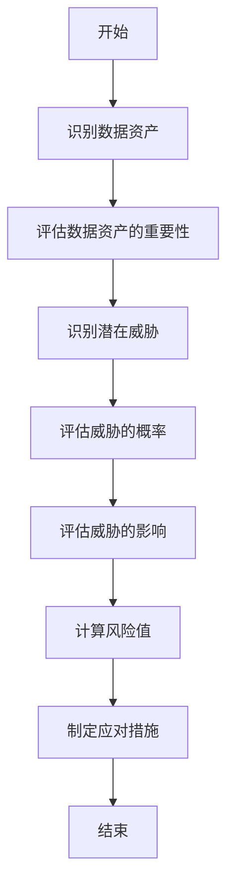
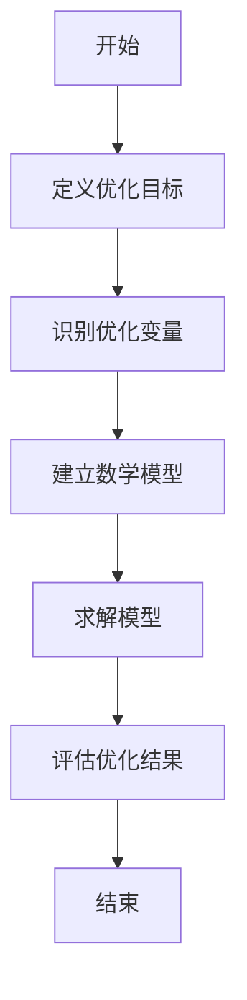
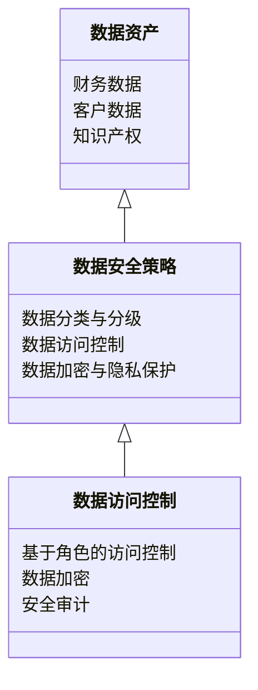
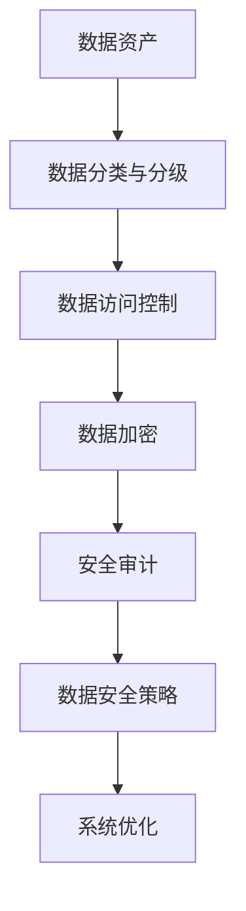
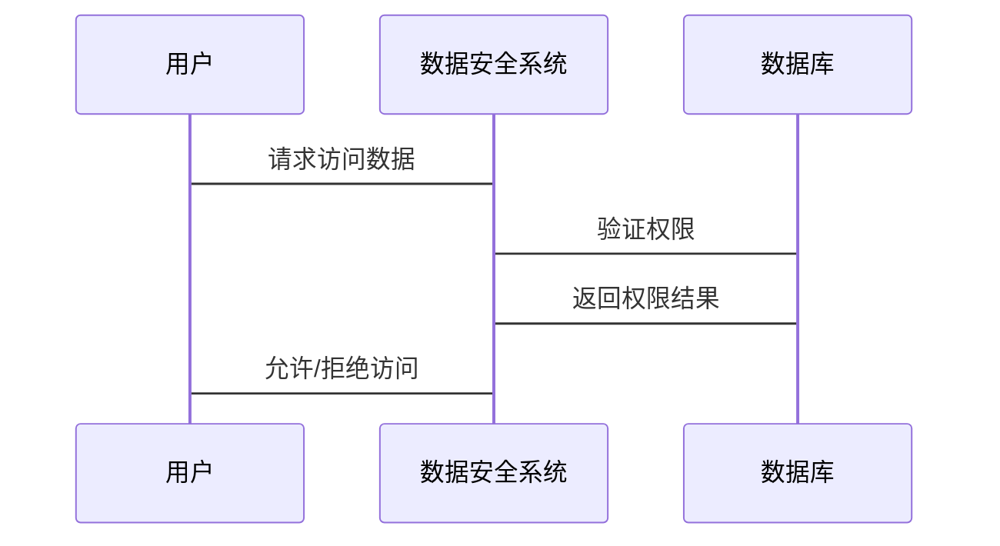

                 


# 股市估值高低对企业数据安全策略的影响

> **关键词**: 股市估值, 数据安全策略, 企业风险管理, 数据资产, 信息安全管理

> **摘要**: 本文探讨了股市估值的高低对企业数据安全策略的影响，分析了高估值和低估值企业在数据安全方面的不同策略，结合数学模型和实际案例，深入阐述了数据安全对企业价值和市场信任的影响，提出了数据安全策略与企业长期发展的协同关系。

---

# 股市估值高低对企业数据安全策略的影响

## 第1章: 股市估值与数据安全概述

### 1.1 股市估值的基本概念

#### 1.1.1 股市估值的定义与计算方法

股市估值是衡量企业市场价值的重要指标，通常通过市盈率（P/E）、市净率（P/B）等指标来衡量。市盈率 = 股价 / 每股收益，市净率 = 股价 / 每股净资产。高估值意味着市场对企业的未来盈利能力有较高预期，而低估值则可能意味着市场对其前景持谨慎态度。

#### 1.1.2 数据安全的基本概念与重要性

数据安全是指保护数据的机密性、完整性和可用性。随着数字化转型的深入，数据已成为企业的核心资产，数据泄露可能导致企业声誉损失、罚款和客户信任下降。数据安全的重要性在于保障企业的数据资产安全，防止未经授权的访问和篡改。

#### 1.1.3 股市估值与数据安全的关联性

股市估值的高低与数据安全密切相关。高估值企业通常面临更高的数据安全风险，因为它们的高市值可能成为黑客攻击的目标。而低估值企业可能在数据安全投入上相对不足，但可以通过优化数据安全策略来提升企业价值。

### 1.2 企业数据安全策略的核心要素

#### 1.2.1 数据分类与分级

数据分类与分级是数据安全管理的基础。企业需要根据数据的重要性进行分类，例如将客户数据、财务数据和知识产权数据分别归类，并制定相应的安全策略。

#### 1.2.2 数据访问控制

数据访问控制是通过权限管理确保只有授权人员可以访问特定数据。基于角色的访问控制（RBAC）是一种常见的方法，可以有效减少数据泄露的风险。

#### 1.2.3 数据加密与隐私保护

数据加密是保护数据安全的重要手段，特别是在数据传输和存储过程中。隐私保护则是通过技术手段确保个人数据不被滥用，符合相关法律法规。

### 1.3 股市估值对企业的影响

#### 1.3.1 高估值企业的数据安全挑战

高估值企业通常拥有更多的数据资产，但也面临更高的数据泄露风险。市场对高估值企业有更高的期望，任何数据安全事件都可能对股价产生重大影响。

#### 1.3.2 低估值企业的数据安全机会

低估值企业可能在数据安全投入上相对较少，但可以通过优化数据安全策略来提升企业价值。例如，通过低成本的数据加密和访问控制，提升客户信任，进而提高市场估值。

#### 1.3.3 股市估值波动对数据安全策略的动态影响

股市估值的波动性会影响企业的数据安全策略。例如，在市场低迷时期，企业可能需要更加谨慎地管理数据安全预算，而在市场繁荣时期，企业可能需要加大对数据安全的投入。

---

## 第2章: 股市估值高低对企业数据安全策略的核心影响

### 2.1 高估值企业数据安全策略的特点

#### 2.1.1 高估值企业数据安全的高要求

高估值企业通常拥有更多的数据资产，因此需要更高的数据安全标准。例如，采用多层次的防火墙、入侵检测系统和加密技术，确保数据的机密性和完整性。

#### 2.1.2 数据安全投资与风险管理

高估值企业通常在数据安全上投入更多资源，包括 hiring专业人员、购买安全设备和订阅安全服务。风险管理是高估值企业数据安全策略的重要组成部分，通过识别和评估潜在风险，制定应对措施。

#### 2.1.3 高估值企业数据安全的外部压力

高估值企业往往面临更多的外部压力，例如投资者对数据安全的关注度更高，监管机构的审查更严格。这些外部压力促使企业不断完善数据安全策略。

### 2.2 低估值企业数据安全策略的特点

#### 2.2.1 低估值企业数据安全的低成本策略

低估值企业可能在数据安全投入上相对较少，但仍然需要确保基本的数据安全。例如，采用低成本的数据加密工具和简单的访问控制机制。

#### 2.2.2 数据安全的内部优化与效率提升

低估值企业可以通过优化内部流程和提高效率来提升数据安全性。例如，通过自动化工具减少人为错误，加强员工培训，提高数据安全意识。

#### 2.2.3 低估值企业数据安全的潜在风险

低估值企业可能因为数据安全投入不足而面临更大的风险。例如，数据泄露可能导致企业声誉受损，客户信任下降，进而影响市场估值。

### 2.3 股市估值对企业数据安全策略的综合影响

#### 2.3.1 高估值与低估值企业的数据安全对比

高估值企业通常在数据安全上投入更多，采用更复杂的安全策略，而低估值企业可能在数据安全上投入较少，但可以通过优化策略来提升企业价值。两者在数据安全策略上的差异反映了市场对企业的不同期望。

#### 2.3.2 股市估值波动对企业数据安全策略的调整

股市估值的波动会影响企业的数据安全策略。例如，在市场低迷时期，企业可能需要更加谨慎地管理数据安全预算，而在市场繁荣时期，企业可能需要加大对数据安全的投入。

#### 2.3.3 数据安全策略与企业长期发展的关系

数据安全策略是企业长期发展的重要组成部分。高估值企业需要通过持续优化数据安全策略来维护市场信任和企业价值，而低估值企业则可以通过加强数据安全来提升市场估值。

---

## 第3章: 股市估值对企业数据安全策略的影响机制

### 3.1 数据安全对企业价值的影响

#### 3.1.1 数据资产对企业价值的贡献

数据资产是企业的核心资产之一，数据的安全性和可用性直接影响企业的市场价值。例如，客户数据的安全性直接影响企业的客户忠诚度和市场份额。

#### 3.1.2 数据泄露对企业价值的负面影响

数据泄露可能导致企业声誉受损，客户信任下降，进而影响市场估值。例如，某高估值企业的数据泄露事件可能导致股价大幅下跌。

#### 3.1.3 数据安全对企业市场信任的影响

数据安全是企业市场信任的重要组成部分。高估值企业需要通过持续优化数据安全策略来维护市场信任，而低估值企业则可以通过加强数据安全来提升市场信任。

### 3.2 股市估值对企业数据安全投资的驱动作用

#### 3.2.1 高估值企业数据安全投资动机

高估值企业通常有更多的资金用于数据安全投资，因为市场对它们的期望更高。数据安全投资可以提升企业形象，增强市场信任，进而推动股价上涨。

#### 3.2.2 低估值企业数据安全投资压力

低估值企业可能在数据安全投资上面临压力，因为市场对它们的期望较低，投资者可能不太关注数据安全问题。然而，数据安全投资仍然是企业长期发展的必要条件。

#### 3.2.3 数据安全投资与企业市值的动态关系

数据安全投资与企业市值之间存在动态关系。高估值企业需要在数据安全上投入更多，而低估值企业可以通过数据安全投资来提升市值。两者的互动关系反映了市场对数据安全的不同关注程度。

### 3.3 数据安全策略对企业风险管理的影响

#### 3.3.1 数据安全风险对企业估值的潜在影响

数据安全风险是企业风险管理的重要组成部分。高估值企业需要更加关注数据安全风险，因为它们的高市值可能成为攻击目标。低估值企业则需要通过风险管理来降低数据安全风险。

#### 3.3.2 数据安全策略在风险管理中的作用

数据安全策略是企业风险管理的重要工具。通过制定和实施有效的数据安全策略，企业可以降低数据安全风险，保障数据资产的安全。

#### 3.3.3 数据安全与企业风险管理的协同效应

数据安全与企业风险管理之间存在协同效应。通过优化数据安全策略，企业可以降低数据安全风险，从而提升整体风险管理效果。

---

## 第4章: 股市估值对企业数据安全策略的数学模型与算法

### 4.1 数据安全风险评估模型

#### 4.1.1 数据安全风险评估的数学模型

数据安全风险评估模型可以通过数学公式来表示。例如，风险值 = 概率 × 影响。概率是指某数据安全事件发生的可能性，影响是指事件对企业价值的影响程度。

#### 4.1.2 数据安全风险评估的流程图

以下是数据安全风险评估的流程图：



#### 4.1.3 数据安全风险评估的代码实现

以下是数据安全风险评估的Python代码示例：

```python
def calculate_risk(threat_probability, impact):
    return threat_probability * impact

# 示例
threat_probability = 0.3  # �威脅发生的概率
impact = 100000  # 威脅对企业价值的影响
risk_value = calculate_risk(threat_probability, impact)
print(f"风险值: {risk_value}")
```

### 4.2 数据安全策略优化算法

#### 4.2.1 数据安全策略优化的数学模型

数据安全策略优化可以通过数学模型来表示。例如，目标函数为最小化数据安全成本，约束条件为满足特定的数据安全目标。

#### 4.2.2 数据安全策略优化的流程图

以下是数据安全策略优化的流程图：



#### 4.2.3 数据安全策略优化的代码实现

以下是数据安全策略优化的Python代码示例：

```python
import numpy as np
from scipy.optimize import minimize

# 目标函数：最小化数据安全成本
def objective(x):
    return np.sum(x)

# 约束条件：满足特定的数据安全目标
def constraint(x):
    return np.sum(x) >= 100  # 示例约束

# 初始化
x0 = np.array([0, 0, 0, 0, 0])

# 求解
result = minimize(objective, x0, constraints={'type': 'ineq', 'fun': constraint})

# 输出结果
print(f"优化结果: {result}")
```

---

## 第5章: 股市估值对企业数据安全策略的系统分析与架构设计

### 5.1 问题场景介绍

股市估值的波动对企业数据安全策略的制定和实施有重要影响。高估值企业需要更加注重数据安全，而低估值企业则需要通过优化数据安全策略来提升市场估值。

### 5.2 系统功能设计

以下是企业数据安全系统的功能设计：



### 5.3 系统架构设计

以下是企业数据安全系统的架构设计：



### 5.4 系统接口设计

系统接口设计包括数据资产接口、数据访问控制接口和数据加密接口。

### 5.5 系统交互设计

以下是系统交互的序列图：



---

## 第6章: 股市估值对企业数据安全策略的项目实战

### 6.1 环境安装

需要安装Python、numpy、scipy和matplotlib等工具。

### 6.2 核心实现代码

以下是数据安全风险评估的Python代码示例：

```python
import numpy as np
from scipy.optimize import minimize

# 定义目标函数
def objective(x):
    return np.sum(x)

# 定义约束条件
def constraint(x):
    return np.sum(x) >= 100

# 初始化
x0 = np.array([0, 0, 0, 0, 0])

# 执行优化
result = minimize(objective, x0, constraints={'type': 'ineq', 'fun': constraint})

# 输出结果
print(f"优化结果: {result}")
```

### 6.3 代码应用解读与分析

通过上述代码，我们可以优化数据安全成本，同时满足特定的数据安全目标。这为企业制定数据安全策略提供了科学依据。

### 6.4 实际案例分析

以某高估值企业为例，分析其数据安全策略的制定和优化过程。通过案例分析，我们可以看到高估值企业如何通过数据安全策略来维护市场信任和企业价值。

### 6.5 项目小结

本章通过实际案例分析和代码实现，深入探讨了股市估值对企业数据安全策略的影响。通过优化数据安全策略，企业可以有效降低数据安全风险，提升市场估值。

---

## 第7章: 股市估值对企业数据安全策略的影响总结与展望

### 7.1 最佳实践 tips

- 高估值企业需要持续优化数据安全策略，确保数据资产的安全。
- 低估值企业可以通过优化数据安全策略来提升市场估值。
- 数据安全策略是企业长期发展的重要组成部分。

### 7.2 小结

本文通过分析股市估值高低对企业数据安全策略的影响，提出了数据安全策略与企业长期发展的协同关系。高估值企业需要在数据安全上投入更多资源，而低估值企业则可以通过优化数据安全策略来提升市场估值。

### 7.3 注意事项

- 数据安全策略的制定需要结合企业的实际情况。
- 数据安全投入需要与企业的发展战略相结合。
- 数据安全策略需要动态调整，以应对市场的变化。

### 7.4 拓展阅读

- 《企业数据安全管理体系》
- 《数据安全风险管理指南》
- 《股市估值与企业风险管理》

---

## 作者

作者：AI天才研究院/AI Genius Institute & 禅与计算机程序设计艺术 /Zen And The Art of Computer Programming

---

通过本文的分析，我们深入探讨了股市估值高低对企业数据安全策略的影响，提出了数据安全策略与企业长期发展的协同关系。希望本文能够为企业的数据安全策略制定提供科学依据，帮助企业更好地应对数据安全挑战，提升市场估值。

