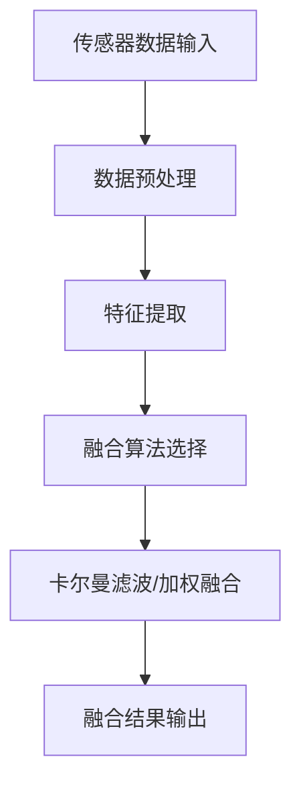
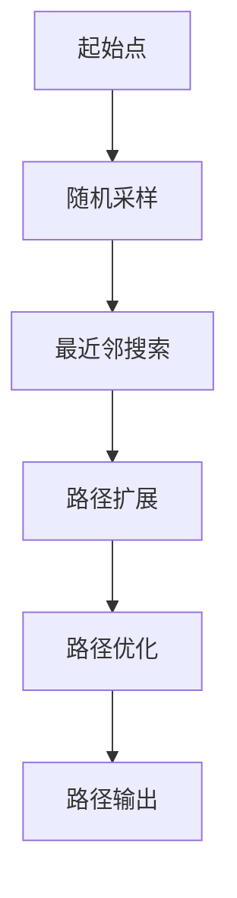
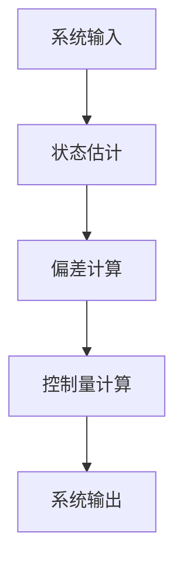
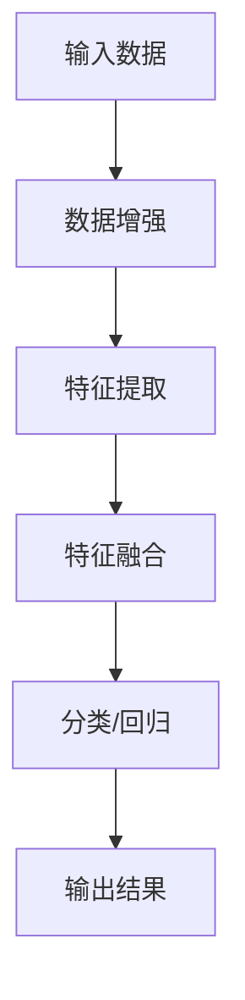
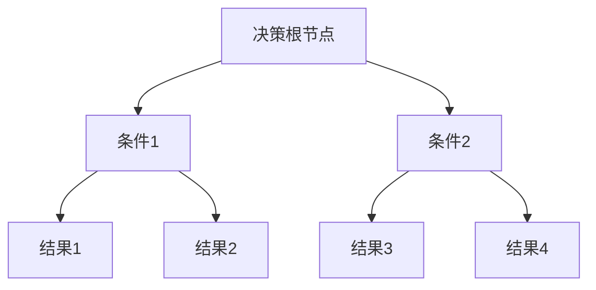
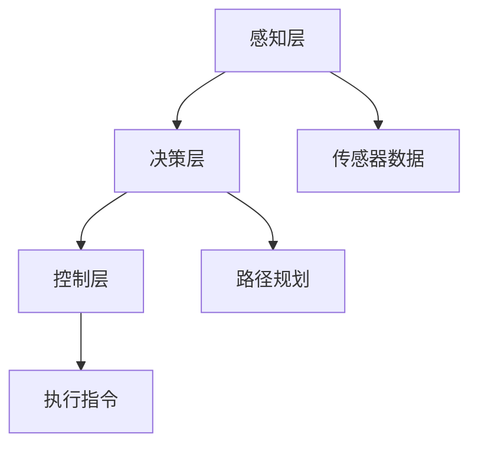

                 


---

### 文章标题：自动驾驶技术发展与相关产业链投资

### 关键词：
自动驾驶技术, 投资机会, 产业链分析, 算法原理, 系统架构

### 摘要：
自动驾驶技术作为现代科技的前沿领域，正逐步改变我们的出行方式。本文从技术发展、产业链结构、投资机会等多角度深入分析自动驾驶领域的现状与未来趋势。通过详细的技术原理讲解和实际案例分析，结合数学模型和系统架构图，为读者提供全面的自动驾驶技术发展与投资策略指南。文章内容涵盖感知系统、决策算法、控制系统等核心技术，以及产业链上游、中游、下游的投资分析，帮助投资者把握市场机遇，规避潜在风险。

---

### 第一部分: 自动驾驶技术发展与相关产业链投资概述

---

### 第2章: 自动驾驶技术的关键技术

#### 2.1 自动驾驶感知系统

##### 2.1.2 数据融合算法

###### 数据融合算法的数学模型

数据融合算法是自动驾驶感知系统的核心，通过多种传感器的数据融合，提高感知的准确性和鲁棒性。常用的算法包括卡尔曼滤波和加权融合。

**卡尔曼滤波模型：**

卡尔曼滤波是一种递归滤波器，用于估计系统状态。其数学模型如下：

$$
\begin{cases}
x_k = F x_{k-1} + w_{k-1} \\
y_k = H x_k + v_k
\end{cases}
$$

其中：
- \(x_k\) 表示第 \(k\) 时刻的系统状态。
- \(F\) 是状态转移矩阵。
- \(w_{k-1}\) 是过程噪声。
- \(y_k\) 是观测值。
- \(H\) 是观测矩阵。
- \(v_k\) 是观测噪声。

卡尔曼滤波的目标是通过迭代计算，得到最优状态估计：

$$
\hat{x}_k = \hat{x}_{k-1} + K_k (y_k - H \hat{x}_{k-1})
$$

其中 \(K_k\) 是卡尔曼增益，计算公式为：

$$
K_k = (H P_{k-1} H^T + R)^{-1} H P_{k-1}^T
$$

其中 \(P_{k-1}\) 是上一时刻的状态协方差矩阵，\(R\) 是观测噪声的协方差矩阵。

**加权融合模型：**

加权融合是一种基于传感器可信度的融合方法。假设我们有两个传感器 \(S_1\) 和 \(S_2\)，其测量值分别为 \(s_{1,k}\) 和 \(s_{2,k}\)，对应的权重分别为 \(w_1\) 和 \(w_2\)。融合后的结果为：

$$
s_k = \frac{w_1 s_{1,k} + w_2 s_{2,k}}{w_1 + w_2}
$$

权重通常基于传感器的准确性和可靠性确定。

**数据融合流程图**



---

#### 2.2 自动驾驶决策系统

##### 2.2.1 路径规划算法

###### 路径规划算法的数学模型

路径规划是自动驾驶决策系统的核心任务之一，旨在找到从起点到终点的最优路径。常用的算法包括A*算法和RRT*算法。

**A*算法：**

A*算法是一种基于图搜索的最短路径算法，其搜索策略基于优先队列，优先探索最有希望的节点。A*算法的数学模型如下：

$$
f(n) = g(n) + h(n)
$$

其中：
- \(f(n)\) 是节点 \(n\) 的优先级。
- \(g(n)\) 是从起点 \(s\) 到节点 \(n\) 的已知成本。
- \(h(n)\) 是从节点 \(n\) 到目标 \(t\) 的启发式估算。

**RRT*算法：**

RRT*（Rapidly-exploring Random Tree Star）算法是一种用于动态环境下的路径规划算法，通过随机采样和树的扩展，逐步逼近目标区域。

RRT*算法的主要步骤如下：
1. 初始化：将起始点添加到树中。
2. 随机采样：随机选择一个点 \(q_{\text{rand}}\)。
3. 最近邻搜索：找到树中与 \(q_{\text{rand}}\) 最近的点 \(q_{\text{near}}\)。
4. 扩展：生成从 \(q_{\text{near}}\) 到 \(q_{\text{rand}}\) 的新点 \(q_{\text{new}}\)。
5. 插入：将 \(q_{\text{new}}\) 插入树中，并检查是否接近目标区域。
6. 重复步骤2-5，直到找到路径或达到终止条件。

**路径规划流程图**



---

#### 2.3 自动驾驶控制系统

##### 2.3.2 控制算法实现

###### 控制算法的数学模型

控制算法是自动驾驶系统的核心，负责根据决策系统的指令，控制车辆的运动。常用的控制算法包括PID控制和模型预测控制（MPC）。

**PID控制：**

PID（Proportional-Integral-Derivative）控制是一种常用的反馈控制方法，适用于线性系统。其控制量 \(u(t)\) 的计算公式为：

$$
u(t) = K_p e(t) + K_i \int_{0}^{t} e(\tau) d\tau + K_d \frac{d e(t)}{dt}
$$

其中：
- \(K_p\) 是比例系数。
- \(K_i\) 是积分系数。
- \(K_d\) 是微分系数。
- \(e(t)\) 是系统偏差。

**模型预测控制（MPC）：**

MPC是一种基于系统模型的控制方法，通过优化未来时序的控制量，实现系统的最优控制。MPC的数学模型如下：

$$
\min_{u} \sum_{k=0}^{N-1} (x_k - x_{\text{ref}})^2 + (u_k - u_{\text{ref}})^2
$$

约束条件：
$$
x_{k+1} = A x_k + B u_k
$$
$$
x_0 = x_{\text{initial}}
$$

其中：
- \(x_k\) 是系统状态。
- \(u_k\) 是控制量。
- \(A\) 和 \(B\) 是系统矩阵。
- \(N\) 是优化窗口长度。

**控制算法流程图**



---

### 第3章: 自动驾驶产业链的投资机会

---

#### 3.2 产业链中游的投资分析

##### 3.2.1 AI算法与大数据平台

###### AI算法的数学模型

AI算法是自动驾驶产业链中游的核心，深度学习算法在感知和决策系统中发挥重要作用。

**目标检测算法：**

以YOLO算法为例，其数学模型如下：

$$
\text{YOLO} = \text{Backbone} + \text{ Neck} + \text{ Head}
$$

其中：
- **Backbone**：特征提取网络，如Darknet-53。
- **Neck**：中间层，用于多尺度特征融合。
- **Head**：用于边界框回归和分类。

YOLO算法的目标检测损失函数为：

$$
\text{Loss} = \lambda_{\text{xy}}(x_{\text{pred}} - x_{\text{true}})^2 + \lambda_{wh}(w_{\text{pred}} - w_{\text{true}})^2 + \lambda_{conf}(p_{\text{conf}} - t_{\text{conf}})^2 + \lambda_{cls}(p_{\text{cls}} - t_{\text{cls}})^2
$$

其中：
- \(\lambda_{\text{xy}}\)、\(\lambda_{\text{wh}}\)、\(\lambda_{\text{conf}}\)、\(\lambda_{\text{cls}}\) 是损失函数的权重系数。

**语义分割算法：**

以U-Net为例，其数学模型如下：

$$
U\text{-Net} = \text{Encoder} + \text{Decoder} + \text{Skip Connection}
$$

U-Net通过编码器提取特征，解码器逐步恢复图像细节，并通过跳跃连接保留多尺度特征。

**AI算法流程图**



---

### 第4章: 自动驾驶技术的数学模型与算法原理

---

#### 4.1 自动驾驶感知算法

##### 4.1.1 目标检测与识别

###### 目标检测算法的数学模型

目标检测算法是自动驾驶感知系统的重要组成部分，常用的算法包括YOLO和Faster R-CNN。

**YOLO算法：**

YOLO算法将目标检测问题转化为回归问题，通过单个神经网络直接预测边界框和类别概率。其数学模型如下：

$$
\text{Output} = \text{Predicted BBox} \times \text{Confidence} \times \text{Class Probability}
$$

其中：
- **Predicted BBox**：预测的边界框。
- **Confidence**：边界框的置信度。
- **Class Probability**：类别概率。

**Faster R-CNN算法：**

Faster R-CNN算法通过区域建议网络（RPN）生成候选区域，然后进行目标检测。其数学模型如下：

$$
\text{RPN Output} = \text{Bounding Boxes} \times \text{Scores}
$$
$$
\text{Fast R-CNN Output} = \text{Bounding Boxes} \times \text{Scores} \times \text{Class Probability}
$$

---

#### 4.2 自动驾驶决策算法

##### 4.2.2 行为决策树

###### 行为决策树的数学模型

行为决策树是一种基于规则的决策方法，适用于简单的决策场景。其数学模型可以通过决策树结构表示。

**行为决策树结构：**



行为决策树通过判断条件，逐步缩小决策范围，最终得到决策结果。

---

### 第5章: 自动驾驶技术的系统分析与架构设计

---

#### 5.3 系统架构设计

##### 5.3.1 分层架构

###### 分层架构的实体关系图

分层架构是自动驾驶系统常见的架构设计，包括感知层、决策层和控制层。

**分层架构实体关系图：**



---

### 第6章: 项目实战

---

#### 6.2 系统核心实现源代码

##### 6.2.1 感知模块

###### 感知模块的代码实现

以下是感知模块的代码实现，展示了如何使用YOLO算法进行目标检测。

```python
import tensorflow as tf
from tensorflow.keras import layers

def yolo_model(input_shape, num_classes):
    inputs = layers.Input(shape=input_shape)
    x = layers.Conv2D(32, (3,3), activation='relu')(inputs)
    x = layers.MaxPooling2D((2,2))(x)
    x = layers.Conv2D(64, (3,3), activation='relu')(x)
    x = layers.MaxPooling2D((2,2))(x)
    x = layers.Conv2D(128, (3,3), activation='relu')(x)
    x = layers.MaxPooling2D((2,2))(x)
    x = layers.Flatten()(x)
    x = layers.Dense(256, activation='relu')(x)
    outputs = layers.Dense(num_classes + 5, activation='sigmoid')(x)  # 5个边界框属性：x, y, w, h, confidence
    return Model(inputs=inputs, outputs=outputs)

# 使用示例
input_shape = (416, 416, 3)
num_classes = 80
model = yolo_model(input_shape, num_classes)
model.summary()
```

---

#### 6.3 代码应用解读与分析

##### 6.3.1 感知模块代码解读

上述代码展示了YOLO算法的感知模块实现：
- **输入层**：接受图像数据。
- **卷积层**：提取图像特征。
- **池化层**：降低计算复杂度。
- **全连接层**：将特征向量映射到输出空间。
- **输出层**：输出边界框和类别概率。

---

### 第7章: 未来展望与投资建议

---

#### 7.1 自动驾驶技术的未来发展趋势

##### 7.1.1 完全自动化

完全自动化（L5级别）是自动驾驶技术的终极目标，未来随着技术的进步和法规的完善，L5级别的自动驾驶将成为现实。

##### 7.1.2 AI芯片的进步

AI芯片的性能提升将支持更复杂的自动驾驶算法，进一步推动技术的发展。

##### 7.1.3 5G通信的普及

5G通信的普及将为自动驾驶提供更高效的车辆通信能力，支持更实时的数据传输和协同决策。

---

### 第8章: 结语

---

### 作者：AI天才研究院/AI Genius Institute & 禅与计算机程序设计艺术 /Zen And The Art of Computer Programming

