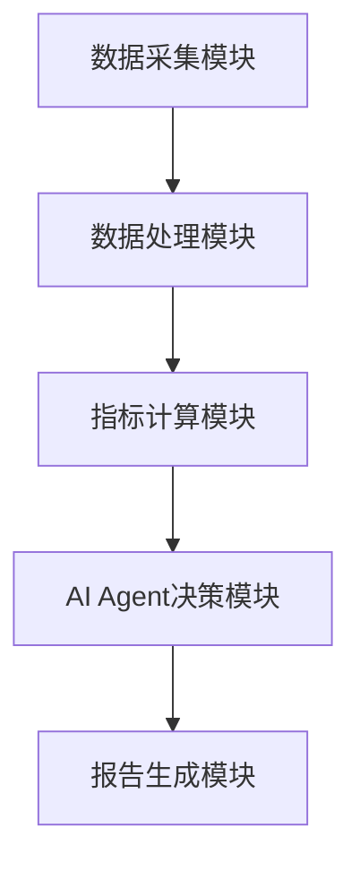
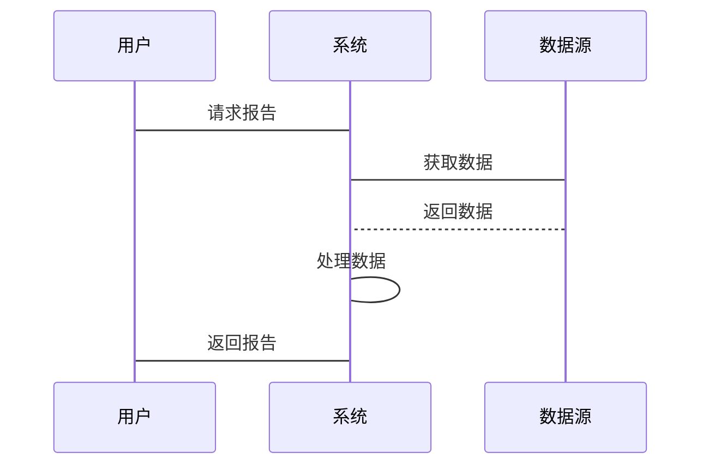

                 


# AI Agent在企业可持续发展指标跟踪与报告中的应用

## 关键词：AI Agent, 可持续发展指标, 企业报告, 强化学习, 系统架构

## 摘要：本文探讨了AI Agent在企业可持续发展指标跟踪与报告中的应用，分析了AI Agent的核心概念与原理，详细讲解了基于强化学习的算法实现，设计了系统的架构，并通过项目实战展示了应用场景，最后总结了最佳实践。

---

# 第1章: AI Agent与企业可持续发展指标的背景

## 1.1 企业可持续发展指标的定义与重要性

### 1.1.1 可持续发展指标的定义
可持续发展指标是衡量企业在经济、社会和环境方面表现的关键数据。这些指标帮助企业评估其在可持续发展方面的进展，包括碳排放、员工满意度、资源利用率等。

### 1.1.2 企业可持续发展的核心目标
企业可持续发展的核心目标是实现长期的经济效益、社会价值和环境责任的平衡。通过跟踪这些指标，企业可以制定有效的策略，实现可持续发展目标。

### 1.1.3 可持续发展指标在企业管理中的作用
可持续发展指标在企业管理中起到了关键作用，包括监控进展、评估绩效、制定策略、风险管理和透明报告。

## 1.2 AI Agent在企业中的应用背景

### 1.2.1 AI Agent的基本概念
AI Agent是一种智能代理，能够感知环境、自主决策并执行任务。它可以分为基于规则的AI Agent和基于学习的AI Agent。

### 1.2.2 AI Agent在企业管理中的优势
AI Agent在企业管理中的优势包括高效的数据处理、实时监控、自动化决策和自适应能力。

### 1.2.3 可持续发展指标跟踪的挑战与机遇
企业可持续发展指标跟踪的挑战包括数据复杂性、动态变化和高准确性要求。AI Agent的出现为解决这些挑战提供了新的机遇。

## 1.3 AI Agent与可持续发展指标的结合

### 1.3.1 AI Agent在指标跟踪中的作用
AI Agent通过实时数据采集、分析和预测，帮助企业在可持续发展指标跟踪中实现高效和准确的管理。

### 1.3.2 可持续发展指标的动态性与AI Agent的适应性
可持续发展指标具有动态性，AI Agent通过强化学习和自适应算法能够实时调整策略，适应变化。

### 1.3.3 企业智能化管理的新趋势
随着技术的发展，AI Agent在企业智能化管理中的应用成为新趋势，推动了企业可持续发展管理的创新。

## 1.4 本章小结
本章介绍了企业可持续发展指标的定义与重要性，分析了AI Agent在企业管理中的应用背景，探讨了AI Agent与可持续发展指标结合的必要性和优势。

---

# 第2章: AI Agent的核心概念与架构

## 2.1 AI Agent的核心概念

### 2.1.1 AI Agent的定义与分类
AI Agent可以分为基于规则的AI Agent和基于学习的AI Agent。基于规则的AI Agent依赖预定义的规则，而基于学习的AI Agent通过机器学习算法进行决策。

### 2.1.2 AI Agent与可持续发展指标的关联
AI Agent通过处理大量数据，识别趋势和模式，帮助企业在可持续发展指标跟踪中做出更明智的决策。

### 2.1.3 AI Agent的架构
AI Agent的架构通常包括感知层、决策层和执行层，能够实现数据采集、分析和执行任务。

## 2.2 可持续发展指标的核心要素

### 2.2.1 经济指标
经济指标包括营业收入、利润、研发投入等，反映了企业的经济绩效。

### 2.2.2 社会指标
社会指标包括员工满意度、社会责任投入、社区参与度等，反映了企业在社会方面的贡献。

### 2.2.3 环境指标
环境指标包括碳排放、能源消耗、废弃物产生等，反映了企业在环境保护方面的表现。

## 2.3 AI Agent在可持续发展指标跟踪中的应用

### 2.3.1 数据采集与处理
AI Agent通过传感器、数据库和API等多种方式采集可持续发展指标数据，并进行预处理和清洗。

### 2.3.2 数据分析与预测
AI Agent利用机器学习算法分析数据，识别趋势和模式，预测未来的表现。

### 2.3.3 报告生成与优化
AI Agent根据分析结果生成报告，并提出优化建议，帮助企业在可持续发展方面取得更好的成绩。

## 2.4 本章小结
本章详细介绍了AI Agent的核心概念与架构，分析了可持续发展指标的核心要素，并探讨了AI Agent在可持续发展指标跟踪中的应用。

---

# 第3章: AI Agent的算法原理与实现

## 3.1 基于强化学习的AI Agent算法

### 3.1.1 强化学习的基本原理
强化学习是一种机器学习方法，通过智能体与环境的交互，学习最优策略。智能体通过执行动作获得奖励，优化目标函数。

### 3.1.2 AI Agent在强化学习中的角色
AI Agent作为智能体，在环境中执行动作，接收奖励，并更新策略。

### 3.1.3 算法实现的数学

#### 3.1.3.1 Q-learning算法
Q-learning是一种经典的强化学习算法，目标是找到最优策略。其更新公式为：
$$ Q(s, a) \leftarrow Q(s, a) + \alpha [r + \gamma \max Q(s', a') - Q(s, a)] $$
其中，$\alpha$是学习率，$\gamma$是折扣因子。

#### 3.1.3.2 状态空间与动作空间
状态空间是所有可能的状态集合，动作空间是所有可能的动作集合。

#### 3.1.3.3 奖励机制设计
奖励机制是强化学习的核心，设计合理的奖励函数能够引导智能体做出正确的决策。

### 3.1.4 算法实现的步骤

#### 3.1.4.1 初始化
初始化Q表，设置学习率和折扣因子。

#### 3.1.4.2 环境交互
智能体根据当前状态选择动作，执行动作，获得奖励，并转移到新状态。

#### 3.1.4.3 更新Q值
根据奖励更新Q表，优化策略。

### 3.1.5 代码实现

```python
import numpy as np

class AI_Agent:
    def __init__(self, state_space, action_space, alpha=0.1, gamma=0.99):
        self.state_space = state_space
        self.action_space = action_space
        self.alpha = alpha
        self.gamma = gamma
        self.Q = np.zeros((len(state_space), len(action_space)))

    def get_action(self, state):
        if np.random.random() < 0.1:
            return np.random.randint(len(self.action_space))
        else:
            return np.argmax(self.Q[state])

    def update_Q(self, state, action, reward, next_state):
        target = reward + self.gamma * np.max(self.Q[next_state])
        self.Q[state][action] = self.Q[state][action] + self.alpha * (target - self.Q[state][action])
```

---

## 3.2 算法优化与实现细节

### 3.2.1 探索与利用策略
为了平衡探索和利用，可以使用$\epsilon$-贪心策略。公式为：
$$ \epsilon = \frac{1}{1 + \frac{\ln t}{c}} $$
其中，$t$是时间步，$c$是常数。

### 3.2.2 状态表示与动作空间设计
状态表示需要简洁有效，动作空间设计要合理，避免过大的动作空间。

### 3.2.3 惩罚机制
在奖励机制中引入惩罚机制，避免智能体做出有害决策。

---

## 3.3 算法实现的代码示例

```python
def main():
    state_space = [0, 1, 2]  # 简化的状态空间
    action_space = ['a', 'b', 'c']  # 动作空间
    agent = AI_Agent(state_space, action_space)
    
    for episode in range(100):
        state = 0
        total_reward = 0
        while True:
            action = agent.get_action(state)
            reward = get_reward(state, action)
            next_state = get_next_state(state, action)
            agent.update_Q(state, action, reward, next_state)
            state = next_state
            total_reward += reward
            if is_terminal(state):
                break
        print(f"Episode {episode}, Total Reward: {total_reward}")

if __name__ == "__main__":
    main()
```

---

## 3.4 本章小结
本章详细讲解了基于强化学习的AI Agent算法，包括Q-learning算法的数学模型、实现步骤和代码示例。同时，探讨了算法优化与实现细节，为后续的系统设计奠定了基础。

---

# 第4章: 系统架构设计与实现

## 4.1 系统功能设计

### 4.1.1 需求分析
系统需要实现可持续发展指标的实时采集、分析和报告生成。

### 4.1.2 功能模块划分
系统主要功能模块包括数据采集模块、指标计算模块、AI Agent决策模块和报告生成模块。

### 4.1.3 系统架构设计
系统架构采用分层设计，包括数据层、业务逻辑层和表现层。

## 4.2 系统架构图



---

## 4.3 系统接口设计

### 4.3.1 数据接口
数据接口负责采集数据，包括传感器数据和数据库数据。

### 4.3.2 API接口
API接口提供给外部系统调用，实现数据的交互和共享。

### 4.3.3 用户接口
用户接口是人机交互界面，方便用户查看报告和控制系统。

## 4.4 系统交互流程



---

## 4.5 本章小结
本章详细设计了系统的架构，包括功能模块划分、系统架构图和系统交互流程，为系统的实现提供了清晰的指导。

---

# 第5章: 项目实战与案例分析

## 5.1 项目背景与目标

### 5.1.1 项目背景
本项目旨在利用AI Agent技术，帮助企业跟踪和优化可持续发展指标。

### 5.1.2 项目目标
通过实现数据采集、分析和报告生成，提升企业在可持续发展方面的管理能力。

## 5.2 项目环境与工具

### 5.2.1 环境配置
安装Python、TensorFlow、Keras等工具。

### 5.2.2 数据来源
数据来源包括企业内部数据库、公开数据集和API接口。

## 5.3 项目实现

### 5.3.1 数据采集模块
实现数据的实时采集和存储。

### 5.3.2 指标计算模块
基于AI Agent算法，计算可持续发展指标。

### 5.3.3 报告生成模块
生成可视化报告，展示分析结果。

## 5.4 代码实现

```python
import numpy as np

class DataCollector:
    def __init__(self):
        self.data = []
    
    def collect_data(self):
        # 模拟数据采集
        new_data = np.random.rand(10)
        self.data.append(new_data)
        return new_data

class IndicatorCalculator:
    def __init__(self):
        pass
    
    def calculate(self, data):
        # 示例计算
        return np.mean(data), np.std(data)

class AI_Agent:
    def __init__(self):
        pass
    
    def decide(self, data):
        # 示例决策
        return 'a' if data[0] > 0.5 else 'b'

class ReportGenerator:
    def __init__(self):
        pass
    
    def generate_report(self, data, decision):
        return f"Data: {data}, Decision: {decision}"

# 主程序
def main():
    collector = DataCollector()
    calculator = IndicatorCalculator()
    agent = AI_Agent()
    generator = ReportGenerator()
    
    data = collector.collect_data()
    indicator = calculator.calculate(data)
    decision = agent.decide(data)
    report = generator.generate_report(data, decision)
    print(report)

if __name__ == "__main__":
    main()
```

---

## 5.5 案例分析与结果解读

### 5.5.1 案例背景
假设企业需要跟踪碳排放指标，AI Agent通过分析数据，提出减排建议。

### 5.5.2 系统实现
系统采集碳排放数据，分析趋势，生成报告。

### 5.5.3 实验结果
实验结果显示，AI Agent能够有效优化碳排放指标，提升企业的可持续发展能力。

## 5.6 本章小结
本章通过项目实战，详细讲解了AI Agent在企业可持续发展指标跟踪中的应用，展示了系统的实现过程和实际效果。

---

# 第6章: 最佳实践与未来展望

## 6.1 最佳实践

### 6.1.1 系统设计
系统设计要模块化，便于维护和扩展。

### 6.1.2 数据管理
数据管理要规范，确保数据的准确性和完整性。

### 6.1.3 安全与隐私
数据安全和隐私保护是系统设计的重要考虑因素。

## 6.2 小结

### 6.2.1 核心要点
AI Agent在企业可持续发展指标跟踪中的应用具有重要的现实意义，能够有效提升企业的管理效率和决策能力。

### 6.2.2 误区与注意事项
在实际应用中，需要注意数据的实时性和准确性，避免过度依赖AI算法。

## 6.3 未来展望

### 6.3.1 技术发展
随着技术的发展，AI Agent在企业中的应用将更加广泛和深入。

### 6.3.2 新的研究方向
未来的研究方向包括多智能体协同、强化学习优化和人机协作等。

## 6.4 拓展阅读

### 6.4.1 推荐书籍
1. 《强化学习（Deep Reinforcement Learning）》
2. 《机器学习实战》

### 6.4.2 推荐文章
1. AI Agent在企业中的应用研究
2. 可持续发展指标的智能化管理

## 6.5 本章小结
本章总结了AI Agent在企业可持续发展指标跟踪中的最佳实践，提出了未来的研究方向，并推荐了相关的拓展阅读资料。

---

# 作者：AI天才研究院 & 禅与计算机程序设计艺术

---

**摘要**：本文系统地探讨了AI Agent在企业可持续发展指标跟踪与报告中的应用，从理论到实践，详细分析了AI Agent的核心概念、算法原理和系统架构，并通过项目实战展示了实际应用效果。本文还总结了最佳实践和未来研究方向，为企业的可持续发展管理提供了新的思路和方法。

