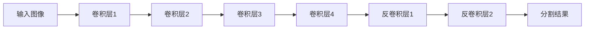
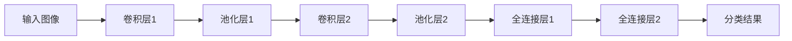
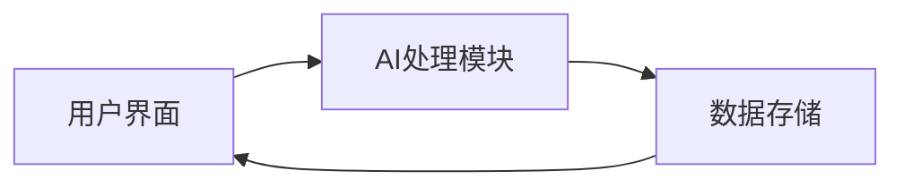
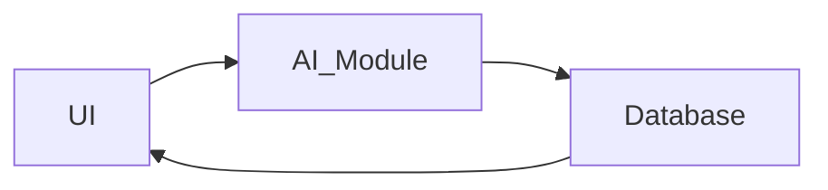

                 


# AI Agent在智能画笔中的绘画技巧指导

**关键词：** AI Agent, 智能画笔, 绘画技巧, 算法原理, 系统设计

**摘要：**  
本文深入探讨AI Agent在智能画笔中的应用，分析其如何通过感知、决策和执行模块辅助绘画创作。结合具体算法原理和系统设计，本文详细讲解AI Agent在绘画技巧指导中的优势和实现方式，同时提供实际案例和最佳实践，帮助读者理解并掌握AI Agent在智能画笔中的应用。

---

# 第1章: AI Agent与智能画笔的背景与基础

## 1.1 AI Agent的基本概念

### 1.1.1 什么是AI Agent
AI Agent（人工智能代理）是一种能够感知环境、做出决策并执行动作的智能实体。它能够通过学习和优化算法，帮助用户完成特定任务，例如绘画。

### 1.1.2 AI Agent的核心特征
- **自主性**：能够在没有外部干预的情况下自主运行。
- **反应性**：能够实时感知环境并做出反应。
- **学习能力**：通过数据学习和优化，不断提升性能。
- **协作性**：能够与其他系统或用户协同工作。

### 1.1.3 智能画笔的定义与分类
智能画笔是一种结合了AI技术的绘画工具，能够通过传感器和算法实时分析用户的绘画动作，并提供反馈或建议。常见的智能画笔包括：
- **基于传感器的智能画笔**：通过压力、角度等传感器捕捉绘画动作。
- **基于视觉的智能画笔**：通过摄像头和图像处理技术分析绘画内容。
- **混合型智能画笔**：结合传感器和视觉技术的智能画笔。

---

## 1.2 AI在绘画中的应用背景

### 1.2.1 现代绘画工具的发展历程
- 传统绘画工具：如铅笔、油画棒等，依赖用户的技巧和经验。
- 数字绘画工具：如平板电脑和绘图软件，通过数字技术辅助绘画。
- 智能绘画工具：结合AI技术，提供智能化的绘画辅助功能。

### 1.2.2 AI技术在艺术创作中的潜力
AI技术可以通过以下方式改变绘画创作：
- **风格迁移**：将一种绘画风格应用到另一种绘画中。
- **自动补全**：根据用户的绘画动作，自动完成未绘制的部分。
- **灵感推荐**：基于用户的绘画风格，推荐相似的绘画作品或技巧。

### 1.2.3 智能画笔的市场现状与趋势
- **市场现状**：智能画笔正在逐步普及，尤其是在艺术教育和专业绘画领域。
- **发展趋势**：AI技术的不断进步将使智能画笔的功能更加智能化和个性化。

---

## 1.3 AI Agent在智能画笔中的作用

### 1.3.1 AI Agent如何辅助绘画
AI Agent在智能画笔中的作用主要体现在以下几个方面：
- **实时反馈**：通过分析用户的绘画动作，提供实时的技巧反馈。
- **风格推荐**：根据用户的绘画风格，推荐相似的绘画技巧或作品。
- **自动优化**：通过算法优化用户的绘画，使其更加符合预期效果。

### 1.3.2 AI Agent的核心功能与价值
- **提高绘画效率**：通过自动化和智能化的方式，减少用户的绘画时间。
- **提升绘画质量**：通过算法优化，使用户的绘画更加专业和美观。
- **降低学习门槛**：通过实时反馈和技巧推荐，帮助新手快速提升绘画能力。

### 1.3.3 与传统绘画工具的对比分析

| 对比维度       | 传统绘画工具                     | 智能画笔（AI Agent辅助）                |
|----------------|----------------------------------|---------------------------------------|
| 功能           | 简单的绘画功能                   | 实时反馈、风格推荐、自动优化            |
| 学习成本       | 高                              | 低                                     |
| 绘画效果       | 取决于用户技巧                   | 更专业、更美观                        |
| 适用场景       | 专业绘画、艺术创作               | 初学者、教育领域、专业创作             |

---

## 1.4 本章小结
本章介绍了AI Agent和智能画笔的基本概念，分析了AI技术在绘画中的应用背景，并探讨了AI Agent在智能画笔中的作用和价值。通过对比分析，我们可以看出，AI Agent能够显著提升绘画的效率和质量，同时降低学习门槛。

---

# 第2章: AI Agent的核心原理

## 2.1 AI Agent的感知与决策机制

### 2.1.1 感知模块的作用与实现
感知模块是AI Agent的核心部分，负责收集用户的绘画数据。常用的感知方式包括：
- **传感器感知**：通过压力、角度等传感器捕捉用户的绘画动作。
- **视觉感知**：通过摄像头和图像处理技术分析用户的绘画内容。

### 2.1.2 决策模块的算法基础
决策模块负责根据感知数据，生成绘画建议。常用的算法包括：
- **基于规则的决策算法**：根据预设的规则生成建议。
- **基于机器学习的决策算法**：通过训练模型生成最优建议。

### 2.1.3 执行模块的实现方式
执行模块负责将决策模块的建议转化为实际的绘画操作。常见的实现方式包括：
- **自动绘画**：根据建议自动完成未绘制的部分。
- **实时反馈**：通过屏幕显示建议和反馈。

---

## 2.2 AI Agent与绘画技巧的结合

### 2.2.1 AI如何分析绘画风格
AI Agent可以通过以下方式分析用户的绘画风格：
- **图像特征提取**：通过卷积神经网络提取绘画的特征。
- **风格分类**：根据提取的特征对绘画风格进行分类。

### 2.2.2 AI如何优化绘画技巧
AI Agent可以通过以下方式优化用户的绘画技巧：
- **实时反馈**：根据用户的绘画动作，实时提供技巧建议。
- **自动优化**：通过算法优化用户的绘画，使其更加符合预期效果。

### 2.2.3 AI如何辅助创作灵感
AI Agent可以通过以下方式辅助用户的创作灵感：
- **风格迁移**：将一种绘画风格应用到另一种绘画中。
- **灵感推荐**：根据用户的绘画风格，推荐相似的绘画作品或技巧。

---

## 2.3 AI Agent的绘画技巧模型

### 2.3.1 感知模块的数学模型
感知模块的核心是图像处理技术，常用的算法包括：
- **边缘检测**：使用Canny算法检测图像中的边缘。
- **图像分割**：使用U-Net模型对图像进行分割。

### 2.3.2 决策模块的算法实现
决策模块的核心是机器学习算法，常用的模型包括：
- **随机森林**：用于分类和回归任务。
- **深度学习模型**：如卷积神经网络（CNN）用于图像分类和生成。

---

## 2.4 本章小结
本章详细介绍了AI Agent的核心原理，包括感知、决策和执行模块的实现方式。通过数学模型和算法实现的分析，我们可以看到，AI Agent的强大功能依赖于先进的算法和高效的计算能力。

---

# 第3章: AI Agent的算法原理与实现

## 3.1 图像处理算法

### 3.1.1 Canny边缘检测算法
Canny算法是一种常用的边缘检测算法，其步骤如下：
1. **高斯滤波**：对图像进行平滑处理，去除噪声。
2. **计算梯度**：计算图像的梯度 magnitude 和方向。
3. **非极大值抑制**：抑制非边缘点。
4. **双阈值检测**：根据阈值检测边缘点。

**Python实现代码：**
```python
import cv2

def canny_edge_detection(image):
    # 高斯滤波
    blurred = cv2.GaussianBlur(image, (5, 5), 0)
    # 计算梯度
    gray = cv2.cvtColor(blurred, cv2.COLOR_BGR2GRAY)
    edges = cv2.Canny(gray, 50, 150)
    return edges
```

### 3.1.2 U-Net图像分割算法
U-Net是一种常用的图像分割算法，其网络结构如下：
1. **编码器**：通过卷积层提取特征。
2. **解码器**：通过反卷积层生成分割结果。

**网络结构图（Mermaid）：**


---

## 3.2 机器学习算法

### 3.2.1 随机森林分类算法
随机森林是一种常用的分类算法，其核心是通过随机选择特征和样本构建多个决策树，并通过投票的方式进行分类。

**Python实现代码：**
```python
from sklearn.ensemble import RandomForestClassifier

# 训练数据
X_train = ...
y_train = ...
# 训练模型
model = RandomForestClassifier(n_estimators=100)
model.fit(X_train, y_train)
```

### 3.2.2 深度学习模型

#### 3.2.2.1 卷积神经网络（CNN）
CNN是一种常用的图像分类和生成模型，其网络结构包括卷积层、池化层和全连接层。

**网络结构图（Mermaid）：**


---

## 3.3 算法实现的注意事项

### 3.3.1 数据预处理
- **归一化**：将数据归一化到[0,1]范围。
- **数据增强**：通过旋转、翻转等方式增加数据量。

### 3.3.2 模型优化
- **超参数调优**：通过网格搜索等方式优化模型参数。
- **正则化**：使用L1/L2正则化防止过拟合。

---

## 3.4 本章小结
本章详细介绍了AI Agent中常用的图像处理和机器学习算法，并提供了具体的实现代码和网络结构图。通过这些算法的实现，我们可以看到AI Agent的强大功能和复杂性。

---

# 第4章: AI Agent的系统分析与架构设计

## 4.1 系统分析

### 4.1.1 问题场景介绍
用户使用智能画笔进行绘画创作，系统需要实时分析用户的绘画动作并提供反馈。

### 4.1.2 系统功能设计
- **用户界面**：显示绘画界面和反馈信息。
- **AI处理模块**：负责图像处理和算法实现。
- **数据存储**：存储用户的绘画数据和反馈信息。

---

## 4.2 系统架构设计

### 4.2.1 系统架构图（Mermaid）


### 4.2.2 系统交互流程图（Mermaid）


---

## 4.3 系统实现

### 4.3.1 环境安装
- **Python**：安装Python 3.8或更高版本。
- **库依赖**：安装numpy、opencv、tensorflow等库。

### 4.3.2 核心代码实现
```python
import cv2
import tensorflow as tf

# 图像处理函数
def process_image(image):
    # 图像预处理
    preprocessed_image = cv2.resize(image, (224, 224))
    preprocessed_image = preprocessed_image / 255.0
    return preprocessed_image

# 模型加载
model = tf.keras.models.load_model("paint_model.h5")

# 绘画反馈函数
def get_feedback(image):
    processed_image = process_image(image)
    prediction = model.predict(processed_image)
    return prediction
```

---

## 4.4 本章小结
本章详细分析了AI Agent的系统架构，并提供了具体的实现代码和系统交互流程图。通过系统的实现，我们可以看到AI Agent的强大功能和复杂性。

---

# 第5章: AI Agent的项目实战

## 5.1 环境安装与配置

### 5.1.1 安装Python和相关库
```bash
pip install numpy
pip install opencv-python
pip install tensorflow
```

### 5.1.2 安装智能画笔驱动
根据智能画笔的型号，安装相应的驱动程序。

---

## 5.2 核心代码实现

### 5.2.1 图像处理代码
```python
import cv2

def canny_edge_detection(image):
    blurred = cv2.GaussianBlur(image, (5, 5), 0)
    gray = cv2.cvtColor(blurred, cv2.COLOR_BGR2GRAY)
    edges = cv2.Canny(gray, 50, 150)
    return edges
```

### 5.2.2 风格迁移代码
```python
import tensorflow as tf
import numpy as np

def style_transfer(content_image, style_image):
    # 加载预训练模型
    model = tf.keras.models.load_model("style_model.h5")
    # 风格迁移
    generated_image = model(content_image, style_image)
    return generated_image
```

---

## 5.3 实际案例分析

### 5.3.1 风景画的风格迁移
- **输入**：一幅风景画和一种绘画风格。
- **输出**：将风景画的风格迁移到指定的绘画风格。

### 5.3.2 人物画的自动优化
- **输入**：一幅人物画。
- **输出**：通过AI Agent自动优化人物画的质量。

---

## 5.4 项目总结

### 5.4.1 项目实现的关键点
- **图像处理**：Canny边缘检测、风格迁移等。
- **模型训练**：深度学习模型的训练和优化。
- **系统集成**：智能画笔与AI处理模块的集成。

### 5.4.2 项目经验总结
- **数据质量**：高质量的数据是模型性能的关键。
- **模型优化**：模型的优化能够显著提升性能。
- **用户反馈**：用户的反馈是改进系统的重要依据。

---

## 5.5 本章小结
本章通过实际案例分析，详细讲解了AI Agent在智能画笔中的应用。通过项目实战，我们可以更好地理解AI Agent的强大功能和实际应用价值。

---

# 第6章: 最佳实践与注意事项

## 6.1 最佳实践

### 6.1.1 数据预处理
- **归一化**：将数据归一化到[0,1]范围。
- **数据增强**：通过旋转、翻转等方式增加数据量。

### 6.1.2 模型优化
- **超参数调优**：通过网格搜索等方式优化模型参数。
- **正则化**：使用L1/L2正则化防止过拟合。

---

## 6.2 注意事项

### 6.2.1 数据隐私
- **数据加密**：保护用户的绘画数据不被泄露。
- **数据存储**：确保数据存储的安全性。

### 6.2.2 系统性能
- **硬件配置**：确保硬件配置能够支持AI Agent的运行。
- **软件优化**：通过优化代码提升系统性能。

---

## 6.3 拓展阅读

### 6.3.1 推荐书籍
- 《深度学习》（Deep Learning）—— Ian Goodfellow
- 《Python机器学习实战》—— 周志华

### 6.3.2 推荐博客
- [TensorFlow官方博客](https://tensorflow.org/)
- [OpenCV官方博客](https://opencv.org/)

---

## 6.4 本章小结
本章总结了AI Agent在智能画笔中的最佳实践和注意事项，并提供了拓展阅读的资料。通过这些内容，我们可以更好地理解和应用AI Agent技术。

---

# 作者：AI天才研究院/AI Genius Institute & 禅与计算机程序设计艺术/Zen And The Art of Computer Programming

感谢您的阅读！希望本文能够帮助您更好地理解AI Agent在智能画笔中的应用，并为您提供实际的指导和帮助。

