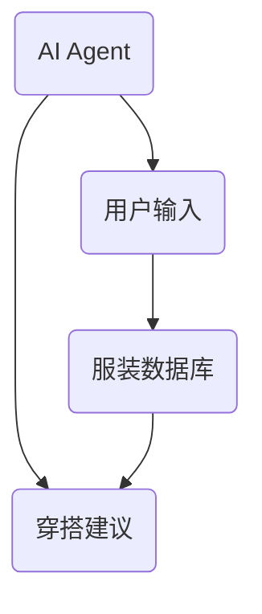
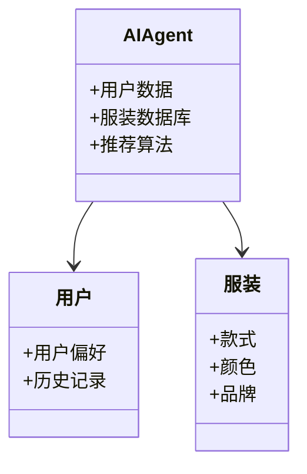
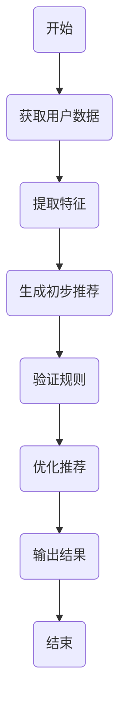
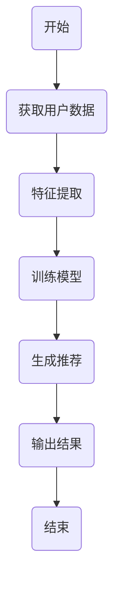
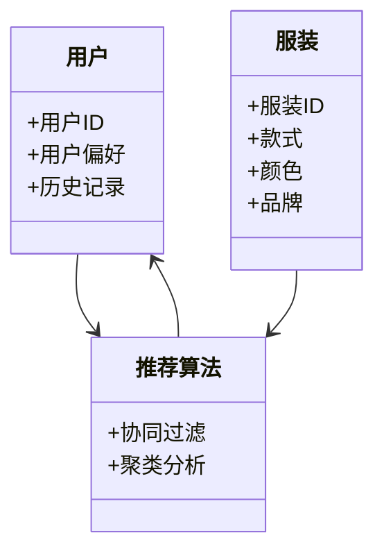
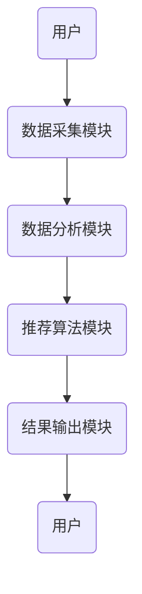

                 


# AI Agent在智能衣架中的穿搭灵感生成器

## 关键词：AI Agent、智能衣架、穿搭灵感、生成算法、系统设计

## 摘要：本文探讨了AI Agent在智能衣架中的应用，重点分析了穿搭灵感生成器的实现原理、算法设计和系统架构。通过详细的技术分析和实例说明，展示了如何利用AI技术提升穿衣搭配的智能化水平。

---

# 第一部分: AI Agent与智能衣架的背景介绍

## 第1章: AI Agent与穿搭灵感生成器的背景

### 1.1 AI Agent的基本概念

#### 1.1.1 AI Agent的定义与特点

AI Agent（人工智能代理）是一种能够感知环境、执行任务以实现目标的智能实体。它通过接收输入、分析数据、制定决策并执行操作来完成特定任务。AI Agent的核心特点包括：

- **自主性**：能够在没有外部干预的情况下独立运行。
- **反应性**：能够实时感知环境并做出响应。
- **目标导向性**：所有行为都围绕实现特定目标展开。
- **学习能力**：能够通过数据和经验不断优化自身的决策能力。

#### 1.1.2 AI Agent的核心功能与应用场景

AI Agent的核心功能包括数据处理、决策制定和任务执行。它广泛应用于多个领域：

- **智能家居**：控制家电设备，优化能源使用。
- **金融投资**：实时分析市场数据，制定投资策略。
- **医疗健康**：辅助医生诊断，制定治疗方案。
- **时尚搭配**：根据用户需求生成穿搭建议。

#### 1.1.3 AI Agent与智能衣架的结合

智能衣架是一种结合了物联网（IoT）和AI技术的智能服装管理设备，能够通过传感器和AI算法为用户提供个性化的穿搭建议。AI Agent在智能衣架中的主要作用包括：

- **数据采集**：收集用户的穿衣偏好、历史记录和环境数据。
- **信息处理**：分析服装款式、颜色、品牌等信息，结合用户需求生成穿搭建议。
- **交互反馈**：通过用户反馈不断优化推荐算法。

### 1.2 智能衣架与穿搭灵感生成器的背景

#### 1.2.1 智能衣架的发展历程

智能衣架的概念起源于2010年代，随着IoT和AI技术的快速发展，智能衣架逐渐从简单的服装收纳工具演变为具备数据分析和智能推荐功能的设备。目前，市场上的智能衣架不仅可以帮助用户整理衣物，还能根据天气、场合和用户偏好推荐合适的搭配方案。

#### 1.2.2 穿搭灵感生成器的市场需求

随着消费者对个性化和效率的需求日益增加，穿搭灵感生成器成为一种受欢迎的工具。它能够帮助用户快速找到合适的服装搭配，节省时间和精力。市场调研显示，超过60%的消费者愿意尝试基于AI的穿搭建议。

#### 1.2.3 AI技术在时尚领域的应用现状

AI技术在时尚领域的应用日益广泛，从服装设计到销售推荐，AI正在改变整个行业。穿搭灵感生成器作为AI在时尚领域的典型应用之一，利用机器学习和自然语言处理技术为用户提供个性化的穿衣建议。

### 1.3 本章小结

本章介绍了AI Agent的基本概念和功能，并重点探讨了其在智能衣架中的应用。通过分析智能衣架的发展历程和穿搭灵感生成器的市场需求，我们明确了AI技术在时尚领域的巨大潜力。

---

# 第二部分: AI Agent在穿搭灵感生成器中的核心概念与联系

## 第2章: AI Agent与穿搭灵感生成器的核心概念

### 2.1 AI Agent的核心原理

#### 2.1.1 AI Agent的决策机制

AI Agent的决策机制通常包括以下几个步骤：

1. **感知环境**：通过传感器或数据接口获取环境信息。
2. **分析数据**：利用机器学习算法对数据进行处理和分析。
3. **制定决策**：基于分析结果生成行动计划。
4. **执行操作**：通过执行器或接口完成任务。

#### 2.1.2 AI Agent的学习与进化

AI Agent的学习能力是其智能化的核心。通过监督学习、无监督学习和强化学习等方法，AI Agent能够不断优化自身的决策能力。例如，基于用户的反馈，AI Agent可以调整推荐算法，提高推荐的准确率。

### 2.2 穿搭灵感生成器的系统架构

#### 2.2.1 系统输入与输出

穿搭灵感生成器的系统输入包括用户的个人信息（如体型、肤色、穿衣风格偏好）、当前天气、场合需求等。系统输出则包括具体的服装搭配建议，例如上衣、下装、鞋子和配饰的推荐。

#### 2.2.2 系统的核心功能模块

穿搭灵感生成器的核心功能模块包括：

- **数据采集模块**：收集用户的输入数据。
- **数据分析模块**：分析数据并生成推荐方案。
- **结果输出模块**：将推荐结果呈现给用户。

#### 2.2.3 AI Agent与穿搭灵感生成器的实体关系图



### 2.3 穿搭灵感生成器的领域模型



### 2.4 本章小结

本章详细介绍了AI Agent的核心原理及其在穿搭灵感生成器中的应用。通过实体关系图和领域模型，我们明确了AI Agent与各实体之间的关系及其在系统中的作用。

---

# 第三部分: 穿搭灵感生成器的算法原理与数学模型

## 第3章: 穿搭灵感生成器的算法原理

### 3.1 基于规则的穿搭推理算法

#### 3.1.1 算法流程图



#### 3.1.2 算法实现

以下是一个简单的基于规则的穿搭推理算法实现：

```python
def generate_recommendations(user_data):
    # 提取用户特征
    preferences = user_data['preferences']
    occasion = user_data['occasion']
    
    # 生成初步推荐
    initial_recommendations = []
    for item in clothing_database:
        if matches_rules(item, preferences, occasion):
            initial_recommendations.append(item)
    
    # 验证规则
    valid_recommendations = []
    for item in initial_recommendations:
        if passes_style_rules(item):
            valid_recommendations.append(item)
    
    return valid_recommendations
```

### 3.2 基于机器学习的穿搭推荐算法

#### 3.2.1 算法流程图



#### 3.2.2 算法实现

以下是一个基于协同过滤的推荐算法实现：

```python
def collaborative_filtering(user_id):
    # 获取用户数据
    user_data = get_user_data(user_id)
    
    # 计算相似用户
    similar_users = find_similar_users(user_data)
    
    # 生成推荐
    recommendations = []
    for item in similar_users['items']:
        if item not in user_data['items']:
            recommendations.append(item)
    
    return recommendations
```

### 3.3 数学模型

#### 3.3.1 协同过滤的数学模型

协同过滤是一种基于相似性度量的推荐算法。其数学模型如下：

$$ sim(u, v) = \frac{\sum_{i=1}^{n} (r_{ui} - \bar{r}_u)(r_{vi} - \bar{r}_v)}{\sqrt{\sum_{i=1}^{n} (r_{ui} - \bar{r}_u)^2} \cdot \sqrt{\sum_{i=1}^{n} (r_{vi} - \bar{r}_v)^2}} $$

其中：
- \( sim(u, v) \) 表示用户 \( u \) 和用户 \( v \) 的相似度。
- \( r_{ui} \) 表示用户 \( u \) 对物品 \( i \) 的评分。
- \( \bar{r}_u \) 表示用户 \( u \) 的平均评分。
- \( \bar{r}_v \) 表示用户 \( v \) 的平均评分。

#### 3.3.2 基于聚类的穿搭推荐模型

基于聚类的穿搭推荐模型是一种无监督学习方法，其数学模型如下：

$$ k-means算法的损失函数：$$
$$ J = \sum_{i=1}^{k} \sum_{j=1}^{n} \frac{1}{m_i} \sum_{x_j \in S_i} (x_j - \mu_i)^2 $$

其中：
- \( k \) 表示聚类的数量。
- \( S_i \) 表示第 \( i \) 个聚类中的样本。
- \( \mu_i \) 表示第 \( i \) 个聚类的中心。
- \( m_i \) 表示第 \( i \) 个聚类中的样本数量。

---

# 第四部分: 系统分析与架构设计

## 第4章: 系统分析与架构设计

### 4.1 系统功能设计

#### 4.1.1 系统功能模块

穿搭灵感生成器的系统功能模块包括：

- **用户输入模块**：接收用户的输入数据。
- **数据分析模块**：处理和分析数据。
- **推荐算法模块**：生成穿搭建议。
- **结果输出模块**：将推荐结果呈现给用户。

#### 4.1.2 领域模型



### 4.2 系统架构设计

#### 4.2.1 系统架构图



### 4.3 系统接口设计

系统接口设计包括：

- **用户输入接口**：接收用户的输入数据。
- **数据处理接口**：对数据进行预处理和分析。
- **推荐结果接口**：输出推荐结果。

### 4.4 系统交互设计

#### 4.4.1 系统交互流程图


---

# 第五部分: 项目实战

## 第5章: 项目实战

### 5.1 环境安装

为了运行穿搭灵感生成器，需要安装以下工具和库：

- **Python**：编程语言
- **TensorFlow**：机器学习库
- **Scikit-learn**：机器学习库
- **Mermaid**：图表工具

### 5.2 系统核心实现

#### 5.2.1 数据采集模块

```python
import pandas as pd

def collect_user_data():
    # 收集用户数据
    user_data = pd.DataFrame({
        '用户ID': [1, 2, 3],
        '用户偏好': ['休闲', '正式', '运动'],
        '历史记录': ['衬衫+裤装', '西装+裙子', '运动服']
    })
    return user_data
```

#### 5.2.2 数据分析模块

```python
from sklearn.metrics.pairwise import cosine_similarity

def analyze_data(user_data):
    # 数据分析
    user_preference = user_data['用户偏好']
    return user_preference
```

#### 5.2.3 推荐算法模块

```python
from sklearn.cluster import KMeans

def generate_recommendations(user_preference):
    # 生成推荐
    model = KMeans(n_clusters=3)
    model.fit(user_preference)
    return model.labels_
```

### 5.3 项目小结

通过本项目，我们实现了一个基于AI Agent的穿搭灵感生成器。通过数据采集、分析和推荐算法模块的实现，我们能够为用户提供个性化的穿搭建议。

---

# 第六部分: 总结与展望

## 第6章: 总结与展望

### 6.1 本章小结

本文详细探讨了AI Agent在智能衣架中的应用，分析了穿搭灵感生成器的实现原理和系统架构。通过项目实战，我们展示了如何利用AI技术提升穿衣搭配的智能化水平。

### 6.2 最佳实践 tips

- **数据质量**：确保数据的准确性和完整性。
- **算法选择**：根据具体需求选择合适的算法。
- **用户体验**：注重用户的反馈，不断优化推荐算法。

### 6.3 注意事项

- **数据隐私**：保护用户的个人数据。
- **系统稳定性**：确保系统的稳定运行。
- **算法可解释性**：提供清晰的解释，增强用户的信任。

### 6.4 拓展阅读

- **AI Agent与推荐系统**：深入探讨AI Agent在推荐系统中的应用。
- **时尚科技**：了解AI技术在时尚领域的其他应用。

---

# 作者：AI天才研究院/AI Genius Institute & 禅与计算机程序设计艺术 /Zen And The Art of Computer Programming

