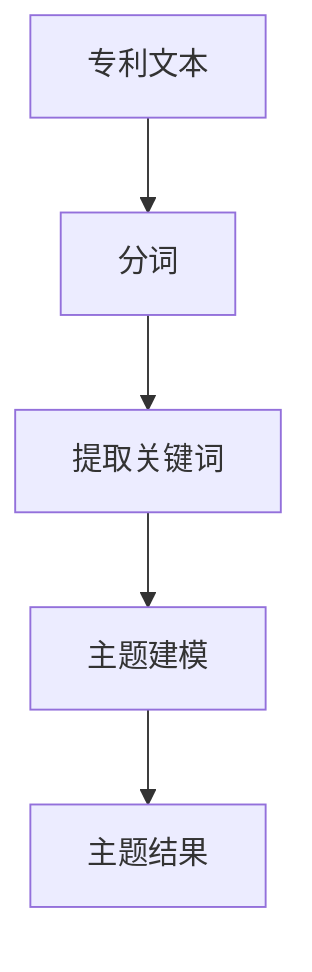
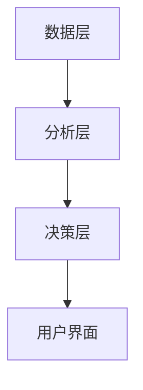

                 


# AI驱动的企业知识产权管理：专利分析与战略规划

> 关键词：AI技术，企业知识产权管理，专利分析，知识产权战略，机器学习，自然语言处理

> 摘要：本文探讨了AI技术在企业知识产权管理中的应用，特别是在专利分析与战略规划方面的创新方法。通过结合自然语言处理、机器学习和图论等技术，AI能够帮助企业更高效地进行专利检索、分类、趋势预测和风险评估，从而优化知识产权战略布局。本文详细分析了AI驱动的专利分析方法、系统架构设计以及实际应用案例，并展望了未来的发展方向。

---

# 第一部分：AI驱动的企业知识产权管理概述

## 第1章：AI在企业知识产权管理中的应用背景

### 1.1 企业知识产权管理的背景与挑战

#### 1.1.1 知识产权管理的核心概念

知识产权（Intellectual Property, IP）是指法律所确认的创造性智力成果，主要包括专利、商标、版权、商业秘密等。知识产权管理（Intellectual Property Management）是企业对其知识产权的获取、维护、运用和保护的过程，旨在最大化知识产权的商业价值，降低法律风险。

**关键术语解释：**

- **专利（Patent）**：保护发明的技术方案，通常涉及技术领域的创新。
- **商标（Trademark）**：用于区分商品或服务来源的标识。
- **版权（Copyright）**：保护文学、艺术和科学作品的原创性。
- **商业秘密（Trade Secret）**：未公开的商业信息，具有经济价值并采取保密措施。

**问题背景：**

随着全球化的加剧和技术的快速发展，企业面临的知识产权管理挑战日益复杂：

1. **数据爆炸**：全球专利申请数量激增，人工处理效率低下。
2. **信息分散**：知识产权信息分布在不同数据库和来源中，难以整合。
3. **分析复杂性**：专利分析需要结合技术、法律和商业等多个维度。
4. **战略需求**：企业需要通过知识产权布局提升市场竞争力，但传统方法难以快速响应市场变化。

**问题解决：**

AI技术的引入为企业知识产权管理提供了新的解决方案。通过自然语言处理（NLP）、机器学习（ML）和大数据分析，企业可以高效地处理海量数据，提取有价值的信息，支持决策。

**边界与外延：**

- **边界**：本文主要关注专利分析与战略规划，不涉及商标、版权等其他知识产权类型。
- **外延**：AI技术在知识产权管理中的应用不仅限于专利，还包括知识产权保护、侵权检测等方面。

### 1.2 AI驱动知识产权管理的必要性

#### 1.2.1 数据爆炸与信息处理的挑战

随着科技的进步，每天产生的专利申请数量庞大。例如，中国国家知识产权局（CNIPA）每年受理的专利申请超过100万件。传统的人工分析方法难以处理如此庞大的数据量，且效率低下。

#### 1.2.2 专利分析的复杂性与AI的优势

专利分析需要结合技术领域、发明人、专利权人等多个维度的信息。AI技术可以通过自然语言处理和机器学习，自动提取关键词、分类专利、识别技术趋势，从而简化分析过程。

#### 1.2.3 企业战略规划的智能化需求

企业需要根据市场和技术的变化动态调整知识产权战略。AI可以通过预测技术发展趋势、识别竞争对手的专利布局，为企业提供实时的决策支持。

### 1.3 本章小结

本章介绍了企业知识产权管理的核心概念和面临的挑战，并重点阐述了AI技术在专利分析和战略规划中的应用价值。AI技术能够帮助企业高效处理海量数据，提取有价值的信息，支持决策，从而优化知识产权管理。

---

## 第2章：专利分析的理论与方法

### 2.1 专利分析的基本概念

#### 2.1.1 专利分析的定义与目的

专利分析是对专利数据进行整理、分析和研究的过程，旨在为企业提供技术趋势、竞争对手分析、专利布局优化等方面的决策支持。

#### 2.1.2 专利分析的核心要素

1. **技术领域**：专利涉及的技术领域，如人工智能、生物医药等。
2. **发明人**：专利的发明人及其研究领域。
3. **专利权人**：专利的申请人或权利人，通常为公司或研究机构。
4. **专利数量与质量**：专利的数量、授权率、引用次数等。

#### 2.1.3 专利分析的分类与应用场景

1. **技术趋势分析**：分析某个技术领域的发展趋势和热点方向。
2. **竞争对手分析**：识别竞争对手的专利布局和技术动态。
3. **专利布局优化**：为企业制定合理的专利申请策略。

### 2.2 基于AI的专利分析方法

#### 2.2.1 自然语言处理在专利文本分析中的应用

**关键术语解释：**

- **分词（Tokenization）**：将文本分割成单词或短语。
- **关键词提取（Keyword Extraction）**：从文本中提取具有代表性的关键词。
- **主题建模（Topic Modeling）**：识别文本的主题分布。

**算法原理：**

1. **分词**：使用jieba或spaCy等工具对专利文本进行分词。
2. **关键词提取**：基于TF-IDF（Term Frequency-Inverse Document Frequency）提取关键词。
3. **主题建模**：使用LDA（Latent Dirichlet Allocation）模型进行主题建模。

**代码示例：**

```python
from gensim import corpora, models

# 假设我们有一个专利文本列表texts
texts = ["发明专利的申请流程", "专利检索方法", "专利布局策略"]

# 分词
tokenizer = lambda text: text.split()
corpus = [tokenizer(text) for text in texts]

# 创建词典
dictionary = corpora.Dictionary(corpus)
corpus_bow = [dictionary.doc2bow(text) for text in corpus]

# 训练LDA模型
lda = models.LDA(corpus_bow, num_topics=2, passes=10)
topics = lda.get_topics()

# 输出主题
for topic in topics:
    print([dictionary[word] for word, prob in topic])
```

**流程图：**



---

### 2.3 专利分析的工具与平台

#### 2.3.1 常用专利分析工具介绍

1. **PatentScope**：由世界知识产权组织（WIPO）提供，支持全球专利数据的检索和分析。
2. **IncoPat**：专注于中国专利数据的分析平台。
3. **IPWatch**：提供专利检索、分析和监控服务。

#### 2.3.2 AI驱动的专利分析平台的特点

1. **智能化**：通过AI技术自动提取专利信息，减少人工干预。
2. **实时性**：能够实时更新专利数据，支持动态分析。
3. **可视化**：提供直观的数据可视化界面，便于用户理解。

---

## 第3章：专利分析的算法原理与实现

### 3.1 专利文本处理的NLP算法

#### 3.1.1 分词与关键词提取

**代码示例：**

```python
import jieba

text = "专利申请流程包括初步审查、实质审查等步骤"
words = jieba.lcut(text)
print(words)
# 输出：['专利', '申请', '流程', '包括', '初步', '审查', '实质', '审查', '等', '步骤']
```

#### 3.1.2 情感分析与主题建模

**代码示例：**

```python
from sklearn.feature_extraction.text import TfidfVectorizer
from sklearn.decomposition import NMF

# 假设我们有一个专利文本列表texts
texts = ["发明专利的申请流程", "专利检索方法", "专利布局策略"]

# TF-IDF提取关键词
vectorizer = TfidfVectorizer(max_features=10)
tfidf_matrix = vectorizer.fit_transform(texts)
feature_names = vectorizer.get_feature_names()

# 输出关键词
for i, doc in enumerate(texts):
    feature_scores = tfidf_matrix[i].toarray()[0]
    for feature, score in zip(feature_names, feature_scores):
        if score > 0.2:
            print(f"{doc}: {feature} ({score})")
```

#### 3.1.3 基于BERT的专利文本相似度计算

**代码示例：**

```python
from transformers import BertTokenizer, BertModel
import torch

tokenizer = BertTokenizer.from_pretrained('bert-base-uncased')
model = BertModel.from_pretrained('bert-base-uncased')

text1 = "发明专利的申请流程"
text2 = "专利检索方法"

# 分词
inputs1 = tokenizer(text1, return_tensors='np')
inputs2 = tokenizer(text2, return_tensors='np')

# 获取隐藏层向量
with torch.no_grad():
    outputs1 = model(**inputs1)
    outputs2 = model(**inputs2)

# 计算相似度
similarity = torch.cosine_similarity(outputs1.last_hidden_state.mean(dim=1),
                                     outputs2.last_hidden_state.mean(dim=1))
print(similarity.item())
```

---

## 第4章：企业知识产权战略规划的AI支持

### 4.1 知识产权战略规划的核心要素

#### 4.1.1 战略目标的设定

企业知识产权战略目标通常包括以下方面：

1. **技术领先**：通过专利布局占据技术高地。
2. **市场保护**：通过商标和版权保护品牌和产品。
3. **风险防控**：避免侵犯他人知识产权，降低侵权风险。

#### 4.1.2 专利布局的优化

**关键术语解释：**

- **专利布局**：企业在不同技术领域和地域上的专利申请策略。
- **技术生命周期**：技术从研发到成熟再到被淘汰的过程。

**算法原理：**

1. **技术趋势预测**：基于时间序列分析预测技术发展趋势。
2. **地域选择**：根据市场分析选择重点申请的国家或地区。

**代码示例：**

```python
import pandas as pd
from statsmodels.tsa.arima_model import ARIMA

# 假设我们有一个技术领域的专利申请数量时间序列
data = pd.Series([100, 200, 150, 250, 300, 280, 350], index=[2015, 2016, 2017, 2018, 2019, 2020, 2021])

# 训练ARIMA模型
model = ARIMA(data, order=(1, 1, 1))
model_fit = model.fit()

# 预测2022年的专利申请数量
forecast = model_fit.forecast(steps=1)
print(forecast)
```

#### 4.1.3 知识产权保护与风险防控

**关键术语解释：**

- **知识产权保护**：通过法律手段保护企业的知识产权。
- **风险防控**：识别和规避知识产权侵权风险。

**算法原理：**

1. **侵权检测**：基于自然语言处理和机器学习技术，自动检测是否存在侵权风险。
2. **风险评估**：根据专利布局和市场分析，评估潜在的侵权风险。

---

## 第5章：基于AI的企业知识产权管理系统架构

### 5.1 系统功能设计

#### 5.1.1 专利数据采集与预处理

**关键术语解释：**

- **数据采集**：从专利数据库中获取专利数据。
- **数据预处理**：对专利数据进行清洗、转换和标准化。

**代码示例：**

```python
import requests
from bs4 import BeautifulSoup

# 从PatentScope获取专利数据（示例）
url = "https://patentscope.wipo.int"
response = requests.get(url)
soup = BeautifulSoup(response.text, 'html.parser')
# 提取专利信息
patent_info = []
for result in soup.find_all('div', class_='patent-result'):
    title = result.find('h2').text
    publication_number = result.find('span', class_='pub-number').text
    patent_info.append({'title': title, 'publication_number': publication_number})
print(patent_info)
```

#### 5.1.2 专利分析与可视化

**关键术语解释：**

- **可视化**：通过图表展示专利分析结果。
- **数据可视化工具**：如Matplotlib、Seaborn等。

**代码示例：**

```python
import matplotlib.pyplot as plt

# 假设我们有一个专利分析结果的DataFrame df
# 绘制专利申请数量随时间的变化趋势图
plt.figure(figsize=(10, 6))
plt.plot(df['year'], df['count'], 'b-', marker='o')
plt.xlabel('Year')
plt.ylabel('Patent Count')
plt.title('Patent Filing Trends')
plt.grid(True)
plt.show()
```

#### 5.1.3 知识产权战略规划与模拟

**关键术语解释：**

- **战略模拟**：通过AI模拟不同战略的实施效果，为企业提供决策支持。
- **优化建议**：基于模拟结果提出最优的知识产权管理策略。

**代码示例：**

```python
import numpy as np

# 假设我们有一个专利布局的优化模型
# 输入参数：技术领域、地域、专利数量
# 输出：优化后的专利布局方案
def optimize PatentLayout(tech_fields, regions, num_patents):
    # 简单的优化逻辑（示例）
    optimized_layout = {}
    for field in tech_fields:
        for region in regions:
            # 计算该技术领域在该地区的最优专利数量
            optimized_patents = num_patents * 0.2  # 示例计算
            optimized_layout[(field, region)] = optimized_patents
    return optimized_layout

# 示例调用
tech_fields = ['AI', '生物医药', '半导体']
regions = ['中国', '美国', '欧洲']
num_patents = 100

result = optimize_PatentLayout(tech_fields, regions, num_patents)
print(result)
```

### 5.2 系统架构设计

#### 5.2.1 分层架构设计

**层次化设计：**

1. **数据层**：存储专利数据和相关知识库。
2. **分析层**：包括专利分析算法和工具。
3. **决策层**：提供战略规划和优化建议。

**流程图：**



---

## 第6章：基于AI的知识产权管理系统的实际应用

### 6.1 项目实战：环境安装与系统核心实现

#### 6.1.1 环境安装

**所需工具：**

1. **Python**：编程语言。
2. **TensorFlow/PyTorch**：深度学习框架。
3. **Scikit-learn**：机器学习库。
4. **BeautifulSoup**：网页抓取工具。
5. **Jieba**：中文分词工具。

**安装命令：**

```bash
pip install numpy pandas scikit-learn jieba beautifulsoup4 requests transformers
```

#### 6.1.2 核心实现

**代码示例：**

```python
from transformers import BertTokenizer, BertModel
import torch
import pandas as pd
from sklearn.decomposition import PCA

# 专利文本数据
texts = [
    "发明专利的申请流程包括初步审查和实质审查。",
    "专利检索方法包括关键词检索和分类号检索。",
    "专利布局需要考虑技术领域和目标市场。",
    "知识产权保护包括专利、商标和版权的保护。",
    "技术趋势分析可以帮助企业制定研发战略。"
]

# 分词
tokenizer = BertTokenizer.from_pretrained('bert-base-uncased')
inputs = tokenizer(texts, return_tensors='np', padding=True, truncation=True)

# 获取词向量
model = BertModel.from_pretrained('bert-base-uncased')
with torch.no_grad():
    outputs = model(**inputs)
    sentence_embeddings = outputs.last_hidden_state.mean(dim=1)

# PCA降维
pca = PCA(n_components=2)
reduced_embeddings = pca.fit_transform(sentence_embeddings)

# 可视化
import matplotlib.pyplot as plt

plt.figure(figsize=(10, 6))
plt.scatter(reduced_embeddings[:, 0], reduced_embeddings[:, 1], c='blue', marker='o')
plt.xlabel('Component 1')
plt.ylabel('Component 2')
plt.title('PCA Visualization of Patent Text Embeddings')
plt.show()
```

### 6.2 项目小结

通过实际项目，我们展示了如何利用AI技术实现专利文本的分词、关键词提取、主题建模和可视化。这些技术可以帮助企业更高效地进行专利分析，制定合理的知识产权战略。

---

## 第7章：AI驱动的知识产权管理系统的未来展望

### 7.1 创新管理模式的探索

#### 7.1.1 数据驱动的决策支持

AI技术可以帮助企业通过数据驱动的方式优化知识产权管理，例如：

1. **实时监控**：实时跟踪专利数据的变化。
2. **动态调整**：根据市场变化动态调整知识产权战略。

#### 7.1.2 多维度的知识产权保护

未来，AI技术将进一步拓展在知识产权保护中的应用，例如：

1. **自动侵权检测**：通过自然语言处理和图像识别技术，自动检测是否存在侵权行为。
2. **智能预警**：基于AI模型预测潜在的知识产权风险，提前采取应对措施。

### 7.2 法律与伦理问题的思考

#### 7.2.1 知识产权保护的法律框架

AI技术的应用需要遵守相关的法律法规，例如《中华人民共和国专利法》《计算机软件保护条例》等。

#### 7.2.2 数据隐私与伦理问题

在使用AI进行知识产权管理时，需要关注数据隐私和伦理问题，例如：

1. **数据隐私**：专利数据可能包含企业的商业秘密，需要严格控制数据访问权限。
2. **算法公平性**：AI算法的决策可能影响企业的知识产权战略，需要确保算法的公平性和透明性。

### 7.3 未来发展方向

#### 7.3.1 技术创新

1. **更高效的自然语言处理技术**：如BERT、GPT-3等大模型的应用。
2. **多模态分析**：结合文本、图像等多种数据源进行分析。
3. **实时分析能力**：提升系统的实时性，支持动态调整。

#### 7.3.2 应用场景拓展

1. **知识产权风险评估**：基于AI技术进行知识产权风险评估和应对策略制定。
2. **知识产权交易与运营**：支持知识产权的交易和运营，提升知识产权的商业价值。

---

## 第8章：总结与展望

### 8.1 本章总结

本文详细探讨了AI技术在企业知识产权管理中的应用，特别是专利分析与战略规划方面的创新方法。通过结合自然语言处理、机器学习和大数据分析，AI技术能够帮助企业更高效地进行专利检索、分类、趋势预测和风险评估，从而优化知识产权管理。

### 8.2 未来展望

随着AI技术的不断发展，企业知识产权管理将更加智能化和数据驱动。未来，AI技术将在知识产权保护、侵权检测、技术趋势预测等方面发挥更大的作用，为企业提供更加全面和精准的决策支持。

---

## 作者信息

作者：AI天才研究院/AI Genius Institute & 禅与计算机程序设计艺术 /Zen And The Art of Computer Programming

