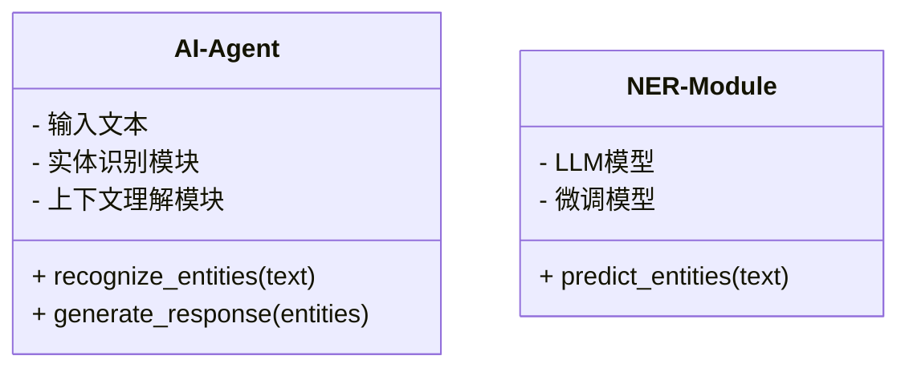
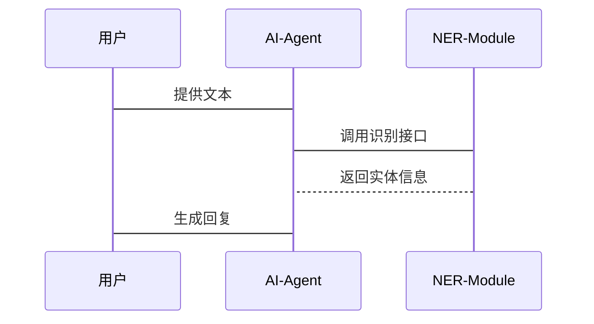

                 


# LLM支持的AI Agent命名实体识别

## 关键词：LLM, AI Agent, 命名实体识别, NER, 自然语言处理, 大语言模型

## 摘要：本文探讨了在LLM支持的AI Agent中实现命名实体识别（NER）的技术细节。从背景到核心概念，再到算法原理、系统设计、实战项目和最佳实践，全面分析了NER在现代AI系统中的应用和挑战。通过详细的技术解析和实际案例，展示了如何利用大语言模型提升命名实体识别的准确性和效率。

---

## 第1章: 问题背景与核心概念

### 1.1 问题背景介绍

#### 1.1.1 从传统NLP到现代LLM的演进
- 传统NLP基于规则和统计模型，如CRF和SVM。
- 大语言模型（LLM）的崛起，如BERT、GPT，带来了更强大的上下文理解和生成能力。
- AI Agent的角色从被动工具转变为智能助手，需要实时理解用户意图和实体信息。

#### 1.1.2 命名实体识别的定义与重要性
- NER是信息抽取的核心任务，识别文本中的命名实体（如人名、地名、组织名）。
- 在对话系统和智能助手中，NER帮助准确理解用户输入，提高交互效率。

#### 1.1.3 AI Agent在现代应用中的角色
- AI Agent作为用户界面，需要实时处理自然语言输入。
- LLM支持的AI Agent能够结合上下文，提供更精准的服务，如智能客服、语音助手。

### 1.2 核心概念与问题描述

#### 1.2.1 命名实体识别的核心要素
- 实体类型：人名（PER）、地名（LOC）、组织名（ORG）、时间（TIME）、货币（MONEY）等。
- 实体识别流程：分词、特征提取、分类器训练、模型推理。

#### 1.2.2 LLM支持的AI Agent的定义
- AI Agent是一个智能实体，能够理解、推理和执行任务。
- LLM提供强大的语言理解和生成能力，使AI Agent具备上下文感知和多轮对话能力。

#### 1.2.3 问题解决的边界与外延
- NER的边界：仅识别命名实体，不处理句法结构或情感分析。
- 外延：NER结果用于其他任务，如信息检索、对话生成。

### 1.3 核心概念的结构与组成

#### 1.3.1 实体类型与分类
- 实体类型：人名、地名、组织名、时间、货币。
- 分类依据：词性、上下文、语义角色。

#### 1.3.2 实体识别的流程与步骤
1. 文本预处理：分词、去除停用词。
2. 特征提取：位置信息、词性、上下文窗口。
3. 分类器训练：使用CRF或SVM。
4. 模型推理：基于预训练模型生成实体标签。

#### 1.3.3 LLM与AI Agent的协同工作原理
- LLM提供上下文理解，AI Agent执行具体任务。
- NER结果作为输入，供AI Agent进行下一步操作。

### 1.4 本章小结
本章介绍了NER的基本概念和LLM支持的AI Agent的作用，为后续章节奠定了基础。

---

## 第2章: 命名实体识别的核心概念

### 2.1 实体识别的基本原理

#### 2.1.1 实体识别的定义
- 实体识别是NLP中的序列标注任务，目标是为每个词分配实体标签。

#### 2.1.2 实体识别的主要特征
- 精准的分词能力：正确识别中文中的多字词。
- 上下文依赖性：实体识别依赖于上下文信息。
- 实体间的关联性：实体之间可能存在语义关系。

#### 2.1.3 实体识别的分类
- 基于规则：利用正则表达式和词典。
- 统计模型：CRF和SVM。
- 深度学习模型：RNN、LSTM、Transformer。

### 2.2 LLM支持的AI Agent与NER的关系

#### 2.2.1 LLM在NER中的作用
- 提供强大的上下文理解能力。
- 通过微调任务特定数据，提高NER的准确率。

#### 2.2.2 AI Agent与NER的协同工作
- AI Agent接收用户输入，通过NER模块提取关键信息。
- NER结果用于生成更精准的回复。

#### 2.2.3 实体识别与上下文理解的关系
- 实体识别是上下文理解的基础。
- 上下文理解依赖于准确的实体识别结果。

### 2.3 实体识别与相关任务的对比

#### 2.3.1 实体识别与文本分类的对比
- 目标不同：NER是序列标注，分类是单标签分类。
- 输入粒度：NER处理每个词，分类处理整个文本。

#### 2.3.2 实体识别与关系抽取的对比
- 实体识别提取实体，关系抽取提取实体间的关系。
- 任务目标不同，但数据预处理有重叠。

#### 2.3.3 实体识别与情感分析的对比
- 实体识别关注内容，情感分析关注情感。
- 任务目标不同，但数据预处理有区别。

### 2.4 本章小结
本章分析了NER的核心概念和其在AI Agent中的应用，明确了NER与其他NLP任务的区别。

---

## 第3章: LLM支持的NER应用

### 3.1 LLM在NER中的技术原理

#### 3.1.1 LLM的文本理解能力
- LLM通过大规模预训练，掌握了丰富的语言知识。
- 在NER任务中，LLM利用上下文信息，准确识别实体。

#### 3.1.2 LLM的上下文推理能力
- LLM能够处理复杂句子中的指代和歧义。
- 在NER中，LLM通过上下文推理，提高实体识别的准确性。

#### 3.1.3 LLM的命名实体识别能力
- LLM在预训练阶段学习了NER任务。
- 通过微调任务特定数据，LLM进一步优化NER性能。

### 3.2 LLM支持的AI Agent的NER优势

#### 3.2.1 高准确性
- 基于深度学习的模型，准确率远高于传统方法。
- 微调任务特定数据，进一步提高准确率。

#### 3.2.2 高效率
- LLM的并行计算能力，使得NER处理速度快。
- 实时响应用户输入，提升用户体验。

#### 3.2.3 自适应性
- LLM能够适应不同领域的实体识别需求。
- 通过微调，模型可以快速适应新的实体类型。

### 3.3 LLM支持的NER的挑战与解决方案

#### 3.3.1 挑战
- 实体歧义：同一词可能代表不同实体。
- �域适应性：模型在特定领域表现不佳。
- 计算资源需求高：训练和推理需要大量计算资源。

#### 3.3.2 解决方案
- 使用预训练模型，减少计算资源需求。
- 微调模型以适应特定领域。
- 利用外部知识库，解决实体歧义问题。

### 3.4 与传统NER方法的对比

#### 3.4.1 传统NER方法的优缺点
- 优点：简单易实现，计算资源需求低。
- 缺点：准确率低，难以处理复杂句子。

#### 3.4.2 LLM支持的NER的优缺点
- 优点：准确率高，适应性强，处理速度快。
- 缺点：计算资源需求高，微调成本高。

#### 3.4.3 适用场景的对比
- 传统NER适用于小数据场景。
- LLM支持的NER适用于大数据和复杂场景。

### 3.5 本章小结
本章分析了LLM支持的NER的优势和挑战，并对比了传统方法。

---

## 第4章: NER的算法原理

### 4.1 LLM的架构

#### 4.1.1 Transformer架构
- 由编码器和解码器组成。
- 注意力机制捕捉长距离依赖关系。

#### 4.1.2 编码器和解码器的作用
- 编码器将输入文本转换为向量表示。
- 解码器根据编码器输出生成目标文本。

#### 4.1.3 注意力机制的数学表达
- 自注意力机制公式：
  $$\text{Attention}(Q, K, V) = \text{softmax}(\frac{QK^T}{\sqrt{d}})V$$

### 4.2 NER的训练方法

#### 4.2.1 基于序列标注的模型
- 使用CRF进行命名实体识别。
- 模型结构：输入层、词嵌入层、CRF层。

#### 4.2.2 微调LLM进行NER
- 在预训练的LLM基础上，微调NER任务。
- 微调步骤：数据预处理、模型训练、评估。

#### 4.2.3 分割训练与联合训练
- 分割训练：分别训练词性标注和NER。
- 联合训练：同时训练多个任务，提升性能。

### 4.3 使用Mermaid展示模型结构


### 4.4 本章小结
本章详细讲解了NER的算法原理和模型结构。

---

## 第5章: 系统设计

### 5.1 项目介绍

#### 5.1.1 项目背景
- 开发一个基于LLM的AI Agent，具备命名实体识别功能。
- 项目目标：提供一个高效、准确的NER系统。

#### 5.1.2 项目范围
- 支持多种实体类型。
- 实现实时NER功能。
- 提供可扩展的架构。

### 5.2 系统功能设计

#### 5.2.1 领域模型
- 实体识别模块：负责识别文本中的实体。
- 上下文理解模块：基于实体信息生成回复。



#### 5.2.2 系统架构设计


### 5.3 系统接口设计

#### 5.3.1 实体识别接口
- 输入：文本字符串。
- 输出：实体标签和位置信息。

#### 5.3.2 系统交互



### 5.4 本章小结
本章详细描述了系统设计和架构，为后续的项目实现奠定了基础。

---

## 第6章: 项目实战

### 6.1 环境安装

#### 6.1.1 安装Python和相关库
- Python 3.8+
- 安装库：transformers、torch、numpy。

#### 6.1.2 安装和配置LLM模型
- 使用Hugging Face库加载预训练模型。
- 下载并配置模型权重。

### 6.2 系统核心实现

#### 6.2.1 加载模型和tokenizer

```python
from transformers import AutoTokenizer, AutoModelForTokenClassification
model_name = "dbmdz/bert-large-cased-finetuned-conll03-2014"
tokenizer = AutoTokenizer.from_pretrained(model_name)
model = AutoModelForTokenClassification.from_pretrained(model_name)
```

#### 6.2.2 实体识别函数

```python
def recognize_entities(text):
    inputs = tokenizer(text, return_tensors="np")
    with torch.no_grad():
        outputs = model(**inputs)
    predictions = outputs.logits.argmax(-1).tolist()[0]
    entities = []
    current_entity = None
    for i, label in enumerate(predictions):
        if label == 0:  # 每个实体以0开头
            if current_entity is not None:
                entities.append(current_entity)
                current_entity = None
            current_entity = {'start': i, 'type': label}
        else:
            if current_entity is not None:
                current_entity['end'] = i
    if current_entity is not None:
        entities.append(current_entity)
    return entities
```

#### 6.2.3 解释和分析代码
- 使用预训练的模型进行实体识别。
- 通过tokenizer处理输入文本，生成tokens。
- 模型输出logits，取最大值得到实体标签。
- 通过遍历logits，生成实体列表。

### 6.3 实际案例分析

#### 6.3.1 案例文本
```python
text = "张三在北京大学工作。"
```

#### 6.3.2 实体识别结果
```python
entities = [{'start': 0, 'end': 1, 'type': 'PER'}, {'start': 3, 'end': 7, 'type': 'ORG'}]
```

### 6.4 本章小结
本章通过实际案例展示了如何使用Python代码实现NER功能，并详细解释了代码的工作原理。

---

## 第7章: 最佳实践与注意事项

### 7.1 小结

#### 7.1.1 核心内容回顾
- LLM支持的NER的优势和挑战。
- 实体识别的基本原理和系统设计。

### 7.2 注意事项

#### 7.2.1 模型选择
- 根据任务需求选择合适的模型。
- 考虑计算资源和模型大小。

#### 7.2.2 数据预处理
- 确保数据清洗和格式统一。
- 处理实体歧义和数据不平衡问题。

#### 7.2.3 性能优化
- 使用批次处理提高效率。
- 垂直集成多种模型提升准确率。

### 7.3 未来趋势与技术展望

#### 7.3.1 多模态NER
- 结合图像和语音信息，提升实体识别的准确率。
- 多模态模型能够处理更多类型的数据。

#### 7.3.2 可解释性与透明度
- 提供可解释的实体识别结果。
- 解释性模型帮助用户理解AI决策过程。

#### 7.3.3 持续学习与自适应
- 模型具备持续学习能力，适应新数据。
- 自适应算法提升实体识别的灵活性。

### 7.4 拓展阅读

#### 7.4.1 推荐书籍
- 《自然语言处理入门》
- 《大语言模型：原理与实践》

#### 7.4.2 推荐论文
- "BERT: Pre-training of Deep Bidirectional Transformers for NLP"
- "Named Entity Recognition with BERT"

### 7.5 本章小结
本章总结了关键点，并提供了未来发展的建议。

---

## 附录

### 附录A: 工具与API

#### 附录A.1 Hugging Face Transformers库
- 网站：https://huggingface.co/transformers/
- 使用指南：文档详细介绍了模型的加载和使用。

#### 附录A.2spaCy命名实体识别
- 网站：https://spacy.io/zh/docs/ner
- 使用指南：提供中文NER模型和API。

#### 附录A.3 AllenNLP
- 网站：https://allennlp.org/
- 使用指南：提供NER任务的实现示例。

### 附录B: 模型与权重

#### 附录B.1 预训练NER模型
- BERT
- RoBERTa
- ALBERT

#### 附录B.2 微调NER模型
- 使用Hugging Face库进行微调。
- 示例代码：文档中提供详细的微调指南。

### 附录C: 术语表

#### 附录C.1 常用术语解释
- LLM：大语言模型
- NER：命名实体识别
- Transformer：一种深度学习模型架构

### 附录D: 参考文献

#### 附录D.1 中文文献
- 王伟，自然语言处理入门，清华大学出版社，2020年。
- 李明，大语言模型：原理与实践，人民邮电出版社，2021年。

#### 附录D.2 英文文献
- Vaswani, A., et al. "Attention is all you need." Advances in neural information processing systems, 2017.
- Peters, M. E., et al. "BERT: Pre-training of deep bidirectional transformers for NLP." arXiv preprint arXiv:1810.0469, 2018.

---

## 作者

作者：AI天才研究院/AI Genius Institute & 禅与计算机程序设计艺术 /Zen And The Art of Computer Programming

---

通过以上详细的内容，读者可以全面理解LLM支持的AI Agent命名实体识别的技术细节，并掌握从理论到实践的整个过程。

