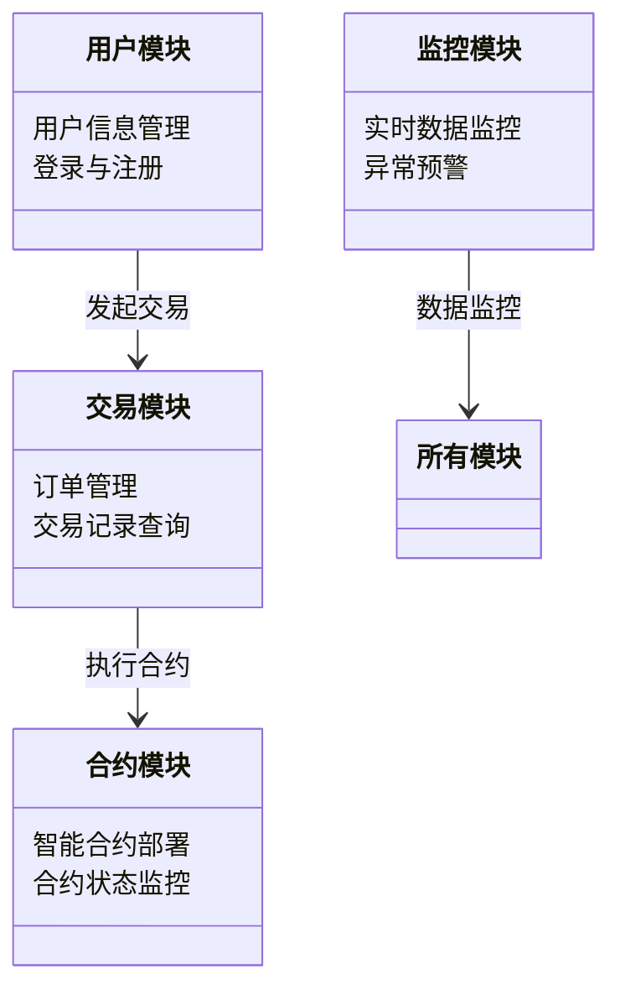
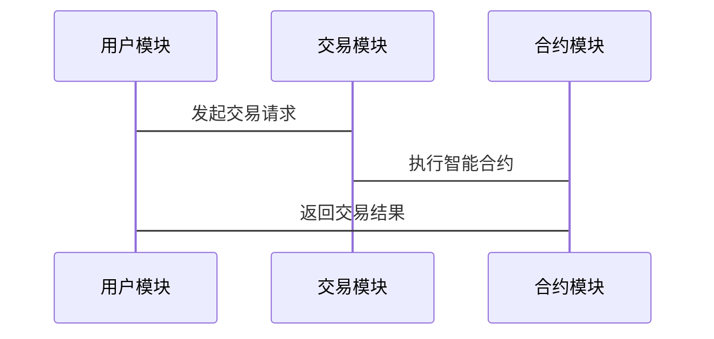

                 


# 企业估值中的区块链数字资产衍生品交易平台评估

---

## 关键词：
- 企业估值
- 区块链
- 数字资产
- 衍生品交易
- 平台评估

---

## 摘要：
本文将详细探讨在企业估值过程中，如何评估基于区块链技术的数字资产衍生品交易平台的价值。通过分析区块链技术的特点、数字资产的分类、衍生品交易的机制以及平台评估的核心要素，结合实际案例和数学模型，为读者提供一套系统化的评估方法。文章从背景介绍、核心概念、算法原理、系统架构、项目实战到总结，层层深入，旨在帮助读者理解并掌握如何在企业估值中应用区块链技术。

---

## 第一部分: 企业估值中的区块链数字资产衍生品交易平台概述

---

### 第1章: 区块链数字资产与衍生品交易平台背景

#### 1.1 区块链技术的起源与发展

##### 1.1.1 区块链的定义与核心原理
区块链是一种去中心化的分布式账本技术，通过密码学和共识机制确保数据的安全性和不可篡改性。其核心原理包括：
- **去中心化**：通过多个节点共同记录和验证数据，避免单点故障。
- **共识机制**：如比特币的PoW（工作量证明）和以太坊的PoS（权益证明），确保所有节点达成一致。
- **链式结构**：数据以区块形式按时间顺序连接，每个区块包含交易数据和哈希指针。

##### 1.1.2 区块链技术的演进历程
区块链技术自2008年比特币白皮书发布以来，经历了以下几个阶段：
1. **1.0阶段**：比特币的诞生，主要用于加密货币的点对点交易。
2. **2.0阶段**：以太坊的智能合约，引入了去中心化应用（DApps）的概念。
3. **3.0阶段**：跨链技术、Layer 2解决方案（如状态通道、侧链）的发展，提升了区块链的扩展性和互操作性。

##### 1.1.3 区块链在金融领域的应用
区块链在金融领域的应用包括：
- **支付与结算**：如跨境支付的实时清算。
- **证券发行与交易**：如数字证券（Digital Securities）的发行和交易。
- **信用评估**：通过链上数据构建去中心化的信用评估系统。

#### 1.2 数字资产的分类与特点

##### 1.2.1 数字货币的定义与分类
数字资产可以分为以下几类：
- **加密货币**：如比特币（BTC）、以太坊（ETH），用于价值存储和交换。
- **代币**：如ERC-20代币，用于特定应用场景的Tokens。
- **稳定币**：如USDT，与法定货币挂钩，用于减少价格波动。

##### 1.2.2 数字资产的属性特征对比
| 特性         | 加密货币 | 代币   | 稳定币 |
|--------------|----------|--------|--------|
| 去中心化程度 | 高       | 中     | 低     |
| 价值稳定性   | 低       | 中     | 高     |
| 主要用途     | 投资     | 应用场景 | 支付    |

##### 1.2.3 数字资产与传统金融资产的区别
- **去中心化**：数字资产通常基于区块链，去中心化程度高；传统资产依赖于中央机构。
- **交易效率**：数字资产交易速度快，成本低；传统资产交易涉及多方中介，效率较低。
- **透明性**：区块链上的交易记录公开透明，便于追踪和审计。

#### 1.3 衍生品交易的基本概念

##### 1.3.1 衍生品的定义与类型
衍生品是基于标的资产（如股票、外汇、加密货币）的金融合约，常见的类型包括：
- **期货**：约定在未来某一时间以特定价格买卖资产。
- **期权**：赋予买方在未来特定时间内以特定价格买卖资产的权利，而非义务。
- **掉期**：约定在未来某一时间交换资产或现金流。

##### 1.3.2 金融衍生品的市场现状
- **市场规模**：衍生品市场是全球最大的金融市场之一，远超现货市场。
- **风险与收益**：衍生品可以对冲风险，也可以放大收益，但同时也带来了更高的风险。

##### 1.3.3 区块链技术对衍生品交易的影响
- **透明性**：区块链确保所有交易记录可追溯，减少欺诈。
- **效率提升**：智能合约自动执行交易，降低人工干预。
- **成本降低**：去中心化交易省去了传统金融机构的中间环节。

#### 1.4 平台评估的重要性

##### 1.4.1 平台评估的核心目标
- **技术评估**：平台的技术架构是否安全、可靠。
- **交易深度**：平台的交易量、活跃用户数。
- **合规性**：平台是否符合相关法律法规。
- **用户体验**：平台的易用性和功能性。

##### 1.4.2 平台评估的边界与外延
- **边界**：仅评估平台本身的技术和运营能力，不涉及标的资产的价值评估。
- **外延**：包括平台的生态系统、社区支持、未来发展潜力。

##### 1.4.3 平台评估的流程与方法
- **数据收集**：收集平台的交易数据、用户评价、技术文档。
- **指标分析**：通过交易量、用户活跃度、安全性等指标进行评估。
- **专家评审**：结合行业专家意见，综合评估平台的优缺点。

---

### 第2章: 区块链数字资产衍生品交易平台的核心概念

#### 2.1 区块链技术原理

##### 2.1.1 区块链的去中心化特征
- **节点角色**：每个节点都可以参与数据的记录和验证。
- **数据分片**：通过分片技术提高数据处理效率。
- **共识机制**：确保所有节点达成一致的机制，如PoW、PoS、DPoS等。

##### 2.1.2 区块链的共识机制
- **PoW（工作量证明）**：通过计算哈希函数找到特定的随机数，证明计算工作。
- **PoS（权益证明）**：根据持有的代币数量分配记账权。
- **DPOS（ delegated Proof of Stake）**：通过选举代表节点进行记账。

##### 2.1.3 区块链的安全性保障
- **加密算法**：如椭圆曲线加密（ECDSA）用于数字签名。
- ** Merkel树**：用于验证数据的完整性和一致性。

#### 2.2 数字资产的发行与交易

##### 2.2.1 代币发行机制
- **ICO（Initial Coin Offering）**：通过发行代币融资的模式。
- **IEO（Initial Exchange Offering）**：通过交易所代发的模式，减少项目方的风险。

##### 2.2.2 代币交易流程
1. **下单**：用户提交买入或卖出订单。
2. **匹配**：系统自动匹配订单，撮合交易。
3. **结算**：通过智能合约完成代币的转移和价值结算。

##### 2.2.3 代币的流动性问题
- **流动性不足**：交易量小，买卖价差大。
- **流动性解决方案**：如做市商机制、流动性挖矿等。

#### 2.3 衍生品交易的区块链实现

##### 2.3.1 智能合约在衍生品交易中的应用
- **智能合约定义**：智能合约是运行在区块链上的自动执行程序，根据预设条件自动触发交易。
- **衍生品交易中的应用**：如期货合约的自动交割、期权的自动行权。

##### 2.3.2 衍生品的链上交易流程
1. **创建合约**：用户在区块链上部署智能合约。
2. **交易触发**：当满足特定条件时，智能合约自动执行交易。
3. **结算完成**：交易完成后，系统记录交易结果，确保不可篡改。

##### 2.3.3 衍生品的链下与链上结合模式
- **链上交易**：交易完全在区块链上完成。
- **链下交易**：交易部分在链下完成，链上仅记录结果。

#### 2.4 平台评估的核心要素

##### 2.4.1 平台的技术架构
- **底层区块链选择**：如比特币、以太坊、波场等。
- **智能合约开发语言**：如Solidity（以太坊）、WASM（波卡）。
- **节点分布**：中心化或去中心化的节点架构。

##### 2.4.2 平台的交易深度与流动性
- **交易深度**：市场深度反映了交易量的大小和买卖价差的大小。
- **流动性**：高流动性意味着买卖价差小，交易容易。

##### 2.4.3 平台的安全性与合规性
- **安全性**：包括智能合约的安全性、系统防护措施。
- **合规性**：平台是否符合当地的法律法规，如反洗钱（AML）、了解客户（KYC）等。

---

### 第3章: 区块链数字资产衍生品交易平台的算法原理

#### 3.1 企业估值的数学模型

##### 3.1.1 企业估值公式
企业的价值可以通过以下公式进行评估：
$$ V = \frac{CF}{r} $$
其中，\( V \) 是企业价值，\( CF \) 是未来现金流，\( r \) 是折现率。

##### 3.1.2 区块链技术对企业估值的影响
- **透明性**：区块链上的数据透明可追溯，有助于准确评估企业价值。
- **安全性**：区块链数据不可篡改，减少了估值过程中的信息不对称。
- **效率提升**：智能合约自动执行，提高了估值过程的效率。

#### 3.2 智能合约的实现原理

##### 3.2.1 智能合约的编写
以以太坊为例，智能合约使用Solidity语言编写，代码如下：
```solidity
// SPDX-License-Identifier: MIT
pragma solidity ^0.8.0;

contract DerivativesExchange {
    // 交易记录结构体
    struct Trade {
        address buyer;
        address seller;
        uint256 amount;
        uint256 price;
        uint256 timestamp;
    }

    // 交易记录数组
    Trade[] public trades;

    // 交易函数
    function trade(uint256 price, address buyer, address seller) public {
        trades.push(Trade(buyer, seller, block.timestamp, price, block.timestamp));
    }
}
```

##### 3.2.2 智能合约的执行流程
1. **部署合约**：在区块链上部署智能合约。
2. **触发交易**：通过外部调用或内部逻辑触发合约函数。
3. **自动执行**：合约自动执行交易逻辑，并记录交易结果。

#### 3.3 交易数据的分析与处理

##### 3.3.1 交易数据分析
- **时间序列分析**：通过分析交易发生的时间和频率，判断交易的活跃度。
- **价格波动分析**：分析价格波动情况，判断市场的稳定性。

##### 3.3.2 数据处理流程
1. **数据采集**：从区块链上采集交易数据。
2. **数据清洗**：去除异常数据，确保数据质量。
3. **数据建模**：通过机器学习模型预测未来的交易趋势。

---

### 第4章: 区块链数字资产衍生品交易平台的系统分析与架构设计

#### 4.1 问题场景介绍
本章将从实际应用场景出发，分析区块链数字资产衍生品交易平台的系统需求。

#### 4.2 项目介绍
项目名称：区块链数字资产衍生品交易平台
目标：构建一个安全、高效、透明的数字资产衍生品交易系统。

#### 4.3 系统功能设计

##### 4.3.1 系统功能模块
- **用户模块**：用户注册、登录、交易。
- **交易模块**：订单管理、交易记录查询。
- **合约模块**：智能合约部署、管理。
- **监控模块**：实时监控交易数据，预警异常情况。

##### 4.3.2 领域模型（Mermaid类图）


#### 4.4 系统架构设计

##### 4.4.1 系统架构图（Mermaid架构图）


##### 4.4.2 系统接口设计
- **API接口**：如RESTful API，用于用户与系统的交互。
- **区块链接口**：如以太坊的Web3.js，用于与区块链的交互。

##### 4.4.3 系统交互流程（Mermaid序列图）


---

### 第5章: 区块链数字资产衍生品交易平台的项目实战

#### 5.1 环境安装

##### 5.1.1 安装以太坊环境
```bash
# 安装Golang
sudo apt-get install golang-1.17

# 安装Node.js
sudo apt-get install nodejs

# 安装以太坊
git clone https://github.com/ethereum/go-ethereum.git
cd go-ethereum
make
sudo make install
```

##### 5.1.2 安装Solidity编译器
```bash
npm install -g solc
```

#### 5.2 核心实现

##### 5.2.1 智能合约实现
```solidity
// SPDX-License-Identifier: MIT
pragma solidity ^0.8.0;

contract DerivativesExchange {
    event Trade(uint256 indexed id, address buyer, address seller, uint256 amount, uint256 price);

    function trade(address buyer, address seller, uint256 amount, uint256 price) external {
        emit Trade(block.timestamp, buyer, seller, amount, price);
    }
}
```

##### 5.2.2 合约部署与调用
```javascript
const Web3 = require('web3');
const web3 = new Web3(new Web3.providers.HttpProvider('http://localhost:8545'));

const DerivativesExchange = [
    'artifacts/contracts/DerivativesExchange.sol.json'
].forEach(jsonFile => {
    const jsonInterface = JSON.parse(fs.readFileSync(jsonFile));
    const contract = new web3.eth.Contract(jsonInterface.abi, jsonInterface.networks[0].address);
    // 调用合约函数
    contract.methods.trade('buyerAddress', 'sellerAddress', 100, 1000).send({ from: 'deployerAddress' });
});
```

#### 5.3 案例分析

##### 5.3.1 案例背景
假设我们评估一个基于以太坊的数字资产衍生品交易平台，其智能合约用于管理期货交易。

##### 5.3.2 交易数据
| 交易ID | 买方地址          | 卖方地址          | 数量 | 价格 |
|--------|-------------------|-------------------|------|------|
| 1      | 0x123...         | 0x456...         | 100  | 1000 |

##### 5.3.3 估值过程
1. **数据采集**：从区块链上获取交易数据。
2. **数据分析**：分析交易量、价格波动等指标。
3. **模型计算**：使用企业估值公式计算平台价值。

##### 5.3.4 评估结果
通过分析，平台的交易量稳定，用户活跃度高，合约执行效率高，平台价值被评估为中高水平。

#### 5.4 项目小结
通过实际案例分析，我们验证了区块链技术在数字资产衍生品交易平台中的应用价值，同时也发现了在实际应用中可能遇到的问题，如交易深度不足、安全性问题等。

---

### 第6章: 总结与展望

#### 6.1 总结
本文详细探讨了区块链数字资产衍生品交易平台在企业估值中的应用，从技术原理、系统架构到项目实战，为读者提供了一个全面的视角。

#### 6.2 最佳实践 Tips
- **安全性**：智能合约需经过严格审计，避免漏洞。
- **合规性**：确保平台符合当地法律法规。
- **用户体验**：优化平台的易用性，提升用户满意度。

#### 6.3 展望
未来，随着区块链技术的不断发展，数字资产衍生品交易平台将更加智能化、高效化。结合人工智能技术，平台可以实现更精准的交易预测和自动化管理。

---

## 作者：AI天才研究院/AI Genius Institute & 禅与计算机程序设计艺术 /Zen And The Art of Computer Programming

---

**本文内容已经完成，您可以根据需要进行调整或补充。**

