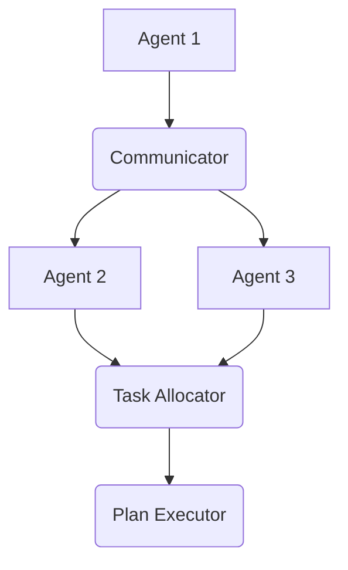
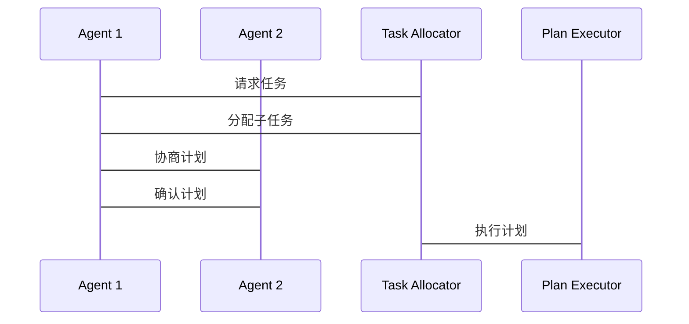

                 


# 开发具有多Agent协同规划能力的系统

## 关键词：多Agent系统、协同规划、分布式规划、协作算法、系统架构设计

## 摘要：本文系统地介绍了开发具有多Agent协同规划能力的系统的各个方面。从基本概念到核心算法，从系统架构到实际应用，详细阐述了多Agent协同规划的理论基础与实践方法。通过丰富的案例分析和详细的代码实现，帮助读者全面理解并掌握多Agent协同规划系统的开发技巧。

---

# 第一部分: 多Agent协同规划系统概述

# 第1章: 多Agent协同规划系统概述

## 1.1 多Agent系统的基本概念

### 1.1.1 Agent的基本定义与特征

Agent（智能体）是指在环境中能够感知并自主行动以实现目标的实体。Agent可以是软件程序、机器人或其他智能设备。Agent的核心特征包括：

- **自主性**：能够在没有外部干预的情况下自主决策。
- **反应性**：能够感知环境并实时响应。
- **目标导向**：所有的行为都是为了实现特定的目标。
- **社交能力**：能够与其他Agent或人类进行交互和协作。

### 1.1.2 多Agent系统的特点与优势

多Agent系统（Multi-Agent System, MAS）由多个Agent组成，这些Agent通过协作完成复杂的任务。其特点包括：

- **分布式智能**：任务分布在多个Agent之间，避免了单点故障。
- **协作性**：Agent之间通过协作完成任务，比单个Agent更高效。
- **适应性**：能够动态调整策略以应对环境变化。

### 1.1.3 协同规划的核心概念

协同规划是指多个Agent共同制定一个联合计划，以实现共同目标的过程。其核心概念包括：

- **任务分配**：将任务分解并分配给不同的Agent。
- **协作协调**：确保Agent之间的协作不会产生冲突。
- **动态调整**：根据环境变化实时调整计划。

---

## 1.2 多Agent协同规划的应用背景

### 1.2.1 协同规划的定义与范围

协同规划是多Agent系统中的核心功能，它涉及多个Agent共同制定和执行计划。其范围包括任务分配、协作协调、动态调整等多个方面。

### 1.2.2 协同规划在实际场景中的应用

协同规划广泛应用于多个领域，例如：

- **机器人协作**：多个机器人共同完成任务，如 warehouse automation。
- **自动驾驶**：多辆自动驾驶车辆协同完成交通规划。
- **分布式系统**：在分布式系统中，多个节点协作完成任务。

### 1.2.3 当前技术发展与挑战

当前，多Agent协同规划技术发展迅速，但也面临诸多挑战，例如：

- **动态环境中的适应性**：如何在动态环境中实时调整计划。
- **Agent之间的通信与协调**：如何高效地进行通信和协作。
- **复杂任务的分解与分配**：如何将复杂任务分解并分配给不同的Agent。

---

## 1.3 本书的目标与结构

### 1.3.1 本书的核心目标

本书旨在帮助读者全面理解多Agent协同规划的理论与实践，掌握开发多Agent协同规划系统的方法。

### 1.3.2 目录结构与内容概览

本书分为多个部分，包括基本概念、核心算法、系统架构设计和项目实战等内容。

### 1.3.3 学习本书的建议

建议读者在阅读本书时，结合实际项目进行实践，并熟悉相关算法和工具。

---

# 第二部分: 多Agent协同规划的核心概念与原理

# 第2章: 多Agent系统的核心概念

## 2.1 Agent的基本属性与分类

### 2.1.1 Agent的定义与基本属性

Agent可以分为简单反射Agent、基于模型的反射Agent、目标导向Agent、效用导向Agent等类型。每种类型的Agent有不同的行为方式和决策机制。

### 2.1.2 多Agent系统中的Agent分类

多Agent系统中的Agent可以根据智能性、自主性和协作性进行分类。例如：

- **简单反应式Agent**：基于当前感知做出反应。
- **目标导向Agent**：根据目标制定计划并执行。
- **协作式Agent**：与其他Agent协作完成任务。

### 2.1.3 多Agent系统中Agent之间的关系

Agent之间的关系可以是竞争、协作或中立。在协同规划中，Agent之间的关系通常是协作的。

---

## 2.2 多Agent系统的通信机制

### 2.2.1 通信协议的基本概念

通信协议定义了Agent之间如何交换信息。常用的通信协议包括FIPA（Foundation for Intelligent Physical Agents）、HTTP、WebSocket等。

### 2.2.2 常见的通信模型与协议

FIPA是一种广泛使用的通信协议，它定义了Agent之间的交互过程，包括请求、响应和协商等步骤。

### 2.2.3 通信机制在协同规划中的作用

通信机制在协同规划中至关重要，它确保Agent之间能够高效地交换信息，从而制定和执行计划。

---

## 2.3 协同规划中的任务分配与协作

### 2.3.1 任务分配的基本原理

任务分配是将任务分解并分配给不同的Agent。常用的任务分配算法包括基于角色的分配、基于能力的分配和基于优先级的分配。

### 2.3.2 协作过程中的角色分工

在协同规划中，Agent需要根据任务需求分配不同的角色。例如，在交通管理系统中，一个Agent可以负责交通监控，另一个负责路径规划。

### 2.3.3 协作中的冲突解决机制

冲突解决机制用于处理Agent之间的冲突。常用的方法包括协商、仲裁和优先级处理。

---

# 第3章: 多Agent协同规划的理论基础

## 3.1 规划问题的建模与表示

### 3.1.1 规划问题的定义与分类

规划问题可以分为任务规划、路径规划、资源分配等多种类型。

### 3.1.2 规划问题的建模方法

常用的建模方法包括状态空间模型、规划树模型和图模型。状态空间模型将问题表示为状态的集合，路径规划问题可以表示为图中的最短路径问题。

### 3.1.3 常见的规划表示形式

常用的规划表示形式包括动作-预条件-结果（ADR）表示法、规划查询语言（PDDL）等。

---

## 3.2 协同规划中的搜索算法

### 3.2.1 单Agent规划中的搜索算法

单Agent规划中的搜索算法包括广度优先搜索（BFS）、深度优先搜索（DFS）、A*算法等。

### 3.2.2 多Agent协同规划中的搜索算法

多Agent协同规划中的搜索算法包括分布式A*算法（D-A*）、分布式启发式搜索（DHS）等。

### 3.2.3 搜索算法的优化与改进

优化方法包括启发式搜索、剪枝技术、分布式计算等。

---

## 3.3 协同规划中的协调与同步

### 3.3.1 协调的基本概念与方法

协调是指Agent之间通过协商和协作来实现一致性的过程。常用的方法包括协商、仲裁和同步。

### 3.3.2 同步机制在协同规划中的应用

同步机制用于确保多个Agent的计划一致。常用的同步机制包括时间同步、事件同步和状态同步。

### 3.3.3 协调与同步的实现方式

实现方式包括基于通信的协调、基于共享状态的协调和基于分布式算法的协调。

---

# 第4章: 多Agent协同规划的算法原理

## 4.1 分布式规划算法

### 4.1.1 分布式规划的基本原理

分布式规划算法将规划任务分解为多个子任务，并由不同的Agent分别执行。

### 4.1.2 分布式规划的实现步骤

1. 任务分解：将整体任务分解为子任务。
2. 任务分配：将子任务分配给不同的Agent。
3. 子任务规划：每个Agent独立完成子任务的规划。
4. 协调与同步：确保所有子任务的规划一致。

### 4.1.3 分布式规划的优缺点分析

优点：提高了系统的并行性和效率。缺点：增加了协调的复杂性和通信开销。

---

## 4.2 基于协商的规划算法

### 4.2.1 基于协商的规划的基本原理

基于协商的规划算法通过Agent之间的协商来确定最终的计划。协商过程包括请求、协商、冲突解决等步骤。

### 4.2.2 基于协商的规划的实现步骤

1. 初始化：所有Agent提出自己的初步计划。
2. 协商：Agent之间通过协商解决冲突。
3. 冲突解决：通过协商或仲裁确定最终计划。

### 4.2.3 基于协商的规划的优缺点分析

优点：能够适应动态变化的环境。缺点：协商过程可能增加系统的延迟。

---

## 4.3 基于博弈论的规划算法

### 4.3.1 基于博弈论的规划的基本原理

基于博弈论的规划算法通过模拟博弈过程来确定最优计划。常用的博弈模型包括完全理性模型、有限理性模型等。

### 4.3.2 基于博弈论的规划的实现步骤

1. 建立博弈模型：定义博弈的参与者、策略和结果。
2. 计算纳什均衡：确定博弈的均衡点。
3. 确定最优策略：根据纳什均衡确定最优计划。

### 4.3.3 基于博弈论的规划的优缺点分析

优点：能够处理复杂的博弈场景。缺点：计算复杂，实现难度大。

---

# 第5章: 多Agent协同规划的系统分析与架构设计

## 5.1 问题场景介绍

多Agent协同规划系统需要解决的任务包括任务分配、协作协调、动态调整等。

## 5.2 系统功能设计

系统功能包括任务分配、计划制定、协作协调、动态调整等。

---

## 5.3 系统架构设计

### 5.3.1 系统架构图



### 5.3.2 系统接口设计

系统接口包括通信接口、任务分配接口、计划执行接口等。

### 5.3.3 系统交互序列图



---

## 5.4 系统功能模块设计

系统功能模块包括通信模块、任务分配模块、计划制定模块、协作协调模块和动态调整模块。

---

## 5.5 系统实现中的关键技术

关键技术包括分布式计算、通信协议实现、任务分配算法实现、计划协调算法实现等。

---

# 第6章: 多Agent协同规划的项目实战

## 6.1 环境配置

### 6.1.1 系统环境

操作系统：Linux/Windows/MacOS

开发工具：Python、Java、C++、ROS（Robot Operating System）

### 6.1.2 算法库与框架

常用的算法库和框架包括ROS、OpenAI Gym、Multi-agent Planning Toolkit（MAPT）等。

---

## 6.2 核心代码实现

### 6.2.1 任务分配模块

```python
def task_allocation(task_list, agent_capability):
    # 根据任务和Agent的能力分配任务
    pass
```

### 6.2.2 计划制定模块

```python
def plan_formulation(task, agent_state):
    # 根据任务和Agent的状态制定计划
    pass
```

### 6.2.3 协作协调模块

```python
def collaboration Coordination(agents, plan):
    # 协调多个Agent的计划
    pass
```

---

## 6.3 代码实现与解读

### 6.3.1 环境配置

安装必要的库和工具：

```bash
pip install rospy
pip install matplotlib
pip install numpy
```

### 6.3.2 核心代码实现

```python
import rospy
from std_msgs.msg import String

class Agent:
    def __init__(self, name):
        self.name = name
        self.sub = rospy.Subscriber('topic', String, self.callback)
    
    def callback(self, data):
        # 处理接收的消息
        pass

if __name__ == '__main__':
    rospy.init_node('agent_node')
    agent = Agent('Agent 1')
    rospy.spin()
```

---

## 6.4 实际案例分析

### 6.4.1 案例背景介绍

以多机器人协作任务为例，多个机器人需要共同完成 warehouse 的货物搬运任务。

### 6.4.2 系统设计与实现

1. **任务分配**：根据机器人的位置和能力分配任务。
2. **计划制定**：每个机器人制定自己的搬运计划。
3. **协作协调**：确保机器人的路径不冲突。

### 6.4.3 系统运行与测试

测试系统在动态环境中的表现，例如机器人故障、任务变更等情况。

---

## 6.5 项目小结

通过项目实战，读者可以掌握多Agent协同规划系统的开发流程，包括环境配置、任务分配、计划制定、协作协调等。

---

# 第7章: 多Agent协同规划的最佳实践与注意事项

## 7.1 最佳实践 tips

- **明确任务分解**：确保任务分解合理，避免重复或遗漏。
- **选择合适的通信协议**：根据需求选择适合的通信协议。
- **优化协调机制**：设计高效的协调机制，减少冲突和延迟。

## 7.2 注意事项

- **动态环境适应性**：确保系统能够适应动态变化的环境。
- **通信开销控制**：避免过大的通信开销影响系统性能。
- **任务分配策略**：选择合适的任务分配策略，提高系统效率。

## 7.3 拓展阅读

推荐阅读以下书籍和论文：

- 《Multi-Agent Systems: Algorithmic, Complexity, and Synthesis》
- 《Cooperative Path-Finding》

---

# 第8章: 总结与展望

## 8.1 本章总结

本文系统地介绍了多Agent协同规划系统的各个方面，从基本概念到核心算法，从系统架构到实际应用，帮助读者全面理解并掌握多Agent协同规划系统的开发技巧。

## 8.2 未来展望

未来，多Agent协同规划技术将在更多领域得到应用，例如智能交通、智能制造、智慧城市等。同时，随着人工智能技术的发展，多Agent协同规划系统将更加智能和高效。

---

# 作者

作者：AI天才研究院/AI Genius Institute & 禅与计算机程序设计艺术 /Zen And The Art of Computer Programming

