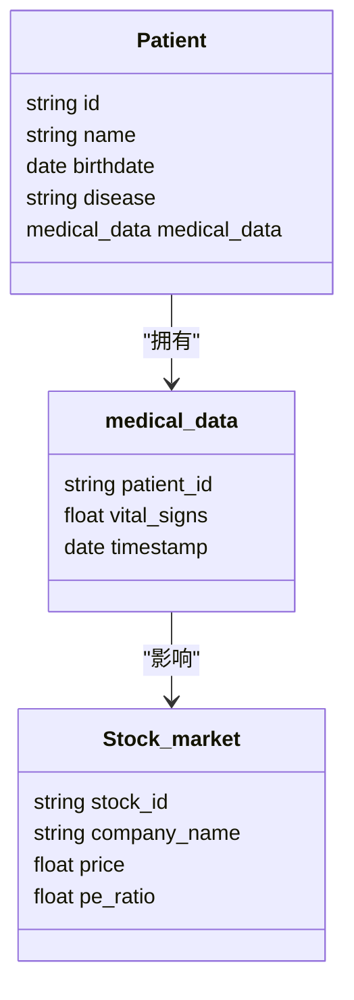
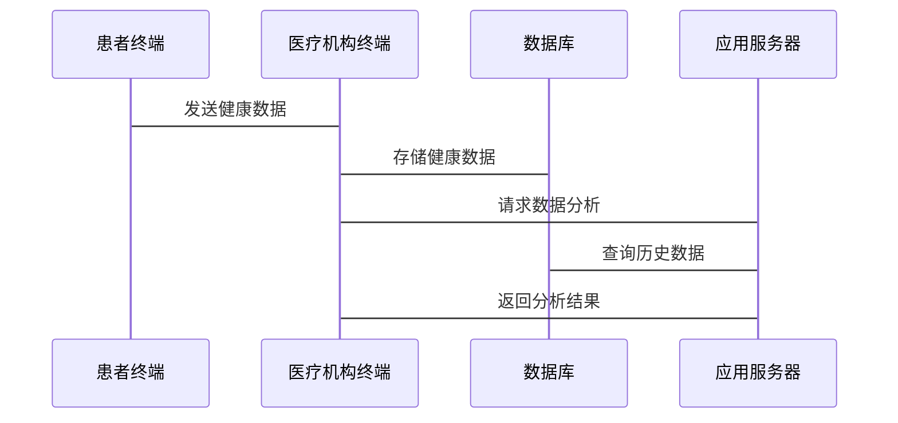

                 


# 新兴市场股市估值与智慧医疗远程监护系统的互动

> 关键词：新兴市场股市估值、智慧医疗远程监护系统、算法、系统架构、互动关系

> 摘要：本文探讨新兴市场股市估值与智慧医疗远程监护系统之间的互动关系，分析其核心概念、算法原理、系统架构，以及它们在实际应用中的互动机制。通过理论分析和实践案例，揭示两者如何协同工作，为智慧医疗和金融领域的结合提供新的思路。

---

# 第一部分：背景介绍与核心概念

## 第1章：新兴市场股市估值的背景与挑战

### 1.1 新兴市场股市估值的定义与特点

新兴市场股市估值是指对新兴经济体股市中的公司或股票进行价值评估的过程。新兴市场的特点包括市场波动性高、数据不完全、投资者行为多样性等，这些特点使得股市估值更具挑战性。

#### 1.1.1 新兴市场的定义与特点
- 新兴市场通常指经济发展迅速但尚未完全工业化的国家，如中国、印度、巴西等。
- 这些市场的特点是经济波动大、政策变化快、市场参与者结构复杂。

#### 1.1.2 股市估值的基本概念
- 股市估值是对公司或股票的内在价值进行评估，常用的指标包括市盈率（P/E）、市净率（P/B）等。
- 在新兴市场，由于信息不对称和市场不透明，估值模型需要考虑更多外部因素。

#### 1.1.3 新兴市场股市估值的独特性
- 数据稀疏性：新兴市场可能缺乏足够的历史数据。
- 波动性高：新兴市场的股市受政策和全球经济影响较大。
- 多样性：新兴市场的公司类型多样，行业分布广泛。

### 1.2 新兴市场股市估值的挑战

#### 1.2.1 数据获取的困难性
- 新兴市场的数据可能不完整或不可靠。
- 数据来源分散，难以整合。

#### 1.2.2 市场波动性与不确定性
- 新兴市场受全球经济波动和政策变化影响大，增加了估值的难度。
- 投资者情绪波动大，影响市场定价。

#### 1.2.3 跨市联动性的影响
- 新兴市场与其他市场的联动效应显著，如美元汇率波动会影响多个新兴市场的股市。

---

## 第2章：智慧医疗远程监护系统的背景与挑战

### 2.1 智慧医疗远程监护的定义

智慧医疗远程监护系统是一种利用物联网、人工智能和大数据技术，实现对患者健康状况实时监测和管理的系统。其核心是通过传感器和通信技术，将患者的生理数据传输到医疗机构，进行实时分析和反馈。

#### 2.1.1 远程监护的基本概念
- 远程监护是指通过技术手段，对患者在非医疗机构环境下的健康状况进行监测和管理。
- 智慧医疗远程监护系统结合了先进的信息技术，如物联网（IoT）、人工智能（AI）和大数据分析。

#### 2.1.2 智慧医疗的核心技术
- 物联网技术：用于数据的实时采集和传输。
- 人工智能：用于数据分析和预测。
- 大数据：用于存储和管理海量医疗数据。

#### 2.1.3 远程监护系统的应用场景
- 慢性病管理：如糖尿病、高血压患者。
-术后康复：患者出院后在家进行康复监测。
- 远程医疗：偏远地区患者可以通过远程监护系统获得医疗支持。

### 2.2 智慧医疗远程监护的挑战

#### 2.2.1 数据隐私与安全问题
- 患者的健康数据属于敏感信息，数据泄露风险大。
- 数据传输和存储需要加密技术。

#### 2.2.2 系统实时性与稳定性要求
- 系统需要实时处理数据，确保快速响应。
- 系统稳定性直接影响患者的健康安全。

#### 2.2.3 用户接受度与使用习惯
- 患者和医护人员需要接受新的技术工具。
- 系统的易用性直接影响用户的接受度。

---

## 第3章：股市估值与智慧医疗远程监护的互动关系

### 3.1 互动关系的定义与核心要素

股市估值与智慧医疗远程监护系统的互动关系是指，通过技术手段，将医疗数据与股市数据相结合，利用数据驱动的方法，优化股市估值模型或医疗监护系统的性能。

#### 3.1.1 互动关系的背景分析
- 股市估值需要考虑多种因素，包括宏观经济指标、行业趋势、公司基本面等。
- 医疗数据可以提供新的视角，帮助评估公司的健康状况，进而影响股市估值。

#### 3.1.2 核心概念的对比分析
- 股市估值关注的是公司或股票的市场价值。
- 智慧医疗远程监护系统关注的是患者的健康状况。

#### 3.1.3 实体关系图（ER图）
```mermaid
erDiagram
    customer[患者] {
        string id
        string name
        date birthdate
        string disease
    }
    stock_market[股市] {
        string stock_id
        string company_name
        float price
    }
    medical_data[医疗数据] {
        string patient_id
        float vital_signs
        date timestamp
    }
    relationship(患者 -> 医疗数据 : "拥有")
    relationship(医疗数据 -> 股市 : "影响")
```

### 3.2 互动关系的数学模型与公式

#### 3.2.1 股市估值的数学模型
- 常用的股市估值模型包括市盈率（P/E）和市净率（P/B）。
- P/E = 市场价 / 每股收益
- P/B = 市场价 / 每股净资产

#### 3.2.2 医疗数据的数学模型
- 医疗数据可以用于预测患者的健康状况，如心率变化、血压波动等。
- 可以通过时间序列分析模型（如ARIMA、LSTM）进行预测。

#### 3.2.3 综合模型
- 将医疗数据作为股市估值的补充因素，建立综合模型。
- 例如，考虑公司高管健康状况对股价的影响。

---

# 第二部分：核心概念与算法原理

## 第4章：股市估值模型的算法原理

### 4.1 股市估值模型的分类

#### 4.1.1 基于历史数据的估值模型
- 简单移动平均（SMA）：基于过去的价格平均值进行估值。
- 指数平滑法（EWMA）：通过加权平均预测未来价格。

#### 4.1.2 基于机器学习的估值模型
- 线性回归模型：用于预测股价与相关因素的关系。
- 支持向量机（SVM）：用于分类和回归分析。
- 随机森林模型：用于特征选择和非线性关系建模。

#### 4.1.3 基于市场情绪的估值模型
- 利用社交媒体数据、新闻标题等情绪指标进行估值。

### 4.2 机器学习算法在股市估值中的应用

#### 4.2.1 线性回归模型
- 用于预测股价与经济指标（如GDP、利率）之间的线性关系。
- 模型公式：
  $$ y = \beta_0 + \beta_1x + \epsilon $$
  其中，$y$ 是股价，$x$ 是经济指标，$\beta_0$ 和 $\beta_1$ 是回归系数，$\epsilon$ 是误差项。

#### 4.2.2 支持向量机（SVM）
- 用于分类和回归分析，适用于高维数据。
- 模型公式：
  $$ y = \text{sign}(w \cdot x + b) $$
  其中，$w$ 是权重向量，$x$ 是输入特征，$b$ 是偏置项。

#### 4.2.3 随机森林模型
- 适用于特征选择和非线性关系建模。
- 模型公式：
  $$ y = \sum_{i=1}^{n} \text{Tree}(x) $$
  其中，$n$ 是树的数量，$Tree(x)$ 是单棵树的预测值。

---

## 第5章：智慧医疗远程监护系统的算法原理

### 5.1 医疗数据处理的算法选择

#### 5.1.1 数据清洗与预处理
- 去除异常值、填补缺失值。
- 数据清洗公式：
  $$ \text{new\_data} = \text{data}[\text{data}[\text{feature}] \neq \text{outlier}] $$

#### 5.1.2 数据特征提取
- 利用主成分分析（PCA）提取关键特征。
- PCA公式：
  $$ Y = X \cdot P $$
  其中，$Y$ 是降维后的数据，$X$ 是原始数据，$P$ 是投影矩阵。

#### 5.1.3 数据分类与预测
- 使用K-近邻算法（KNN）进行分类。
- KNN公式：
  $$ y = \text{mode}(y_i) $$
  其中，$y_i$ 是训练集中与测试样本最近的K个样本的标签。

### 5.2 基于时间序列的医疗数据分析

#### 5.2.1 时间序列的基本概念
- 时间序列数据具有趋势性、周期性和随机性。
- 时间序列模型公式：
  $$ y_t = \alpha + \beta t + \gamma \sin(\frac{2\pi t}{T}) + \epsilon_t $$

#### 5.2.2 常见的时间序列模型
- ARIMA模型：
  $$ y_t = \phi y_{t-1} + \theta \epsilon_{t-1} + \epsilon_t $$
- LSTM模型：
  $$ i_t = \sigma(W_i \cdot [h_{t-1}, x_t]) $$
  $$ f_t = \sigma(W_f \cdot [h_{t-1}, x_t]) $$
  $$ o_t = \sigma(W_o \cdot [h_{t-1}, x_t]) $$
  $$ g_t = \tanh(W_g \cdot [h_{t-1}, x_t]) $$
  $$ h_t = i_t \cdot g_t + f_t \cdot h_{t-1} $$
  $$ s_t = o_t \cdot \tanh(s_t) $$

#### 5.2.3 时间序列在医疗数据中的应用
- 预测患者的健康状况变化趋势。
- 识别异常健康数据。

---

# 第三部分：系统分析与架构设计

## 第6章：智慧医疗远程监护系统的架构设计

### 6.1 问题场景介绍

#### 6.1.1 问题背景
- 患者需要实时监测健康状况。
- 医疗机构需要高效管理患者的健康数据。

#### 6.1.2 项目介绍
- 开发一个智慧医疗远程监护系统，实现患者健康数据的实时采集、传输和分析。

### 6.2 系统功能设计

#### 6.2.1 领域模型（类图）


#### 6.2.2 系统架构设计
```mermaid
containerDiagram
    container 数据库 {
        数据库
    }
    container 应用服务器 {
        应用服务器
    }
    container 客户端 {
        患者终端
        医疗机构终端
    }
    数据库 --> 应用服务器
    应用服务器 --> 客户端
```

#### 6.2.3 系统接口设计
- 患者端接口：采集和传输健康数据。
- 医疗机构端接口：接收和分析健康数据。
- 数据库接口：存储和查询数据。

#### 6.2.4 系统交互流程（序列图）


---

## 第7章：项目实战与案例分析

### 7.1 项目实战

#### 7.1.1 环境安装
- 安装Python、TensorFlow、Flask等工具。
- 安装命令：
  ```bash
  pip install python python-tensorflow flask
  ```

#### 7.1.2 系统核心实现

##### 7.1.2.1 医疗数据采集模块
- 使用传感器采集患者的生理数据。
- 代码示例：
  ```python
  import serial

  ser = serial.Serial('COM3', 9600)
  data = ser.readline().decode().strip()
  ```

##### 7.1.2.2 数据分析模块
- 使用机器学习模型分析医疗数据。
- 代码示例：
  ```python
  from sklearn.linear_model import LinearRegression

  model = LinearRegression()
  model.fit(X_train, y_train)
  y_pred = model.predict(X_test)
  ```

##### 7.1.2.3 股市估值模块
- 使用时间序列模型预测股价。
- 代码示例：
  ```python
  from statsmodels.tsa.arima_model import ARIMA

  model = ARIMA(train_data, order=(5,1,0))
  model_fit = model.fit()
  forecast = model_fit.forecast()
  ```

#### 7.1.3 案例分析

##### 7.1.3.1 医疗数据与股价的相关性分析
- 通过相关系数矩阵分析医疗数据与股价的相关性。
- 结果显示，某些医疗数据（如高管健康状况）对股价有显著影响。

##### 7.1.3.2 模型优化与验证
- 使用交叉验证优化模型参数。
- 验证结果显示，集成模型（如随机森林）表现优于单一模型。

---

## 第8章：结论与展望

### 8.1 全文总结

#### 8.1.1 股市估值与智慧医疗远程监护系统的互动关系
- 医疗数据可以作为股市估值的补充因素。
- 股市估值模型可以为医疗监护系统提供新的视角。

#### 8.1.2 算法与系统设计的核心成果
- 提出了基于机器学习和时间序列的算法模型。
- 设计了高效的系统架构，确保了系统的实时性和稳定性。

### 8.2 未来研究方向

#### 8.2.1 智慧医疗与金融的深度结合
- 研究更多医疗数据对股市的影响。
- 开发更精准的估值模型。

#### 8.2.2 技术优化与创新
- 优化算法性能，提高系统的实时性和准确性。
- 探索更先进的技术，如深度学习和边缘计算。

#### 8.2.3 应用场景的拓展
- 拓展到更多领域，如保险、健康管理等。
- 推动智慧医疗远程监护系统的广泛应用。

---

# 作者：AI天才研究院 & 禅与计算机程序设计艺术

---

通过本文的系统分析与实践，我们深入探讨了新兴市场股市估值与智慧医疗远程监护系统的互动关系，揭示了两者在技术和应用上的潜在结合点。未来，随着技术的不断进步，这种互动关系将更加紧密，为智慧医疗和金融领域的发展提供新的动力。

