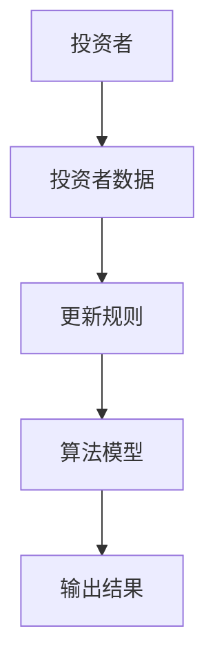
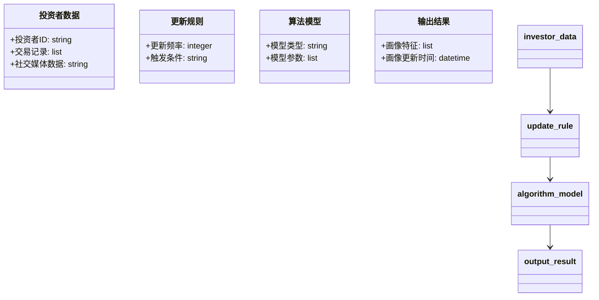
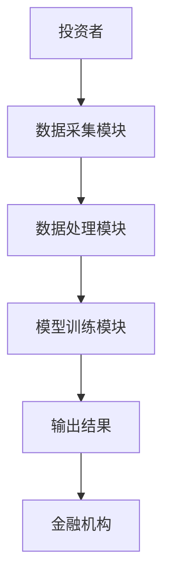
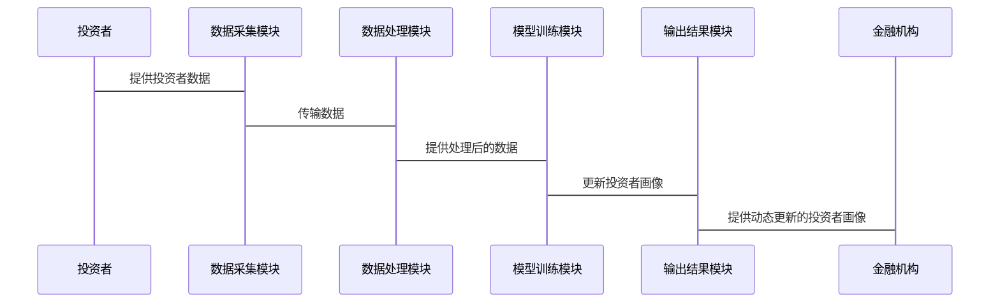

                 


# 智能投资者画像动态更新平台

> 关键词：智能投资者画像，动态更新，人工智能，机器学习，实时数据分析

> 摘要：本文介绍了一种利用人工智能技术实现投资者画像动态更新的平台。通过分析投资者数据，利用机器学习算法和实时数据分析技术，平台能够实时更新投资者画像，帮助金融机构更好地理解和服务投资者。文章详细讲解了平台的背景、核心概念、算法原理、系统架构以及项目实战，旨在为读者提供全面的技术指导。

---

## 第1章：背景与核心概念

### 1.1 问题背景与描述

#### 1.1.1 投资者画像的传统构建方法及其局限性

传统的投资者画像构建方法通常基于静态数据分析，例如通过问卷调查、历史交易记录等方式收集投资者的信息，并通过统计分析生成投资者的画像。这种方法存在以下问题：

- 数据更新周期长：传统的投资者画像通常是静态的，无法实时反映投资者的最新行为和市场变化。
- 精准度有限：基于历史数据的分析可能无法准确捕捉投资者在动态市场环境下的行为变化。
- 个性化不足：传统方法难以根据投资者的实时行为和市场变化提供个性化的服务。

#### 1.1.2 动态更新的必要性：市场变化与投资者需求的实时响应

在金融市场中，投资者的需求和行为会受到市场波动、经济环境变化等多种因素的影响，因此投资者画像需要动态更新以反映这些变化。动态更新的必要性体现在以下几个方面：

- 市场环境的实时变化：金融市场波动频繁，投资者的决策会受到市场环境的影响，动态更新的投资者画像可以帮助金融机构快速响应这些变化。
- 投资者行为的实时变化：投资者的交易行为、风险偏好等会在市场变化中不断调整，动态更新的画像能够更准确地反映这些变化。
- 个性化服务的需求：不同投资者的需求和行为变化可能不同，动态更新的画像可以为投资者提供更加个性化的服务。

### 1.2 核心问题与解决

#### 1.2.1 投资者画像的动态更新需求

投资者画像的动态更新需求主要体现在以下几个方面：

- 实时性：投资者画像需要能够实时更新，以反映投资者的最新行为和市场变化。
- 准确性：动态更新的画像需要准确反映投资者的真实特征和行为模式。
- 可解释性：动态更新的画像需要具备可解释性，以便金融机构能够理解和应用这些信息。

#### 1.2.2 传统静态画像的不足与动态更新的优势

传统静态画像的不足主要体现在以下方面：

- 数据更新周期长：传统方法通常定期更新投资者画像，无法实时反映投资者的变化。
- 精准度有限：静态画像无法捕捉投资者在不同时间段的行为变化，可能导致画像的不准确。

动态更新的优势则体现在：

- 实时性：动态更新的画像能够实时反映投资者的变化。
- 准确性：通过实时数据分析和机器学习算法，动态更新的画像可以更准确地反映投资者的真实特征。
- 个性化：动态更新的画像可以为投资者提供更加个性化的服务。

### 1.3 边界与外延

#### 1.3.1 平台的适用范围与限制

智能投资者画像动态更新平台主要适用于以下场景：

- 金融机构：如证券公司、基金公司等，可以通过平台实时更新投资者画像，提供更加精准的服务。
- 投资者：投资者可以通过平台实时了解自己的画像变化，更好地进行投资决策。

平台的限制主要体现在以下方面：

- 数据来源的限制：平台依赖于投资者提供的数据和市场数据，数据的完整性和准确性直接影响画像的准确性。
- 技术实现的复杂性：动态更新的实现需要复杂的技术支持，包括实时数据处理、机器学习算法等。

#### 1.3.2 相关领域的扩展

动态更新的投资者画像技术可以扩展到以下领域：

- 金融科技（FinTech）：动态更新的投资者画像可以应用于智能投顾、风险管理等领域。
- 数据分析：动态更新的画像可以为市场分析、投资策略制定提供数据支持。

### 1.4 概念结构与核心要素

#### 1.4.1 核心要素

智能投资者画像动态更新平台的核心要素包括：

- 投资者数据：包括投资者的基本信息、交易记录、市场互动数据等。
- 更新规则：包括数据更新的频率、触发条件等。
- 算法模型：包括用于动态更新的机器学习算法和实时数据分析技术。

#### 1.4.2 关键属性

投资者画像动态更新平台的关键属性包括：

- 实时性：动态更新的频率和速度。
- 准确性：画像反映投资者真实特征的能力。
- 可解释性：画像结果的可解释性和可理解性。

---

## 第2章：核心概念与联系

### 2.1 核心概念解析

#### 2.1.1 智能投资者画像的定义

智能投资者画像是基于投资者的多维度数据，利用人工智能技术构建的动态化、个性化投资者特征模型。它不仅包括投资者的基本信息，还包括投资者的行为模式、风险偏好、投资风格等。

#### 2.1.2 动态更新的机制

动态更新的机制是指通过实时数据采集和机器学习算法，定期或实时更新投资者画像的过程。动态更新的机制需要考虑数据的实时性、更新的频率以及更新的触发条件等因素。

### 2.2 概念属性对比

以下是一个概念属性对比的表格：

| 概念      | 实时性   | 准确性 | 可解释性 |
|-----------|----------|--------|----------|
| 静态画像  | 低       | 中      | 高        |
| 动态画像  | 高       | 高      | 中        |

### 2.3 实体关系图

以下是一个实体关系图的Mermaid图示：



---

## 第3章：算法原理与实现

### 3.1 算法概述

#### 3.1.1 基于时间序列的预测模型

时间序列预测模型用于预测投资者的行为变化。常用的模型包括ARIMA（自回归积分滑动平均模型）和LSTM（长短期记忆网络）。

#### 3.1.2 基于NLP的情感分析模型

情感分析模型用于分析投资者在社交媒体上的言论，提取投资者的情绪倾向，从而更新投资者画像。

### 3.2 算法实现

#### 3.2.1 时间序列预测模型的实现

以下是一个时间序列预测模型的Python代码示例：

```python
import pandas as pd
import numpy as np
from sklearn.metrics import mean_squared_error
from statsmodels.tsa.arima_model import ARIMA

# 数据预处理
data = pd.read_csv('investor_data.csv')
train_data = data['value'].values

# 模型训练
model = ARIMA(train_data, order=(5, 1, 0))
model_fit = model.fit()

# 预测
 forecast = model_fit.forecast(steps=10)
```

#### 3.2.2 情感分析模型的实现

以下是一个情感分析模型的Python代码示例：

```python
from textblob import TextBlob

def get_sentiment(text):
    blob = TextBlob(text)
    sentiment = blob.sentiment.polarity
    if sentiment > 0:
        return 'positive'
    elif sentiment < 0:
        return 'negative'
    else:
        return 'neutral'

text = "我对市场前景非常乐观"
print(get_sentiment(text))  # 输出: 'positive'
```

### 3.3 数学模型

#### 3.3.1 ARIMA模型的数学公式

ARIMA模型的数学公式如下：

$$
\phi(B)X_t = \theta(B)\epsilon_t
$$

其中，$\phi(B)$是自回归多项式，$\theta(B)$是移动平均多项式，$X_t$是观测值，$\epsilon_t$是白噪声。

#### 3.3.2 LSTM网络的数学公式

LSTM网络的数学公式如下：

$$
i_t = \sigma(W_i x_t + U_i h_{t-1} + b_i)
$$

$$
f_t = \sigma(W_f x_t + U_f h_{t-1} + b_f)
$$

$$
o_t = \sigma(W_o x_t + U_o h_{t-1} + b_o)
$$

$$
g_t = \tanh(W_g x_t + U_g h_{t-1} + b_g)
$$

$$
h_t = h_{t-1} \circ i_t + g_t \circ f_t
$$

$$
s_t = o_t \circ \tanh(s_t)
$$

其中，$i_t$是输入门，$f_t$是遗忘门，$o_t$是输出门，$g_t$是候选细胞状态，$h_t$是隐藏状态，$s_t$是输出状态。

---

## 第4章：系统分析与架构设计方案

### 4.1 问题场景介绍

智能投资者画像动态更新平台需要解决的问题包括：

- 实时采集投资者数据，包括交易数据、社交媒体数据等。
- 对投资者数据进行实时分析，更新投资者画像。
- 提供动态更新的投资者画像供金融机构使用。

### 4.2 项目介绍

#### 4.2.1 系统目标

智能投资者画像动态更新平台的目标是实现投资者画像的动态更新，提高投资者画像的准确性和实时性，为金融机构提供更加精准的服务。

#### 4.2.2 系统功能需求

系统功能需求包括：

- 数据采集模块：实时采集投资者的交易数据、社交媒体数据等。
- 数据处理模块：对投资者数据进行清洗、转换和整合。
- 模型训练模块：基于机器学习算法训练投资者画像模型。
- 动态更新模块：根据实时数据动态更新投资者画像。
- 结果展示模块：展示动态更新的投资者画像。

### 4.3 系统功能设计

#### 4.3.1 领域模型

以下是一个领域模型的Mermaid图示：



#### 4.3.2 系统架构设计

以下是一个系统架构设计的Mermaid图示：



### 4.4 系统接口设计

系统接口设计包括：

- 数据采集接口：用于实时采集投资者数据。
- 模型训练接口：用于训练投资者画像模型。
- 动态更新接口：用于动态更新投资者画像。
- 查询接口：用于查询投资者的动态画像。

### 4.5 系统交互设计

以下是一个系统交互的Mermaid图示：



---

## 第5章：项目实战

### 5.1 环境安装

#### 5.1.1 安装Python

```bash
python --version
pip install --upgrade pip
```

#### 5.1.2 安装机器学习库

```bash
pip install numpy pandas scikit-learn tensorflow
```

#### 5.1.3 安装文本处理库

```bash
pip install textblob
python -m textblob.download_corpora
```

### 5.2 系统核心实现

#### 5.2.1 数据采集模块

```python
import requests

def get_market_data():
    response = requests.get('http://api.market.com/investor_data')
    return response.json()

data = get_market_data()
```

#### 5.2.2 数据处理模块

```python
import pandas as pd

def preprocess_data(data):
    df = pd.DataFrame(data)
    df.dropna(inplace=True)
    return df

processed_data = preprocess_data(data)
```

#### 5.2.3 模型训练模块

```python
from sklearn.model_selection import train_test_split
from sklearn.ensemble import RandomForestClassifier

X = processed_data.drop('target', axis=1)
y = processed_data['target']

X_train, X_test, y_train, y_test = train_test_split(X, y, test_size=0.2)

model = RandomForestClassifier()
model.fit(X_train, y_train)
```

#### 5.2.4 动态更新模块

```python
from datetime import datetime

def update_investor_profile():
    current_time = datetime.now().strftime("%Y-%m-%d %H:%M:%S")
    model.predict(X_test)
    print(f"Investor profile updated at {current_time}")

update_investor_profile()
```

### 5.3 实际案例分析

#### 5.3.1 案例背景

假设我们有一个投资者的数据集，包括投资者的基本信息、交易记录和社交媒体数据。

#### 5.3.2 数据处理与分析

通过对投资者的交易记录进行分析，发现该投资者在市场下跌时倾向于减少投资，而在市场上涨时倾向于增加投资。这表明该投资者的风险偏好较低。

#### 5.3.3 模型训练与评估

通过训练随机森林模型，我们可以准确地预测投资者在不同市场环境下的行为变化。

### 5.4 项目小结

通过实际案例分析，我们验证了动态更新投资者画像的有效性。模型能够准确捕捉投资者的行为变化，为金融机构提供更加精准的服务。

---

## 第6章：最佳实践与总结

### 6.1 最佳实践 tips

- 数据隐私保护：在采集和处理投资者数据时，必须遵守数据隐私保护法规，确保数据的安全性和隐私性。
- 模型调优：定期对模型进行调优，确保模型的准确性和实时性。
- 系统监控：实时监控系统的运行状态，及时发现和解决问题。

### 6.2 小结

智能投资者画像动态更新平台通过实时数据分析和机器学习算法，能够动态更新投资者画像，为金融机构提供更加精准的服务。本文详细讲解了平台的背景、核心概念、算法原理、系统架构以及项目实战，为读者提供了全面的技术指导。

### 6.3 注意事项

- 数据的实时性和准确性直接影响投资者画像的准确性。
- 模型的选择和调优需要根据具体场景进行，避免过度拟合。
- 系统的运行需要考虑性能和稳定性，确保系统的高效运行。

### 6.4 拓展阅读

- 《时间序列分析与应用预测方法》
- 《深度学习在金融领域的应用》
- 《Python机器学习实战》

---

## 作者：AI天才研究院 & 禅与计算机程序设计艺术

--- 

**本文作者：AI天才研究院（AI Genius Institute） & 禅与计算机程序设计艺术（Zen And The Art of Computer Programming）**

