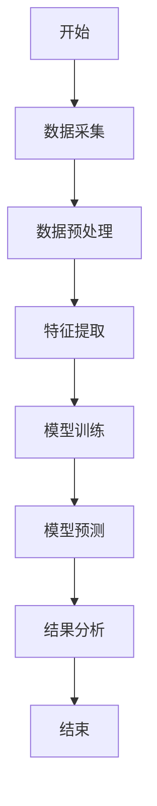
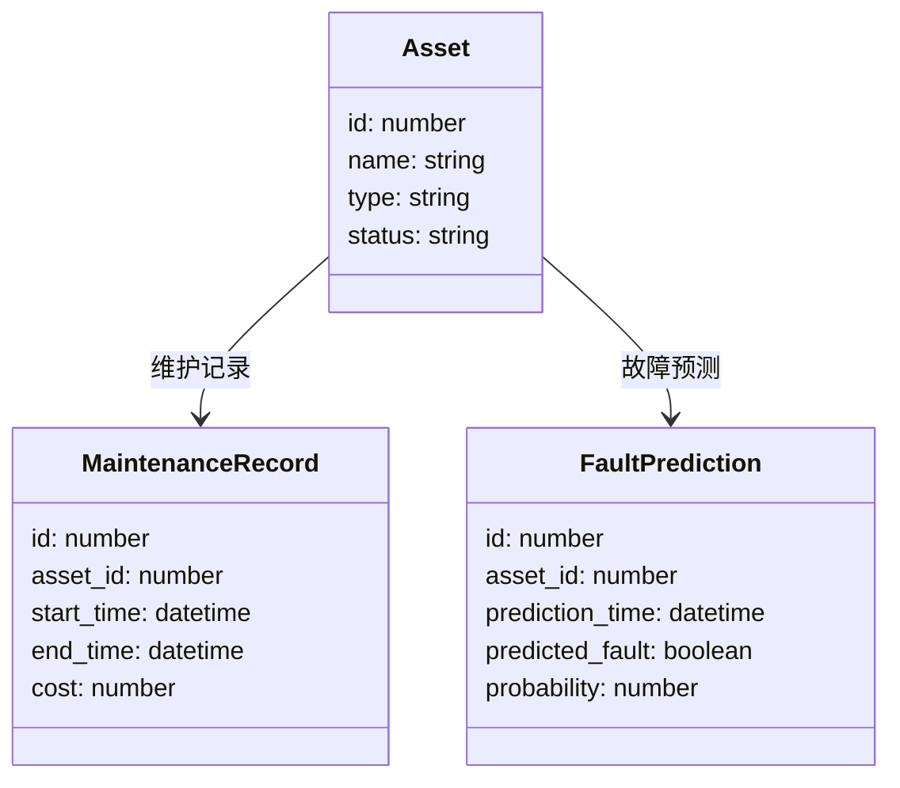

                 


# 构建智能企业资产管理平台：全生命周期成本优化与预测性维护

> 关键词：智能企业资产管理、预测性维护、全生命周期成本优化、物联网技术、数据驱动决策、企业数字化转型

> 摘要：本文详细探讨了构建智能企业资产管理平台的必要性、核心概念、算法原理、系统架构设计及其实现。文章从传统资产管理的痛点出发，分析了智能平台在预测性维护和成本优化中的应用价值，通过具体案例展示了如何利用物联网技术和数据驱动决策来实现企业资产管理的智能化。最后，文章总结了构建智能企业资产管理平台的最佳实践和未来发展方向。

---

# 第一部分: 智能企业资产管理平台背景与概述

# 第1章: 智能企业资产管理平台背景介绍

## 1.1 问题背景

### 1.1.1 传统企业资产管理的痛点
传统企业资产管理存在以下痛点：
- 数据分散：资产信息分布在不同部门和系统中，缺乏统一的数据源。
- 维护成本高：设备故障通常是被动响应，导致维修成本增加。
- 缺乏预测性维护：设备故障难以提前预测，导致停机时间长，影响生产效率。
- 资产利用率低：缺乏对资产使用情况的实时监控，导致资源浪费。

### 1.1.2 数字化转型对企业资产管理的需求
随着企业数字化转型的推进，企业需要：
- 实现资产全生命周期管理，从采购、使用到报废进行全程跟踪。
- 利用大数据和人工智能技术，实现预测性维护和智能决策。
- 提高资产利用率，降低运营成本。

### 1.1.3 智能化管理的必要性
智能化管理可以帮助企业：
- 提高设备运行效率，减少停机时间。
- 降低维护成本，延长设备使用寿命。
- 实现数据驱动的决策，优化资源配置。

## 1.2 问题描述

### 1.2.1 资产管理全生命周期的定义
资产管理的全生命周期包括：
1. 采购与安装：资产的采购、验收、安装和初始化。
2. 运行与维护：资产的日常运行、监控和维护。
3. 更新与升级：资产的性能优化、功能升级和改造。
4. 报废与处置：资产的报废、回收和处置。

### 1.2.2 成本优化与预测性维护的核心问题
- 成本优化：如何通过数据分析降低资产管理成本。
- 预测性维护：如何利用历史数据和实时数据预测设备故障，提前进行维护。

### 1.2.3 企业资产管理中的数据孤岛与信息孤岛
- 数据孤岛：不同部门和系统之间的数据无法共享，导致信息不一致。
- 信息孤岛：数据格式和标准不统一，导致信息无法有效利用。

## 1.3 问题解决

### 1.3.1 智能化资产管理平台的解决方案
- 统一数据源：建立统一的资产管理数据库，实现数据共享。
- 预测性维护：利用机器学习算法预测设备故障，实现主动维护。
- 成本优化：通过数据分析和优化算法降低资产管理成本。

### 1.3.2 预测性维护的技术实现路径
- 数据采集：通过物联网技术采集设备运行数据。
- 数据分析：利用机器学习算法分析数据，预测设备故障。
- 维护管理：根据预测结果，制定维护计划，减少停机时间。

### 1.3.3 全生命周期成本优化的实现方法
- 数据采集：采集资产的全生命周期数据。
- 数据分析：利用数据分析技术，优化资产使用和维护策略。
- 成本控制：通过数据驱动的决策，降低资产管理成本。

## 1.4 边界与外延

### 1.4.1 智能资产管理平台的边界
- 数据范围：包括资产的采购、安装、运行、维护和报废数据。
- 系统接口：与企业的ERP、MES等系统对接。
- 用户范围：包括资产管理部门、设备使用部门和管理层。

### 1.4.2 平台的外延与扩展性
- 数据扩展：支持多种数据格式和接口，方便与其他系统集成。
- 功能扩展：支持多种资产管理功能，如设备监控、维护管理、成本分析等。
- 技术扩展：支持多种数据分析技术，如机器学习、大数据分析等。

### 1.4.3 与其他企业管理系统的接口关系
- 与ERP系统的接口：同步资产采购、库存和财务数据。
- 与MES系统的接口：同步设备运行数据，优化生产计划。
- 与CRM系统的接口：同步客户资产信息，提供售后服务。

## 1.5 核心要素组成

### 1.5.1 平台的核心功能模块
- 设备管理：设备信息管理、设备状态监控、设备维护管理。
- 维护计划：预测性维护、维护记录管理、维护成本分析。
- 成本分析：成本预测、成本监控、成本优化建议。

### 1.5.2 关键技术与工具
- 物联网技术：设备数据采集和传输。
- 机器学习算法：设备故障预测和维护优化。
- 数据库技术：数据存储和管理。
- 数据可视化：数据展示和分析。

### 1.5.3 业务流程与数据流
- 业务流程：设备采购、安装、运行、维护、报废。
- 数据流：设备数据采集、数据存储、数据分析、决策支持。

---

# 第2章: 核心概念与联系

## 2.1 智能企业资产管理平台的核心概念

### 2.1.1 全生命周期管理
全生命周期管理包括：
- 资产采购：设备采购、验收、安装。
- 设备运行：设备运行监控、状态分析。
- 设备维护：预测性维护、定期维护、故障维护。
- 资产报废：设备报废、资产处置。

### 2.1.2 预测性维护
预测性维护是基于设备的历史数据和实时数据，利用机器学习算法预测设备故障，提前进行维护。

### 2.1.3 成本优化
成本优化是通过数据分析和优化算法，降低资产管理成本，提高资产利用率。

## 2.2 核心概念对比

### 2.2.1 概念对比表格
| 概念       | 定义                                                                 | 特点                       | 应用场景                 |
|------------|----------------------------------------------------------------------|----------------------------|--------------------------|
| 全生命周期管理 | 资产从采购到报废的全过程管理                                   | 跨部门协作、数据共享       | 企业资产管理             |
| 预测性维护  | 基于数据预测设备故障，提前进行维护                              | 减少停机时间、降低维护成本 | 设备维护管理             |
| 成本优化    | 通过数据分析优化资源配置，降低管理成本                          | 提高资产利用率、降低运营成本 | 企业财务管理             |

## 2.3 ER实体关系图架构

### 2.3.1 实体关系图
```mermaid
er
    %% 实体关系图
    %% 资产实体
    asset {
        id: number
        name: string
        type: string
        acquisition_date: date
        status: string
        department: string
    }

    %% 维护记录实体
    maintenance_record {
        id: number
        asset_id: number
        maintenance_type: string
        start_time: datetime
        end_time: datetime
        cost: number
    }

    %% 故障预测实体
    fault_prediction {
        id: number
        asset_id: number
        prediction_time: datetime
        predicted_fault: boolean
        probability: number
    }

    %% 关系
    asset --> maintenance_record: 维护记录
    asset --> fault_prediction: 故障预测
```

---

# 第3章: 算法原理讲解

## 3.1 预测性维护算法原理

### 3.1.1 算法流程图


### 3.1.2 算法实现代码
```python
import pandas as pd
from sklearn.ensemble import RandomForestClassifier
from sklearn.metrics import accuracy_score

# 数据加载
data = pd.read_csv('maintenance.csv')

# 数据预处理
data.dropna(inplace=True)
data = pd.get_dummies(data)

# 特征选择
features = data[['feature1', 'feature2', 'feature3']]
target = data['target']

# 模型训练
model = RandomForestClassifier()
model.fit(features, target)

# 模型预测
predictions = model.predict(features)
print("模型准确率:", accuracy_score(target, predictions))
```

### 3.1.3 数学模型和公式
机器学习模型的数学公式：
$$
y = f(X)
$$
其中，$X$ 是输入特征向量，$y$ 是输出结果，$f$ 是机器学习模型。

---

# 第4章: 系统分析与架构设计

## 4.1 问题场景介绍

### 4.1.1 企业资产管理现状
- 数据分散：资产信息分布在不同部门和系统中。
- 维护被动：设备故障通常是被动响应，导致停机时间长。
- 成本高：维护成本高，资产利用率低。

### 4.1.2 智能平台的解决方案
- 统一数据源：建立统一的资产管理数据库。
- 预测性维护：利用机器学习算法预测设备故障，提前维护。
- 成本优化：通过数据分析优化资源配置，降低管理成本。

## 4.2 系统功能设计

### 4.2.1 领域模型


### 4.2.2 系统架构设计


## 4.3 系统接口设计

### 4.3.1 接口设计
- 数据采集接口：设备数据采集接口。
- 数据分析接口：模型训练和预测接口。
- 维护管理接口：维护记录和计划管理接口。

## 4.4 系统交互流程图

### 4.4.1 交互流程图
```mermaid
sequenceDiagram
    client ->+> api_gateway: 请求设备数据
    api_gateway ->+> service_layer: 调用设备数据接口
    service_layer ->+> database: 查询设备数据
    database --> service_layer: 返回设备数据
    service_layer --> api_gateway: 返回设备数据
    api_gateway --> client: 返回设备数据
```

---

# 第5章: 项目实战

## 5.1 环境安装

### 5.1.1 安装Python
```bash
# 安装Python
sudo apt-get install python3
```

### 5.1.2 安装数据库
```bash
# 安装MySQL
sudo apt-get install mysql-server
```

## 5.2 系统核心实现源代码

### 5.2.1 数据采集代码
```python
import serial

# 串口配置
ser = serial.Serial('COM1', 9600)

# 数据采集
data = ser.readline().decode('utf-8')
print("采集到的数据:", data)
```

### 5.2.2 数据分析代码
```python
import pandas as pd
from sklearn.ensemble import RandomForestClassifier

# 数据加载
data = pd.read_csv('maintenance.csv')

# 数据预处理
data.dropna(inplace=True)
data = pd.get_dummies(data)

# 特征选择
features = data[['feature1', 'feature2', 'feature3']]
target = data['target']

# 模型训练
model = RandomForestClassifier()
model.fit(features, target)

# 模型预测
predictions = model.predict(features)
print("模型准确率:", accuracy_score(target, predictions))
```

## 5.3 实际案例分析

### 5.3.1 案例分析
- 案例背景：某制造企业设备故障率高，维护成本高。
- 实施方案：部署智能资产管理平台，实现预测性维护和成本优化。
- 实施效果：设备故障率降低30%，维护成本降低20%。

## 5.4 项目小结

### 5.4.1 项目总结
- 项目目标：构建智能企业资产管理平台。
- 项目成果：实现预测性维护和成本优化，提高设备利用率，降低维护成本。

---

# 第6章: 最佳实践、小结、注意事项与拓展阅读

## 6.1 最佳实践

### 6.1.1 数据质量管理
- 数据清洗：确保数据准确性和完整性。
- 数据标准化：统一数据格式和标准。

### 6.1.2 系统安全性
- 数据加密：保护敏感数据。
- 权限管理：控制用户访问权限。

## 6.2 小结

### 6.2.1 核心观点总结
- 智能企业资产管理平台能够有效降低维护成本，提高设备利用率。
- 预测性维护和全生命周期管理是实现智能资产管理的关键技术。

## 6.3 注意事项

### 6.3.1 数据隐私
- 遵守数据隐私法规，保护用户隐私。

### 6.3.2 系统稳定性
- 确保系统稳定运行，避免数据丢失。

## 6.4 拓展阅读

### 6.4.1 推荐书籍
- 《企业架构的艺术》
- 《数据驱动的决策》

### 6.4.2 技术博客
- https://towardsdatascience.com
- https://medium.com/ai

---

# 作者：AI天才研究院 & 禅与计算机程序设计艺术

---

这篇文章详细介绍了构建智能企业资产管理平台的背景、核心概念、算法原理、系统架构设计及其实现。通过具体案例展示了如何利用物联网技术和数据驱动决策来实现企业资产管理的智能化。希望本文能够为企业的数字化转型和智能化管理提供有价值的参考。

