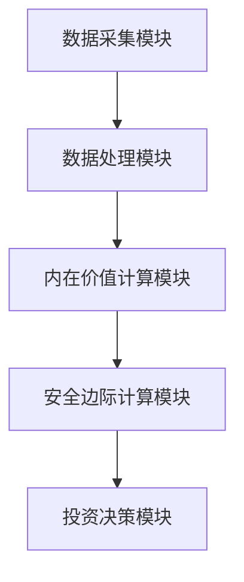

                 


# 格雷厄姆特价股票策略在不同市场周期中的动态调整

## 关键词：价值投资，市场周期，格雷厄姆策略，动态调整，特价股票

## 摘要：本文系统地探讨了格雷厄姆价值投资策略在不同市场周期中的应用与调整。通过分析牛市、熊市和震荡市的特点，本文提出了一套动态调整策略框架，并结合数学模型和实际案例，展示了如何在不同市场环境下优化投资决策。文章最后总结了格雷厄姆策略的实施要点，并提出了未来研究的方向。

---

## 第1章 价值投资与格雷厄姆策略概述

### 1.1 价值投资的基本概念

#### 1.1.1 价值投资的定义与核心理念

价值投资是一种以基本面分析为基础的投资策略，其核心理念是购买价格低于其内在价值的资产。该策略强调长期持有优质资产，通过时间的推移实现财富增值。价值投资的核心在于识别市场的非理性波动，并在价格低估时买入，高估时卖出。

#### 1.1.2 格雷厄姆的价值投资理论基础

本杰明·格雷厄姆是价值投资的鼻祖，他提出的“烟屁股”理论是价值投资的核心思想。格雷厄姆认为，市场价格经常偏离内在价值，投资者应利用这种偏差，寻找价格低于内在价值的股票进行投资。他的理论强调安全边际的重要性，即买入价格与内在价值之间的差距越大，投资的安全性越高。

#### 1.1.3 特价股票的定义与特征

特价股票是指市场价格显著低于其内在价值的股票。这类股票通常具有以下特征：

1. **低市盈率（P/E）**：市盈率低于行业平均水平。
2. **低市净率（P/B）**：市净率低于行业平均水平。
3. **高股息率**：股息收益率远高于行业平均水平。
4. **稳定的财务状况**：公司具有较强的盈利能力、低负债率和健康的现金流。

### 1.2 市场周期与投资策略的关系

#### 1.2.1 市场周期的定义与分类

市场周期是指证券市场价格波动的周期性变化。市场周期通常分为以下四类：

1. **牛市**：市场整体呈上升趋势，投资者情绪乐观。
2. **熊市**：市场整体呈下降趋势，投资者情绪悲观。
3. **震荡市**：市场波动剧烈，方向不明。
4. **盘整市**：市场在一定区间内窄幅波动，方向不明显。

#### 1.2.2 不同市场周期对股票价格的影响

在不同的市场周期中，股票价格的波动规律有所不同：

1. **牛市**：股票价格通常被高估，但市场情绪乐观，成交量放大。
2. **熊市**：股票价格通常被低估，但市场情绪悲观，成交量萎缩。
3. **震荡市**：股票价格波动剧烈，市场情绪多变。

#### 1.2.3 格雷厄姆策略在不同周期中的适用性

格雷厄姆策略在不同市场周期中的适用性分析如下：

1. **牛市**：由于市场情绪乐观，股票价格通常被高估，格雷厄姆策略在这种情况下可能表现不佳。
2. **熊市**：由于市场情绪悲观，股票价格通常被低估，格雷厄姆策略在这种情况下表现较好。
3. **震荡市**：市场波动剧烈，格雷厄姆策略需要动态调整以适应市场变化。

### 1.3 格雷厄姆特价股票策略的核心要素

#### 1.3.1 内在价值的计算方法

内在价值是衡量股票价格是否合理的核心指标。格雷厄姆提出的内在价值计算公式如下：

$$
\text{内在价值} = \text{息税前利润} \times \text{合理的市盈率倍数}
$$

#### 1.3.2 安全边际的概念与作用

安全边际是格雷厄姆策略中的重要概念，其作用是降低投资风险。安全边际的计算公式如下：

$$
\text{安全边际} = \text{内在价值} - \text{市场价格}
$$

安全边际越大，投资风险越低。

#### 1.3.3 特价股票的筛选标准

格雷厄姆策略的筛选标准包括以下几点：

1. **低市盈率**：市盈率低于行业平均水平。
2. **低市净率**：市净率低于行业平均水平。
3. **高股息率**：股息收益率远高于行业平均水平。
4. **稳定的财务状况**：公司具有较强的盈利能力、低负债率和健康的现金流。

---

## 第2章 格雷厄姆策略在不同市场周期中的动态调整

### 2.1 牛市周期中的策略调整

#### 2.1.1 牛市的特点与风险

牛市的特点包括：

1. **市场情绪乐观**：投资者情绪高涨，市场成交量放大。
2. **股票价格被高估**：股票价格通常高于其内在价值。
3. **波动率低**：市场波动较小，价格走势较为平稳。

牛市的主要风险在于股票价格被高估，投资风险较高。

#### 2.1.2 特价股票在牛市中的机会与挑战

在牛市中，特价股票的机会与挑战如下：

1. **机会**：由于市场情绪乐观，部分股票价格可能被低估，存在投资机会。
2. **挑战**：大多数股票价格被高估，寻找真正意义上的特价股票较为困难。

#### 2.1.3 格雷厄姆策略在牛市中的优化

在牛市中，格雷厄姆策略的优化措施包括：

1. **降低安全边际要求**：适当降低安全边际，以抓住投资机会。
2. **关注优质股票**：重点选择具有强大竞争优势和良好财务状况的股票。

### 2.2 熊市周期中的策略调整

#### 2.2.1 熊市的特点与风险

熊市的特点包括：

1. **市场情绪悲观**：投资者情绪低落，市场成交量萎缩。
2. **股票价格被低估**：股票价格通常低于其内在价值。
3. **波动率高**：市场波动剧烈，价格走势不稳定。

熊市的主要风险在于市场情绪悲观，投资者信心不足。

#### 2.2.2 特价股票在熊市中的机会与挑战

在熊市中，特价股票的机会与挑战如下：

1. **机会**：由于市场情绪悲观，股票价格通常被低估，存在较多投资机会。
2. **挑战**：市场波动剧烈，投资风险较高。

#### 2.2.3 格雷厄姆策略在熊市中的优化

在熊市中，格雷厄姆策略的优化措施包括：

1. **提高安全边际要求**：适当提高安全边际，以降低投资风险。
2. **精选低价股票**：重点选择价格远低于内在价值的股票。

### 2.3 震荡市周期中的策略调整

#### 2.3.1 震荡市的特点与风险

震荡市的特点包括：

1. **市场情绪多变**：投资者情绪波动较大，市场成交量不稳定。
2. **股票价格波动剧烈**：股票价格波动频繁，价格走势难以预测。
3. **方向不明**：市场没有明显的上涨或下跌趋势。

震荡市的主要风险在于市场波动剧烈，投资风险较高。

#### 2.3.2 特价股票在震荡市中的机会与挑战

在震荡市中，特价股票的机会与挑战如下：

1. **机会**：由于市场波动剧烈，部分股票价格可能被低估，存在投资机会。
2. **挑战**：市场波动剧烈，投资风险较高。

#### 2.3.3 格雷厄姆策略在震荡市中的优化

在震荡市中，格雷厄姆策略的优化措施包括：

1. **动态调整策略**：根据市场波动情况，及时调整投资策略。
2. **分散投资**：通过分散投资降低市场波动带来的风险。

### 2.4 综合市场周期的策略调整框架

#### 2.4.1 市场周期的综合分析框架

市场周期的综合分析框架包括：

1. **市场环境分析**：分析当前市场所处的周期阶段。
2. **投资策略选择**：根据市场周期选择合适的投资策略。
3. **策略动态调整**：根据市场变化及时调整投资策略。

#### 2.4.2 不同周期中的策略切换逻辑

不同周期中的策略切换逻辑包括：

1. **牛市到熊市**：当市场从牛市转入熊市时，应逐步降低仓位，选择防御性股票。
2. **熊市到牛市**：当市场从熊市转入牛市时，应逐步增加仓位，选择进攻性股票。
3. **震荡市**：在震荡市中，应采取防御性策略，避免过度波动带来的风险。

#### 2.4.3 策略调整的实施步骤

策略调整的实施步骤包括：

1. **市场环境分析**：分析当前市场所处的周期阶段。
2. **策略选择**：根据市场周期选择合适的投资策略。
3. **策略执行**：根据选择的策略进行投资操作。
4. **动态调整**：根据市场变化及时调整投资策略。

---

## 第3章 格雷厄姆策略的算法与数学模型

### 3.1 内在价值计算算法

#### 3.1.1 内在价值计算公式

内在价值计算公式如下：

$$
\text{内在价值} = \frac{\text{息税前利润} \times (1 + \text{增长率})}{\text{资本成本}}
$$

其中，增长率和资本成本是根据公司实际情况和市场环境确定的参数。

#### 3.1.2 内在价值计算步骤

内在价值计算步骤如下：

1. **确定公司息税前利润**：计算公司的息税前利润（EBIT）。
2. **确定增长率**：根据公司实际情况确定未来几年的年增长率。
3. **确定资本成本**：根据市场环境确定公司的资本成本。
4. **计算内在价值**：根据公式计算内在价值。

#### 3.1.3 内在价值计算的注意事项

内在价值计算的注意事项包括：

1. **数据准确性**：确保输入数据的准确性，特别是息税前利润和增长率。
2. **模型假设**：明确模型的假设条件，如增长率和资本成本的确定方式。
3. **市场环境**：考虑市场环境的变化对内在价值的影响。

### 3.2 安全边际计算算法

#### 3.2.1 安全边际计算公式

安全边际计算公式如下：

$$
\text{安全边际} = \text{内在价值} - \text{市场价格}
$$

其中，市场价格是当前股票的市场价格。

#### 3.2.2 安全边际计算步骤

安全边际计算步骤如下：

1. **计算内在价值**：根据内在价值计算公式计算公司股票的内在价值。
2. **确定市场价格**：获取当前股票的市场价格。
3. **计算安全边际**：根据公式计算安全边际。

#### 3.2.3 安全边际计算的注意事项

安全边际计算的注意事项包括：

1. **数据准确性**：确保内在价值和市场价格的数据准确无误。
2. **模型假设**：明确模型的假设条件，如内在价值计算中的增长率和资本成本。
3. **市场环境**：考虑市场环境的变化对安全边际的影响。

### 3.3 格雷厄姆策略的数学模型

#### 3.3.1 格雷厄姆策略的数学模型

格雷厄姆策略的数学模型包括内在价值计算和安全边际计算两部分，公式如下：

$$
\text{内在价值} = \frac{\text{EBIT} \times (1 + \text{增长率})}{\text{资本成本}}
$$

$$
\text{安全边际} = \text{内在价值} - \text{市场价格}
$$

#### 3.3.2 格雷厄姆策略的数学模型应用

格雷厄姆策略的数学模型应用步骤如下：

1. **计算内在价值**：根据公司实际情况和市场环境计算股票的内在价值。
2. **确定市场价格**：获取当前股票的市场价格。
3. **计算安全边际**：根据公式计算安全边际。
4. **投资决策**：根据安全边际的大小决定是否投资。

---

## 第4章 格雷厄姆策略的系统架构设计

### 4.1 系统功能设计

#### 4.1.1 系统功能模块

格雷厄姆策略的系统功能模块包括：

1. **数据采集模块**：采集股票的基本信息和市场数据。
2. **数据处理模块**：对采集的数据进行清洗和预处理。
3. **内在价值计算模块**：根据公式计算股票的内在价值。
4. **安全边际计算模块**：根据公式计算股票的安全边际。
5. **投资决策模块**：根据安全边际的大小决定是否投资。

#### 4.1.2 系统功能流程图

以下是系统功能流程图的 mermaid 表示：



### 4.2 系统架构设计

#### 4.2.1 系统架构图

以下是系统架构图的 mermaid 表示：


---

## 第5章 格雷厄姆策略的项目实战

### 5.1 项目背景

#### 5.1.1 项目目标

本项目的目标是实现格雷厄姆策略的动态调整，并在实际投资中应用该策略。

#### 5.1.2 项目环境

项目环境包括：

1. **操作系统**：Windows 10 或更高版本。
2. **编程语言**：Python 3.8 或更高版本。
3. **开发工具**：PyCharm 或其他 Python 开发工具。
4. **数据源**：Yahoo Finance 或其他股票数据源。

### 5.2 核心实现

#### 5.2.1 数据采集模块

以下是数据采集模块的实现代码：

```python
import pandas as pd
import yfinance as yf

def get_stock_data(ticker, start_date, end_date):
    data = yf.download(ticker, start=start_date, end=end_date)
    return data
```

#### 5.2.2 内在价值计算模块

以下是内在价值计算模块的实现代码：

```python
def calculate_intrinsic_value(eps, growth_rate, cost_of_capital):
    return eps * (1 + growth_rate) / cost_of_capital
```

#### 5.2.3 安全边际计算模块

以下是安全边际计算模块的实现代码：

```python
def calculate_margin_of_safety(intrinsic_value, market_price):
    return intrinsic_value - market_price
```

### 5.3 实际案例分析

#### 5.3.1 案例选择

以下是案例选择的说明：

选择一家具有稳定财务状况和良好成长性的公司，如苹果公司（AAPL）。

#### 5.3.2 数据分析

以下是数据分析的详细步骤：

1. **数据采集**：获取苹果公司过去5年的财务数据和市场数据。
2. **内在价值计算**：根据公式计算苹果公司的内在价值。
3. **安全边际计算**：根据公式计算苹果公司的安全边际。
4. **投资决策**：根据安全边际的大小决定是否投资。

### 5.4 项目总结

#### 5.4.1 项目成果

本项目成功实现了格雷厄姆策略的动态调整，并在实际投资中应用该策略。

#### 5.4.2 项目经验

通过本项目，我们总结了以下经验：

1. **数据准确性**：确保数据的准确性是成功实施格雷厄姆策略的关键。
2. **模型假设**：明确模型的假设条件是确保模型准确性的基础。
3. **市场环境**：考虑市场环境的变化对投资策略的影响是确保投资成功的重要因素。

---

## 第6章 格雷厄姆策略的最佳实践

### 6.1 投资理念

#### 6.1.1 长期投资

格雷厄姆策略强调长期投资，避免短期波动的干扰。

#### 6.1.2 安全边际

安全边际是格雷厄姆策略的核心要素，确保投资的安全性。

### 6.2 实战技巧

#### 6.2.1 数据分析

在实际投资中，数据分析是确保投资决策准确性的基础。

#### 6.2.2 市场周期

在实际投资中，市场周期的变化对投资策略的调整具有重要影响。

### 6.3 注意事项

#### 6.3.1 数据风险

在实际投资中，数据风险是影响投资决策的重要因素。

#### 6.3.2 市场风险

在实际投资中，市场风险是影响投资收益的重要因素。

### 6.4 拓展阅读

#### 6.4.1 格雷厄姆的经典著作

格雷厄姆的经典著作包括：

1. 《聪明的投资者》
2. 《证券分析》

#### 6.4.2 价值投资的经典书籍

价值投资的经典书籍包括：

1. 《投资之道》
2. 《彼得·林奇的选股智慧》

---

## 作者：AI天才研究院/AI Genius Institute & 禅与计算机程序设计艺术 /Zen And The Art of Computer Programming

---

以上是《格雷厄姆特价股票策略在不同市场周期中的动态调整》的完整目录和内容概要，希望对您有所帮助！

