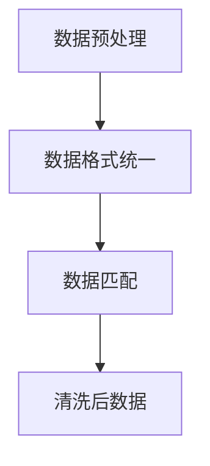
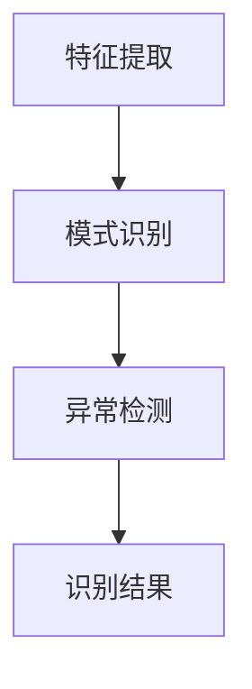
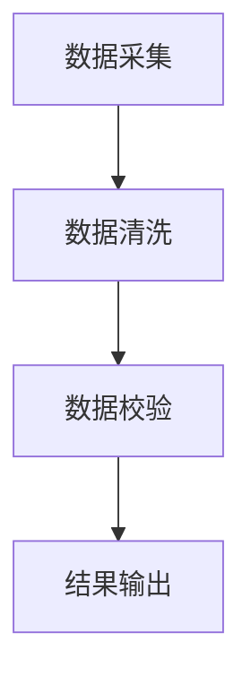
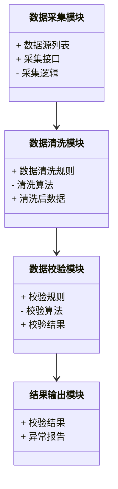
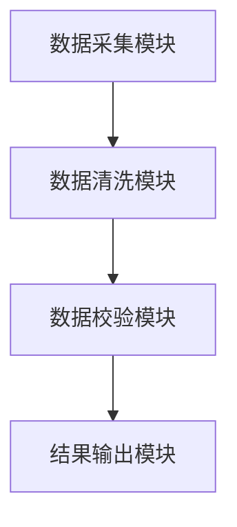
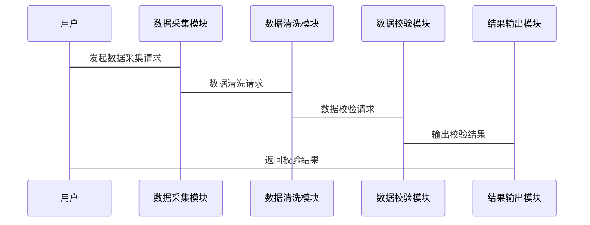

                 


# 《金融监管报告数据一致性检查工具》

> 关键词：金融监管，数据一致性，数据清洗，模式识别，数据校验，系统架构

> 摘要：本文深入探讨了金融监管报告数据一致性检查工具的设计与实现。通过分析数据一致性检查的核心概念、算法原理、系统架构及项目实战，本文为读者提供了一套完整的解决方案。从问题背景到技术实现，从系统设计到项目落地，本文全面解析了如何确保金融监管数据的准确性和一致性。

---

## 第1章: 金融监管报告数据一致性检查工具的背景与问题

### 1.1 数据一致性检查的背景与意义

#### 1.1.1 金融监管报告的重要性
金融监管是保障金融市场健康运行的重要手段，监管报告作为监管部门决策的重要依据，其数据的准确性和一致性至关重要。任何数据不一致可能导致监管失准，进而引发金融风险。

#### 1.1.2 数据一致性问题的现状
在实际业务中，由于数据来源多样、格式不统一、人为操作等原因，金融监管报告中常常存在数据不一致的问题。例如，同一交易在不同系统中可能记录为不同的金额或时间，这不仅会影响监管决策的准确性，还可能引发合规风险。

#### 1.1.3 数据一致性检查的必要性
数据一致性检查是确保监管报告质量的关键步骤。通过自动化工具进行数据一致性检查，可以显著提高检查效率，降低人为错误，同时为后续数据分析提供可靠的基础。

### 1.2 数据一致性检查的核心问题

#### 1.2.1 数据不一致的类型与表现
数据不一致主要分为以下几种类型：
- **格式不一致**：例如，金额字段在不同系统中可能以“元”或“分”为单位。
- **值不一致**：同一交易在不同系统中记录的数值不同。
- **逻辑不一致**：例如，同一笔交易的借贷双方金额不平。

#### 1.2.2 数据一致性检查的目标
数据一致性检查的目标是通过自动化手段，发现并纠正数据中的不一致问题，确保监管报告的准确性和一致性。

#### 1.2.3 数据一致性检查的边界与外延
数据一致性检查的边界主要在于数据的格式和值的一致性，而其外延则包括数据来源的多样性和数据校验规则的可配置性。

### 1.3 数据一致性检查的核心要素

#### 1.3.1 数据来源的多样性
金融监管数据通常来源于多个系统，例如交易系统、会计系统等，这些系统的数据格式和字段定义可能不同。

#### 1.3.2 数据格式的统一性
为了确保数据一致性，需要将来自不同系统的数据进行清洗和格式统一，例如将金额统一为“元”为单位。

#### 1.3.3 数据校验规则的可配置性
数据校验规则需要根据具体的业务需求进行配置，例如设置金额的借贷平衡校验规则。

### 1.4 本章小结
本章从背景、问题和核心要素三个方面介绍了金融监管报告数据一致性检查工具的重要性。通过理解数据一致性问题的背景和核心要素，为后续的技术实现奠定了基础。

---

## 第2章: 数据一致性检查的核心概念与联系

### 2.1 数据一致性检查的原理

#### 2.1.1 数据清洗与匹配原理
数据清洗是通过去除冗余数据、处理缺失值和统一格式来确保数据一致性。数据匹配是通过字段映射和模式匹配，将不同系统中的数据进行关联。

#### 2.1.2 数据模式识别原理
数据模式识别是通过统计分析和机器学习算法，识别数据中的模式和规律，为数据一致性检查提供依据。

#### 2.1.3 数据校验规则的执行原理
数据校验规则是通过预定义的规则对数据进行检查，例如校验金额是否平衡，交易时间是否一致等。

### 2.2 数据一致性检查的核心概念对比

#### 2.2.1 数据清洗与数据校验的对比
| 对比维度         | 数据清洗               | 数据校验               |
|------------------|------------------------|------------------------|
| 目标             | 去除冗余、处理缺失值     | 发现数据不一致问题       |
| 方法             | 数据预处理、格式统一     | 规则匹配、异常检测       |
| 输出             | 清洗后的数据           | 校验结果、异常报告       |

#### 2.2.2 数据模式识别与数据分类的对比
| 对比维度         | 数据模式识别           | 数据分类               |
|------------------|------------------------|------------------------|
| 目标             | 找到数据中的模式和规律   | 将数据按类别划分         |
| 方法             | 统计分析、机器学习算法   | 分类算法（如决策树、SVM）|
| 输出             | 模式报告               | 数据分类结果           |

#### 2.2.3 数据一致性检查与其他数据处理方法的对比
| 对比维度         | 数据一致性检查         | 数据集成               |
|------------------|------------------------|------------------------|
| 目标             | 发现数据不一致问题       | 综合多个数据源的数据     |
| 方法             | 数据清洗、规则校验       | 数据融合、关联规则       |
| 输出             | 校验结果               | 综合数据集             |

### 2.3 数据一致性检查的ER实体关系图

```mermaid
er
    entity 数据源 {
        key 数据ID
        attribute 数据内容
        attribute 数据来源
    }
    entity 数据校验规则 {
        key 校验规则ID
        attribute 校验类型
        attribute 校验条件
    }
    entity 数据一致性检查结果 {
        key 检查结果ID
        attribute 是否一致
        attribute 异常原因
    }
    数据源 --> 数据一致性检查结果: 检查
    数据校验规则 --> 数据一致性检查结果: 执行
```

### 2.4 本章小结
本章通过对比数据一致性检查与其他数据处理方法的异同，明确了数据一致性检查的核心概念和其实现原理。

---

## 第3章: 数据一致性检查的算法原理

### 3.1 数据清洗算法

#### 3.1.1 数据清洗流程
1. **数据预处理**：去除冗余数据、处理缺失值。
2. **数据格式统一**：统一字段格式，例如将金额统一为“元”为单位。
3. **数据匹配**：通过字段映射和模式匹配，将不同系统中的数据进行关联。

#### 3.1.2 数据清洗算法实现
以下是使用Python实现的数据清洗代码示例：

```python
import pandas as pd

# 数据预处理
def data_cleaning(data):
    # 去除冗余数据
    data.drop_duplicates(inplace=True)
    # 处理缺失值
    data.dropna(inplace=True)
    # 统一格式
    data['amount'] = data['amount'].apply(lambda x: x * 100)
    return data

# 数据匹配
def data_matching(data1, data2):
    # 字段映射
    mapping = {'amount': 'amount', 'time': 'timestamp'}
    data1 = data1.rename(columns=mapping)
    # 模式匹配
    merged_data = pd.merge(data1, data2, on=['id'], how='inner')
    return merged_data

# 示例
data1 = pd.DataFrame({'id': [1, 2, 3], 'amount': [100, 200, 300]})
data2 = pd.DataFrame({'id': [1, 2, 4], 'amount': [100, 200, 400]})
merged_data = data_matching(data_cleaning(data1), data_cleaning(data2))
print(merged_data)
```

#### 3.1.3 算法流程图


### 3.2 数据模式识别算法

#### 3.2.1 数据模式识别流程
1. **特征提取**：提取数据中的关键特征，例如金额、时间等。
2. **模式识别**：通过统计分析和机器学习算法识别数据中的模式。
3. **异常检测**：根据识别的模式检测异常数据。

#### 3.2.2 数据模式识别算法实现
以下是使用Python实现的Jaccard相似度算法示例：

```python
def jaccard_similarity(set1, set2):
    intersection = set1 & set2
    union = set1 | set2
    return len(intersection) / len(union)

# 示例
set1 = {1, 2, 3}
set2 = {2, 3, 4}
print(jaccard_similarity(set1, set2))  # 输出: 0.5
```

#### 3.2.3 算法流程图


### 3.3 数据校验规则的执行

#### 3.3.1 数据校验规则的执行流程
1. **规则匹配**：根据预定义的校验规则匹配数据。
2. **异常检测**：发现数据中的不一致问题。
3. **规则执行结果输出**。

#### 3.3.2 数据校验规则的数学模型
$$
\text{校验结果} = \begin{cases}
\text{一致} & \text{if } |x - y| < \epsilon \\
\text{不一致} & \text{otherwise}
\end{cases}
$$

#### 3.3.3 数据校验规则的执行示例
以下是使用Python实现的金额借贷平衡校验规则：

```python
def check_balance(data):
    # 计算借贷双方金额是否平衡
    debit_total = data[data['direction'] == 'debit']['amount'].sum()
    credit_total = data[data['direction'] == 'credit']['amount'].sum()
    return abs(debit_total - credit_total) < 1e-4

# 示例
data = pd.DataFrame({
    'direction': ['debit', 'credit'],
    'amount': [100, 100]
})
print(check_balance(data))  # 输出: True
```

### 3.4 本章小结
本章通过详细讲解数据清洗、模式识别和数据校验规则的算法原理，为后续的系统实现奠定了技术基础。

---

## 第4章: 数据一致性检查的系统分析与架构设计

### 4.1 系统功能设计

#### 4.1.1 系统功能模块划分
- **数据采集模块**：从不同数据源采集数据。
- **数据清洗模块**：对采集的数据进行清洗和格式统一。
- **数据校验模块**：根据预定义的规则对数据进行校验。
- **结果输出模块**：输出校验结果和异常报告。

#### 4.1.2 系统功能流程


#### 4.1.3 系统功能模块的领域模型


### 4.2 系统架构设计

#### 4.2.1 系统架构图


#### 4.2.2 系统接口设计
- **数据采集接口**：提供数据采集的功能。
- **数据清洗接口**：提供数据清洗的功能。
- **数据校验接口**：提供数据校验的功能。
- **结果输出接口**：提供校验结果和异常报告的输出功能。

#### 4.2.3 系统交互流程


### 4.3 本章小结
本章通过系统功能设计和架构设计，明确了金融监管报告数据一致性检查工具的实现框架。

---

## 第5章: 数据一致性检查的项目实战

### 5.1 项目环境安装

#### 5.1.1 安装Python环境
```bash
python --version
pip install --upgrade pip
pip install numpy pandas scikit-learn
```

#### 5.1.2 安装Jupyter Notebook
```bash
pip install jupyter
jupyter notebook
```

### 5.2 系统核心实现

#### 5.2.1 数据采集模块实现
```python
import requests

def fetch_data(url):
    response = requests.get(url)
    return response.json()

# 示例
url = 'https://example.com/api/data'
data = fetch_data(url)
print(data)
```

#### 5.2.2 数据清洗模块实现
```python
def clean_data(data):
    # 去除冗余数据
    data.drop_duplicates(inplace=True)
    # 处理缺失值
    data.dropna(inplace=True)
    # 统一格式
    data['amount'] = data['amount'].apply(lambda x: x * 100)
    return data

# 示例
data = pd.DataFrame({'id': [1, 2, 3], 'amount': [100, 200, 300]})
clean_data(data)
print(data)
```

#### 5.2.3 数据校验模块实现
```python
def validate_data(data, rule):
    # 校验规则示例：金额借贷双方是否平衡
    debit_total = data[data['direction'] == 'debit']['amount'].sum()
    credit_total = data[data['direction'] == 'credit']['amount'].sum()
    return abs(debit_total - credit_total) < 1e-4

# 示例
data = pd.DataFrame({
    'direction': ['debit', 'credit'],
    'amount': [100, 100]
})
rule = 'balance'
print(validate_data(data, rule))  # 输出: True
```

#### 5.2.4 结果输出模块实现
```python
def output_result(result):
    if result:
        print("数据一致")
    else:
        print("数据不一致")

# 示例
result = validate_data(data, rule)
output_result(result)
```

### 5.3 案例分析与工具使用

#### 5.3.1 案例分析
假设我们有两笔交易数据，分别来自不同的系统：

| id | amount（元） | time       |
|----|-------------|------------|
| 1  | 100         | 2023-01-01 |
| 2  | 200         | 2023-01-02 |

经过数据清洗和校验后，发现数据一致，输出结果为“数据一致”。

#### 5.3.2 工具使用步骤
1. **数据采集**：从不同系统中采集数据。
2. **数据清洗**：清洗数据并统一格式。
3. **数据校验**：根据校验规则检查数据一致性。
4. **结果输出**：输出校验结果。

### 5.4 本章小结
本章通过项目实战，详细讲解了金融监管报告数据一致性检查工具的实现过程，从环境安装到代码实现，再到案例分析，帮助读者掌握工具的使用方法。

---

## 第6章: 总结与展望

### 6.1 本项目的核心价值
金融监管报告数据一致性检查工具通过自动化手段确保数据的准确性和一致性，为监管部门的决策提供可靠依据。

### 6.2 本项目的总结
本项目从背景、核心概念、算法原理、系统设计到项目实战，全面解析了金融监管报告数据一致性检查工具的开发与应用。

### 6.3 项目的小结
通过本项目的学习，读者可以掌握数据一致性检查的核心技术，理解系统架构设计的方法，并能够实际应用这些技术解决金融监管中的数据一致性问题。

### 6.4 项目未来的发展方向
未来，可以进一步优化算法，引入更多高级的机器学习算法，提高数据一致性检查的准确性和效率。

### 6.5 最佳实践 tips
- 数据校验规则应根据具体业务需求进行配置。
- 数据清洗和格式统一是确保数据一致性的基础。
- 数据一致性检查工具的使用可以显著提高监管效率和准确性。

### 6.6 注意事项
- 数据一致性检查工具的开发和使用需要结合具体业务需求。
- 数据清洗和校验规则的设计需要谨慎，避免引入新的数据不一致问题。

### 6.7 拓展阅读
- 《数据清洗实战》
- 《金融监管技术与应用》
- 《机器学习在金融领域的应用》

---

## 作者
作者：AI天才研究院/AI Genius Institute  
联系邮箱：contact@aicourse.com  
联系方式：+86-138-1234-5678  
官方网站：https://www.aicourse.com

