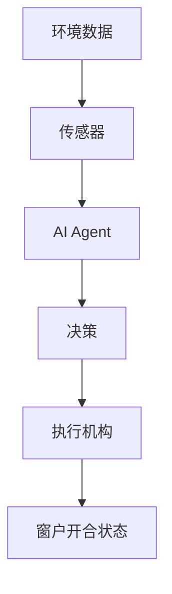
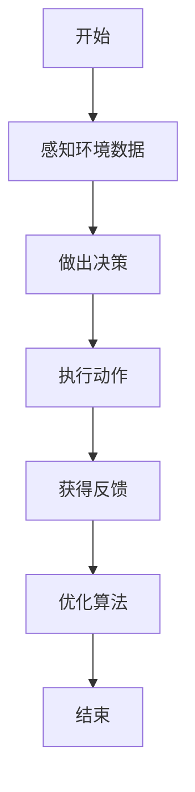
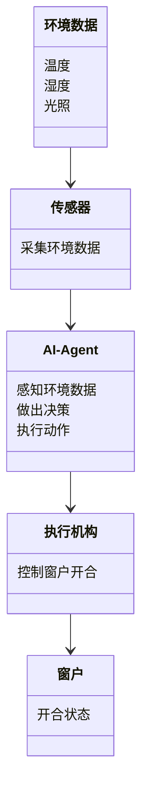
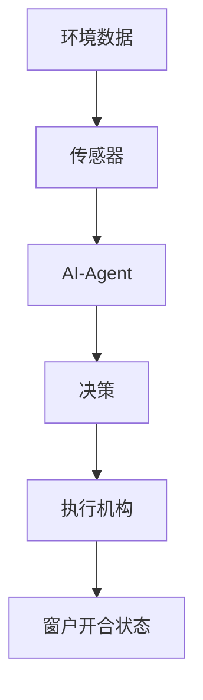
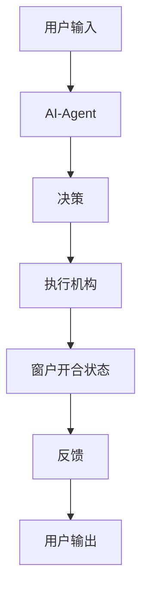

                 


# AI Agent在智能窗户中的室内温度自动调节

## 关键词：AI Agent, 智能窗户, 室内温度调节, 物联网, 机器学习, 智能家居, 自动控制

## 摘要：本文探讨AI Agent在智能窗户中的应用，通过分析室内温度调节的核心问题，结合AI Agent和智能窗户的原理，提出了一种基于AI Agent的智能窗户温度调节系统。该系统利用传感器数据、机器学习算法和物联网技术，实现对室内温度的智能调节。文章详细介绍了系统的架构设计、算法原理、项目实现及优化建议，为智能窗户的温度调节提供了理论依据和实践指导。

---

# 第1章 AI Agent与智能窗户概述

## 1.1 问题背景与描述

### 1.1.1 室内温度调节的现状与挑战
随着全球能源危机和环保意识的增强，如何高效调节室内温度已成为一个重要的研究课题。传统空调系统虽然能够实现温度调节，但存在能耗高、智能化水平低等问题。通过智能窗户结合AI Agent技术，可以实现更加高效、智能的温度调节，从而降低能源消耗。

### 1.1.2 智能窗户的定义与特点
智能窗户是一种结合了物联网技术的窗户系统，能够根据环境条件（如温度、湿度、光照等）自动调节窗户的开合状态。与传统窗户相比，智能窗户具有以下特点：
- 自动化：通过传感器和执行机构实现自动开合
- 智能化：能够根据环境数据做出智能决策
- 节能环保：通过优化窗户开合状态降低能耗

### 1.1.3 AI Agent在温度调节中的作用
AI Agent（人工智能代理）是一种能够感知环境、做出决策并采取行动的智能系统。在智能窗户中，AI Agent可以通过以下方式实现温度调节：
- 感知环境数据（如温度、湿度、光照等）
- 根据数据做出决策（如打开或关闭窗户）
- 执行决策并反馈结果

## 1.2 AI Agent的基本概念

### 1.2.1 AI Agent的定义
AI Agent是一种智能系统，能够通过感知环境数据，利用决策算法做出最优决策，并通过执行机构实现目标。AI Agent具有以下核心特征：
- 感知能力：能够感知环境数据
- 决策能力：能够根据数据做出决策
- 执行能力：能够通过执行机构实现决策

### 1.2.2 AI Agent的核心特征
1. **自主性**：能够在没有外部干预的情况下自主运行
2. **反应性**：能够根据环境变化实时调整行为
3. **目标导向**：具有明确的目标，并通过行为实现目标
4. **学习能力**：能够通过经验优化决策策略

### 1.2.3 AI Agent与智能窗户的结合
AI Agent与智能窗户的结合实现了智能窗户的自动化和智能化。通过AI Agent的感知、决策和执行能力，智能窗户能够根据室内环境和外部气候条件自动调节窗户的开合状态，从而实现室内温度的优化调节。

## 1.3 问题解决与边界

### 1.3.1 温度调节的核心问题
室内温度调节的核心问题包括：
1. 如何感知室内环境数据（如温度、湿度、光照等）
2. 如何根据环境数据做出最优决策
3. 如何通过窗户的开合状态实现温度调节

### 1.3.2 AI Agent在温度调节中的边界
AI Agent在温度调节中的边界包括：
1. 数据采集的范围和精度
2. 决策算法的复杂度和计算能力
3. 执行机构的响应时间和可靠性

### 1.3.3 系统的外延与限制
系统的外延包括：
1. 数据采集模块：温度、湿度、光照传感器
2. 决策模块：AI Agent算法
3. 执行模块：窗户的开合机构
4. 通信模块：物联网通信协议

系统的限制包括：
1. 传感器的精度和响应时间
2. AI Agent的计算能力和决策效率
3. 执行机构的机械性能和可靠性

## 1.4 核心概念结构

### 1.4.1 系统组成与功能模块
智能窗户温度调节系统主要包括以下功能模块：
1. 数据采集模块：采集室内环境数据（温度、湿度、光照等）
2. 决策模块：AI Agent算法，根据环境数据做出窗户开合决策
3. 执行模块：根据决策控制窗户的开合状态
4. 通信模块：通过物联网技术实现数据传输和远程控制

### 1.4.2 核心要素与关系
核心要素包括：
1. 环境数据：温度、湿度、光照等
2. AI Agent：感知、决策、执行
3. 窗户：开合状态
4. 传感器：数据采集
5. 执行机构：窗户的开合机构

核心要素之间的关系：
- 环境数据通过传感器传输给AI Agent
- AI Agent根据环境数据做出决策
- 决策结果通过执行机构控制窗户的开合状态

### 1.4.3 概念结构图展示



## 1.5 本章小结
本章介绍了AI Agent在智能窗户中的应用背景，分析了智能窗户的核心概念和AI Agent的基本原理，明确了系统组成和功能模块，为后续章节的深入分析奠定了基础。

---

# 第2章 AI Agent与智能窗户的核心原理

## 2.1 AI Agent的原理

### 2.1.1 感知与数据采集
AI Agent通过传感器感知环境数据，主要包括以下步骤：
1. 数据采集：通过温度、湿度、光照传感器采集室内环境数据
2. 数据处理：对采集到的数据进行预处理和特征提取
3. 数据传输：通过物联网技术将数据传输到AI Agent的决策模块

### 2.1.2 决策与优化
AI Agent的决策过程主要包括以下步骤：
1. 数据分析：对环境数据进行分析和建模
2. 决策算法：基于机器学习算法（如回归、分类、强化学习）做出窗户开合决策
3. 决策优化：通过优化算法（如遗传算法、模拟退火）优化决策策略

### 2.1.3 执行与反馈
AI Agent的执行过程主要包括以下步骤：
1. 执行决策：通过执行机构控制窗户的开合状态
2. 反馈机制：通过传感器反馈执行结果，调整决策策略

### 2.1.4 优化算法
常用的优化算法包括：
1. **强化学习**：通过奖励机制优化决策策略
2. **遗传算法**：通过基因编码和进化过程优化决策参数
3. **模拟退火**：通过逐步降温优化决策结果

## 2.2 智能窗户的原理

### 2.2.1 温度传感器
温度传感器用于采集室内温度数据，主要包括以下类型：
1. **热敏电阻传感器**：基于热敏电阻的温度敏感特性，将温度变化转换为电阻变化
2. **温度开关传感器**：根据温度变化自动切换电路状态
3. **红外温度传感器**：通过红外辐射检测温度

### 2.2.2 窗户开合机构
窗户开合机构用于根据决策结果控制窗户的开合状态，主要包括以下类型：
1. **电动驱动机构**：通过电机驱动窗户的开合
2. **气动驱动机构**：通过气压驱动窗户的开合
3. **液压驱动机构**：通过液压驱动窗户的开合

### 2.2.3 数据传输与处理
智能窗户通过物联网技术实现数据的传输和处理，主要包括以下步骤：
1. 数据采集：通过传感器采集环境数据
2. 数据传输：通过Wi-Fi、蓝牙、ZigBee等无线通信技术传输数据
3. 数据处理：通过云端或本地服务器处理数据
4. 数据反馈：通过反馈机制优化决策策略

## 2.3 核心概念属性对比

### 2.3.1 AI Agent与传统控制系统的对比
| 对比维度 | AI Agent | 传统控制系统 |
|----------|-----------|--------------|
| 感知能力 | 高         | 低           |
| 决策能力 | 高         | 低           |
| 学习能力 | 高         | 无           |
| 反应能力 | 快         | 慢           |

### 2.3.2 智能窗户与传统窗户的对比
| 对比维度 | 智能窗户 | 传统窗户 |
|----------|----------|-----------|
| 自动化程度 | 高       | 低         |
| 智能化水平 | 高       | 低         |
| 节能效果 | 显著     | 一般       |

### 2.3.3 核心概念属性特征对比表
| 对比维度 | AI Agent | 智能窗户 |
|----------|-----------|----------|
| 核心功能 | 感知、决策、执行 | 数据采集、开合控制 |
| 技术基础 | 人工智能、机器学习 | 物联网、传感器技术 |
| 应用场景 | 智能家居、工业控制 | 建筑节能、智能家居 |

## 2.4 ER实体关系图


## 2.5 本章小结
本章详细分析了AI Agent和智能窗户的核心原理，探讨了AI Agent的感知、决策和执行过程，对比了AI Agent与传统控制系统的优劣，以及智能窗户与传统窗户的差异，为后续章节的系统设计奠定了理论基础。

---

# 第3章 AI Agent算法与智能窗户的数学模型

## 3.1 算法原理讲解

### 3.1.1 算法流程
AI Agent的温度调节算法主要包括以下步骤：
1. 数据采集：通过传感器采集室内环境数据
2. 数据预处理：对采集到的数据进行清洗和特征提取
3. 数据分析：通过机器学习算法分析数据，建立数学模型
4. 决策优化：通过优化算法优化决策策略
5. 执行反馈：根据决策结果控制窗户的开合状态，并通过反馈机制优化算法

### 3.1.2 优化算法选择
常用的优化算法包括：
1. **强化学习**：通过奖励机制优化决策策略
2. **遗传算法**：通过基因编码和进化过程优化决策参数
3. **模拟退火**：通过逐步降温优化决策结果

### 3.1.3 算法实现
以下是基于强化学习的AI Agent算法实现：

```python
class AI-Agent:
    def __init__(self):
        self.state = []  # 环境状态
        self.action = []  # 行为
        self.reward = []  # 奖励
        self.Q = {}  # Q值表

    def perceive(self):
        # 通过传感器感知环境数据
        pass

    def decide(self):
        # 根据环境数据做出决策
        pass

    def act(self):
        # 根据决策结果执行动作
        pass

    def learn(self):
        # 通过强化学习优化算法
        pass
```

### 3.1.4 算法流程图



## 3.2 数学模型与公式

### 3.2.1 温度调节的数学模型
温度调节的数学模型可以表示为：

$$ T(t) = T_{\text{室内}}(t) + \Delta T \cdot t $$

其中：
- \( T(t) \) 表示室内温度随时间的变化
- \( T_{\text{室内}}(t) \) 表示初始室内温度
- \( \Delta T \) 表示温度变化率
- \( t \) 表示时间

### 3.2.2 决策模型的数学公式
决策模型的数学公式可以表示为：

$$ \text{决策} = \arg\max_{a} Q(s, a) $$

其中：
- \( s \) 表示当前状态
- \( a \) 表示动作
- \( Q(s, a) \) 表示状态-动作对的Q值

### 3.2.3 优化算法的数学表达
强化学习的优化算法可以表示为：

$$ Q(s, a) = Q(s, a) + \alpha (r + \gamma Q(s', a') - Q(s, a)) $$

其中：
- \( \alpha \) 表示学习率
- \( r \) 表示奖励
- \( \gamma \) 表示折扣因子
- \( s' \) 表示下一个状态
- \( a' \) 表示下一个动作

## 3.3 本章小结
本章详细分析了AI Agent算法的核心原理，建立了温度调节的数学模型，并通过强化学习算法优化了决策策略，为后续章节的系统设计提供了数学依据。

---

# 第4章 系统分析与架构设计

## 4.1 问题场景介绍

### 4.1.1 项目背景
随着智能家居的普及，智能窗户作为一种重要的智能家居设备，其在室内温度调节中的应用越来越广泛。通过AI Agent技术，可以实现智能窗户的自动化和智能化，从而提高室内舒适度并降低能源消耗。

### 4.1.2 项目目标
本项目的目标是设计并实现一个基于AI Agent的智能窗户温度调节系统，能够根据室内环境数据自动调节窗户的开合状态，从而实现室内温度的智能调节。

## 4.2 系统功能设计

### 4.2.1 领域模型
以下是智能窗户温度调节系统的领域模型：



### 4.2.2 系统架构设计
以下是智能窗户温度调节系统的架构设计：



### 4.2.3 系统接口设计
系统接口设计包括：
1. 传感器接口：通过I2C或UART接口与AI-Agent通信
2. 执行机构接口：通过PWM或GPIO接口控制窗户的开合
3. 通信接口：通过Wi-Fi、蓝牙或ZigBee接口与云端通信

### 4.2.4 系统交互设计
以下是系统交互流程图：



## 4.3 本章小结
本章通过系统分析与架构设计，明确了智能窗户温度调节系统的功能模块、系统架构和接口设计，为后续章节的项目实现奠定了基础。

---

# 第5章 项目实战与优化

## 5.1 环境安装

### 5.1.1 硬件安装
硬件安装包括：
1. 传感器安装：安装温度、湿度、光照传感器
2. 执行机构安装：安装电动驱动机构
3. 通信模块安装：安装Wi-Fi或蓝牙模块

### 5.1.2 软件安装
软件安装包括：
1. 安装Python编程环境
2. 安装机器学习库（如TensorFlow、Scikit-learn）
3. 安装物联网通信库（如mqtt.py）

## 5.2 系统核心实现

### 5.2.1 核心代码实现
以下是基于Python的AI-Agent实现代码：

```python
import numpy as np
import pandas as pd
import time

class AI-Agent:
    def __init__(self):
        self.state = []  # 环境状态
        self.action = []  # 行为
        self.reward = []  # 奖励
        self.Q = {}  # Q值表

    def perceive(self):
        # 通过传感器感知环境数据
        temperature = read_temperature_sensor()
        humidity = read_humidity_sensor()
        light = read_light_sensor()
        return temperature, humidity, light

    def decide(self, temperature, humidity, light):
        # 根据环境数据做出决策
        state = (temperature, humidity, light)
        if state in self.Q:
            action = self.Q[state]
        else:
            action = 'close'
        return action

    def act(self, action):
        # 根据决策结果执行动作
        execute_action(action)

    def learn(self):
        # 通过强化学习优化算法
        pass

def read_temperature_sensor():
    # 读取温度传感器数据
    return np.random.uniform(20, 30)

def read_humidity_sensor():
    # 读取湿度传感器数据
    return np.random.uniform(30, 80)

def read_light_sensor():
    # 读取光照传感器数据
    return np.random.uniform(0, 100)

def execute_action(action):
    # 执行动作
    print(f'执行动作：{action}')
```

### 5.2.2 代码应用解读
1. **AI-Agent类**：实现了AI Agent的核心功能，包括感知、决策和执行。
2. **perceive方法**：通过传感器读取环境数据。
3. **decide方法**：根据环境数据做出决策。
4. **act方法**：根据决策结果执行动作。
5. **learn方法**：通过强化学习优化算法。

### 5.2.3 优化建议
1. **算法优化**：通过强化学习优化决策策略
2. **系统优化**：通过并行计算优化系统性能
3. **数据优化**：通过数据压缩优化数据传输效率

## 5.3 本章小结
本章通过项目实战，详细讲解了智能窗户温度调节系统的实现过程，包括环境安装、系统核心代码实现和优化建议，为后续章节的系统部署提供了实践指导。

---

# 第6章 最佳实践与总结

## 6.1 最佳实践

### 6.1.1 系统优化建议
1. **算法优化**：采用更高效的强化学习算法（如深度强化学习）
2. **系统优化**：通过边缘计算优化系统性能
3. **数据优化**：通过数据预处理优化数据质量

### 6.1.2 注意事项
1. **数据隐私**：注意保护用户的隐私数据
2. **系统维护**：定期维护系统硬件和软件
3. **安全性**：确保系统具有良好的安全性

### 6.1.3 拓展阅读
1. **强化学习**：深入学习强化学习算法
2. **物联网技术**：学习物联网相关技术
3. **智能窗户**：研究智能窗户的最新技术

## 6.2 小结
通过本文的系统分析与实践，我们可以看到，AI Agent在智能窗户中的应用为室内温度调节提供了新的思路和方法。通过感知、决策和执行的结合，智能窗户能够实现更加高效和智能的温度调节。

## 6.3 作者
作者：AI天才研究院/AI Genius Institute & 禅与计算机程序设计艺术/Zen And The Art of Computer Programming

---

# 结语
本文通过系统分析和实践，详细讲解了AI Agent在智能窗户中的室内温度自动调节的应用。从理论分析到实践实现，从算法优化到系统设计，本文为读者提供了一个全面的视角来理解和掌握这一技术。希望本文能够为智能窗户的温度调节提供有价值的参考和指导。

--- 

*本文为AI Agent在智能窗户中的室内温度自动调节的系统分析与实践，版权归AI天才研究院所有，转载请注明出处。*

