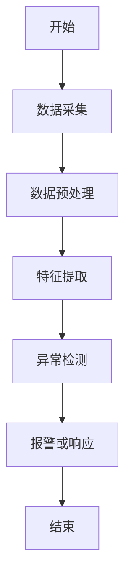
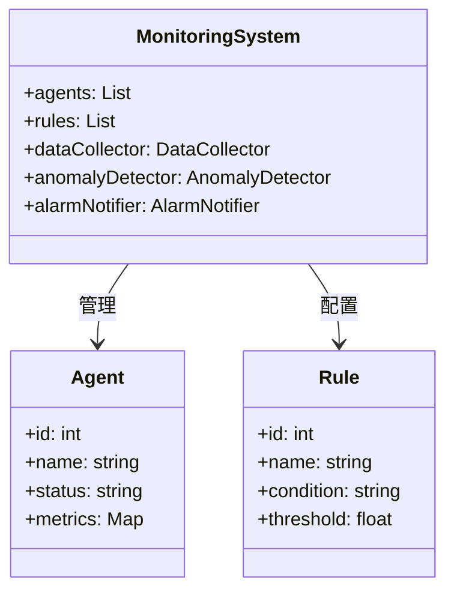

                 


# 企业AI Agent的实时监控系统

## 关键词：企业AI Agent、实时监控、异常检测、系统架构、算法原理

## 摘要：本文详细探讨了企业AI Agent实时监控系统的设计与实现，涵盖了从背景介绍到系统架构的各个方面，分析了核心算法原理，并通过项目实战展示了系统的实现过程，最后提出了优化建议和未来展望。

---

## 第一部分: 企业AI Agent实时监控系统概述

### 第1章: 企业AI Agent实时监控系统背景介绍

#### 1.1 问题背景

##### 1.1.1 AI Agent在企业中的应用现状
AI Agent（人工智能代理）在企业中的应用日益广泛，从客服机器人到供应链优化，AI Agent正在改变企业的运作方式。然而，随着AI Agent的复杂性和规模的增加，监控和管理这些系统的挑战也随之增加。

##### 1.1.2 实时监控系统的重要性
实时监控系统在企业AI Agent中的作用不可忽视。它能够实时检测系统异常，确保AI Agent的稳定运行，同时优化性能，降低成本。

##### 1.1.3 企业AI Agent实时监控的核心问题
- **数据采集与处理**：如何高效地采集和处理来自多个AI Agent的数据。
- **异常检测**：如何准确识别和预测系统中的异常行为。
- **实时响应**：如何快速采取措施应对系统异常。

#### 1.2 问题描述

##### 1.2.1 AI Agent运行中的关键挑战
AI Agent在运行过程中可能会遇到多种问题，如资源耗尽、响应延迟、算法失效等，这些问题需要实时监控系统及时发现并处理。

##### 1.2.2 实时监控系统的定义与目标
实时监控系统是指能够持续收集、分析和响应AI Agent运行状态的系统。其目标是确保AI Agent的高效、稳定和安全运行。

##### 1.2.3 系统边界与外延
- **系统边界**：监控系统的范围限定在AI Agent及其运行环境，不涉及其他外部系统。
- **外延**：监控系统可能需要与企业现有的日志系统、报警系统等进行集成。

#### 1.3 问题解决

##### 1.3.1 AI Agent实时监控的解决方案
通过实时监控系统，企业可以实现对AI Agent的全生命周期管理，包括数据采集、异常检测、报警通知和自动响应。

##### 1.3.2 监控系统的功能模块划分
监控系统通常包括数据采集模块、数据处理模块、异常检测模块、报警模块和响应模块。

##### 1.3.3 系统实现的关键技术
- 数据采集技术：如日志采集、性能指标采集。
- 数据处理技术：如数据清洗、数据 enrichment。
- 异常检测技术：如基于统计的方法、机器学习方法。

#### 1.4 核心概念结构与组成

##### 1.4.1 系统核心要素分析
- AI Agent：执行具体任务的智能体。
- 监控数据：AI Agent运行过程中产生的各种数据。
- 监控规则：定义监控的条件和阈值。
- 报警机制：当监控数据触发规则时，发出报警。

##### 1.4.2 系统架构的核心组件
- 数据采集层：负责采集AI Agent的运行数据。
- 数据处理层：对采集的数据进行清洗、转换和存储。
- 异常检测层：基于历史数据和机器学习模型，检测异常。
- 报警与响应层：根据检测结果，触发报警并执行预定义的响应策略。

##### 1.4.3 监控数据流的逻辑关系
数据从AI Agent流出，经过数据采集层进入数据处理层，然后通过异常检测层分析，最后触发报警或响应。

---

### 第2章: 企业AI Agent实时监控系统的核心概念与联系

#### 2.1 核心概念原理

##### 2.1.1 AI Agent的基本原理
AI Agent通过感知环境、决策和执行动作来实现任务。其实时监控系统需要关注其运行状态，包括CPU使用率、响应时间、错误率等。

##### 2.1.2 实时监控系统的原理
实时监控系统通过持续采集和分析数据，识别异常，并采取相应措施。其核心在于高效的数据处理和准确的异常检测。

##### 2.1.3 两者结合的机制
AI Agent提供运行数据，实时监控系统分析这些数据，发现异常并反馈给AI Agent或采取外部措施。

#### 2.2 核心概念属性特征对比

| 特性       | AI Agent                     | 监控系统                     |
|------------|------------------------------|-----------------------------|
| 目标       | 执行任务                     | 监控状态                     |
| 数据源     | 任务执行数据                 | 运行状态数据                 |
| 响应方式   | 自动执行任务                 | 发出报警或触发响应           |

#### 2.3 ER实体关系图
```mermaid
er
actor: 监控系统管理员
agent: AI Agent实例
monitoring_data: 监控数据
event: 监控事件
rule: 监控规则
action: 系统动作

actor --> monitoring_data: 创建
actor --> rule: 配置
agent --> monitoring_data: 生成
monitoring_data --> event: 触发
event --> rule: 匹配
rule --> action: 执行
```

---

## 第3章: 企业AI Agent实时监控系统算法原理

### 3.1 数据采集与处理

#### 3.1.1 数据采集方法
数据采集可以通过API、日志文件或性能监控工具进行。常用的方法包括轮询采集和事件驱动采集。

#### 3.1.2 数据预处理流程
数据预处理包括清洗（去除无效数据）、转换（统一数据格式）、归一化（标准化）等步骤。

#### 3.1.3 数据特征提取
通过统计方法或机器学习模型提取特征，如均值、方差、最大值、最小值等。

### 3.2 异常检测算法

#### 3.2.1 基于统计的方法
- **Z-score方法**：通过计算数据点与均值的距离标准化值来判断异常。
  $$ z = \frac{x - \mu}{\sigma} $$
  其中，$\mu$是均值，$\sigma$是标准差。

- **箱线图方法**：通过计算四分位数来判断异常值。

#### 3.2.2 基于机器学习的方法
- **Isolation Forest**：一种无监督学习算法，用于异常检测。
- **One-Class SVM**：通过构建数据分布的模型来检测异常。

#### 3.2.3 基于深度学习的方法
- **自动编码器（Autoencoder）**：通过训练模型重构输入数据，检测重构误差较大的数据点为异常。

### 3.3 算法流程图


### 3.4 异常检测算法实现代码示例
```python
import numpy as np
from sklearn.ensemble import IsolationForest

# 示例数据
X = np.random.normal(0, 1, 100)
X[50] = 100  # 异常点

# 训练模型
model = IsolationForest(random_state=42)
model.fit(X.reshape(-1, 1))

# 预测异常
y_pred = model.predict(X.reshape(-1, 1))
y_pred = y_pred == -1

# 输出结果
print("异常点索引:", np.where(y_pred)[0])
```

---

## 第4章: 企业AI Agent实时监控系统分析与架构设计

### 4.1 项目介绍
本项目旨在设计一个实时监控系统，用于监控企业中的多个AI Agent实例的运行状态。

### 4.2 系统功能设计

#### 4.2.1 领域模型类图


### 4.3 系统架构设计

#### 4.3.1 系统架构图
```mermaid
archi
MonitoringSystem
    DataCollector
    |---> Database
    AnomalyDetector
    |---> MachineLearningModel
    AlarmNotifier
    |---> Email
    |---> Slack
```

#### 4.3.2 接口与交互设计

##### 4.3.2.1 API接口
- GET /agents：获取所有AI Agent的信息。
- POST /alarms：设置报警规则。
- GET /alarms：获取报警历史。

##### 4.3.2.2 序列图
```mermaid
sequenceDiagram
actor 监控系统管理员
system 监控系统

监控系统管理员 -> 监控系统: 获取AI Agent列表
监控系统 -> 监控系统: 查询数据库获取AI Agent信息
监控系统 -> 监控系统管理员: 返回AI Agent列表

监控系统管理员 -> 监控系统: 设置报警规则
监控系统 -> 监控系统: 更新规则库
监控系统 -> 监控系统管理员: 返回设置结果
```

---

## 第5章: 企业AI Agent实时监控系统项目实战

### 5.1 环境安装

#### 5.1.1 安装Python环境
使用Anaconda安装Python 3.8及以上版本。

#### 5.1.2 安装依赖库
安装必要的库，如Pandas、NumPy、Scikit-learn、Flask等。

### 5.2 系统核心实现

#### 5.2.1 数据采集模块
```python
import requests

def get_agent_data(agent_id):
    url = f"http://localhost:5000/agents/{agent_id}/metrics"
    response = requests.get(url)
    return response.json()
```

#### 5.2.2 异常检测模块
```python
from sklearn.ensemble import IsolationForest

def detect_anomalies(data):
    model = IsolationForest(random_state=42)
    model.fit(data.reshape(-1, 1))
    return model.predict(data.reshape(-1, 1)) == -1
```

#### 5.2.3 报警模块
```python
import smtplib
from email.mime.text import MIMEText

def send_email_alarm(email, message):
    sender = 'admin@example.com'
    password = 'password'
    server = 'smtp.example.com'
    msg = MIMEText(message)
    msg['Subject'] = 'AI Agent异常通知'
    msg['From'] = sender
    msg['To'] = email
    with smtplib.SMTP(server, 587) as smtp:
        smtp.starttls()
        smtp.login(sender, password)
        smtp.sendmail(sender, email, msg.as_string())
```

### 5.3 案例分析
假设我们有一个AI Agent负责处理订单，我们可以通过监控系统的CPU使用率、响应时间和错误率来检测异常。当CPU使用率超过阈值时，触发报警并自动扩展计算资源。

### 5.4 项目小结
通过本项目，我们实现了一个完整的实时监控系统，能够采集数据、检测异常并触发报警。这为企业提供了高效管理AI Agent的能力。

---

## 第6章: 企业AI Agent实时监控系统的优化与未来展望

### 6.1 系统优化建议

#### 6.1.1 性能优化
- 优化数据采集频率，减少资源消耗。
- 使用更高效的算法，如分布式计算和流式处理。

#### 6.1.2 可扩展性优化
- 支持多租户架构，适应不同规模的企业。
- 提供API接口，便于与其他系统集成。

#### 6.1.3 可用性优化
- 增加冗余节点，确保系统高可用。
- 使用自动备份和恢复机制。

### 6.2 未来展望

#### 6.2.1 技术发展趋势
- 更智能的异常检测算法，如基于深度学习的模型。
- 更实时的数据处理技术，如边缘计算。

#### 6.2.2 企业应用场景扩展
- AI Agent在更多领域的应用，如智能制造、智慧城市。
- 更复杂的监控需求，如多系统协同监控。

#### 6.2.3 挑战与机遇
- 挑战：数据隐私和安全问题。
- 机遇：通过实时监控提升企业AI系统的智能化水平。

---

## 附录

### 附录A: 工具安装与配置指南
列出安装Python、框架和依赖库的步骤。

### 附录B: 术语表
定义文中出现的专业术语。

### 附录C: 参考文献
列出引用的文献和资料。

---

## 作者：AI天才研究院/AI Genius Institute & 禅与计算机程序设计艺术 /Zen And The Art of Computer Programming

