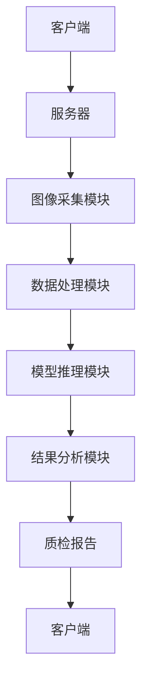

                 


# 企业AI Agent的计算机视觉技术应用：质量控制

---

## 关键词：企业AI Agent，计算机视觉，质量控制，目标检测，图像分割，深度学习

---

## 摘要

本文详细探讨了企业AI Agent在计算机视觉技术中的应用，特别是质量控制领域的实践。通过分析计算机视觉和AI Agent的核心原理，结合实际项目案例，本文深入讲解了如何利用目标检测、图像分割等技术实现高效的质量控制。文章还提供了系统架构设计、数学模型、算法流程图等技术细节，并总结了最佳实践和注意事项，为企业的质量控制提供了新的思路和解决方案。

---

# 第一部分: 企业AI Agent的计算机视觉技术应用概述

## 第1章: 背景介绍与核心概念

### 1.1 问题背景与描述

#### 1.1.1 企业质量控制中的痛点

现代企业生产过程中，产品质量是企业的生命线。然而，传统的人工质检方式效率低下、成本高昂，且容易受到主观因素的影响。此外，随着生产规模的扩大，复杂的产品结构和多样化的质量标准进一步增加了质检的难度。

#### 1.1.2 计算机视觉技术的引入

计算机视觉技术能够通过图像处理和模式识别，自动检测产品中的缺陷和异常。相比人工质检，计算机视觉技术具有高效、精准和可扩展的特点，能够显著提升企业的质检效率和产品质量。

#### 1.1.3 AI Agent在质量控制中的作用

AI Agent（人工智能代理）能够通过计算机视觉技术感知环境，并根据感知结果做出决策和行动。在质量控制中，AI Agent可以实时监控生产过程，自动识别缺陷，并指导后续的生产调整，从而实现智能化的质量控制。

### 1.2 核心概念与定义

#### 1.2.1 计算机视觉的定义与特点

计算机视觉是利用计算机模拟人类视觉系统，通过对图像的处理和分析，实现对视觉信息的理解和应用。其主要特点包括：

- **数据驱动**：依赖大量图像数据进行训练。
- **实时性**：能够在较短时间内完成图像处理和分析。
- **准确性**：通过深度学习算法，能够实现高精度的图像识别。

#### 1.2.2 AI Agent的定义与特点

AI Agent是一种具有感知、决策和行动能力的智能系统。其主要特点包括：

- **自主性**：能够在没有外部干预的情况下完成任务。
- **反应性**：能够根据环境变化实时调整行为。
- **协作性**：能够与其他系统或人员协同工作。

#### 1.2.3 企业AI Agent在质量控制中的应用场景

- **实时监控**：通过摄像头实时采集生产过程中的图像，识别潜在的质量问题。
- **缺陷检测**：利用目标检测和图像分割技术，精准识别产品中的缺陷。
- **质量优化**：根据检测结果，优化生产参数，提升产品质量。

### 1.3 问题解决与边界

#### 1.3.1 计算机视觉在质量控制中的解决方案

计算机视觉技术能够通过图像处理和模式识别，帮助企业在生产过程中实现自动化质检。具体包括：

- **目标检测**：识别图像中的特定目标（如产品中的缺陷）。
- **图像分割**：将图像分割为不同的区域，便于进一步分析。
- **语义理解**：理解图像中的物体及其关系，提升质检的准确性。

#### 1.3.2 AI Agent在质量控制中的边界与外延

AI Agent在质量控制中的应用具有一定的边界。例如：

- **数据依赖性**：AI Agent的性能依赖于高质量的训练数据。
- **环境适应性**：AI Agent需要适应不同的生产环境和光照条件。
- **实时性要求**：AI Agent需要在较短的时间内完成图像处理和决策。

#### 1.3.3 核心概念之间的关系与联系

计算机视觉和AI Agent在质量控制中的应用是相辅相成的。计算机视觉提供了图像处理和分析的能力，而AI Agent则通过感知和决策能力，将计算机视觉的结果应用到实际的生产过程中。

---

## 第2章: 计算机视觉与AI Agent的核心原理

### 2.1 计算机视觉的基本原理

#### 2.1.1 图像处理基础

图像处理是计算机视觉的基础，主要包括图像的获取、预处理和特征提取。图像预处理通常包括灰度化、滤波和边缘检测等步骤。

- **灰度化**：将彩色图像转换为灰度图像，减少颜色干扰。
- **滤波**：通过滤波器去除图像中的噪声。
- **边缘检测**：通过算法提取图像中的边缘信息。

#### 2.1.2 特征提取与目标检测

特征提取是计算机视觉中的关键步骤，常用的特征提取方法包括SIFT、HOG和CNN等。目标检测则是在特征提取的基础上，识别图像中的特定目标。

- **SIFT（尺度不变特征变换）**：能够提取图像中的尺度不变特征。
- **HOG（方向梯度直方图）**：通过统计图像中局部区域的梯度方向，实现目标检测。
- **CNN（卷积神经网络）**：通过卷积操作提取图像的深层特征。

#### 2.1.3 图像分割与语义理解

图像分割是将图像分割为多个区域的过程，常用于目标识别和场景理解。语义理解则是通过分析图像中的物体及其关系，理解图像的含义。

- **图像分割**：常用算法包括基于区域的分割和基于边界检测的分割。
- **语义理解**：通过深度学习模型，理解图像中的物体及其关系。

#### 2.1.4 计算机视觉的核心流程

计算机视觉的核心流程可以分为以下几个步骤：

1. **图像获取**：通过摄像头或图像采集设备获取图像。
2. **图像预处理**：对图像进行灰度化、滤波等预处理。
3. **特征提取**：提取图像中的特征信息。
4. **目标检测/图像分割**：识别图像中的目标或分割图像。
5. **语义理解**：理解图像中的物体及其关系。

### 2.2 AI Agent的基本原理

#### 2.2.1 AI Agent的感知与决策机制

AI Agent的感知能力主要依赖于传感器和摄像头等设备，通过获取环境中的信息，实现对环境的感知。决策机制则基于感知结果，结合预设的规则或机器学习模型，做出相应的决策。

- **感知机制**：通过摄像头获取图像信息，通过麦克风获取音频信息等。
- **决策机制**：基于感知结果，结合历史数据和规则，做出决策。

#### 2.2.2 基于视觉的AI Agent设计

基于视觉的AI Agent设计主要关注如何通过计算机视觉技术实现对环境的感知和理解。这包括图像处理、目标检测和语义理解等技术。

- **图像处理**：对获取的图像进行预处理和特征提取。
- **目标检测**：识别图像中的特定目标。
- **语义理解**：理解图像中的物体及其关系。

#### 2.2.3 AI Agent与质量控制的结合

AI Agent在质量控制中的应用主要体现在以下几个方面：

- **实时监控**：通过摄像头实时采集生产过程中的图像，识别潜在的质量问题。
- **缺陷检测**：利用目标检测和图像分割技术，精准识别产品中的缺陷。
- **质量优化**：根据检测结果，优化生产参数，提升产品质量。

### 2.3 计算机视觉与AI Agent的联系

#### 2.3.1 计算机视觉在AI Agent中的应用

计算机视觉技术在AI Agent中的应用主要体现在以下几个方面：

- **目标检测**：识别图像中的特定目标。
- **图像分割**：将图像分割为不同的区域，便于进一步分析。
- **语义理解**：理解图像中的物体及其关系。

#### 2.3.2 AI Agent如何提升计算机视觉性能

AI Agent通过其感知和决策能力，能够提升计算机视觉技术的性能。例如，AI Agent可以根据环境变化实时调整图像处理策略，提高图像识别的准确率。

- **环境适应性**：AI Agent能够根据环境变化调整图像处理参数。
- **自适应学习**：AI Agent可以通过在线学习不断提升图像识别的准确率。

#### 2.3.3 两者的协同工作流程

计算机视觉和AI Agent的协同工作流程可以分为以下几个步骤：

1. **图像获取**：通过摄像头获取生产过程中的图像。
2. **图像预处理**：对图像进行灰度化、滤波等预处理。
3. **特征提取**：提取图像中的特征信息。
4. **目标检测/图像分割**：识别图像中的目标或分割图像。
5. **语义理解**：理解图像中的物体及其关系。
6. **决策与行动**：根据检测结果做出相应的决策和行动。

---

## 第3章: 企业AI Agent计算机视觉技术的数学模型与算法原理

### 3.1 目标检测算法

#### 3.1.1 YOLO算法原理

YOLO（You Only Look Once）是一种基于深度学习的目标检测算法。其核心思想是将目标检测问题转化为回归问题，通过单个神经网络直接预测目标的边界框和类别。

- **YOLO v1**：将图像划分为网格，每个网格负责预测一定数量的目标。
- **YOLO v2**：引入锚框（anchor box）概念，提高了检测精度。
- **YOLO v3**：采用更深的Darknet-53网络，进一步提升了检测精度。

#### 3.1.2 Faster R-CNN算法原理

Faster R-CNN是一种基于区域建议网络（RPN）的目标检测算法。其核心思想是通过RPN生成候选区域，然后在这些候选区域内进行目标检测。

- **RPN（区域建议网络）**：生成候选区域。
- **RoI Pooling（区域池化）**：将候选区域特征提取为固定尺寸的特征向量。
- **Fast R-CNN**：在RPN的基础上，进一步优化了检测速度。

#### 3.1.3 检测算法的优缺点对比

| 算法名称 | 优点 | 缺点 |
|----------|------|------|
| YOLO     | 高效，适合实时检测 | 检测精度较低 |
| Faster R-CNN | 检测精度高 | 检测速度较慢 |

### 3.2 图像分割算法

#### 3.2.1 U-Net网络结构

U-Net是一种经典的图像分割网络结构，广泛应用于医学图像分割和图像修复等领域。其核心思想是通过跳跃连接（skip connection）实现特征的跳跃式传播。

- **编码器（Encoder）**：通过卷积操作提取图像特征。
- **解码器（Decoder）**：通过反卷积操作恢复图像细节。

#### 3.2.2 SegNet网络结构

SegNet是一种基于全连接条件随机场（FCN）的图像分割算法。其核心思想是通过条件随机场模型，实现像素级的图像分割。

- **FCN（全连接条件随机场）**：通过条件随机场模型，实现像素级的图像分割。
- **CRF（条件随机场）**：通过条件随机场模型，实现像素级的图像分割。

#### 3.2.3 分割算法的性能评估

图像分割算法的性能通常通过以下指标进行评估：

- **IOU（交并比）**：衡量分割结果与真实标签的重叠程度。
- **F1分数**：综合考虑精确率和召回率。
- **像素准确率**：衡量分割结果的总体准确率。

### 3.3 模型训练与优化

#### 3.3.1 深度学习模型的训练流程

深度学习模型的训练流程通常包括以下几个步骤：

1. **数据预处理**：对图像进行归一化、裁剪等预处理。
2. **数据增强**：通过数据增强技术增加训练数据的多样性。
3. **模型定义**：定义深度学习模型的网络结构。
4. **损失函数定义**：定义损失函数，衡量预测结果与真实标签的差异。
5. **优化器选择**：选择合适的优化器，如Adam、SGD等。
6. **模型训练**：通过反向传播算法优化模型参数。

#### 3.3.2 模型优化与调参技巧

模型优化与调参是提升模型性能的重要步骤。常用的调参技巧包括：

- **学习率调整**：通过调整学习率，优化模型的收敛速度。
- **批量大小调整**：通过调整批量大小，优化模型的训练效率。
- **正则化参数调整**：通过调整正则化参数，防止模型过拟合。

#### 3.3.3 模型压缩与部署方法

模型压缩是将训练好的模型进行压缩，使其在资源受限的设备上能够运行。常用的模型压缩方法包括：

- **剪枝**：去除模型中冗余的神经元和权重。
- **量化**：将模型中的浮点数权重转换为整数，减少存储空间。
- **知识蒸馏**：通过小模型模仿大模型的行为，实现模型压缩。

---

## 第4章: 企业AI Agent计算机视觉系统的系统分析与架构设计

### 4.1 系统功能模块设计

#### 4.1.1 图像采集模块

图像采集模块负责通过摄像头或其他图像采集设备获取生产过程中的图像。主要功能包括：

- **图像获取**：通过摄像头获取图像。
- **图像预处理**：对获取的图像进行灰度化、滤波等预处理。

#### 4.1.2 数据处理模块

数据处理模块负责对获取的图像进行特征提取和目标检测。主要功能包括：

- **特征提取**：通过卷积神经网络提取图像的深层特征。
- **目标检测**：利用目标检测算法，识别图像中的特定目标。

#### 4.1.3 模型推理模块

模型推理模块负责将图像输入到预训练的模型中，生成预测结果。主要功能包括：

- **模型加载**：加载预训练的深度学习模型。
- **图像输入**：将预处理后的图像输入模型。
- **结果输出**：获取模型的预测结果。

#### 4.1.4 结果分析模块

结果分析模块负责对模型的预测结果进行分析，生成最终的质检报告。主要功能包括：

- **结果解析**：解析模型的预测结果。
- **缺陷分类**：根据预测结果，对缺陷进行分类。
- **报告生成**：生成质检报告，记录检测结果和缺陷信息。

### 4.2 系统架构设计

#### 4.2.1 分层架构设计

分层架构设计将系统划分为多个层次，每一层负责不同的功能。通常包括：

- **数据层**：负责数据的存储和管理。
- **服务层**：负责业务逻辑的实现。
- **表现层**：负责用户界面的展示。

#### 4.2.2 微服务架构设计

微服务架构设计将系统划分为多个独立的服务，每个服务负责不同的功能。通常包括：

- **图像采集服务**：负责图像的采集和预处理。
- **模型推理服务**：负责图像的特征提取和目标检测。
- **结果分析服务**：负责模型结果的解析和报告生成。

#### 4.2.3 混合架构设计

混合架构设计结合了分层架构和微服务架构的优点，适用于复杂的生产环境。通常包括：

- **数据采集层**：负责图像的采集和预处理。
- **模型推理层**：负责图像的特征提取和目标检测。
- **结果分析层**：负责模型结果的解析和报告生成。

### 4.3 系统接口设计

#### 4.3.1 API接口定义

系统接口设计通常包括以下几个部分：

- **图像采集接口**：定义图像采集的API接口。
- **模型推理接口**：定义模型推理的API接口。
- **结果分析接口**：定义结果分析的API接口。

#### 4.3.2 数据格式与通信协议

系统接口的数据格式和通信协议需要统一规范。常用的通信协议包括：

- **HTTP**：通过HTTP协议进行数据传输。
- **TCP/IP**：通过TCP/IP协议进行数据传输。

#### 4.3.3 接口调用流程

系统接口的调用流程通常包括以下几个步骤：

1. **发起请求**：通过API接口发起请求。
2. **处理请求**：服务器端处理请求，生成响应。
3. **返回响应**：将处理结果返回给客户端。

### 4.4 系统交互流程

#### 4.4.1 系统交互流程图

系统交互流程图如下：



---

## 第5章: 企业AI Agent计算机视觉技术的项目实战

### 5.1 环境安装与配置

#### 5.1.1 操作系统与开发工具选择

建议使用以下操作系统和开发工具：

- **操作系统**：Linux（如Ubuntu）或Windows。
- **开发工具**：PyCharm、VS Code等。

#### 5.1.2 依赖库的安装与配置

需要安装以下依赖库：

- **Python**：3.6+
- **TensorFlow**：2.0+
- **Keras**：2.2.5+
- **OpenCV**：4.5.0+
- **PyTorch**：1.9+

安装命令如下：

```bash
pip install numpy
pip install opencv-python
pip install tensorflow
pip install torch
```

#### 5.1.3 开发环境的优化

为了提高开发效率，可以进行以下优化：

- **虚拟环境配置**：使用虚拟环境管理依赖库。
- **代码格式化工具**：安装黑猫（black）等代码格式化工具。
- **调试工具**：安装PyCharm等调试工具。

### 5.2 核心代码实现

#### 5.2.1 图像采集与预处理代码

```python
import cv2

def capture_image():
    # 初始化摄像头
    cap = cv2.VideoCapture(0)
    if not cap.isOpened():
        raise ValueError("无法打开摄像头")
    # 获取图像
    ret, frame = cap.read()
    if not ret:
        raise ValueError("无法获取图像")
    # 显示图像
    cv2.imshow('捕捉的图像', frame)
    cv2.waitKey(0)
    cv2.destroyAllWindows()
    return frame

# 调用函数
image = capture_image()
```

#### 5.2.2 模型训练与优化代码

```python
import torch
import torch.nn as nn
import torch.optim as optim

class SimpleCNN(nn.Module):
    def __init__(self):
        super(SimpleCNN, self).__init__()
        self.conv1 = nn.Conv2d(3, 6, 5)
        self.pool = nn.MaxPool2d(2, 2)
        self.conv2 = nn.Conv2d(6, 16, 5)
        self.fc1 = nn.Linear(16 * 5 * 5, 120)
        self.fc2 = nn.Linear(120, 84)
        self.fc3 = nn.Linear(84, 10)

    def forward(self, x):
        x = self.pool(torch.relu(self.conv1(x)))
        x = self.pool(torch.relu(self.conv2(x)))
        x = x.view(-1, 16 * 5 * 5)
        x = torch.relu(self.fc1(x))
        x = torch.relu(self.fc2(x))
        x = self.fc3(x)
        return x

# 初始化模型
model = SimpleCNN()
criterion = nn.CrossEntropyLoss()
optimizer = optim.SGD(model.parameters(), lr=0.001)

# 训练模型
for epoch in range(10):
    for inputs, labels in dataloaders['train']:
        outputs = model(inputs)
        loss = criterion(outputs, labels)
        optimizer.zero_grad()
        loss.backward()
        optimizer.step()
```

#### 5.2.3 模型部署与推理代码

```python
import cv2
import numpy as np

def detect_object(image):
    # 转换为张量
    image = image / 255.0
    image = np.transpose(image, (0, 3, 1, 2))
    image = torch.from_numpy(image).float()
    # 前向传播
    with torch.no_grad():
        outputs = model(image)
    # 解析结果
    _, predicted = torch.max(outputs.data, 1)
    return predicted

# 调用函数
result = detect_object(image)
```

### 5.3 项目案例分析

#### 5.3.1 某企业质量控制项目案例

假设某企业生产电子元器件，通过部署基于AI Agent的计算机视觉系统，实现了产品的自动质检。具体步骤如下：

1. **图像采集**：通过摄像头采集电子元器件的图像。
2. **图像预处理**：对图像进行灰度化、滤波等预处理。
3. **目标检测**：利用YOLO算法检测电子元器件中的缺陷。
4. **结果分析**：根据检测结果生成质检报告。

#### 5.3.2 案例分析与详细讲解

通过上述案例，我们可以看到基于AI Agent的计算机视觉技术在质量控制中的应用具有以下优势：

- **高效性**：能够快速检测出产品中的缺陷，显著提高质检效率。
- **准确性**：通过深度学习算法，能够实现高精度的图像识别。
- **可扩展性**：能够适应不同类型的产品和质量标准。

---

## 第6章: 总结与展望

### 6.1 总结

本文详细探讨了企业AI Agent在计算机视觉技术中的应用，特别是质量控制领域的实践。通过分析计算机视觉和AI Agent的核心原理，结合实际项目案例，本文深入讲解了如何利用目标检测、图像分割等技术实现高效的质量控制。

### 6.2 展望

随着深度学习和计算机视觉技术的不断发展，企业AI Agent在质量控制中的应用前景广阔。未来，我们可以期待以下发展趋势：

- **模型优化**：通过模型压缩和知识蒸馏等技术，进一步提升模型的性能。
- **多模态融合**：结合计算机视觉和自然语言处理等技术，实现更智能的质检系统。
- **边缘计算**：通过边缘计算技术，实现更高效的图像处理和分析。

---

## 作者

作者：AI天才研究院/AI Genius Institute & 禅与计算机程序设计艺术 /Zen And The Art of Computer Programming

