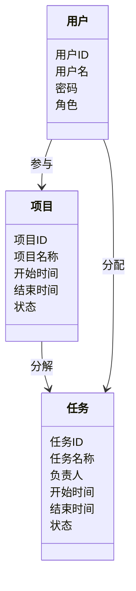
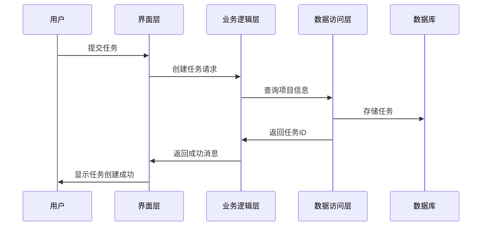

                 


# 团队组建与项目管理

> 关键词：团队组建、项目管理、项目计划、关键路径法、成本控制、风险管理

> 摘要：本文探讨了团队组建与项目管理的核心概念，详细分析了团队角色与项目管理的关系，介绍了项目管理的算法原理，包括关键路径法和成本控制，并通过实际案例展示了系统的架构设计和项目实施。通过这些内容，读者可以掌握团队组建与项目管理的关键技能，提升项目执行效率。

---

## 第一部分: 团队组建与项目管理背景介绍

### 第1章: 团队组建与项目管理概述

#### 1.1 团队组建的背景与重要性
##### 1.1.1 团队在现代工作中的核心地位
现代工作中，团队合作已成为不可或缺的模式。团队通过协作完成复杂任务，提高效率和创造力。团队成员的多样性带来了不同的视角和技能，使团队能够应对各种挑战。

##### 1.1.2 团队组建的必要性与优势
团队组建的必要性在于，个体能力有限，团队可以整合资源，优势互补。团队的优势包括创新能力强、抗风险能力高、任务执行效率高等。

##### 1.1.3 团队在企业中的角色与价值
团队是企业完成项目的核心力量。优秀的团队能够推动企业战略目标的实现，提升企业的竞争力和市场响应速度。

#### 1.2 项目管理的基本概念
##### 1.2.1 项目管理的定义与范围
项目管理是通过计划、执行、监控和收尾等过程，确保项目按时、按质、按预算完成的管理方法。其范围涵盖项目全生命周期。

##### 1.2.2 项目管理的核心要素
项目管理的核心要素包括：目标、时间、成本、质量、范围、资源和风险。这些要素相互关联，共同影响项目的成功。

##### 1.2.3 项目管理与日常工作的区别
项目管理注重目标导向和时间限制，而日常运营注重持续性和效率。项目管理强调创新和变革，而日常运营强调稳定性和效率。

#### 1.3 本章小结
##### 1.3.1 团队与项目管理的关系
团队是项目执行的基础，项目管理为团队提供方向和框架。两者相辅相成，共同确保项目成功。

##### 1.3.2 初步理解项目管理的关键点
项目管理涉及多方面的协调与控制，团队角色和协作方式直接影响项目成果。

---

## 第二部分: 团队组建的核心概念与联系

### 第2章: 团队组建的核心要素

#### 2.1 团队角色与职责分配
##### 2.1.1 团队角色的分类
团队角色通常分为领导者、协调者、执行者、监督者和创新者。每个角色都有其独特的作用和职责。

##### 2.1.2 不同角色的职责与权限
领导者负责制定战略和决策，协调者负责沟通和资源分配，执行者负责具体任务，监督者负责质量控制，创新者负责提出新想法。

##### 2.1.3 角色间的关系与协作
角色间应相互支持，信息共享，确保任务顺利进行。良好的协作关系是项目成功的关键。

#### 2.2 团队组建的流程与方法
##### 2.2.1 团队组建的基本流程
招募、筛选、评估、培训和建立文化是团队组建的关键步骤。每个步骤都需要精心设计和执行。

##### 2.2.2 人员筛选与能力评估
通过面试、测试和能力评估，选择最适合团队成员。评估包括技术能力、团队合作和问题解决能力。

##### 2.2.3 团队文化的建立
建立信任、尊重和目标导向的文化，增强团队凝聚力和协作能力。

#### 2.3 团队绩效评估与优化
##### 2.3.1 团队绩效的评估指标
包括任务完成度、团队协作、创新能力和成员满意度。这些指标帮助评估团队的整体表现。

##### 2.3.2 绩效反馈与改进措施
定期评估并反馈绩效，根据问题调整团队结构和管理方法，优化团队表现。

##### 2.3.3 团队优化的长期策略
持续培训、优化沟通机制和激励措施是长期优化团队绩效的关键。

### 第3章: 团队与项目管理的核心联系

#### 3.1 团队在项目管理中的角色
##### 3.1.1 团队作为项目执行的核心
团队是项目执行的基础，成员的协作直接影响项目进度和质量。

##### 3.1.2 团队协作对项目成功的影响
良好的协作能提高效率，减少冲突，确保项目按时完成。有效的沟通和明确的职责分配是关键。

##### 3.1.3 团队文化与项目管理风格的关系
积极向上的团队文化促进创新和高效执行，而消极的文化可能导致项目失败。

#### 3.2 项目管理中的团队动态
##### 3.2.1 团队发展阶段与管理策略
团队通常经历形成、震荡、规范和成熟阶段。不同阶段需要不同的管理策略。

##### 3.2.2 团队冲突的处理方法
通过沟通、妥协和寻求共同目标，有效处理冲突，避免影响项目进度。

##### 3.2.3 团队激励与绩效提升
激励措施如奖励、晋升和培训能提高团队积极性，促进绩效提升。

#### 3.3 核心概念原理对比
##### 3.3.1 团队角色与项目目标的关系
明确角色和职责有助于目标分解和任务分配，确保项目顺利进行。

##### 3.3.2 项目管理流程与团队协作的关系
流程为协作提供框架，协作使流程有效执行，两者相辅相成。

##### 3.3.3 团队绩效与项目成果的关联
团队绩效直接影响项目成果，高绩效团队能更好地完成项目目标。

---

## 第三部分: 项目管理的算法原理与数学模型

### 第4章: 项目管理的算法原理

#### 4.1 项目进度计划的算法
##### 4.1.1 关键路径法（CPM）
关键路径法通过网络图确定项目的关键路径，计算项目总工期。关键路径是决定项目完成时间的最长路径。

##### 4.1.2 项目进度计算的数学模型
$$ 关键路径长度 = \sum_{i=1}^{n} \text{活动时间} $$
$$ 时间偏差 = \text{实际时间} - \text{计划时间} $$

##### 4.1.3 网络图绘制与时间计算
使用Mermaid绘制网络图，计算每个活动的最早和最迟开始时间，识别关键路径。

#### 4.2 项目成本控制的算法
##### 4.2.1 成本估算与预算制定
通过历史数据和专家意见估算成本，制定预算。

##### 4.2.2 成本偏差分析方法
$$ \text{成本偏差} = \text{实际成本} - \text{计划成本} $$
$$ \text{进度偏差} = \text{实际进度} - \text{计划进度} $$

##### 4.2.3 成本优化策略
通过资源优化和分包降低成本，定期监控成本偏差，调整预算。

#### 4.3 项目风险管理的算法
##### 4.3.1 风险识别与评估
使用头脑风暴法和风险评估矩阵识别和评估风险，确定优先级。

##### 4.3.2 风险概率与影响矩阵
$$ \text{风险值} = \text{概率} \times \text{影响} $$

##### 4.3.3 风险应对策略
制定应急预案，分配资源，调整计划以应对高优先级风险。

### 第5章: 数学模型与公式

#### 5.1 关键路径法的数学模型
##### 5.1.1 关键路径计算公式
$$ 关键路径长度 = \sum_{i=1}^{n} \text{活动时间} $$

##### 5.1.2 时间偏差计算公式
$$ 时间偏差 = \text{实际时间} - \text{计划时间} $$

#### 5.2 成本控制的数学模型
##### 5.2.1 成本估算公式
$$ \text{总成本} = \sum_{i=1}^{n} (\text{单位成本} \times \text{数量}) $$

##### 5.2.2 进度偏差分析
$$ \text{进度偏差} = \text{实际进度} - \text{计划进度} $$

#### 5.3 风险管理的数学模型
##### 5.3.1 风险值计算公式
$$ \text{风险值} = \text{概率} \times \text{影响} $$

---

## 第四部分: 系统分析与架构设计方案

### 第6章: 系统分析与架构设计

#### 6.1 问题场景介绍
项目管理软件用于帮助团队协作和项目跟踪，解决传统管理中的低效和混乱问题。

#### 6.2 系统功能设计
##### 6.2.1 领域模型mermaid类图


#### 6.3 系统架构设计
##### 6.3.1 系统架构mermaid架构图
```mermaid
archi
    界面层 --> 业务逻辑层
    业务逻辑层 --> 数据访问层
    数据访问层 --> 数据库
```

#### 6.4 系统接口设计
##### 6.4.1 系统接口设计
定义RESTful API，如`POST /projects`创建项目，`GET /tasks`获取任务列表。

#### 6.5 系统交互设计
##### 6.5.1 系统交互mermaid序列图


---

## 第五部分: 项目实战

### 第7章: 项目实战

#### 7.1 环境安装
安装必要的工具如Git、Python和Django框架，搭建开发环境。

#### 7.2 核心代码实现
##### 7.2.1 项目管理系统的实现
```python
# models.py
from django.db import models

class Project(models.Model):
    name = models.CharField(max_length=100)
    start_date = models.DateTimeField()
    end_date = models.DateTimeField()
    status = models.CharField(max_length=20)

class Task(models.Model):
    name = models.CharField(max_length=100)
    project = models.ForeignKey(Project, on_delete=models.CASCADE)
    assigned_to = models.CharField(max_length=100)
    start_date = models.DateTimeField()
    end_date = models.DateTimeField()
    status = models.CharField(max_length=20)
```

##### 7.2.2 任务分配逻辑
```python
# views.py
from django.shortcuts import render, redirect
from .models import Project, Task

def assign_task(request):
    if request.method == 'POST':
        project_id = request.POST.get('project_id')
        task_name = request.POST.get('task_name')
        assigned_to = request.POST.get('assigned_to')
        Task.objects.create(
            project_id=project_id,
            name=task_name,
            assigned_to=assigned_to,
            start_date=request.POST.get('start_date'),
            end_date=request.POST.get('end_date'),
            status='未完成'
        )
        return redirect('task_list')
    return render(request, 'assign_task.html')
```

#### 7.3 代码应用解读与分析
##### 7.3.1 代码实现
使用Django框架搭建项目管理系统，实现项目创建、任务分配和进度跟踪功能。

##### 7.3.2 代码优化
优化查询和性能，确保系统高效运行。例如，使用ORM减少SQL查询数量。

#### 7.4 实际案例分析
##### 7.4.1 案例分析
以软件开发项目为例，展示如何使用项目管理系统进行任务分配和进度跟踪。

##### 7.4.2 详细讲解
从需求分析到系统设计，再到实施和测试，详细说明每个步骤的具体操作。

#### 7.5 项目小结
##### 7.5.1 项目实施的关键点
明确需求、合理设计系统架构、确保代码质量和做好测试。

##### 7.5.2 项目实施的经验总结
沟通的重要性，需求变更的处理，以及测试的必要性。

---

## 第六部分: 最佳实践与小结

### 第8章: 最佳实践与小结

#### 8.1 最佳实践 tips
##### 8.1.1 有效的沟通与协作
定期召开会议，明确任务分配，确保信息畅通。

##### 8.1.2 冲突的处理与团队建设
及时处理冲突，增强团队凝聚力，提升团队整体绩效。

##### 8.1.3 定期评估与优化
定期评估项目进展和团队绩效，及时调整管理策略。

#### 8.2 小结
##### 8.2.1 团队组建与项目管理的核心要素
团队角色、职责分配、文化建立和绩效评估是团队组建的关键。项目管理的算法原理和系统架构设计是项目成功的基础。

##### 8.2.2 实战经验与总结
通过实际案例，我们学会了如何将理论应用于实践，提升了项目管理的技能和经验。

#### 8.3 注意事项
##### 8.3.1 团队管理中的常见问题
角色混淆、沟通不畅和任务优先级不明确是常见问题，需提前预防和解决。

##### 8.3.2 项目管理中的风险控制
定期评估风险，制定应急预案，降低项目失败的可能性。

#### 8.4 拓展阅读
##### 8.4.1 推荐书籍
1. 《敏捷宣言》
2. 《项目管理知识体系指南（PMBOK）》
3. 《高效能团队的协作法则》

##### 8.4.2 推荐在线课程
1. Coursera上的《项目管理专项课程》
2. Udemy上的《敏捷开发实战》

---

## 结语

团队组建与项目管理是实现项目成功的关键因素。通过合理的团队角色分配、有效的项目管理方法和系统的架构设计，可以显著提升项目执行效率。希望本文能为读者提供有价值的见解和实用的指导，帮助他们在实际工作中取得更好的成果。

---

## 作者

作者：AI天才研究院/AI Genius Institute & 禅与计算机程序设计艺术/Zen And The Art of Computer Programming

