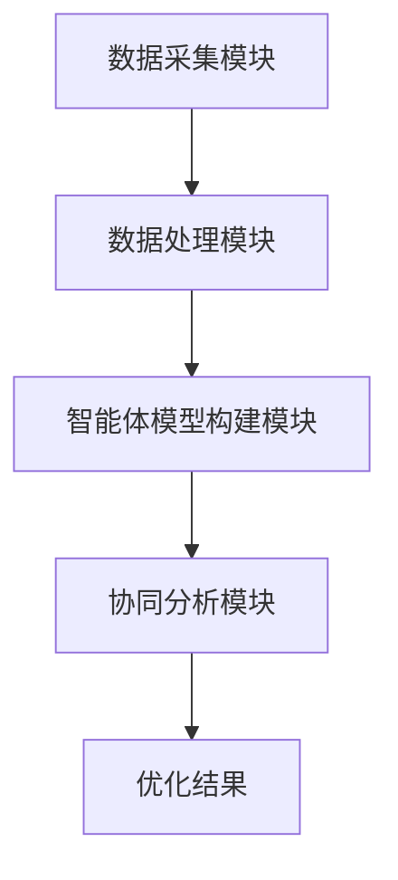
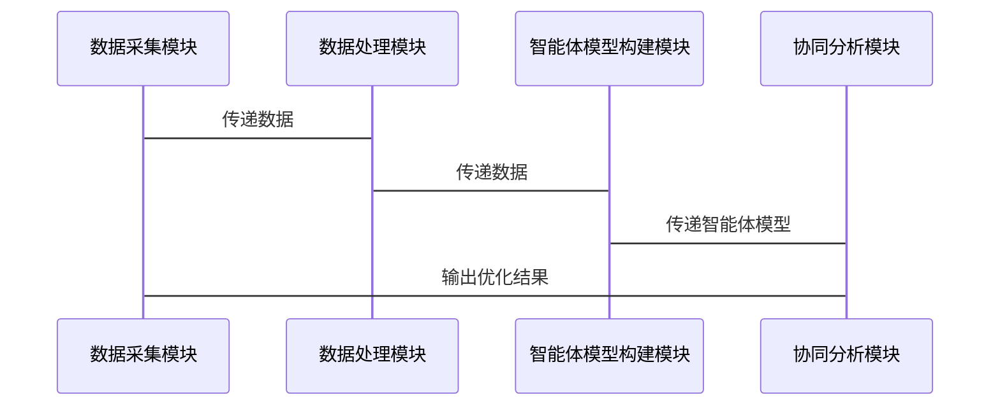

                 


# 多智能体协同分析全球价值链机会

## 关键词：多智能体协同，全球价值链，分布式系统，人工智能，博弈论，经济分析

## 摘要：  
多智能体协同分析全球价值链机会是一种新兴的研究方向，旨在通过多智能体系统的协同工作，优化全球价值链的资源配置和效率。本文从多智能体协同的基本概念出发，分析其在全球价值链中的应用，探讨多智能体协同算法的设计与实现，并通过实际案例展示其在经济分析中的潜力。通过本文的分析，读者可以深入了解多智能体协同在全球价值链中的重要作用，并掌握相关技术的应用方法。

---

# 第1章: 多智能体协同与全球价值链引论

## 1.1 多智能体协同的基本概念

### 1.1.1 多智能体系统的定义  
多智能体系统（Multi-Agent System, MAS）是由多个智能体组成的分布式系统，这些智能体能够通过自主决策和协同工作完成复杂的任务。多智能体系统的核心在于智能体之间的协作与通信，以及对复杂问题的分布式求解。

### 1.1.2 多智能体系统的特征  
- **自主性**：智能体能够自主决策，无需外部干预。  
- **反应性**：智能体能够感知环境并实时调整行为。  
- **协作性**：智能体之间通过通信和协作完成共同目标。  
- **分布式性**：智能体分布在不同的物理或逻辑位置，协同工作。

### 1.1.3 多智能体与单智能体的区别  
- **决策过程**：单智能体由中心化决策，多智能体去中心化决策。  
- **资源分配**：单智能体依赖中心节点，多智能体分布式资源分配。  
- **灵活性**：多智能体系统更具灵活性和容错性，单智能体系统则相对 rigid。

### 1.1.4 多智能体系统的分类  
- **基于任务的多智能体系统**：智能体协作完成特定任务。  
- **基于市场的多智能体系统**：智能体通过市场机制进行资源分配。  
- **基于网络的多智能体系统**：智能体通过网络进行通信和协作。

## 1.2 全球价值链的基本概念

### 1.2.1 全球价值链的定义  
全球价值链（Global Value Chain, GVC）是指在全球范围内，不同国家和企业通过分工与协作，共同完成产品从设计、生产到销售的全过程。全球价值链的核心在于资源的优化配置和利益最大化。

### 1.2.2 全球价值链的结构与特点  
- **分工与协作**：不同企业专注于价值链的不同环节，如设计、生产、物流等。  
- **全球化与本地化**：全球价值链跨越国界，但每个环节可能本地化。  
- **动态性**：全球价值链随着市场需求和技术进步不断调整。

### 1.2.3 全球价值链的核心要素  
- **资源分配**：企业在全球范围内分配资源，如劳动力、技术、资本等。  
- **协同合作**：企业通过协作实现价值链的高效运转。  
- **风险分担**：全球价值链涉及多个环节和参与者，风险分担是关键。

## 1.3 多智能体协同与全球价值链的结合

### 1.3.1 多智能体协同在经济活动中的应用  
- **供应链管理**：多智能体协同优化供应链的各个环节。  
- **资源分配**：通过多智能体协同实现资源的最优配置。  
- **风险管理**：多智能体协同降低全球价值链中的风险。

### 1.3.2 全球价值链中的协同问题  
- **信息不对称**：不同企业之间的信息不透明，影响协同效率。  
- **利益冲突**：不同企业可能有不同的利益目标，导致协同困难。  
- **协调复杂性**：全球价值链涉及多个环节和参与者，协调复杂。

### 1.3.3 多智能体协同对全球价值链的优化作用  
- **提高效率**：多智能体协同能够快速响应市场需求，优化资源配置。  
- **降低成本**：通过协作减少重复劳动和资源浪费。  
- **增强灵活性**：多智能体协同能够快速适应市场变化。

## 1.4 本章小结  
本章介绍了多智能体协同的基本概念、全球价值链的核心要素，以及多智能体协同在优化全球价值链中的作用。通过分析，我们了解到多智能体协同能够有效解决全球价值链中的协同问题，提高效率和降低成本。

---

# 第2章: 多智能体协同的理论基础

## 2.1 多智能体系统的基本理论

### 2.1.1 多智能体系统的分类  
- **基于任务的多智能体系统**：智能体协作完成特定任务。  
- **基于市场的多智能体系统**：智能体通过市场机制进行资源分配。  
- **基于网络的多智能体系统**：智能体通过网络进行通信和协作。

### 2.1.2 多智能体系统的通信机制  
- **直接通信**：智能体之间直接交换信息。  
- **间接通信**：通过中间媒介进行信息传递。  
- **发布-订阅模型**：智能体发布信息，其他智能体订阅并接收信息。

### 2.1.3 多智能体系统的协作协议  
- **协商协议**：智能体通过协商达成一致。  
- **拍卖协议**：通过拍卖机制分配资源。  
- **承诺协议**：智能体承诺完成特定任务。

## 2.2 全球价值链的分析框架

### 2.2.1 全球价值链的网络结构  
- **节点与边**：全球价值链中的企业为节点，企业之间的关系为边。  
- **中心性**：分析节点在网络中的中心性，判断其在价值链中的地位。  
- **社区检测**：通过社区检测发现价值链中的产业集群。

### 2.2.2 全球价值链的节点关系  
- **供应商关系**：供应商与制造商之间的关系。  
- **客户关系**：制造商与零售商之间的关系。  
- **合作伙伴关系**：企业之间的战略合作关系。

### 2.2.3 全球价值链的动态演化  
- **技术进步**：技术进步推动价值链的升级。  
- **市场需求变化**：市场需求变化影响价值链的调整。  
- **政策变化**：政策变化影响价值链的布局。

## 2.3 多智能体协同与全球价值链的关系

### 2.3.1 多智能体协同对全球价值链的影响  
- **优化资源配置**：通过多智能体协同实现资源的最优配置。  
- **提高效率**：多智能体协同能够快速响应市场需求，提高效率。  
- **降低成本**：通过协作减少重复劳动和资源浪费。

### 2.3.2 全球价值链对多智能体协同的反作用  
- **复杂性**：全球价值链涉及多个环节和参与者，增加协同复杂性。  
- **动态性**：全球价值链的动态变化要求多智能体系统具备更强的适应性。  
- **信息不对称**：全球价值链中的信息不对称影响多智能体协同的效果。

### 2.3.3 多智能体协同在全球价值链中的应用案例  
- **供应链管理**：多智能体协同优化供应链的各个环节。  
- **资源分配**：通过多智能体协同实现资源的最优配置。  
- **风险管理**：多智能体协同降低全球价值链中的风险。

## 2.4 本章小结  
本章详细讲解了多智能体协同的理论基础，包括多智能体系统的分类、通信机制和协作协议。同时，分析了全球价值链的网络结构和动态演化，探讨了多智能体协同与全球价值链的关系。

---

# 第3章: 多智能体协同分析全球价值链的框架

## 3.1 分析框架的构建

### 3.1.1 分析框架的设计原则  
- **系统性**：分析框架应涵盖全球价值链的各个环节。  
- **动态性**：分析框架应能够适应全球价值链的动态变化。  
- **可操作性**：分析框架应具备可操作性，便于实际应用。

### 3.1.2 分析框架的组成部分  
- **数据采集与处理**：采集全球价值链中的数据，并进行清洗和预处理。  
- **智能体模型构建**：根据数据构建智能体模型，模拟全球价值链中的企业行为。  
- **协同分析**：通过多智能体协同分析，优化全球价值链的资源配置和效率。

## 3.2 数据采集与处理

### 3.2.1 数据来源与采集方法  
- **公开数据**：利用公开的经济数据和行业报告。  
- **企业数据**：采集企业的生产、销售和成本数据。  
- **网络数据**：通过网络爬取相关的行业信息。

### 3.2.2 数据清洗与预处理  
- **去重**：去除重复数据。  
- **填补缺失值**：利用插值法填补缺失值。  
- **标准化**：对数据进行标准化处理。

### 3.2.3 数据存储与管理  
- **数据库**：使用关系型数据库存储数据。  
- **数据仓库**：构建数据仓库，支持多维度分析。  
- **数据可视化**：通过数据可视化工具展示数据。

## 3.3 智能体模型的构建

### 3.3.1 智能体的属性与行为  
- **属性**：企业的生产能力、成本、市场份额等。  
- **行为**：企业的生产决策、定价策略等。

### 3.3.2 智能体之间的交互关系  
- **竞争关系**：企业之间的竞争关系。  
- **合作关系**：企业之间的合作关系。  
- **信息共享**：企业之间的信息共享。

### 3.3.3 智能体的协同机制  
- **协商机制**：智能体通过协商达成一致。  
- **拍卖机制**：通过拍卖机制分配资源。  
- **承诺机制**：智能体承诺完成特定任务。

## 3.4 本章小结  
本章构建了多智能体协同分析全球价值链的框架，包括数据采集与处理、智能体模型构建和协同分析。通过分析框架，我们可以系统地优化全球价值链的资源配置和效率。

---

# 第4章: 多智能体协同算法的设计与实现

## 4.1 分布式计算与多智能体协同

### 4.1.1 分布式计算的基本概念  
- **分布式系统**：由多个计算节点组成的系统，节点之间通过通信进行协作。  
- **分布式计算**：将计算任务分配到多个节点上，协同完成任务。

### 4.1.2 分布式计算与多智能体协同的关系  
- **任务分解**：分布式计算将任务分解到多个智能体，多智能体协同完成任务。  
- **资源分配**：通过分布式计算实现资源的最优分配。  
- **通信机制**：分布式计算提供智能体之间的通信机制。

### 4.1.3 分布式计算的实现步骤  
1. **任务分解**：将问题分解为多个子任务，分配到不同的智能体。  
2. **通信协议设计**：设计智能体之间的通信协议，确保信息高效传递。  
3. **协同算法设计**：设计协同算法，确保智能体协同工作。  
4. **实现与测试**：实现算法并进行测试，优化性能。

## 4.2 博弈论模型与多智能体协同

### 4.2.1 博弈论的基本概念  
- **博弈**：多个参与者在一定规则下进行决策的过程。  
- **纳什均衡**：博弈中的一种稳定状态，没有任何参与者能够通过单方面改变策略而提高收益。

### 4.2.2 博弈论模型与多智能体协同的关系  
- **竞争与合作**：博弈论模型可以描述智能体之间的竞争与合作关系。  
- **决策优化**：通过博弈论模型优化智能体的决策。  
- **纳什均衡**：通过纳什均衡分析智能体的最优策略。

### 4.2.3 博弈论模型的实现步骤  
1. **博弈建模**：构建博弈模型，明确参与者的策略和收益。  
2. **纳什均衡分析**：分析纳什均衡，确定智能体的最优策略。  
3. **协同优化**：通过博弈论模型优化智能体的协同策略。

## 4.3 多智能体协同算法的实现

### 4.3.1 算法设计  
1. **初始化**：设置智能体的初始状态。  
2. **信息共享**：智能体之间共享信息。  
3. **决策制定**：智能体根据共享信息制定决策。  
4. **协同优化**：通过协同优化算法，优化智能体的决策。

### 4.3.2 算法实现  
1. **任务分解**：将问题分解为多个子任务，分配到不同的智能体。  
2. **通信机制**：设计智能体之间的通信机制，确保信息高效传递。  
3. **协同算法**：实现协同算法，确保智能体协同工作。  
4. **实现与测试**：实现算法并进行测试，优化性能。

## 4.4 本章小结  
本章详细讲解了多智能体协同算法的设计与实现，包括分布式计算和博弈论模型。通过这些算法，我们可以优化全球价值链的资源配置和效率。

---

# 第5章: 多智能体协同系统的架构设计

## 5.1 系统功能设计

### 5.1.1 系统目标  
- **优化资源配置**：通过多智能体协同优化全球价值链的资源配置。  
- **提高效率**：通过多智能体协同提高全球价值链的效率。  
- **降低风险**：通过多智能体协同降低全球价值链中的风险。

### 5.1.2 系统功能模块  
- **数据采集模块**：采集全球价值链中的数据。  
- **数据处理模块**：对数据进行清洗和预处理。  
- **智能体模型构建模块**：根据数据构建智能体模型。  
- **协同分析模块**：通过多智能体协同分析优化资源配置。

## 5.2 系统架构设计

### 5.2.1 系统架构图  


### 5.2.2 模块之间的交互  
- **数据采集模块**：采集数据并传递给数据处理模块。  
- **数据处理模块**：处理数据并传递给智能体模型构建模块。  
- **智能体模型构建模块**：构建智能体模型并传递给协同分析模块。  
- **协同分析模块**：通过多智能体协同分析，输出优化结果。

## 5.3 系统接口设计

### 5.3.1 数据接口  
- **输入接口**：接收数据采集模块传递的数据。  
- **输出接口**：输出数据处理模块处理后的数据。

### 5.3.2 智能体接口  
- **通信接口**：智能体之间的通信接口。  
- **协作接口**：智能体之间的协作接口。

## 5.4 系统交互设计

### 5.4.1 交互流程图  


## 5.5 本章小结  
本章详细讲解了多智能体协同系统的架构设计，包括系统功能设计、系统架构设计、系统接口设计和系统交互设计。

---

# 第6章: 多智能体协同分析全球价值链的项目实战

## 6.1 项目背景与目标

### 6.1.1 项目背景  
- **全球价值链优化**：通过多智能体协同优化全球价值链的资源配置和效率。  
- **降低成本**：通过多智能体协同降低全球价值链中的成本。

### 6.1.2 项目目标  
- **优化资源配置**：通过多智能体协同优化全球价值链的资源配置。  
- **提高效率**：通过多智能体协同提高全球价值链的效率。  
- **降低风险**：通过多智能体协同降低全球价值链中的风险。

## 6.2 项目实施步骤

### 6.2.1 环境安装  
1. **安装Python**：安装Python编程语言。  
2. **安装依赖库**：安装numpy、pandas、networkx等依赖库。  
3. **安装开发工具**：安装PyCharm等开发工具。

### 6.2.2 核心代码实现  
```python
import numpy as np
import pandas as pd
import networkx as nx

# 数据采集模块
def data采集():
    # 从CSV文件中读取数据
    data = pd.read_csv('global_value_chain.csv')
    return data

# 数据处理模块
def 数据处理(data):
    # 去除重复数据
    data.drop_duplicates(inplace=True)
    # 填补缺失值
    data.fillna(method='ffill', inplace=True)
    return data

# 智能体模型构建模块
def 智能体建模(data):
    # 构建网络图
    G = nx.Graph()
    for node in data['节点']:
        G.add_node(node)
    for edge in data['边']:
        G.add_edge(edge[0], edge[1])
    return G

# 协同分析模块
def 协同分析(G):
    # 计算节点的中心性
    center = nx.degree_centrality(G)
    return center

# 主程序
def main():
    data = data_采集()
    data_处理 = 数据处理(data)
    G = 智能体建模(data_处理)
    center = 协同分析(G)
    print(center)

if __name__ == '__main__':
    main()
```

### 6.2.3 代码解读与分析  
- **数据采集模块**：从CSV文件中读取数据。  
- **数据处理模块**：去除重复数据，填补缺失值。  
- **智能体模型构建模块**：构建网络图，表示全球价值链中的节点和边。  
- **协同分析模块**：计算节点的中心性，分析智能体的协同效果。

## 6.3 实际案例分析

### 6.3.1 案例背景  
- **行业选择**：选择电子行业作为案例。  
- **数据来源**：使用公开的电子行业数据。

### 6.3.2 案例分析  
- **数据采集与处理**：采集电子行业的数据，并进行清洗和预处理。  
- **智能体模型构建**：构建电子行业的网络图，分析企业的协同关系。  
- **协同分析**：通过协同分析模块，优化电子行业的资源配置。

## 6.4 本章小结  
本章通过实际案例分析，展示了多智能体协同分析全球价值链的应用。通过代码实现，我们可以系统地优化全球价值链的资源配置和效率。

---

# 第7章: 总结与展望

## 7.1 本章总结  
- **多智能体协同的基本概念**：介绍了多智能体协同的基本概念和理论基础。  
- **全球价值链的分析框架**：构建了多智能体协同分析全球价值链的框架。  
- **算法设计与实现**：详细讲解了多智能体协同算法的设计与实现。  
- **系统架构设计**：设计了多智能体协同系统的架构。  
- **项目实战**：通过实际案例分析，展示了多智能体协同分析全球价值链的应用。

## 7.2 本章展望  
- **算法优化**：进一步优化多智能体协同算法，提高效率和准确性。  
- **系统扩展**：扩展系统的功能，增加更多的模块和功能。  
- **实际应用**：将多智能体协同分析全球价值链的技术应用于更多的行业和场景。

## 7.3 注意事项  
- **数据隐私**：在实际应用中，需要注意数据隐私和安全。  
- **算法选择**：根据具体场景选择合适的算法，避免盲目使用。  
- **系统维护**：定期维护系统，确保系统的稳定性和可靠性。

## 7.4 扩展阅读  
- **推荐书籍**：《多智能体系统》、《博弈论与经济行为》。  
- **推荐论文**：《多智能体协同的理论与应用》、《全球价值链的优化与管理》。

---

# 作者：AI天才研究院/AI Genius Institute & 禅与计算机程序设计艺术 /Zen And The Art of Computer Programming

---

希望这篇文章能够为您提供清晰的思路和详细的指导，帮助您理解多智能体协同分析全球价值链的机会和潜力。如果需要进一步的探讨或具体实现细节，欢迎随时联系！

