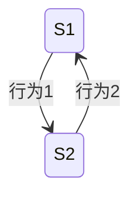
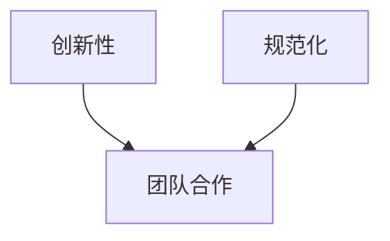

                 


# 多智能体系统在公司文化匹配度分析中的应用：并购价值评估

---

## 关键词：多智能体系统、公司文化匹配度、并购价值评估、人工智能、文化分析、分布式决策

---

## 摘要

在企业并购过程中，公司文化匹配度是决定并购成功与否的重要因素之一。传统的文化匹配度分析方法通常依赖于人工判断，存在主观性强、效率低下等问题。本文提出了一种基于多智能体系统的方法，通过分布式协作和智能体之间的通信与协作，实现对公司文化匹配度的量化分析。该方法能够动态评估文化匹配度，并将其融入并购价值评估体系中，为决策者提供科学依据。本文详细探讨了多智能体系统的原理、文化匹配度的分析模型以及在并购价值评估中的应用，展示了其在提高并购成功率中的潜在价值。

---

# 第一部分：多智能体系统与公司文化匹配度分析概述

## 第1章：多智能体系统与公司文化匹配度分析概述

### 1.1 多智能体系统的基本概念

#### 1.1.1 多智能体系统的定义

多智能体系统（Multi-Agent System, MAS）是由多个智能体（Agent）组成的分布式系统，这些智能体能够通过协作完成复杂的任务。每个智能体都有一定的自主性，能够感知环境、做出决策并采取行动。多智能体系统的特点包括分布式性、协作性、反应性和动态性。

#### 1.1.2 多智能体系统的特征

| 特征 | 描述 |
|------|------|
| 分布式 | 智能体独立运行，分布在不同的空间或时间维度上 |
| 协作性 | 智能体之间通过通信和协作完成共同目标 |
| 反应性 | 智能体能够感知环境变化并做出实时响应 |
| 动态性 | 系统状态和智能体行为可能随时变化 |

#### 1.1.3 多智能体系统与传统单智能体系统的区别

- **单智能体系统**：集中式决策，单点故障风险高，适用于任务简单、环境稳定的场景。
- **多智能体系统**：分布式决策，容错性高，适用于任务复杂、环境动态变化的场景。

### 1.2 公司文化匹配度分析的重要性

#### 1.2.1 并购中的文化冲突问题

公司文化是企业在长期经营中形成的独特价值观、行为规范和思维方式。并购后的企业文化冲突可能导致员工士气低落、工作效率下降，甚至影响企业的长期发展。例如，一家注重创新的文化与一家注重流程规范的文化在合并后可能产生严重的冲突。

#### 1.2.2 文化匹配度对并购成功的影响

文化匹配度高意味着两家公司在价值观、管理风格和员工文化适应性方面具有较高的相似性，这有助于并购后的整合和协同效应的发挥。研究表明，文化匹配度高的并购项目成功率显著高于文化匹配度低的项目。

#### 1.2.3 公司文化分析的挑战与机遇

- **挑战**：公司文化具有主观性和模糊性，难以量化；不同行业和不同规模的企业文化差异较大，分析难度高。
- **机遇**：通过多智能体系统，可以将文化维度转化为可量化的指标，实现客观、动态的文化匹配度分析。

### 1.3 多智能体系统在文化匹配度分析中的应用前景

#### 1.3.1 多智能体系统的优势

- **分布式协作**：多智能体系统能够将文化匹配度分析任务分解为多个子任务，通过智能体之间的协作完成。
- **动态适应性**：智能体能够实时感知环境变化，动态调整分析策略。
- **高容错性**：即使部分智能体出现故障，其他智能体仍能继续完成任务。

#### 1.3.2 多智能体系统在文化匹配度分析中的潜在应用场景

- **企业并购前的评估**：通过多智能体系统分析目标企业的文化匹配度，评估并购风险。
- **企业文化优化**：通过文化匹配度分析，帮助企业识别文化短板，进行针对性优化。
- **跨文化管理**：在跨国并购中，多智能体系统可以帮助企业跨越文化障碍，实现全球化管理。

#### 1.3.3 多智能体系统在并购价值评估中的价值

通过量化文化匹配度，多智能体系统能够将文化因素纳入并购价值评估体系，帮助投资者更全面地评估并购项目的潜在价值和风险。

---

## 第2章：多智能体系统的原理与架构

### 2.1 多智能体系统的组成结构

#### 2.1.1 实体与行为

智能体通过感知环境、决策和行动来完成任务。例如，在文化匹配度分析中，每个智能体可能负责分析一个文化维度（如创新性、规范化）并输出评估结果。

#### 2.1.2 通信与协作

智能体之间通过通信机制交换信息，例如：
- **信息交换格式**：使用JSON或XML格式进行数据传递。
- **通信协议**：采用HTTP或WebSocket协议实现智能体之间的实时通信。

#### 2.1.3 分布式决策

每个智能体基于自身的信息和全局信息做出决策，例如：
- **局部决策**：智能体基于自身数据做出初步判断。
- **全局决策**：通过通信和协作，智能体综合所有信息做出最终决策。

### 2.2 多智能体系统的通信机制

#### 2.2.1 通信协议

通信协议定义了智能体之间信息交换的规则，例如：
- **请求-响应模型**：智能体A向智能体B发送请求，智能体B返回响应。
- **发布-订阅模型**：智能体发布事件，其他智能体订阅并接收事件。

#### 2.2.2 信息交换格式

信息交换格式需要统一，例如使用JSON格式：
```json
{
  "sender": "agent1",
  "receiver": "agent2",
  "message": {
    "culture_dimension": "innovation",
    "score": 0.8
  }
}
```

#### 2.2.3 通信网络的构建

通信网络可以通过图结构表示，例如：
- **中心化通信网络**：所有智能体通过一个中心节点进行通信。
- **分布式通信网络**：智能体之间直接通信，无需中心节点。

### 2.3 多智能体系统的协作机制

#### 2.3.1 协作规则

协作规则定义了智能体之间如何协作完成任务，例如：
- **任务分配规则**：根据智能体的能力分配任务。
- **协作优先级**：定义协作任务的优先级，确保关键任务优先完成。

#### 2.3.2 协作协议

协作协议是智能体之间协作的契约，例如：
- **承诺-响应协议**：智能体A承诺完成任务，智能体B在任务完成后给予响应。
- **谈判协议**：智能体之间通过谈判确定协作方式。

#### 2.3.3 协作过程中的冲突解决

冲突解决机制用于处理协作中的冲突，例如：
- **协商机制**：智能体通过协商解决冲突。
- **仲裁机制**：引入仲裁智能体解决无法协商的冲突。

### 2.4 多智能体系统的数学模型

#### 2.4.1 实体行为模型

实体行为模型可以用状态机表示，例如：



#### 2.4.2 系统状态表示

系统状态可以用向量表示，例如：
$$
\text{状态向量} = [\text{维度1}, \text{维度2}, \ldots, \text{维度n}]
$$

#### 2.4.3 系统演化方程

系统演化方程可以表示为：
$$
s(t+1) = f(s(t), a(t))
$$
其中，$s(t)$ 表示系统状态，$a(t)$ 表示智能体的行动。

---

## 第3章：公司文化匹配度分析的多智能体系统模型

### 3.1 公司文化的多维度分析

#### 3.1.1 公司文化的核心维度

公司文化可以从多个维度进行分析，例如：
- **创新性**：企业是否鼓励创新和冒险。
- **规范化**：企业是否注重流程和规范。
- **团队合作**：企业是否强调团队合作。

#### 3.1.2 各维度的量化方法

每个维度可以通过问卷调查、员工访谈等方式进行量化，例如：
- 创新性：采用 Likert量表（1-5分）进行评分。
- 规范化：通过标准化的评估指标进行评分。

#### 3.1.3 维度之间的相互关系

维度之间的相互关系可以用图表示，例如：



### 3.2 多智能体系统在文化匹配度分析中的角色分配

#### 3.2.1 实体的定义与角色分配

每个智能体负责分析一个文化维度，例如：
- 智能体1：负责创新性分析
- 智能体2：负责规范化分析

#### 3.2.2 实体之间的关系

智能体之间的关系可以用协作图表示，例如：

```mermaid
collaboration
    participant 智能体1
    participant 智能体2
    智能体1 --> 智能体2: 交换信息
```

#### 3.2.3 实体行为的定义

智能体的行为可以用活动图表示，例如：

```mermaid
activityDiagram
    node A
    node B
    A --> B: 执行行为
```

### 3.3 多智能体系统的文化匹配度计算模型

#### 3.3.1 匹配度计算公式

文化匹配度可以通过加权平均公式计算：
$$
\text{匹配度} = \sum_{i=1}^{n} w_i \cdot s_i
$$
其中，$w_i$ 是第 $i$ 个维度的权重，$s_i$ 是第 $i$ 个维度的匹配度评分。

#### 3.3.2 匹配度的权重分配

权重分配可以根据经验或数据驱动的方法确定，例如：
- 创新性权重为0.4
- 规范化权重为0.3
- 团队合作权重为0.3

#### 3.3.3 匹配度的动态调整

匹配度的动态调整可以通过反馈机制实现，例如：
$$
w_i(t+1) = w_i(t) + \alpha \cdot (1 - s_i(t))
$$
其中，$\alpha$ 是调整系数。

---

## 第4章：多智能体系统在并购价值评估中的应用

### 4.1 并购价值评估的基本框架

#### 4.1.1 并购价值的定义

并购价值是指并购后企业整体价值的提升，包括协同效应、成本节约等。

#### 4.1.2 并购价值评估的关键因素

- **财务指标**：如净利润、收入增长率等。
- **文化匹配度**：如文化匹配度评分。
- **风险因素**：如行业风险、政策风险等。

#### 4.1.3 文化匹配度对并购价值的影响

文化匹配度高可以降低整合成本，提升协同效应，从而提高并购价值。

### 4.2 多智能体系统在并购价值评估中的具体应用

#### 4.2.1 文化匹配度的动态评估

通过多智能体系统，可以实时更新文化匹配度评分，例如：

```python
def update_culture_match_score():
    for agent in agents:
        agent.update_score()
```

#### 4.2.2 并购风险的预测

并购风险可以通过文化匹配度、行业趋势等多因素进行预测，例如：

$$
\text{风险评分} = \beta \cdot \text{文化匹配度} + (1-\beta) \cdot \text{行业风险}
$$
其中，$\beta$ 是文化匹配度的权重。

#### 4.2.3 并购后的协同效应评估

协同效应可以通过文化匹配度、资源共享等因素进行评估，例如：

$$
\text{协同效应} = \gamma \cdot \text{文化匹配度} + (1-\gamma) \cdot \text{资源共享程度}
$$
其中，$\gamma$ 是文化匹配度的权重。

### 4.3 多智能体系统的评估结果分析

#### 4.3.1 评估结果的解读

评估结果可以通过可视化工具进行展示，例如：
- 文化匹配度评分分布图
- 并购价值预测图

#### 4.3.2 评估结果对并购决策的影响

评估结果可以为并购决策提供科学依据，例如：
- 文化匹配度高的目标企业优先考虑
- 文化匹配度低的目标企业谨慎评估

#### 4.3.3 评估结果的动态调整

评估结果可以根据新的数据动态调整，例如：
- 定期更新文化匹配度评分
- 根据市场变化调整权重

---

## 第5章：系统实现与项目实战

### 5.1 系统实现的总体架构

#### 5.1.1 系统设计

系统架构设计可以用架构图表示，例如：


#### 5.1.2 系统模块划分

系统模块包括：
- 数据采集模块：负责采集企业文化的各项数据。
- 文化分析模块：负责对文化数据进行分析和评分。
- 价值评估模块：负责根据文化匹配度和其他因素评估并购价值。

### 5.2 项目实战

#### 5.2.1 环境安装

项目需要安装以下工具和库：
- Python 3.8+
- Flask框架
- Pandas库
- Matplotlib库

#### 5.2.2 系统核心实现

以下是系统核心代码示例：

```python
class Agent:
    def __init__(self, dimension):
        self.dimension = dimension
        self.score = 0.0

    def update_score(self, new_score):
        self.score = new_score

def main():
    # 初始化智能体
    agents = [
        Agent("创新性"),
        Agent("规范化"),
        Agent("团队合作")
    ]
    # 更新文化匹配度评分
    for agent in agents:
        agent.update_score(0.8)

if __name__ == "__main__":
    main()
```

#### 5.2.3 代码解读与分析

上述代码实现了三个智能体，分别负责分析创新性、规范化和团队合作维度。每个智能体都有一个 `update_score` 方法，用于更新文化匹配度评分。

#### 5.2.4 实际案例分析

以一个实际案例为例，假设我们有两家公司A和公司B，分别进行文化匹配度分析：

- 公司A：创新性评分0.8，规范化评分0.7，团队合作评分0.9
- 公司B：创新性评分0.6，规范化评分0.8，团队合作评分0.7

文化匹配度计算公式为：
$$
\text{匹配度} = 0.4 \cdot 0.8 + 0.3 \cdot 0.7 + 0.3 \cdot 0.9 = 0.32 + 0.21 + 0.27 = 0.8
$$

最终匹配度为0.8，属于较高匹配度。

### 5.3 项目小结

#### 5.3.1 项目成果

通过本项目，我们实现了基于多智能体系统的文化匹配度分析，并将其应用于并购价值评估。

#### 5.3.2 系统优势

- **高效率**：通过分布式协作提高分析效率。
- **高精度**：通过多维度分析提高匹配度评估的准确性。
- **动态性**：能够实时更新评估结果，适应市场变化。

#### 5.3.3 项目意义

本项目为企业的并购决策提供了科学依据，帮助企业在并购过程中降低文化冲突风险，提升并购成功率。

---

## 结论

通过本文的探讨，我们展示了多智能体系统在公司文化匹配度分析中的应用潜力。基于多智能体系统的文化匹配度分析方法，能够动态评估文化匹配度，并将其融入并购价值评估体系中。未来的研究可以进一步优化多智能体系统的通信机制和协作算法，提高系统的实时性和准确性。此外，还可以探索多智能体系统在其他领域的应用，如组织管理、社会网络分析等。

---

## 作者：AI天才研究院 & 禅与计算机程序设计艺术

---

