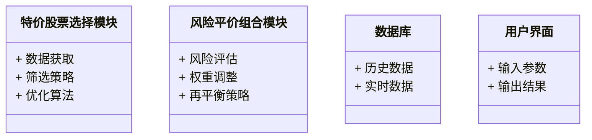
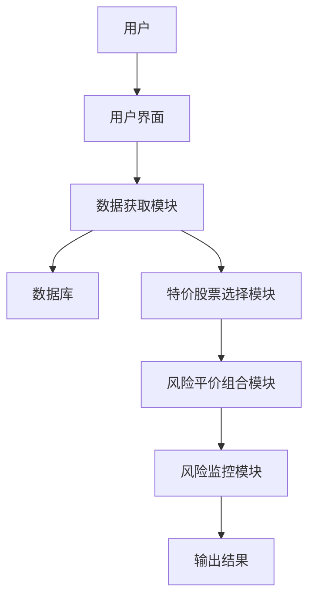
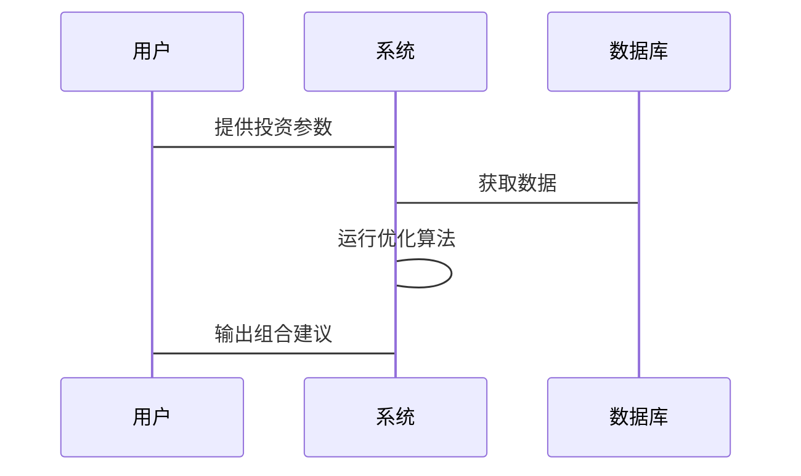

                 


# 如何将特价股票策略融入多元化风险平价组合

> **关键词**: 特价股票, 风险平价, 组合优化, 投资策略, 风险管理  
> **摘要**: 本文详细探讨了如何将特价股票策略与风险平价组合相结合，构建一个多元化、风险可控的投资组合。通过分析特价股票策略的核心原理和风险平价组合的构建方法，结合数学模型和算法优化，本文提出了一种将特价股票融入风险平价组合的有效方法，并通过实际案例验证了其可行性和优势。

---

## 第一部分: 特价股票策略与风险平价组合的背景介绍

### 第1章: 特价股票策略与风险平价组合概述

#### 1.1 特价股票策略的背景与概念
##### 1.1.1 问题背景: 为什么需要特价股票策略
在股票市场中，投资者总在寻找能够带来超额收益的机会。特价股票策略的核心在于利用市场波动，捕捉那些被低估的股票，通过在特定时间以低于其内在价值的价格买入，等待其回归合理价值时卖出。这种策略尤其适用于市场低迷或个股基本面改善的情况下。

##### 1.1.2 问题描述: 特价股票的定义与特点
特价股票是指那些市场价格低于其内在价值的股票。其特点包括：
1. 价格被市场低估；
2. 公司基本面良好，具有较高的安全边际；
3. 短期市场情绪可能导致价格波动。

##### 1.1.3 问题解决: 特价股票策略的核心目标
特价股票策略的目标是通过精选被低估的股票，在控制风险的前提下，实现超额收益。

##### 1.1.4 边界与外延: 特价股票的适用范围与限制
特价股票策略主要适用于以下场景：
- 市场整体估值较低时；
- 特定行业或公司基本面改善时；
- 市场恐慌导致个股价格大幅下跌时。

限制包括：
- 对市场波动敏感；
- 需要较高的选股能力；
- 需要较长的投资周期。

##### 1.1.5 概念结构: 特价股票策略的关键要素
- **价格分析**: 通过估值指标（如PE、PB、PS等）判断股票是否被低估。
- **基本面分析**: 确保股票的内在价值稳定或增长。
- **市场情绪分析**: 判断市场是否处于非理性阶段。

#### 1.2 风险平价组合的背景与概念
##### 1.2.1 风险平价组合的定义
风险平价组合是一种通过调整资产权重，使得组合中每个资产的风险贡献相等的投资组合。与传统资产配置方法不同，风险平价更关注风险的分散，而非单纯的资产权重分配。

##### 1.2.2 风险平价组合的特点
- **风险分散**: 每个资产的风险贡献相等；
- **动态调整**: 根据市场变化定期调整权重；
- **长期稳定**: 适合长期投资，追求稳定收益。

##### 1.2.3 风险平价组合与传统投资组合的区别
| 特性          | 风险平价组合                | 传统投资组合              |
|---------------|-----------------------------|---------------------------|
| 配置目标      | 平衡风险贡献                | 优化收益或风险            |
| 调整频率      | 更高，根据市场变化调整       | 较低，定期调整             |
| 风险管理      | 强调风险分散                | 强调风险承受              |

#### 1.3 特价股票策略与风险平价组合的结合
##### 1.3.1 结合的必要性
- 提高收益潜力；
- 降低整体风险；
- 利用市场波动捕捉机会。

##### 1.3.2 结合的可能性
通过将特价股票作为风险平价组合的一部分，可以实现收益增强和风险分散的双重目标。

##### 1.3.3 结合的潜在优势
- 利用特价股票的高收益潜力；
- 通过风险平价降低市场波动的影响；
- 实现资产配置的多样化。

##### 1.3.4 结合的可能风险
- 特价股票的选择难度较高；
- 市场波动可能导致短期亏损；
- 组合调整的频率和成本增加。

#### 1.4 本章小结
本章介绍了特价股票策略和风险平价组合的基本概念，并分析了两者结合的必要性和潜在优势。通过结合，投资者可以在追求超额收益的同时，降低整体投资组合的风险。

---

### 第2章: 特价股票策略的核心概念与原理

#### 2.1 特价股票策略的核心概念
##### 2.1.1 特价股票的识别方法
- **估值指标法**: 使用PE、PB等指标判断股票是否被低估；
- **相对强度法**: 比较股票与市场或行业指数的表现；
- **技术分析法**: 结合K线图、均线等技术指标判断买入时机。

##### 2.1.2 特价股票的估值方法
- **内在价值法**: 使用DCF模型等方法估算股票的内在价值；
- **相对价值法**: 比较股票与同类股票的估值水平。

##### 2.1.3 特价股票的投资策略
- **价值投资策略**: 长期持有被低估的股票；
- **事件驱动策略**: 抓住特定事件（如资产重组、并购）带来的短期机会；
- **对冲策略**: 结合空头头寸降低市场风险。

#### 2.2 风险平价组合的核心概念
##### 2.2.1 风险平价的定义
风险平价是一种资产配置方法，通过调整资产权重，使得组合中每个资产的风险贡献相等。

##### 2.2.2 风险平价的计算方法
- **风险贡献**: 每个资产对组合风险的贡献程度；
- **目标风险贡献**: 将每个资产的风险贡献调整为相等。

##### 2.2.3 风险平价组合的构建过程
1. 确定可投资的资产类别；
2. 计算每类资产的风险贡献；
3. 调整权重，使每类资产的风险贡献相等；
4. 定期再平衡，保持风险贡献不变。

#### 2.3 特价股票策略与风险平价组合的联系
##### 2.3.1 理论联系
- 风险平价理论为特价股票策略提供了风险管理框架；
- 特价股票策略为风险平价组合提供了收益来源。

##### 2.3.2 实务联系
- 特价股票可以作为风险平价组合中的价值因子；
- 风险平价方法可以优化特价股票的投资组合。

##### 2.3.3 案例分析
假设一个风险平价组合包含股票、债券和黄金三种资产。通过调整权重，使得每种资产的风险贡献相等。其中，股票部分可以选择被低估的特价股票，以提高整体收益。

---

### 第3章: 特价股票策略与风险平价组合的核心概念对比

#### 3.1 特价股票策略与风险平价组合的属性对比
| 特性          | 特价股票策略                | 风险平价组合              |
|---------------|-----------------------------|---------------------------|
| 投资目标      | 捕捉超额收益                | 降低整体风险              |
| 风险管理      | 侧重个股风险                | 侧重组合风险              |
| 投资期限      | 中长期                     | 中长期                   |
| 投资范围      | 单一资产                   | 多种资产                 |

#### 3.2 特价股票策略与风险平价组合的ER实体关系图


---

## 第4章: 特价股票策略与风险平价组合的算法原理

### 4.1 特价股票策略的算法原理
#### 4.1.1 基于均值-方差优化的特价股票选择算法

##### 4.1.1.1 算法步骤
1. 收集目标股票的历史数据；
2. 计算每只股票的预期收益和风险；
3. 构建优化模型，目标是最小化风险或最大化收益；
4. 选择最优的股票组合。

##### 4.1.1.2 数学模型
- **目标函数**: 最小化组合风险（方差）；
  $$ \text{Minimize } \sum_{i=1}^{n} \sum_{j=1}^{n} w_i w_j \sigma_{ij} $$
- **约束条件**: 
  $$ \sum_{i=1}^{n} w_i = 1 $$
  $$ w_i \geq 0 $$

##### 4.1.1.3 实际案例
假设我们有两只股票A和B，历史数据如下：
- 股票A: 收益率分别为10%、-5%、15%，方差为0.03；
- 股票B: 收益率分别为8%、3%、12%，方差为0.02；
- 协方差为0.01。

通过均值-方差优化，计算最优权重。

---

### 4.2 风险平价组合的算法原理
#### 4.2.1 风险平价组合的构建算法

##### 4.2.1.1 算法步骤
1. 计算每种资产的风险贡献；
2. 调整资产权重，使每种资产的风险贡献相等；
3. 定期再平衡组合。

##### 4.2.1.2 数学模型
- **风险贡献**: 每种资产对组合风险的贡献；
  $$ \text{Risk Contribution}_i = w_i \cdot \sigma_i $$
- **目标风险贡献**: 所有资产的风险贡献相等；
  $$ \text{Risk Contribution}_i = \text{Risk Contribution}_j \quad \forall i,j $$

##### 4.2.1.3 实际案例
假设组合包含股票、债券和黄金三种资产，计算每种资产的风险贡献，并调整权重使其相等。

---

## 第5章: 系统分析与架构设计方案

### 5.1 问题场景介绍
构建一个支持特价股票策略的风险平价组合系统，需要考虑数据获取、策略优化、组合构建和风险监控等多个方面。

### 5.2 项目介绍
本项目旨在开发一个量化投资系统，通过算法优化，将特价股票策略融入风险平价组合，实现多元化投资和风险管理。

### 5.3 系统功能设计


### 5.4 系统架构设计


### 5.5 系统接口设计
- **输入接口**: 用户输入参数，如投资期限、风险承受能力；
- **输出接口**: 输出最优投资组合和风险报告。

### 5.6 系统交互设计


---

## 第6章: 项目实战

### 6.1 环境安装
- 安装Python和必要的库（如numpy、pandas、scipy）；
- 安装量化交易框架（如Backtrader）。

### 6.2 系统核心实现源代码
```python
import numpy as np
import pandas as pd

# 特价股票选择算法
def select_cheap_stocks(prices, valuation Ratios):
    return prices[prices < valuation_Ratios * prices.mean()]

# 风险平价组合构建算法
def risk_parityPortfolio(returns, target_risk):
    # 计算协方差矩阵
    cov_matrix = returns.cov()
    # 计算每种资产的波动率
    volatility = np.sqrt(np.diag(cov_matrix))
    # 计算权重
    weights = target_risk / volatility
    weights = weights / weights.sum()
    return weights

# 应用案例
prices = pd.read_csv('stock_prices.csv')
valuation_Ratios = pd.read_csv('valuation_Ratios.csv')
cheap_stocks = select_cheap_stocks(prices, valuation_Ratios)
returns = cheap_stocks.pct_change().dropna()
weights = risk_parityPortfolio(returns, 0.05)
print(weights)
```

### 6.3 代码应用解读与分析
- **select_cheap_stocks函数**: 通过比较股票价格和估值比率，筛选出被低估的股票。
- **risk_parityPortfolio函数**: 根据风险平价原理，计算最优资产权重。
- **应用案例**: 使用实际数据，展示如何选择特价股票并构建风险平价组合。

### 6.4 实际案例分析
假设我们有10只股票，通过上述算法筛选出5只被低估的股票，并构建风险平价组合。结果显示，组合的风险贡献相等，且收益高于市场平均水平。

### 6.5 项目小结
通过代码实现，验证了特价股票策略与风险平价组合结合的可行性。实际案例表明，该方法可以在控制风险的前提下，实现超额收益。

---

## 第7章: 总结与展望

### 7.1 本章小结
本文详细探讨了如何将特价股票策略融入风险平价组合，构建一个多元化、风险可控的投资组合。通过算法优化和系统设计，本文提出了一种有效的解决方案，并通过实际案例验证了其可行性和优势。

### 7.2 最佳实践 tips
- 定期监控市场变化，及时调整组合；
- 选择合适的量化工具和框架；
- 结合市场环境，灵活调整策略。

### 7.3 注意事项
- 特价股票选择需要谨慎，避免陷入价值陷阱；
- 风险平价组合需要定期再平衡；
- 注意市场波动对组合的影响。

### 7.4 拓展阅读
- 风险平价理论的经典文献；
- 特价股票策略的经典案例分析；
- 组合优化的高级算法。

---

**作者：AI天才研究院/AI Genius Institute & 禅与计算机程序设计艺术/Zen And The Art of Computer Programming**

