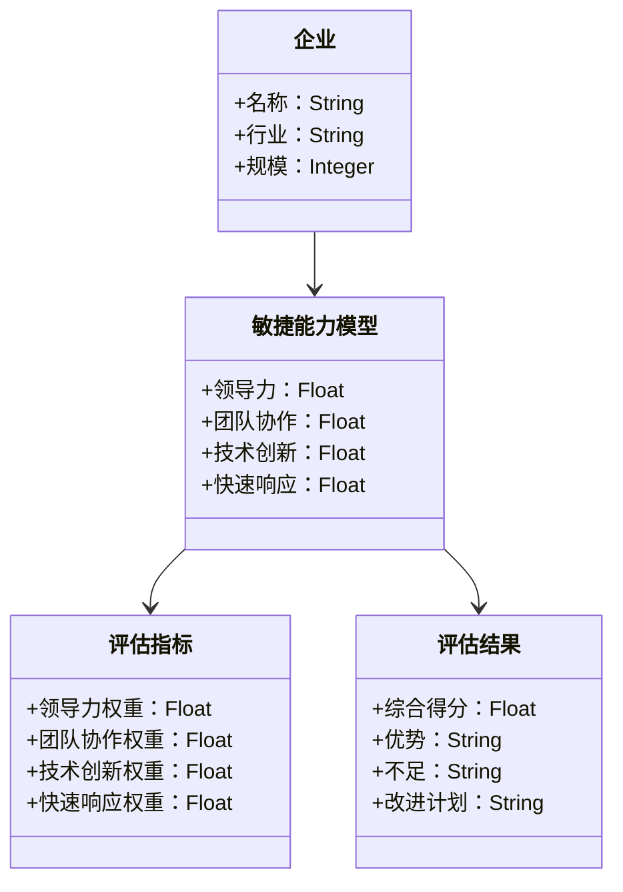
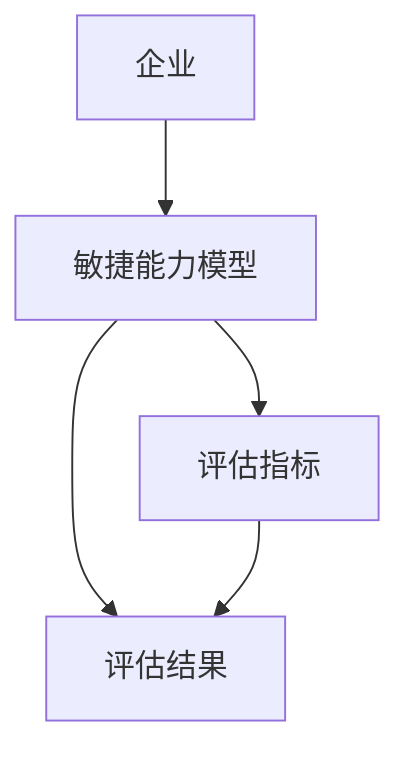
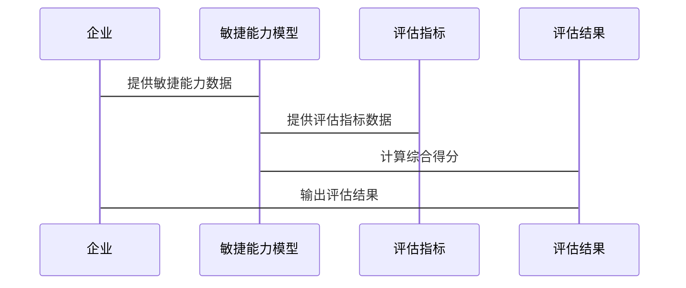

                 


# 如何评估企业的敏捷管理能力

> 关键词：企业敏捷管理能力、评估模型、管理能力模型、敏捷管理、管理能力

> 摘要：本文将详细探讨如何评估企业的敏捷管理能力，从背景介绍、核心概念到系统分析、项目实战，层层剖析，帮助企业更好地理解和提升其敏捷管理能力。通过本文，读者将能够掌握敏捷管理的核心原理、评估方法和实际应用，从而在复杂多变的商业环境中保持竞争力。

---

## 第一部分：企业敏捷管理能力评估的背景与核心概念

### 第1章：企业敏捷管理能力评估的背景与意义

#### 1.1 敏捷管理的起源与发展

##### 1.1.1 敏捷管理的起源
敏捷管理的起源可以追溯到20世纪90年代，当时软件开发行业开始反思传统的瀑布模型在应对需求变化时的低效性。1999年，Kent Beck等人提出了极限编程（Extreme Programming，XP）的思想，强调快速迭代、用户参与和持续交付。2001年，敏捷宣言的发布标志着敏捷管理作为一种全新的管理理念正式诞生。敏捷宣言提出了四个核心价值观：个体互动高于流程，客户合作高于合同谈判，响应变化高于遵循计划，以及交付价值高于遵循计划。

##### 1.1.2 敏捷管理的核心理念
敏捷管理的核心理念包括以下几点：
- **迭代开发**：将项目分解为多个小的、可管理的迭代周期，每个周期结束时交付可工作的软件。
- **持续交付**：通过短周期交付价值，确保客户能够快速看到成果。
- **客户合作**：客户参与开发过程，确保最终交付的产品符合需求。
- **响应变化**：在项目过程中灵活应对变化，而不是 rigidly 遵循计划。

##### 1.1.3 敏捷管理与传统管理的区别
敏捷管理与传统管理的主要区别在于其灵活性和客户导向。传统管理注重严格的流程和计划，而敏捷管理强调快速响应变化、客户参与和持续改进。敏捷管理更适合复杂和不确定的环境，而传统管理则更适合简单和稳定的环境。

#### 1.2 企业敏捷管理能力评估的必要性

##### 1.2.1 数字化转型对企业管理的新要求
随着数字化转型的推进，企业面临着日益复杂和动态变化的市场环境。传统的线性管理方式已经难以应对快速变化的需求和技术进步。敏捷管理作为一种更灵活的管理方法，成为企业在数字化转型中不可或缺的能力。

##### 1.2.2 敏捷管理能力对企业竞争力的影响
在激烈的市场竞争中，企业需要能够快速响应客户需求、灵活调整战略和快速交付产品。敏捷管理能力直接影响企业的市场反应速度、客户满意度和创新能力，从而影响企业的整体竞争力。

##### 1.2.3 企业敏捷管理能力评估的现实意义
通过评估企业敏捷管理能力，企业可以识别自身的优势和不足，有针对性地进行优化。同时，评估结果还可以为企业的战略规划和管理决策提供数据支持。

#### 1.3 本章小结
本章介绍了敏捷管理的起源和发展，阐述了敏捷管理的核心理念，并分析了企业敏捷管理能力评估的必要性。通过本章的学习，读者可以理解敏捷管理的基本概念和其在现代企业中的重要性。

---

### 第2章：敏捷管理的核心概念与联系

#### 2.1 敏捷管理的核心原则

##### 2.1.1 敏捷宣言的核心价值观
敏捷宣言提出了四个核心价值观：
- 个体互动高于流程
- 客户合作高于合同谈判
- 响应变化高于遵循计划
- 交付价值高于遵循计划

##### 2.1.2 敏捷方法论的五大原则
敏捷方法论的五大原则包括：
1. **客户合作**：与客户保持持续合作，确保交付的产品符合需求。
2. **迭代开发**：将项目分解为多个小的、可管理的迭代周期。
3. **持续交付**：通过短周期交付价值，确保客户能够快速看到成果。
4. **响应变化**：在项目过程中灵活应对变化，而不是 rigidly 遵循计划。
5. **持续改进**：通过回顾和反思，不断优化过程和成果。

##### 2.1.3 敏捷管理的三大支柱
敏捷管理的三大支柱包括：
1. **迭代开发**：通过短周期交付价值。
2. **客户合作**：与客户保持持续合作。
3. **持续改进**：通过回顾和反思优化过程。

#### 2.2 企业敏捷管理能力模型

##### 2.2.1 能力模型的构建逻辑
企业敏捷管理能力模型的构建逻辑包括以下几个步骤：
1. **确定核心能力**：识别企业敏捷管理的核心能力，如快速响应能力、团队协作能力等。
2. **定义能力维度**：将核心能力分解为具体的维度，如领导力、团队协作、技术创新等。
3. **建立评估指标**：为每个维度定义具体的评估指标，如领导力可以评估为领导者是否能够有效指导团队完成目标。

##### 2.2.2 能力模型的构成要素
企业敏捷管理能力模型的构成要素包括：
- **领导力**：领导者是否能够有效指导团队完成目标。
- **团队协作**：团队成员之间的协作能力。
- **技术创新**：企业是否能够快速采用新技术。
- **快速响应**：企业是否能够快速响应市场变化。

##### 2.2.3 能力模型的评估维度
能力模型的评估维度包括：
- **领导力**：领导者的指导能力。
- **团队协作**：团队成员之间的协作能力。
- **技术创新**：企业采用新技术的能力。
- **快速响应**：企业响应市场变化的能力。

#### 2.3 敏捷管理能力与其他管理能力的关系

##### 2.3.1 敏捷管理与项目管理的关系
敏捷管理与项目管理的关系是互补的。敏捷管理强调快速迭代和客户合作，而项目管理更注重项目的整体规划和控制。敏捷管理可以看作是一种项目管理的方法论。

##### 2.3.2 敏捷管理与组织文化的关联
敏捷管理与组织文化的关联密不可分。敏捷管理需要一个支持性的组织文化，如鼓励创新、客户导向和持续改进。组织文化反过来也会影响敏捷管理的实施效果。

##### 2.3.3 敏捷管理与绩效考核的结合
敏捷管理与绩效考核的结合体现在绩效考核的指标和方法上。敏捷管理强调持续交付和快速响应，因此绩效考核需要更加注重过程和结果的结合。

#### 2.4 本章小结
本章详细阐述了敏捷管理的核心原则，构建了企业敏捷管理能力模型，并分析了敏捷管理与其他管理能力的关系。通过本章的学习，读者可以理解敏捷管理的核心概念和其在企业中的具体应用。

---

### 第3章：敏捷管理能力评估的理论基础

#### 3.1 管理能力评估的通用框架

##### 3.1.1 管理能力评估的基本概念
管理能力评估是指对企业的管理能力进行全面的评估，以识别优势和不足，并提供改进建议。管理能力评估的基本概念包括评估目标、评估方法和评估结果的应用。

##### 3.1.2 管理能力评估的理论基础
管理能力评估的理论基础包括：
- **管理学理论**：如领导力理论、组织行为学理论等。
- **项目管理理论**：如敏捷方法论、Scrum理论等。
- **绩效管理理论**：如目标设定理论、绩效评估理论等。

##### 3.1.3 管理能力评估的实施步骤
管理能力评估的实施步骤包括：
1. **确定评估目标**：明确评估的目的和范围。
2. **选择评估方法**：根据评估目标选择合适的评估方法。
3. **收集数据**：通过问卷调查、访谈等方式收集数据。
4. **分析数据**：对收集到的数据进行分析，识别问题和机会。
5. **制定改进计划**：根据分析结果制定改进计划。

#### 3.2 敏捷管理能力评估的独特性

##### 3.2.1 敏捷管理能力评估的核心特征
敏捷管理能力评估的核心特征包括：
- **动态性**：敏捷管理能力评估需要动态调整，以应对变化。
- **客户导向**：评估过程中需要关注客户的需求和反馈。
- **持续改进**：评估结果需要用于持续改进企业的敏捷管理能力。

##### 3.2.2 敏捷管理能力评估的关键维度
敏捷管理能力评估的关键维度包括：
- **领导力**：领导者的指导能力。
- **团队协作**：团队成员之间的协作能力。
- **技术创新**：企业是否能够快速采用新技术。
- **快速响应**：企业是否能够快速响应市场变化。

##### 3.2.3 敏捷管理能力评估的指标体系
敏捷管理能力评估的指标体系包括：
- **领导力**：领导者是否能够有效指导团队完成目标。
- **团队协作**：团队成员之间的协作能力。
- **技术创新**：企业是否能够快速采用新技术。
- **快速响应**：企业是否能够快速响应市场变化。

#### 3.3 本章小结
本章探讨了敏捷管理能力评估的理论基础，分析了其独特性和关键维度，并提出了评估指标体系。通过本章的学习，读者可以理解敏捷管理能力评估的理论依据和具体方法。

---

### 第4章：敏捷管理能力评估的模型与方法论

#### 4.1 敏捷管理能力评估框架

##### 4.1.1 评估框架的构建逻辑
敏捷管理能力评估框架的构建逻辑包括以下几个步骤：
1. **确定评估目标**：明确评估的目的和范围。
2. **选择评估方法**：根据评估目标选择合适的评估方法。
3. **设计评估指标**：为每个维度定义具体的评估指标。
4. **收集数据**：通过问卷调查、访谈等方式收集数据。
5. **分析数据**：对收集到的数据进行分析，识别问题和机会。
6. **制定改进计划**：根据分析结果制定改进计划。

##### 4.1.2 评估框架的主要模块
评估框架的主要模块包括：
- **评估目标**：明确评估的目的和范围。
- **评估方法**：选择合适的评估方法。
- **评估指标**：设计具体的评估指标。
- **数据收集**：收集相关的数据。
- **数据分析**：分析数据并识别问题。
- **改进计划**：制定改进计划。

##### 4.1.3 评估框架的实施步骤
评估框架的实施步骤包括：
1. **确定评估目标**：明确评估的目的和范围。
2. **选择评估方法**：根据评估目标选择合适的评估方法。
3. **设计评估指标**：为每个维度定义具体的评估指标。
4. **收集数据**：通过问卷调查、访谈等方式收集数据。
5. **分析数据**：对收集到的数据进行分析，识别问题和机会。
6. **制定改进计划**：根据分析结果制定改进计划。

#### 4.2 敏捷管理能力评估的指标体系

##### 4.2.1 指标体系的设计原则
敏捷管理能力评估的指标体系设计原则包括：
- **全面性**：指标应涵盖企业敏捷管理能力的各个方面。
- **可操作性**：指标应易于测量和评估。
- **动态性**：指标应能够动态调整以应对变化。
- **客户导向**：指标应关注客户的需求和反馈。

##### 4.2.2 指标体系的核心维度
指标体系的核心维度包括：
- **领导力**：领导者的指导能力。
- **团队协作**：团队成员之间的协作能力。
- **技术创新**：企业是否能够快速采用新技术。
- **快速响应**：企业是否能够快速响应市场变化。

##### 4.2.3 指标体系的权重分配
指标体系的权重分配需要根据企业的实际情况和评估目标来确定。通常，权重分配可以通过专家访谈、问卷调查等方式进行。

#### 4.3 本章小结
本章提出了敏捷管理能力评估的框架和指标体系，分析了其设计原则和核心维度。通过本章的学习，读者可以掌握敏捷管理能力评估的具体方法和实施步骤。

---

### 第5章：敏捷管理能力评估的系统分析与架构设计

#### 5.1 问题场景介绍

##### 5.1.1 企业敏捷管理能力评估的挑战
企业在进行敏捷管理能力评估时可能会面临以下挑战：
- **复杂性**：企业的组织结构和业务流程复杂，评估难度大。
- **动态性**：市场环境和客户需求不断变化，评估结果需要动态调整。
- **数据不足**：企业在进行敏捷管理能力评估时可能会面临数据不足的问题。

##### 5.1.2 企业敏捷管理能力评估的目标
企业敏捷管理能力评估的目标包括：
- **识别优势和不足**：通过评估识别企业的优势和不足。
- **制定改进计划**：根据评估结果制定改进计划。
- **持续优化**：通过持续优化提升企业的敏捷管理能力。

#### 5.2 系统功能设计

##### 5.2.1 领域模型类图
以下是企业敏捷管理能力评估的领域模型类图：



##### 5.2.2 系统架构设计



#### 5.3 项目核心实现

##### 5.3.1 环境安装
为了进行企业敏捷管理能力评估，需要安装以下环境：
- **编程语言**：Python 3.8+
- **开发工具**：PyCharm或VS Code
- **依赖管理工具**：pip

##### 5.3.2 核心代码实现

```python
class AgileCapability:
    def __init__(self, leadership, team_collaboration, technologynovation, quick_response):
        self.leadership = leadership
        self.team_collaboration = team_collaboration
        self.technologynovation = technologynovation
        self.quick_response = quick_response

class AssessmentIndicator:
    def __init__(self, leadership_weight, team_collaboration_weight, technologynovation_weight, quick_response_weight):
        self.leadership_weight = leadership_weight
        self.team_collaboration_weight = team_collaboration_weight
        self.technologynovation_weight = technologynovation_weight
        self.quick_response_weight = quick_response_weight

class EnterpriseAssessment:
    def __init__(self, name, industry, size):
        self.name = name
        self.industry = industry
        self.size = size

    def assess_agile_capability(self, agile_capability, assessment_indicator):
        total_score = (
            agile_capability.leadership * assessment_indicator.leadership_weight +
            agile_capability.team_collaboration * assessment_indicator.team_collaboration_weight +
            agile_capability.technologynovation * assessment_indicator.technologynovation_weight +
            agile_capability.quick_response * assessment_indicator.quick_response_weight
        )
        return total_score

# 示例用法
enterprise = EnterpriseAssessment("公司名称", "行业", 100)
agile_capability = AgileCapability(85, 90, 80, 85)
assessment_indicator = AssessmentIndicator(0.3, 0.3, 0.2, 0.2)
total_score = enterprise.assess_agile_capability(agile_capability, assessment_indicator)
print(f"企业 {enterprise.name} 的敏捷管理能力综合得分为：{total_score}")
```

#### 5.4 代码解读与分析

##### 5.4.1 环境安装
上述代码需要以下环境：
- **Python 3.8+**
- **pip**：用于安装依赖

##### 5.4.2 核心代码实现
- **AgileCapability类**：表示企业的敏捷能力，包含领导力、团队协作、技术创新和快速响应四个属性。
- **AssessmentIndicator类**：表示评估指标，包含领导力权重、团队协作权重、技术创新权重和快速响应权重四个属性。
- **EnterpriseAssessment类**：表示企业评估，包含企业名称、行业和规模三个属性。其`assess_agile_capability`方法根据敏捷能力模型和评估指标计算综合得分。

##### 5.4.3 实际案例分析
假设我们有一家名为“科技公司”的企业，属于科技行业，规模为50人。其敏捷能力模型如下：
- 领导力：85
- 团队协作：90
- 技术创新：80
- 快速响应：85

评估指标如下：
- 领导力权重：0.3
- 团队协作权重：0.3
- 技术创新权重：0.2
- 快速响应权重：0.2

计算综合得分：
$$
总得分 = 85 \times 0.3 + 90 \times 0.3 + 80 \times 0.2 + 85 \times 0.2 = 25.5 + 27 + 16 + 17 = 85.5
$$

因此，这家企业的敏捷管理能力综合得分为85.5分，属于较高水平。

#### 5.5 本章小结
本章通过系统分析和架构设计，提出了企业敏捷管理能力评估的系统模型，并通过代码实现和案例分析，展示了如何将理论应用于实践。通过本章的学习，读者可以掌握敏捷管理能力评估的系统设计方法和具体实现步骤。

---

## 第二部分：企业敏捷管理能力评估的系统实现

### 第6章：企业敏捷管理能力评估的系统实现

#### 6.1 系统功能设计

##### 6.1.1 领域模型类图
以下是企业敏捷管理能力评估的领域模型类图：


#### 6.2 系统架构设计

##### 6.2.1 系统架构图
以下是企业敏捷管理能力评估的系统架构图：


#### 6.3 系统接口设计

##### 6.3.1 输入接口
系统输入接口包括：
- **企业信息**：企业名称、行业和规模。
- **敏捷能力模型**：领导力、团队协作、技术创新和快速响应。
- **评估指标**：领导力权重、团队协作权重、技术创新权重和快速响应权重。

##### 6.3.2 输出接口
系统输出接口包括：
- **评估结果**：综合得分、优势、不足和改进计划。

#### 6.4 系统交互设计

##### 6.4.1 交互流程图
以下是企业敏捷管理能力评估的系统交互流程图：



#### 6.5 本章小结
本章通过系统实现，详细阐述了企业敏捷管理能力评估的系统设计和具体实现步骤。通过本章的学习，读者可以掌握敏捷管理能力评估的系统实现方法。

---

### 第7章：项目实战——企业敏捷管理能力评估的案例分析

#### 7.1 案例背景介绍

##### 7.1.1 企业概况
某科技公司是一家专注于人工智能技术研发的公司，拥有50名员工，主要业务包括人工智能算法开发、数据分析和智能硬件设计。

##### 7.1.2 项目目标
通过敏捷管理能力评估，识别公司在敏捷管理方面的优势和不足，并制定改进计划。

#### 7.2 核心代码实现

##### 7.2.1 代码实现
以下是企业敏捷管理能力评估的代码实现：

```python
class AgileCapability:
    def __init__(self, leadership, team_collaboration, technologynovation, quick_response):
        self.leadership = leadership
        self.team_collaboration = team_collaboration
        self.technologynovation = technologynovation
        self.quick_response = quick_response

class AssessmentIndicator:
    def __init__(self, leadership_weight, team_collaboration_weight, technologynovation_weight, quick_response_weight):
        self.leadership_weight = leadership_weight
        self.team_collaboration_weight = team_collaboration_weight
        self.technologynovation_weight = technologynovation_weight
        self.quick_response_weight = quick_response_weight

class EnterpriseAssessment:
    def __init__(self, name, industry, size):
        self.name = name
        self.industry = industry
        self.size = size

    def assess_agile_capability(self, agile_capability, assessment_indicator):
        total_score = (
            agile_capability.leadership * assessment_indicator.leadership_weight +
            agile_capability.team_collaboration * assessment_indicator.team_collaboration_weight +
            agile_capability.technologynovation * assessment_indicator.technologynovation_weight +
            agile_capability.quick_response * assessment_indicator.quick_response_weight
        )
        return total_score

# 示例用法
enterprise = EnterpriseAssessment("科技公司", "科技", 50)
agile_capability = AgileCapability(85, 90, 80, 85)
assessment_indicator = AssessmentIndicator(0.3, 0.3, 0.2, 0.2)
total_score = enterprise.assess_agile_capability(agile_capability, assessment_indicator)
print(f"企业 {enterprise.name} 的敏捷管理能力综合得分为：{total_score}")
```

#### 7.3 代码解读与分析

##### 7.3.1 环境安装
上述代码需要以下环境：
- **Python 3.8+**
- **pip**：用于安装依赖

##### 7.3.2 核心代码实现
- **AgileCapability类**：表示企业的敏捷能力，包含领导力、团队协作、技术创新和快速响应四个属性。
- **AssessmentIndicator类**：表示评估指标，包含领导力权重、团队协作权重、技术创新权重和快速响应权重四个属性。
- **EnterpriseAssessment类**：表示企业评估，包含企业名称、行业和规模三个属性。其`assess_agile_capability`方法根据敏捷能力模型和评估指标计算综合得分。

##### 7.4 实际案例分析
通过上述代码实现，我们可以得出科技公司的敏捷管理能力综合得分为85.5分，属于较高水平。根据评估结果，我们可以识别其优势和不足，并制定改进计划。

#### 7.5 本章小结
本章通过项目实战，详细分析了企业敏捷管理能力评估的实现过程，并通过具体案例展示了如何将理论应用于实践。通过本章的学习，读者可以掌握敏捷管理能力评估的具体操作方法。

---

## 第三部分：企业敏捷管理能力评估的总结与展望

### 第8章：总结与展望

#### 8.1 本章总结
通过本文的详细阐述，读者可以全面了解企业敏捷管理能力评估的核心概念、理论基础和具体方法。从背景介绍到系统实现，再到项目实战，本文为读者提供了一个完整的评估框架和实施步骤。

#### 8.2 未来展望
未来，随着数字化转型的深入推进，企业敏捷管理能力评估将更加重要。建议企业在实践中不断优化评估模型和方法，以更好地应对复杂多变的市场环境。同时，随着人工智能和大数据技术的发展，企业敏捷管理能力评估也将更加智能化和自动化。

#### 8.3 最佳实践 Tips
- **持续优化**：根据评估结果，持续优化企业的敏捷管理能力。
- **动态调整**：根据市场变化和企业需求，动态调整评估模型和方法。
- **客户导向**：在评估过程中，始终关注客户的需求和反馈。

#### 8.4 本章小结
本章总结了本文的核心内容，并展望了企业敏捷管理能力评估的未来发展方向。通过本文的学习，读者可以更好地理解敏捷管理能力评估的重要性和具体实施方法。

---

## 作者信息

作者：AI天才研究院/AI Genius Institute & 禅与计算机程序设计艺术 /Zen And The Art of Computer Programming

