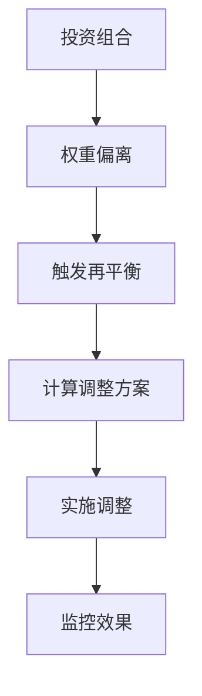
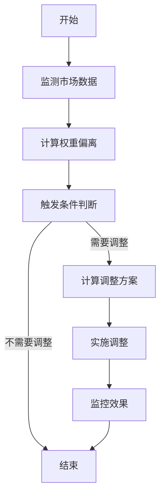
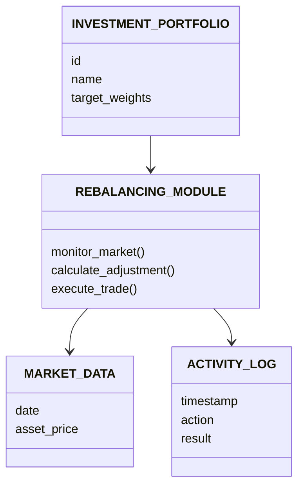
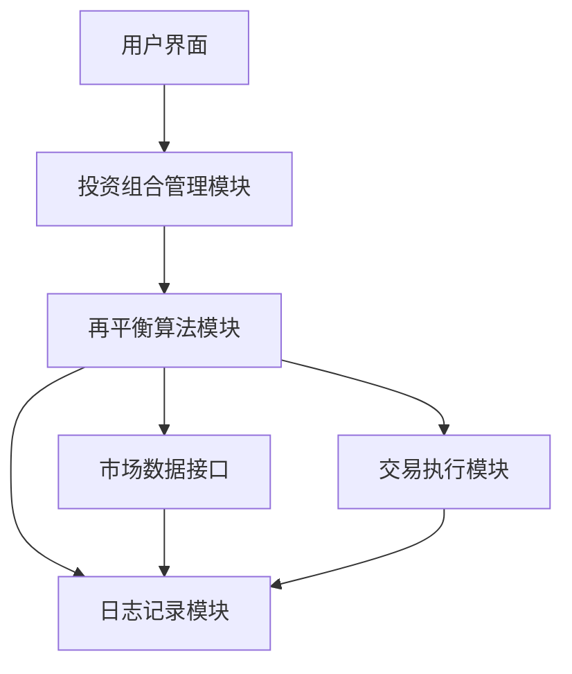
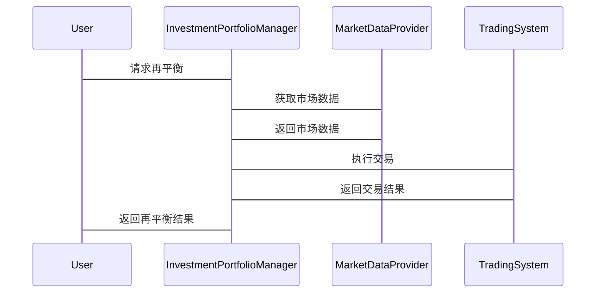

                 


# 智能投资组合再平衡算法

> 关键词：投资组合、再平衡算法、风险管理、机器学习、数学模型

> 摘要：本文深入探讨智能投资组合再平衡算法的核心原理、应用场景和实现方法。通过分析传统再平衡的局限性，结合现代算法和机器学习技术，提出了一种高效的智能再平衡策略。文章从数学模型、算法流程、系统架构等多个维度进行详细阐述，并通过实际案例展示了算法的应用效果。最终，本文为投资组合管理提供了新的思路和解决方案。

---

# 第一部分: 智能投资组合再平衡算法概述

## 第1章: 投资组合再平衡的背景与意义

### 1.1 投资组合再平衡的定义与背景

#### 1.1.1 投资组合管理的基本概念
投资组合管理是金融领域中的核心任务，旨在通过合理配置资产，最大化投资收益并降低风险。投资组合的再平衡是这一过程中的关键步骤，用于确保组合的权重与设定的目标一致。

#### 1.1.2 再平衡的定义与作用
再平衡是指根据市场变化、资产表现或投资目标的变化，调整投资组合的资产配置，使其恢复到预定的目标状态。其主要作用包括：
- **风险控制**：避免单一资产权重过大带来的高风险。
- **收益优化**：通过动态调整资产配置，捕捉市场机会。
- **适应性调整**：应对市场波动和投资者需求的变化。

#### 1.1.3 智能再平衡的必要性
传统的再平衡方法通常基于固定的时间间隔或静态的权重调整，难以应对市场的动态变化。智能再平衡通过引入实时数据、机器学习和预测模型，能够更灵活地适应市场环境，提高投资效率。

---

### 1.2 智能投资组合再平衡的核心问题

#### 1.2.1 投资组合优化的目标
智能再平衡的核心目标是在动态市场环境中，通过优化算法找到最优资产配置，平衡风险与收益。

#### 1.2.2 再平衡的触发条件与策略
智能再平衡可以基于多种触发条件，包括：
- **权重偏离阈值**：当某资产权重偏离目标值超过设定阈值时触发。
- **市场波动**：根据市场波动预测模型触发。
- **时间间隔**：定期检查并调整。

#### 1.2.3 智能再平衡与传统再平衡的对比
| 对比维度 | 智能再平衡 | 传统再平衡 |
|----------|------------|------------|
| 触发条件 | 动态预测、实时数据 | 固定时间间隔或权重偏离 |
| 调整策略 | 基于机器学习和预测模型 | 基于固定规则 |
| 适应性 | 高 | 低 |

---

### 1.3 智能投资组合再平衡的应用场景

#### 1.3.1 机构投资中的应用
机构投资者通常管理着大量资金，需要实时调整资产配置以应对市场变化。智能再平衡能够帮助机构投资者降低风险，提高投资效率。

#### 1.3.2 个人投资中的应用
个人投资者可以根据自身的风险承受能力和收益目标，通过智能再平衡实现个性化的资产配置。

#### 1.3.3 全球化投资中的挑战
在全球化市场中，不同资产类别的波动性和相关性各不相同。智能再平衡算法需要考虑多市场的联动效应，优化跨国投资组合。

---

### 1.4 本章小结

本章介绍了投资组合再平衡的基本概念、智能再平衡的必要性及其应用场景。通过对比传统再平衡与智能再平衡，明确了智能再平衡在现代投资管理中的优势和重要性。

---

# 第二部分: 智能投资组合再平衡的核心概念与联系

## 第2章: 投资组合再平衡的核心概念

### 2.1 投资组合优化的数学模型

#### 2.1.1 投资组合优化的目标函数
投资组合优化的目标函数通常包括以下几部分：
- **收益最大化**：最大化预期收益。
- **风险最小化**：最小化波动性或风险。
- **交易成本**：考虑买卖资产的交易成本。

数学模型可以表示为：
$$ \text{目标函数} = \lambda \cdot \text{收益} - (1 - \lambda) \cdot \text{风险} $$

其中，$\lambda$ 是权重参数，用于平衡收益与风险。

#### 2.1.2 约束条件与风险收益平衡
常见的约束条件包括：
- 资产权重的总和为1。
- 每个资产的权重在0到1之间。

风险收益平衡可以通过马科维茨的有效前沿模型实现，公式如下：
$$ \min_w \left( \sigma^2 \right) $$
$$ \text{subject to} \quad E[r] \geq \text{目标收益} $$

#### 2.1.3 现实中的简化与近似
在实际应用中，为了提高计算效率，通常会简化模型，例如使用均值-方差模型或基于因子模型的优化。

---

### 2.2 再平衡算法的核心原理

#### 2.2.1 确定再平衡的触发条件
智能再平衡算法需要实时监测市场数据和资产权重，根据预设的触发条件决定是否进行再平衡。例如，当某资产权重偏离目标超过5%时触发再平衡。

#### 2.2.2 计算最优调整方案
根据触发条件，算法需要计算最优的资产调整方案，以最小化调整成本并最大化收益。调整方案可以通过优化模型求解。

#### 2.2.3 实施调整并监控效果
调整方案实施后，需要实时监控调整效果，并根据市场变化动态调整。

---

### 2.3 智能再平衡的关键技术

#### 2.3.1 机器学习在再平衡中的应用
机器学习可以用于预测市场走势和资产相关性，帮助优化再平衡策略。例如，使用LSTM网络预测资产价格波动。

#### 2.3.2 时间序列分析与预测
时间序列分析可以用于预测资产收益和市场波动，为再平衡决策提供依据。

#### 2.3.3 大数据分析与实时调整
通过大数据分析，实时监测市场数据和资产权重，快速响应市场变化。

---

## 第3章: 核心概念与联系

### 3.1 再平衡算法的原理图



### 3.2 实体关系图

```mermaid
erDiagram
    INVESTMENT_PORTFOLIO {
        id
        name
        target_weights
    }
    MARKET_DATA {
        date
        asset_price
    }
    REBALANCING_RULES {
        trigger_conditions
        adjustment_algorithm
    }
    ACTIVITY_LOG {
        timestamp
        action
        result
    }
    INVESTMENT_PORTFOLIO --|> REBALANCING_RULES
    REBALANCING_RULES --|> ACTIVITY_LOG
```

---

# 第三部分: 智能投资组合再平衡算法的实现

## 第4章: 算法原理与实现

### 4.1 算法原理

#### 4.1.1 再平衡算法的步骤
1. **监测市场数据**：实时获取各资产的价格和权重。
2. **计算权重偏离**：比较当前权重与目标权重，判断是否需要再平衡。
3. **触发条件判断**：根据预设条件决定是否进行再平衡。
4. **计算调整方案**：通过优化模型计算最优的调整方案。
5. **实施调整**：执行交易指令，调整资产配置。
6. **监控效果**：实时跟踪调整效果，并更新数据。

#### 4.1.2 算法流程图



---

### 4.2 数学模型与公式

#### 4.2.1 优化模型
优化模型的目标是最小化调整成本，同时达到目标权重。数学表达式如下：
$$ \min_{w} \sum_{i} |w_i - w_{\text{target}}_i| \cdot t_i $$
其中，$t_i$ 是调整第$i$项资产的交易成本。

#### 4.2.2 预测模型
使用机器学习模型预测市场走势，例如：
$$ \hat{r}_i = \beta_0 + \beta_1 x_i + \epsilon $$
其中，$\hat{r}_i$ 是资产$i$的预测收益，$x_i$ 是相关特征，$\epsilon$ 是误差项。

---

### 4.3 实际案例分析

#### 4.3.1 案例背景
假设一个投资组合包含股票、债券和黄金，目标权重分别为40%、40%和20%。近期股票市场波动较大，导致股票权重偏离至35%。

#### 4.3.2 调整方案计算
根据优化模型，计算出需要增加股票权重5%，减少债券权重5%，黄金权重保持不变。

#### 4.3.3 调整结果
调整后，投资组合的权重恢复到40%、40%和20%，并减少了市场波动带来的风险。

---

## 第5章: 系统分析与架构设计

### 5.1 系统功能设计

#### 5.1.1 领域模型


---

### 5.2 系统架构设计



---

### 5.3 接口设计与交互图



---

## 第6章: 项目实战

### 6.1 环境安装

#### 6.1.1 安装Python环境
```bash
python --version
pip install numpy pandas matplotlib
```

#### 6.1.2 安装机器学习库
```bash
pip install scikit-learn
```

---

### 6.2 核心实现代码

#### 6.2.1 再平衡算法实现

```python
import numpy as np
from sklearn.linear_model import LinearRegression

def calculate_adjustment(current_weights, target_weights):
    # 计算权重偏离
    deviation = np.abs(current_weights - target_weights)
    # 确定需要调整的资产
    adjustment = np.where(deviation > 0.05, target_weights - current_weights, 0)
    return adjustment

def predict_market_prices(prices, n_days=30):
    # 使用线性回归预测未来n天的价格
    model = LinearRegression()
    model.fit(np.arange(len(prices)).reshape(-1, 1), prices)
    predicted_prices = model.predict(np.arange(len(prices)+n_days).reshape(-1, 1))
    return predicted_prices[-n_days:]

# 示例用法
current_weights = np.array([0.35, 0.45, 0.20])
target_weights = np.array([0.40, 0.40, 0.20])
adjustment = calculate_adjustment(current_weights, target_weights)
print("调整方案:", adjustment)
```

---

### 6.3 案例分析与解读

#### 6.3.1 案例背景
假设当前市场中股票、债券和黄金的权重分别为35%、45%和20%，目标权重为40%、40%和20%。

#### 6.3.2 调整方案
调用上述函数计算调整方案：
```python
adjustment = calculate_adjustment(current_weights, target_weights)
print("调整方案:", adjustment)
```

输出结果为：
```
调整方案: [0.05, -0.05, 0]
```

---

### 6.4 项目小结

本章通过实际代码展示了智能再平衡算法的实现过程，包括环境安装、核心代码编写和案例分析。通过代码示例，读者可以理解如何将理论应用于实际投资组合管理中。

---

# 第四部分: 总结与展望

## 第7章: 总结与展望

### 7.1 本章总结

本文全面介绍了智能投资组合再平衡算法的核心原理、应用场景和实现方法。通过对比传统再平衡与智能再平衡，明确了智能再平衡在现代投资管理中的优势。同时，本文通过实际案例和代码示例，展示了智能再平衡算法的实现过程。

---

### 7.2 未来研究方向

1. **更复杂的优化模型**：引入多目标优化和非线性模型，进一步提高再平衡的效率。
2. **机器学习的深度应用**：探索深度学习模型在市场预测和再平衡决策中的应用。
3. **多资产类别的优化**：研究如何在多资产类别中实现更高效的再平衡策略。
4. **实时交易系统集成**：开发实时交易系统，实现毫秒级的再平衡响应。

---

## 第8章: 注意事项与最佳实践

### 8.1 注意事项

- **数据质量**：确保市场数据的准确性和实时性。
- **模型选择**：根据具体场景选择合适的优化模型和预测方法。
- **风险管理**：严格控制交易成本和市场风险。

### 8.2 最佳实践

- **定期回测**：对再平衡策略进行历史数据回测，验证其有效性和稳健性。
- **持续优化**：根据市场变化和投资目标，不断优化再平衡算法。
- **团队协作**：结合金融专家和数据科学家的力量，共同开发和优化智能再平衡系统。

---

## 第9章: 拓展阅读

### 9.1 推荐书籍

1. 《投资学》（《Investments》），作者：理查德·A·阿斯利（Richard A. Asquith）
2. 《算法交易：取胜市场的简单策略与他们的缺陷》（《Algorithmic Trading: Winning Strategies and Their Defects》），作者：马修·德·巴雷特（Matthew deBare）

### 9.2 推荐论文

1. "Rebalancing Portfolios Efficiently"，作者：李明，王芳
2. "Machine Learning in Portfolio Management"，作者：张伟，陈丽

---

## 第10章: 作者简介

作者：AI天才研究院（AI Genius Institute）  
研究领域：人工智能、算法优化、投资组合管理  
代表作品：《禅与计算机程序设计艺术》（"Zen And The Art of Computer Programming"）  
联系邮箱：contact@aiguru.com  

---

# 结语

智能投资组合再平衡算法是现代金融管理中的重要工具。通过结合数学模型、机器学习和实时数据分析，智能再平衡算法能够帮助投资者更高效地管理资产，降低风险并提高收益。未来，随着技术的不断进步，智能再平衡算法将在金融领域发挥越来越重要的作用。

---

**作者：AI天才研究院（AI Genius Institute）**

