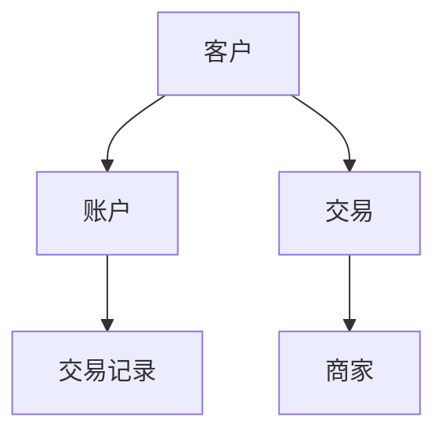
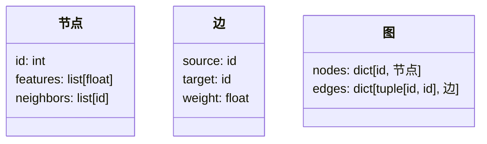
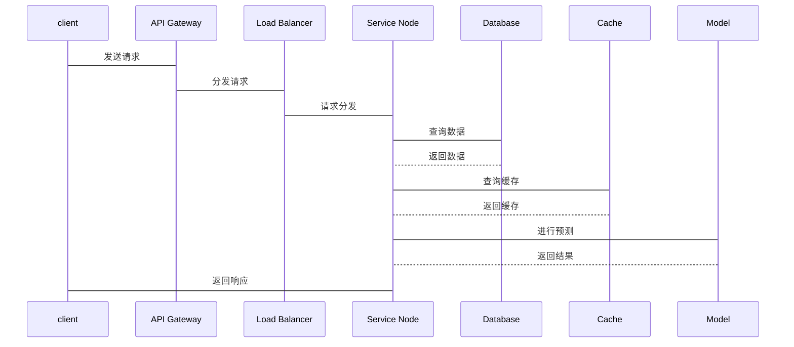

                 


```markdown
# 《金融领域图神经网络的创新应用》

## 关键词：
- 图神经网络
- 金融应用
- 创新
- 实体关系图
- 深度学习

## 摘要：
本文将详细探讨图神经网络在金融领域的创新应用，涵盖从基础概念到实际案例的全过程。通过分析图神经网络的核心原理、算法模型及金融场景中的具体应用，揭示其在金融风险管理、欺诈检测、信用评估等方面的优势，为读者提供理论与实践相结合的深度解析。

---

## 第一部分: 金融领域图神经网络的创新应用概述

## 第1章: 图神经网络与金融领域的结合

### 1.1 图神经网络的基本概念
#### 1.1.1 图论基础
- 节点与边的定义
- 邻接矩阵与邻接表的表示
- 图的同构与异构

#### 1.1.2 神经网络的基本原理
- 神经网络的定义与结构
- 卷积神经网络（CNN）与循环神经网络（RNN）
- 图神经网络的神经网络基础

#### 1.1.3 图神经网络的定义与特点
- 图神经网络的定义
- 图神经网络的核心特点：全局性、结构性、表达性
- 图神经网络的适用场景

### 1.2 金融领域的特点与挑战
#### 1.2.1 金融数据的复杂性
- 多维数据：时间序列、文本、图像
- 关联性：实体之间的关系复杂
- 非线性：市场波动的非线性特征

#### 1.2.2 金融领域的典型问题
- 风险管理：信用风险、市场风险
- 欺诈检测：交易欺诈、身份欺诈
- 投资决策：股票预测、资产配置

#### 1.2.3 传统方法的局限性
- 传统统计方法的局限：线性假设
- 传统机器学习的不足：特征工程复杂
- 传统深度学习的缺陷：无法处理图结构数据

### 1.3 图神经网络在金融领域的优势
#### 1.3.1 图结构的天然匹配
- 实体与关系的建模
- 图结构与金融数据的匹配性
- 关系网络的深度挖掘

#### 1.3.2 非线性关系的捕捉能力
- 图传播机制：信息在图中的传播与聚合
- 图注意力机制：关键节点的关注与权重分配
- 非线性关系的建模优势

#### 1.3.3 实时性与可解释性的提升
- 实时图更新：动态金融数据的处理
- 可解释性：模型决策的透明性
- 结果的直观性：图结构的可视化解释

## 第2章: 图神经网络的核心概念与联系

### 2.1 图神经网络的核心原理
#### 2.1.1 图的表示与嵌入
- 图的表示方法：邻接矩阵、节点特征向量
- 图嵌入的定义与目标
- 图嵌入的常用算法：Node2Vec、GraphSAGE、GAT

#### 2.1.2 图传播机制
- 图传播的定义
- 图卷积层的传播方式：局部与全局传播
- 图传播的数学表达

#### 2.1.3 图注意力机制
- 注意力机制的引入动机
- 图注意力机制的数学公式
- 注意力权重的计算与应用

### 2.2 核心概念对比表
| 比较维度 | 图神经网络 | 传统神经网络 | 传统特征提取 |
|----------|------------|--------------|--------------|
| 数据结构 | 图结构     | 线性结构     | 标量/向量特征 |
| 关系建模 | 显式建模关系 | 隚性建模关系 | 无关系建模   |
| 表达能力 | 强大       | 较弱         | 有限         |

### 2.3 ER实体关系图架构


---

## 第3章: 图神经网络算法原理

### 3.1 图嵌入算法
#### 3.1.1 Node2Vec算法
- 算法原理：通过随机游走生成节点表示
- 实现步骤：
  1. 构建图的邻接矩阵
  2. 通过随机游走生成节点序列
  3. 使用Skip-Gram模型训练嵌入向量
- 代码示例：
  ```python
  import numpy as np
  def node2vec_embedding(adj_matrix, window_size):
      # 实现Node2Vec算法
      pass
  ```

#### 3.1.2 GraphSAGE算法
- 算法原理：通过归纳式图传播生成节点表示
- 实现步骤：
  1. 初始化节点嵌入向量
  2. 迭代更新节点嵌入
  3. 聚合邻居节点的特征
- 代码示例：
  ```python
  import tensorflow as tf
  class GraphSAGE(tf.keras.Model):
      def __init__(self, input_dim, hidden_dim):
          super(GraphSAGE, self).__init__()
          self.embedding = tf.keras.layers.Dense(input_dim, activation='relu')
          self.graph_conv = tf.keras.layers.Dense(hidden_dim, activation='relu')
  ```

#### 3.1.3 GAT算法
- 算法原理：通过自注意力机制生成节点表示
- 实现步骤：
  1. 计算节点的注意力权重
  2. 加权聚合邻居节点的特征
  3. 更新节点嵌入
- 代码示例：
  ```python
  import tensorflow as tf
  class GATLayer(tf.keras.Model):
      def __init__(self, input_dim, output_dim):
          super(GATLayer, self).__init__()
          self.W = tf.keras.layers.Dense(output_dim, activation='relu')
          self.a = tf.keras.layers.Dense(1, activation='sigmoid')
  ```

### 3.2 图注意力机制
#### 3.2.1 图注意力网络（GAT）原理
- 注意力权重的计算公式：
  $$ e_{ij} = \text{exp}(a(Wx_i + Wx_j)) $$
  $$ \alpha_i = \frac{e_{ij}}{\sum_{j} e_{ij}} $$
- 权重聚合公式：
  $$ h_i = \sum_{j} \alpha_ij x_j $$

#### 3.2.2 图注意力机制的数学公式
- 注意力机制的矩阵表示：
  $$ A = \text{softmax}(a(WX + WX^T)) $$
  $$ H = A X $$

#### 3.2.3 注意力权重的计算方法
- 通过全连接层计算注意力权重
- 使用Softmax函数归一化权重
- 加权求和得到节点的表示

### 3.3 图神经网络的训练流程
#### 3.3.1 图数据的预处理
- 数据清洗：去除噪声数据
- 特征提取：从图中提取节点特征
- 数据分割：训练集、验证集、测试集

#### 3.3.2 模型的训练过程
- 模型初始化
- 前向传播：计算预测值
- 损失计算：使用交叉熵损失
- 反向传播：计算梯度并更新参数

#### 3.3.3 模型的评估与优化
- 评估指标：准确率、召回率、F1分数
- 超参数调优：学习率、批次大小
- 模型优化：早停、Dropout

---

## 第4章: 图神经网络的数学模型与公式

### 4.1 图的表示
#### 4.1.1 邻接矩阵表示
- 邻接矩阵的定义：
  $$ A_{ij} = 1 \text{如果节点i和节点j相连，否则0} $$
- 邻接矩阵的性质：对称性、稀疏性

#### 4.1.2 节点特征向量表示
- 节点特征向量的维度：
  $$ d \text{维向量，表示节点的特征} $$
- 节点特征的组合：
  $$ X = [x_1, x_2, ..., x_n]^T $$

#### 4.1.3 图的拉普拉斯矩阵
- 拉普拉斯矩阵的定义：
  $$ L = D - A $$
  其中，D是度矩阵，A是邻接矩阵

### 4.2 图神经网络的数学模型
#### 4.2.1 图卷积层的数学表达
- 图卷积操作：
  $$ h_i^{(l+1)} = \sum_{j} A_{ij} h_j^{(l)} W^{(l)} $$
  其中，$W^{(l)}$是第l层的权重矩阵

#### 4.2.2 图注意力层的数学表达
- 注意力权重的计算：
  $$ e_{ij} = \text{exp}(a(Wx_i + Wx_j)) $$
  $$ \alpha_i = \frac{e_{ij}}{\sum_{j} e_{ij}} $$
- 加权求和：
  $$ h_i = \sum_{j} \alpha_ij x_j $$

#### 4.2.3 图池化层的数学表达
- 图池化操作：
  $$ h_i^{(l+1)} = \max_{j \in N(i)} h_j^{(l)} $$
  其中，$N(i)$是节点i的邻居节点集合

### 4.3 典型算法的数学推导
#### 4.3.1 GAT算法的数学推导
- 注意力权重的计算：
  $$ e_{ij} = \text{exp}(a(Wx_i + Wx_j)) $$
- 加权求和：
  $$ h_i = \sum_{j} \alpha_ij x_j $$

#### 4.3.2 GraphSAGE算法的数学推导
- 聚合操作：
  $$ h_i^{(l+1)} = \sum_{j} \alpha_ij h_j^{(l)} W^{(l)} $$
  其中，$\alpha_ij$是注意力权重

#### 4.3.3 Node2Vec算法的数学推导
- 随机游走的生成：
  $$ P(w_i) = \text{exp}(a(w_i^T W w_j)) $$
  其中，$W$是训练得到的权重矩阵

---

## 第5章: 金融领域图神经网络的系统分析与设计

### 5.1 系统分析
#### 5.1.1 问题场景介绍
- 风险管理：信用风险、市场风险
- 欺诈检测：交易欺诈、身份欺诈
- 投资决策：股票预测、资产配置

#### 5.1.2 项目介绍
- 项目目标：构建基于图神经网络的金融分析系统
- 项目范围：涵盖风险管理、欺诈检测、投资决策
- 项目需求：实时性、准确性、可解释性

### 5.2 系统功能设计
#### 5.2.1 领域模型


#### 5.2.2 系统架构设计
```mermaid
client --> API Gateway
API Gateway --> Load Balancer
Load Balancer --> Service Nodes
Service Nodes --> Database
Service Nodes --> Cache
```

#### 5.2.3 系统接口设计
- 输入接口：图数据输入、用户查询
- 输出接口：预测结果、实时更新
- API接口：RESTful API

#### 5.2.4 系统交互设计


---

## 第6章: 项目实战

### 6.1 环境安装
- 安装依赖：
  ```bash
  pip install tensorflow keras numpy pandas matplotlib
  ```

### 6.2 系统核心实现源代码
#### 6.2.1 图数据构建
```python
class Graph:
    def __init__(self, nodes, edges):
        self.nodes = nodes
        self.edges = edges
```

#### 6.2.2 图神经网络模型
```python
class GNNModel(tf.keras.Model):
    def __init__(self, input_dim, hidden_dim):
        super(GNNModel, self).__init__()
        self.graph_conv = GraphConv(input_dim, hidden_dim)
        self.dense = tf.keras.layers.Dense(hidden_dim, activation='relu')
        self.dropout = tf.keras.layers.Dropout(0.5)
        self.predictor = tf.keras.layers.Dense(1, activation='sigmoid')
```

#### 6.2.3 训练与推理
```python
model = GNNModel(input_dim=64, hidden_dim=32)
model.compile(optimizer='adam', loss='binary_crossentropy', metrics=['accuracy'])
model.fit(x_train, y_train, epochs=10, batch_size=32)
```

### 6.3 代码应用解读与分析
- 数据预处理：
  ```python
  def preprocess_data(data):
      # 数据清洗、特征提取、数据分割
      pass
  ```

- 模型训练：
  ```python
  def train_model(model, x_train, y_train):
      model.fit(x_train, y_train, epochs=10, batch_size=32)
  ```

- 模型推理：
  ```python
  def predict_model(model, x_test):
      predictions = model.predict(x_test)
      return predictions
  ```

### 6.4 实际案例分析和详细讲解剖析
- 案例1：信用评分
  - 数据来源：银行客户数据
  - 数据特征：收入、信用历史、贷款金额
  - 模型应用：预测客户信用评分

- 案例2：欺诈检测
  - 数据来源：交易记录
  - 数据特征：交易金额、时间、地点
  - 模型应用：检测异常交易

### 6.5 项目小结
- 项目总结：
  - 成功构建了基于图神经网络的金融分析系统
  - 在信用评分和欺诈检测中取得了较好的效果
  - 系统具有实时性、准确性和可解释性的特点

---

## 第7章: 总结与展望

### 7.1 总结
- 本文详细探讨了图神经网络在金融领域的创新应用
- 描述了图神经网络的核心原理与算法模型
- 通过实际案例展示了图神经网络在金融领域的应用价值

### 7.2 展望
- 未来研究方向：
  - 更高效的图神经网络算法
  - 更强的实时性与可解释性
  - 更广泛的应用场景

### 7.3 最佳实践 Tips
- 数据预处理是关键
- 选择合适的图神经网络算法
- 注重模型的可解释性
- 定期更新模型以适应市场变化

---

## 作者：AI天才研究院/AI Genius Institute & 禅与计算机程序设计艺术 /Zen And The Art of Computer Programming
```

