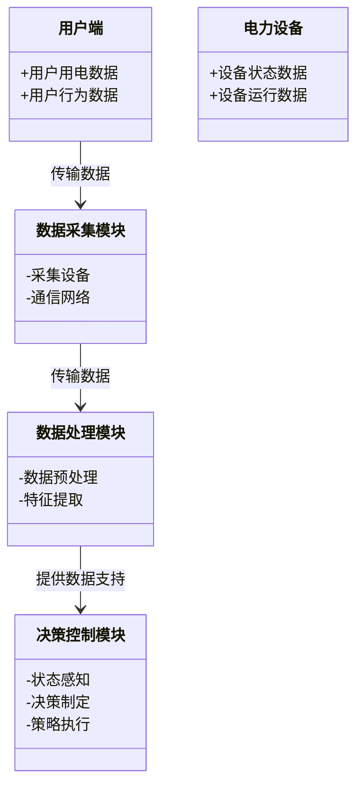
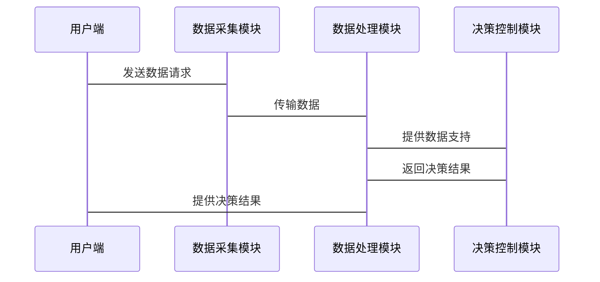

                 


# AI Agent在智能电网中的应用

> 关键词：智能电网, AI Agent, 人工智能, 能源系统, 电力调度

> 摘要：本文探讨了AI Agent在智能电网中的应用，分析了智能电网的基本概念、AI Agent的核心原理及其在智能电网中的技术实现。文章详细介绍了AI Agent在电力调度、负荷预测、设备监测等场景中的应用，并通过实际案例展示了AI Agent在智能电网中的潜力和优势。最后，本文总结了AI Agent在智能电网中的发展趋势和未来方向。

---

## 第1章: 智能电网与AI Agent概述

### 1.1 智能电网的基本概念

#### 1.1.1 智能电网的定义与特点

智能电网是一种以电力为核心，结合信息技术、通信技术和自动化技术的现代化电力系统。它通过智能化的感知、分析、决策和执行，实现电力的高效生产、传输、分配和使用。智能电网的特点包括：

- **智能性**：通过传感器、通信设备和数据处理系统，实时感知电网状态。
- **自适应性**：能够根据电网负荷和运行条件的变化，自动调整运行策略。
- **高效性**：通过优化电力调度和设备管理，提高能源利用效率。
- **可靠性**：能够快速检测和修复电网故障，确保电力供应的连续性。

#### 1.1.2 智能电网的核心组成部分

智能电网的核心组成部分包括：

1. **发电系统**：包括传统的火力发电厂、水力发电站、风力发电站等。
2. **输电系统**：通过高压输电线路将电力从发电站输送到负荷中心。
3. **配电系统**：将电力分配到各个用户端，包括配电站、配电线路等。
4. **用户端**：包括各种电力用户，如居民、工业企业和电动汽车充电桩等。
5. **信息通信系统**：包括传感器、通信网络和数据处理系统，用于实时数据的采集和传输。

#### 1.1.3 智能电网的发展背景与意义

智能电网的发展背景主要源于以下几点：

- **能源危机**：全球能源需求不断增加，传统能源资源有限，亟需开发和利用可再生能源。
- **环境问题**：化石能源的大量使用导致环境污染和气候变化，推动了清洁能源的使用。
- **技术进步**：信息技术、通信技术和人工智能技术的快速发展为智能电网的实现提供了技术支撑。

智能电网的意义在于：

- 提高电力系统的可靠性和稳定性。
- 优化电力资源的配置和利用。
- 促进可再生能源的接入和应用。
- 提供更加灵活和智能的电力服务。

### 1.2 AI Agent的基本概念

#### 1.2.1 AI Agent的定义与分类

AI Agent（人工智能代理）是一种能够感知环境、自主决策并执行任务的智能实体。AI Agent可以分为以下几类：

1. **简单反射型Agent**：基于当前感知直接做出反应，没有内部状态。
2. **基于模型的反射型Agent**：维护内部状态，并根据环境信息和内部模型做出决策。
3. **目标驱动型Agent**：根据预设目标和环境信息进行决策和行动。
4. **效用驱动型Agent**：通过最大化效用函数来优化决策。

#### 1.2.2 AI Agent的核心功能与特点

AI Agent的核心功能包括：

- **感知环境**：通过传感器或其他信息源获取环境状态。
- **决策与规划**：基于感知信息，制定行动策略。
- **执行行动**：根据决策结果执行相应的操作。
- **学习与优化**：通过与环境的交互，不断优化自身的决策和行动策略。

AI Agent的特点包括：

- **自主性**：能够在没有外部干预的情况下自主决策和行动。
- **反应性**：能够根据环境变化实时调整策略。
- **学习能力**：通过学习提高自身的决策和行动能力。
- **协作性**：能够与其他Agent或系统协同工作，实现复杂任务。

#### 1.2.3 AI Agent在智能电网中的应用潜力

AI Agent在智能电网中的应用潜力主要体现在以下几个方面：

1. **电力调度优化**：通过AI Agent实现电力的智能调度，提高电力系统的效率和稳定性。
2. **负荷预测与需求响应**：利用AI Agent进行负荷预测，优化电力需求响应策略。
3. **设备状态监测与故障诊断**：通过AI Agent实时监测设备状态，及时发现和诊断故障。
4. **用户行为分析与能效管理**：通过分析用户行为，优化能源使用效率，降低能源浪费。

### 1.3 智能电网中AI Agent的应用场景

#### 1.3.1 电力系统优化与调度

电力系统优化与调度是智能电网的核心任务之一。通过AI Agent，可以实现电力的智能调度，提高电力系统的效率和稳定性。例如，AI Agent可以根据实时负荷需求和发电资源情况，优化电力的生成和分配。

#### 1.3.2 负荷预测与需求响应

负荷预测是智能电网中的重要任务，通过AI Agent可以实现高精度的负荷预测。基于负荷预测结果，AI Agent可以制定需求响应策略，优化电力需求侧管理，降低电力峰谷差，提高电力系统的运行效率。

#### 1.3.3 设备状态监测与故障诊断

通过AI Agent，可以实现电力设备的实时监测和故障诊断。AI Agent可以通过分析设备运行数据，识别潜在故障，并及时发出预警信号，从而避免设备损坏和电力系统中断。

#### 1.3.4 用户行为分析与能效管理

AI Agent可以通过分析用户用电行为，优化能源使用效率。例如，AI Agent可以向用户发出能效优化建议，帮助用户降低能源消耗，实现绿色能源管理。

---

## 第2章: AI Agent的核心原理

### 2.1 多智能体系统（Multi-Agent System）

#### 2.1.1 多智能体系统的定义与特点

多智能体系统是由多个相互作用的智能体组成的系统，智能体之间通过通信和协作完成复杂任务。多智能体系统的特点包括：

- **分布式性**：智能体之间分布在网络中，各自负责一部分任务。
- **协作性**：智能体之间需要通过协作完成整体任务。
- **动态性**：环境和任务需求可能会动态变化，智能体需要实时调整策略。

#### 2.1.2 多智能体系统中的通信与协作

在多智能体系统中，智能体之间的通信与协作是实现任务的关键。智能体可以通过以下方式进行通信与协作：

1. **直接通信**：智能体之间通过通信协议直接交换信息。
2. **共享知识库**：多个智能体共享一个知识库，通过知识库进行信息交流。
3. **协调机制**：通过协调机制，智能体之间可以达成一致，避免冲突。

#### 2.1.3 多智能体系统中的应用场景

多智能体系统在智能电网中的应用场景包括：

- **电力调度**：多个智能体协同工作，优化电力调度。
- **设备监测**：多个智能体分别监测不同的设备状态，协同完成设备监测任务。
- **需求响应**：多个智能体分别负责不同的用户需求响应，协同优化电力需求。

### 2.2 强化学习（Reinforcement Learning）在AI Agent中的应用

#### 2.2.1 强化学习的基本原理

强化学习是一种机器学习方法，通过智能体与环境的交互，学习最优策略。强化学习的基本原理包括：

1. **状态空间**：智能体所处的环境状态。
2. **动作空间**：智能体可以执行的动作。
3. **奖励函数**：智能体在执行动作后获得的奖励或惩罚。
4. **策略**：智能体在状态空间中选择动作的策略。

#### 2.2.2 强化学习在AI Agent中的应用实例

强化学习在AI Agent中的应用实例包括：

1. **电力调度优化**：通过强化学习，AI Agent可以学习最优的电力调度策略，提高电力系统的效率。
2. **设备状态监测**：通过强化学习，AI Agent可以学习设备状态的异常检测策略，提高故障诊断的准确性。

### 2.3 知识图谱与推理

#### 2.3.1 知识图谱的构建与表示

知识图谱是一种结构化的知识表示方法，通过实体和关系的组合，构建一个完整的知识网络。知识图谱的构建包括：

1. **实体识别**：识别知识图谱中的基本实体。
2. **关系抽取**：抽取实体之间的关系。
3. **知识融合**：将不同来源的知识进行融合，构建统一的知识图谱。

#### 2.3.2 基于知识图谱的推理机制

基于知识图谱的推理机制包括：

1. **路径推理**：通过知识图谱中的路径，推理出新的知识。
2. **规则推理**：基于预定义的规则，推理出新的知识。
3. **学习推理**：通过机器学习方法，从知识图谱中学习推理规则。

---

## 第3章: AI Agent在智能电网中的技术实现

### 3.1 强化学习算法在电力调度中的应用

#### 3.1.1 算法原理

强化学习算法在电力调度中的应用包括：

1. **状态表示**：将电力系统的状态表示为强化学习的状态空间。
2. **动作选择**：根据当前状态，选择最优的调度动作。
3. **奖励设计**：设计合适的奖励函数，引导AI Agent学习最优策略。

#### 3.1.2 算法实现步骤

强化学习算法在电力调度中的实现步骤包括：

1. **初始化**：初始化强化学习算法的参数和状态。
2. **状态感知**：感知当前电力系统的状态。
3. **动作选择**：根据当前状态，选择一个动作。
4. **执行动作**：执行选择的动作，观察新的状态和奖励。
5. **更新策略**：根据奖励更新强化学习算法的策略。

#### 3.1.3 算法的数学模型与公式

强化学习的数学模型包括状态、动作、奖励和策略等。常见的强化学习算法是Q-learning，其数学模型如下：

$$ Q(s,a) = Q(s,a) + \alpha [r + \gamma \max Q(s',a') - Q(s,a)] $$

其中：
- $Q(s,a)$ 表示状态 $s$ 下执行动作 $a$ 的价值。
- $\alpha$ 是学习率。
- $r$ 是奖励。
- $\gamma$ 是折扣因子。
- $s'$ 是下一个状态。

#### 3.1.4 实例分析

以电力调度为例，假设电力系统的状态包括当前负荷、发电量、输电线路状态等。AI Agent通过强化学习算法，学习最优的电力调度策略，实现电力系统的高效运行。

### 3.2 负荷预测的深度学习模型

#### 3.2.1 深度学习模型的基本结构

深度学习模型在负荷预测中的应用包括：

1. **输入层**：输入历史负荷数据和相关特征。
2. **隐藏层**：通过多个隐藏层提取数据的特征。
3. **输出层**：输出预测的负荷值。

#### 3.2.2 基于LSTM的负荷预测模型

LSTM（长短期记忆网络）是一种特殊的循环神经网络，适用于时间序列数据的预测。基于LSTM的负荷预测模型包括：

1. **输入层**：输入历史负荷数据和时间特征。
2. **LSTM层**：提取时间序列数据的特征。
3. **全连接层**：将LSTM的输出映射到预测的负荷值。

#### 3.2.3 模型的训练与优化

模型的训练与优化包括：

1. **数据预处理**：对负荷数据进行归一化处理。
2. **模型训练**：使用训练数据训练深度学习模型。
3. **模型优化**：通过调整模型参数和优化算法，提高模型的预测精度。

### 3.3 设备状态监测的异常检测算法

#### 3.3.1 基于统计的异常检测方法

基于统计的异常检测方法包括：

1. **均值-方差法**：通过计算数据的均值和方差，判断数据是否异常。
2. **孤立森林法**：通过构建孤立森林，识别异常数据点。

#### 3.3.2 基于深度学习的异常检测方法

基于深度学习的异常检测方法包括：

1. **自动编码器**：通过训练自动编码器，重构输入数据，判断数据是否异常。
2. **变分自编码器**：通过变分自编码器，学习数据的潜在分布，识别异常数据点。

---

## 第4章: 智能电网AI Agent的系统架构与设计

### 4.1 系统模块划分

#### 4.1.1 数据采集模块

数据采集模块负责采集智能电网中的各种数据，包括电力设备状态、负荷数据、环境数据等。数据采集模块通常使用传感器和通信设备，将数据传输到数据处理模块。

#### 4.1.2 数据处理模块

数据处理模块负责对采集到的数据进行预处理、特征提取和数据存储。数据处理模块通常包括数据清洗、数据转换和数据存储等功能。

#### 4.1.3 决策控制模块

决策控制模块负责根据处理后的数据，制定决策和控制策略。决策控制模块通常包括状态感知、决策制定和策略执行等功能。

### 4.2 系统功能设计

#### 4.2.1 领域模型（mermaid类图）



#### 4.2.2 系统架构设计（mermaid架构图）

```mermaid
archi
    系统: 智能电网AI Agent系统
    子系统 数据采集模块: 数据采集
    子系统 数据处理模块: 数据处理
    子系统 决策控制模块: 决策控制
    数据采集模块 --> 数据处理模块: 数据流
    数据处理模块 --> 决策控制模块: 数据流
```

#### 4.2.3 系统接口设计

系统接口设计包括：

1. **数据采集接口**：定义数据采集模块与外部设备的接口。
2. **数据处理接口**：定义数据处理模块与决策控制模块的接口。
3. **用户接口**：定义用户与系统的交互接口。

#### 4.2.4 系统交互（mermaid序列图）



---

## 第5章: 项目实战

### 5.1 智能配电网的优化调度系统

#### 5.1.1 项目介绍

智能配电网的优化调度系统是一个基于AI Agent的智能配电网优化调度系统，旨在通过AI Agent实现配电网的智能调度和优化管理。

#### 5.1.2 环境安装

项目环境安装包括：

1. **Python环境**：安装Python 3.8及以上版本。
2. **深度学习框架**：安装TensorFlow或Keras。
3. **强化学习库**：安装OpenAI Gym或其他强化学习库。
4. **数据处理工具**：安装Pandas、NumPy等数据处理工具。

#### 5.1.3 核心实现

核心实现包括：

1. **数据采集与预处理**：通过传感器采集配电网数据，进行数据清洗和特征提取。
2. **AI Agent设计与实现**：设计并实现基于强化学习的AI Agent，用于配电网的优化调度。
3. **系统集成与测试**：将AI Agent集成到智能配电网系统中，进行系统测试和优化。

#### 5.1.4 代码实现与解读

以下是AI Agent的强化学习算法实现代码示例：

```python
import numpy as np
import gym
from gym import spaces

class AI-Agent(gym.Env):
    def __init__(self, state_space, action_space):
        super(AI-Agent, self).__init__()
        self.state_space = state_space
        self.action_space = action_space

    def reset(self):
        # 初始化环境状态
        self.current_state = np.zeros(state_space)
        return self.current_state

    def step(self, action):
        # 执行动作，返回新的状态和奖励
        new_state = self.current_state + action
        reward = self.compute_reward(new_state)
        self.current_state = new_state
        return new_state, reward, False, {}

    def compute_reward(self, state):
        # 计算奖励
        return -np.mean(np.abs(state - np.mean(state)))

# 初始化环境
env = AI-Agent(state_space=6, action_space=4)

# 初始化强化学习算法
Q = np.zeros(env.state_space)

# 强化学习算法实现
alpha = 0.1
gamma = 0.9

for episode in range(1000):
    state = env.reset()
    while True:
        # 选择动作
        action = np.argmax(Q[state])
        # 执行动作
        next_state, reward, done, _ = env.step(action)
        # 更新Q值
        Q[state] += alpha * (reward + gamma * np.max(Q[next_state]) - Q[state])
        state = next_state
        if done:
            break
```

#### 5.1.5 实际案例分析

以某城市配电网为例，通过AI Agent实现配电网的优化调度，提高电力系统的效率和稳定性。通过实验验证，AI Agent可以显著提高电力系统的运行效率，减少电力浪费。

---

## 第6章: 总结与展望

### 6.1 本章总结

本文详细探讨了AI Agent在智能电网中的应用，分析了智能电网的基本概念、AI Agent的核心原理及其在智能电网中的技术实现。通过实际案例展示了AI Agent在智能电网中的潜力和优势。

### 6.2 未来展望

未来，AI Agent在智能电网中的应用将更加广泛和深入。随着人工智能技术的不断发展，AI Agent将在电力调度、负荷预测、设备监测等方面发挥更大的作用。同时，随着可再生能源的接入和分布式能源的兴起，AI Agent在智能电网中的应用将更加复杂和多样化。

---

## 作者信息

作者：AI天才研究院/AI Genius Institute & 禅与计算机程序设计艺术/Zen And The Art of Computer Programming

---

本文版权归作者所有，转载请注明出处。

