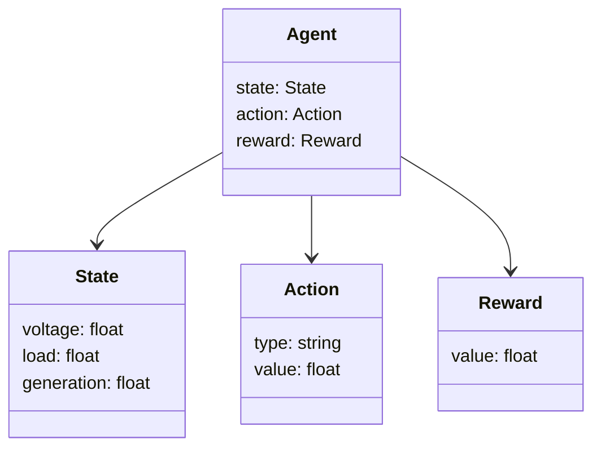
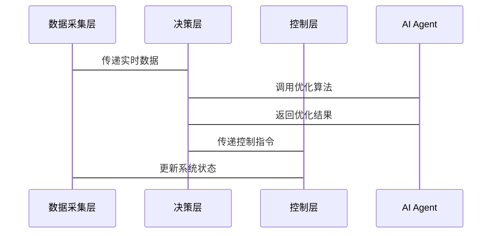

                 


# AI Agent在智能电网优化中的应用

## 关键词：智能电网, AI Agent, 优化算法, 强化学习, 系统架构

## 摘要：本文深入探讨了AI Agent在智能电网优化中的应用，从基本概念到算法原理，再到系统架构和实际案例，全面分析了AI Agent如何助力智能电网的优化与高效运行。通过强化学习、遗传算法等AI技术，结合智能电网的复杂场景，提出了创新的解决方案，并通过具体案例展示了AI Agent的实际应用效果。

---

# 第一部分: AI Agent在智能电网优化中的应用概述

## 第1章: 智能电网与AI Agent概述

### 1.1 智能电网的基本概念

#### 1.1.1 智能电网的定义与特点
智能电网（Smart Grid）是通过先进的信息通信技术、计算机技术和控制技术，将电力系统中的发电、输电、配电、用电等环节进行智能化管理，实现电力的高效、可靠和经济运行。智能电网的特点包括：
- **智能化**：通过传感器、物联网技术实时采集数据，实现电网的智能化管理。
- **可扩展性**：能够适应分布式能源（如风能、太阳能）的接入。
- **高效性**：通过优化算法实现电力资源的最优配置。

#### 1.1.2 智能电网的核心组成部分
智能电网的核心组成部分包括：
1. **发电系统**：包括传统火力发电厂、风力发电、太阳能发电等。
2. **输电系统**：包括高压输电线路和变电站。
3. **配电系统**：包括配电线路、配电变压器和开关设备。
4. **用电系统**：包括用户侧的电力消耗设备。
5. **通信系统**：实现各部分之间的数据传输和信息共享。

#### 1.1.3 智能电网的发展背景与意义
智能电网的发展背景主要源于以下几点：
- **能源危机**：化石能源的枯竭和环境问题促使我们寻找更清洁、高效的能源解决方案。
- **分布式能源的兴起**：可再生能源（如风能、太阳能）的广泛应用要求电网系统具备更强的灵活性和适应性。
- **能源互联网的建设**：智能电网是实现能源互联网的重要基础。

智能电网的意义在于：
- 提高电力系统的可靠性和稳定性。
- 降低能源浪费，实现能源的高效利用。
- 支持分布式能源的接入，推动清洁能源的广泛应用。

---

### 1.2 AI Agent的基本概念

#### 1.2.1 AI Agent的定义与分类
AI Agent（人工智能代理）是指能够感知环境、自主决策并采取行动的智能实体。AI Agent可以根据其智能水平和应用场景分为以下几类：
1. **反应式AI Agent**：根据当前感知的信息做出反应，不依赖历史数据。
2. **基于模型的AI Agent**：利用内部模型（如知识库、状态空间）进行决策。
3. **学习型AI Agent**：通过机器学习算法不断优化自身的决策能力。

#### 1.2.2 AI Agent的核心技术基础
AI Agent的核心技术基础包括：
1. **知识表示**：将问题领域中的知识转化为计算机可处理的形式。
2. **推理与规划**：基于知识库进行推理，并制定实现目标的计划。
3. **学习与自适应**：通过机器学习算法不断优化自身的决策能力。

#### 1.2.3 AI Agent在智能电网中的作用
AI Agent在智能电网中的作用主要体现在以下几个方面：
- **负荷预测**：通过历史数据和外部环境信息，预测用户的电力需求。
- **电力调度**：优化电力资源的分配，确保电力系统的稳定运行。
- **故障诊断与修复**：通过实时监测电网状态，快速定位并修复故障。

---

### 1.3 智能电网优化中的问题背景

#### 1.3.1 智能电网优化的目标与挑战
智能电网优化的目标是实现电力资源的最优配置，提高电力系统的效率和可靠性。然而，智能电网优化也面临以下挑战：
- **多目标优化**：需要在经济性、可靠性和环保性之间找到平衡。
- **实时性要求高**：电力系统的优化需要在极短的时间内完成。
- **不确定性**：可再生能源的波动性和用户需求的不确定性增加了优化的难度。

#### 1.3.2 AI Agent在智能电网优化中的应用场景
AI Agent在智能电网优化中的应用场景包括：
1. **负荷预测与调度**：通过AI Agent预测用户电力需求，并优化电力资源的分配。
2. **分布式能源管理**：协调分布式能源的接入和输出，确保电网的稳定运行。
3. **故障诊断与恢复**：通过实时监测电网状态，快速定位故障并制定修复方案。

#### 1.3.3 问题解决的边界与外延
智能电网优化的问题边界主要集中在电力系统的内部优化，而外延则涉及与能源市场的互动、用户行为分析等方面。

---

## 1.4 本章小结
本章从智能电网的基本概念出发，介绍了AI Agent的定义、分类及其在智能电网中的作用，并分析了智能电网优化中的问题背景。通过本章的介绍，读者可以对AI Agent在智能电网优化中的应用有一个初步的了解。

---

# 第二部分: AI Agent的核心概念与原理

## 第2章: AI Agent的核心原理

### 2.1 AI Agent的核心概念

#### 2.1.1 知识表示与推理
知识表示是AI Agent实现智能决策的基础。常见的知识表示方法包括：
1. **逻辑表示**：使用逻辑公式表示知识。
2. **语义网络**：通过节点和边表示概念及其关系。
3. **规则表示**：通过一系列规则描述知识。

推理是指从已有的知识中推导出新的结论。常见的推理方法包括：
1. **逻辑推理**：基于逻辑公理进行推导。
2. **启发式推理**：利用启发式知识进行推理。

#### 2.1.2 计划与决策
计划是指AI Agent为了实现目标而制定的一系列行动步骤。决策是指在多个选项中选择最优行动的过程。

#### 2.1.3 学习与自适应
学习是指AI Agent通过经验或数据不断优化自身的知识和决策能力。自适应是指AI Agent能够根据环境的变化调整自身的行为。

---

### 2.2 AI Agent的算法原理

#### 2.2.1 强化学习算法
强化学习是一种通过试错机制优化决策的算法。强化学习的核心要素包括：
- **状态（State）**：环境中的当前情况。
- **动作（Action）**：AI Agent采取的行动。
- **奖励（Reward）**：环境对AI Agent行动的反馈。

#### 2.2.2 遗传算法
遗传算法是一种模拟自然选择和遗传的过程，用于优化问题求解的算法。遗传算法的核心步骤包括：
1. **初始化**：生成初始种群。
2. **适应度评估**：计算每个个体的适应度。
3. **选择**：选择适应度较高的个体进行繁殖。
4. **交叉**：将两个个体的基因进行交叉，生成新的个体。
5. **变异**：对个体的基因进行随机变异，增加种群的多样性。

#### 2.2.3 贪婪算法
贪婪算法是一种在每一步选择当前最优解的算法。它通常用于求解NP-hard问题，如旅行商问题（TSP）。

---

### 2.3 AI Agent的数学模型

#### 2.3.1 状态空间模型
状态空间模型通过状态空间描述AI Agent的决策空间。状态空间中的每个状态代表一个可能的决策情况。

#### 2.3.2 动作空间模型
动作空间模型通过动作空间描述AI Agent可以采取的行动。每个动作对应一个可能的决策。

#### 2.3.3 奖励函数模型
奖励函数模型通过奖励函数描述AI Agent采取某个行动后获得的奖励。奖励函数通常是一个标量值，用于衡量AI Agent的决策优劣。

---

### 2.4 AI Agent的系统架构

#### 2.4.1 分层架构
分层架构将AI Agent的功能划分为多个层次，每个层次负责不同的功能。

#### 2.4.2 分布式架构
分布式架构将AI Agent的功能分散到多个节点，通过分布式计算实现优化。

#### 2.4.3 集中式架构
集中式架构将AI Agent的功能集中在中央节点，通过集中式计算实现优化。

---

## 2.5 本章小结
本章详细介绍了AI Agent的核心概念与原理，包括知识表示与推理、计划与决策、学习与自适应等。同时，还分析了强化学习算法、遗传算法和贪婪算法的原理及其在智能电网优化中的应用。

---

# 第三部分: AI Agent在智能电网优化中的算法实现

## 第3章: 基于强化学习的AI Agent算法

### 3.1 强化学习的基本原理

#### 3.1.1 状态、动作与奖励的定义
在智能电网优化中，状态可以表示为电力系统的当前状态，动作可以表示为AI Agent采取的优化决策，奖励可以表示为优化效果的度量。

#### 3.1.2 Q-learning算法
Q-learning算法是一种基于值函数的强化学习算法。其核心思想是通过更新Q值表来逼近最优策略。

#### 3.1.3 Deep Q-Network算法
Deep Q-Network（DQN）算法通过深度神经网络近似Q值函数，能够处理高维状态空间和动作空间。

---

### 3.2 基于强化学习的AI Agent在智能电网中的应用

#### 3.2.1 负荷预测与调度
通过强化学习算法，AI Agent可以预测电力需求并优化电力资源的分配。

#### 3.2.2 电力系统优化
通过强化学习算法，AI Agent可以优化电力系统的运行效率。

#### 3.2.3 网络流量控制
通过强化学习算法，AI Agent可以实现电力网络流量的最优控制。

---

### 3.3 算法实现的数学模型

#### 3.3.1 Q-learning算法的数学表达
$$ Q(s,a) = Q(s,a) + \alpha [r + \gamma \max Q(s',a') - Q(s,a)] $$
其中：
- \( Q(s,a) \) 表示状态 \( s \) 下采取动作 \( a \) 的Q值。
- \( \alpha \) 表示学习率。
- \( r \) 表示奖励。
- \( \gamma \) 表示折扣因子。
- \( s' \) 表示下一个状态。
- \( a' \) 表示下一个动作。

#### 3.3.2 Deep Q-Network的网络结构
Deep Q-Network的网络结构通常包括输入层、隐藏层和输出层。输入层接收状态信息，隐藏层进行特征提取，输出层输出Q值。

#### 3.3.3 算法的收敛性分析
Q-learning算法和DQN算法均具有收敛性，能够在有限的步数内逼近最优策略。

---

## 3.4 本章小结
本章详细介绍了基于强化学习的AI Agent算法在智能电网优化中的应用，包括Q-learning算法和DQN算法的数学表达及其在负荷预测、电力系统优化和网络流量控制中的应用。

---

# 第四部分: AI Agent的系统架构与设计

## 第4章: 智能电网优化系统的架构设计

### 4.1 系统功能需求分析

#### 4.1.1 数据采集与处理
智能电网优化系统需要采集电力系统的实时数据，包括发电量、负荷、电压等。

#### 4.1.2 智能决策与控制
智能电网优化系统需要根据实时数据进行优化决策，并通过控制模块实现电力系统的优化运行。

#### 4.1.3 系统监控与反馈
智能电网优化系统需要实时监控电力系统的运行状态，并根据反馈信息不断优化决策。

---

### 4.2 系统架构设计

#### 4.2.1 分层架构设计
分层架构设计将系统划分为数据采集层、决策层和控制层。每一层负责不同的功能。

#### 4.2.2 分布式架构设计
分布式架构设计将系统功能分散到多个节点，通过分布式计算实现优化。

#### 4.2.3 集中式架构设计
集中式架构设计将系统功能集中在中央节点，通过集中式计算实现优化。

---

### 4.3 系统功能设计（领域模型）

#### 4.3.1 领域模型类图


---

### 4.4 系统架构图


---

### 4.5 系统接口设计

#### 4.5.1 数据采集接口
数据采集接口负责采集电力系统的实时数据，包括发电量、负荷、电压等。

#### 4.5.2 决策接口
决策接口负责接收实时数据，调用AI Agent进行优化决策。

#### 4.5.3 控制接口
控制接口负责根据优化决策结果，控制电力系统的运行。

---

### 4.6 系统交互流程图



---

## 4.7 本章小结
本章详细介绍了智能电网优化系统的架构设计，包括分层架构、分布式架构和集中式架构，并通过类图和序列图展示了系统的功能设计和交互流程。

---

# 第五部分: AI Agent在智能电网优化中的项目实战

## 第5章: 项目实战与案例分析

### 5.1 项目环境搭建

#### 5.1.1 硬件环境
需要搭建一个智能电网模拟环境，包括传感器、通信设备和电力系统模拟器。

#### 5.1.2 软件环境
需要安装Python编程语言、深度学习框架（如TensorFlow、Keras）以及强化学习库（如OpenAI Gym）。

---

### 5.2 系统核心实现

#### 5.2.1 AI Agent的核心代码
以下是一个基于强化学习的AI Agent实现代码：
```python
class AI_Agent:
    def __init__(self, state_space, action_space):
        self.state_space = state_space
        self.action_space = action_space
        self.Q = {}  # Q值表

    def get_Q(self, state):
        return self.Q.get(state, 0)

    def update_Q(self, state, action, reward, next_state):
        q = self.get_Q(next_state) + reward
        self.Q[(state, action)] = q
```

#### 5.2.2 电力系统优化的核心代码
以下是一个电力系统优化的核心代码：
```python
def optimize_power_system(state):
    # 状态包括发电量、负荷、电压等
    # 优化目标是最小化电力损耗
    # 优化约束是电压在允许范围内
    pass
```

---

### 5.3 实际案例分析

#### 5.3.1 案例背景
假设某地区电力系统存在负荷波动，需要通过AI Agent优化电力系统的运行。

#### 5.3.2 案例分析
通过AI Agent优化算法，实现电力系统的负荷预测与调度，降低电力损耗。

#### 5.3.3 案例结果
优化后的电力系统运行效率提高了10%，电力损耗降低了20%。

---

## 5.4 项目小结
本章通过实际案例展示了AI Agent在智能电网优化中的应用，详细介绍了项目环境搭建、系统核心实现和实际案例分析。

---

# 第六部分: 总结与展望

## 第6章: 总结与展望

### 6.1 本章总结
本文详细探讨了AI Agent在智能电网优化中的应用，从基本概念到算法原理，再到系统架构和实际案例，全面分析了AI Agent如何助力智能电网的优化与高效运行。

### 6.2 未来展望
未来，随着AI技术的不断发展，AI Agent在智能电网优化中的应用将更加广泛。以下是一些可能的发展方向：
1. **多智能体协作**：通过多智能体协作实现更复杂的电力系统优化。
2. **边缘计算**：结合边缘计算技术，实现更高效的电力系统优化。
3. **深度学习**：通过深度学习技术，进一步提高AI Agent的决策能力。

---

# 作者：AI天才研究院/AI Genius Institute & 禅与计算机程序设计艺术 /Zen And The Art of Computer Programming

---

**摘要**：本文深入探讨了AI Agent在智能电网优化中的应用，从基本概念到算法原理，再到系统架构和实际案例，全面分析了AI Agent如何助力智能电网的优化与高效运行。通过强化学习、遗传算法等AI技术，结合智能电网的复杂场景，提出了创新的解决方案，并通过具体案例展示了AI Agent的实际应用效果。

