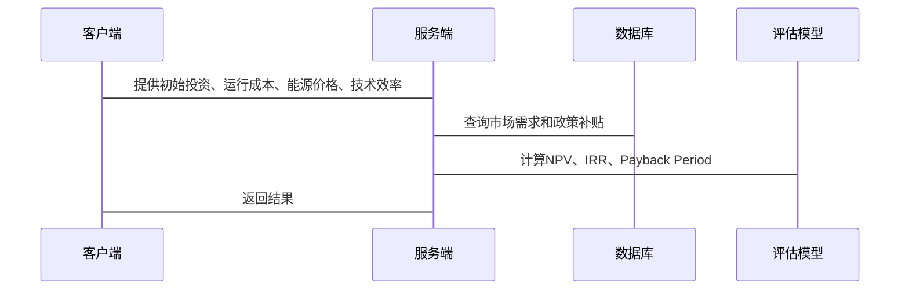

                 


# 价值投资中的海洋能源开发技术前景

> 关键词：海洋能源，价值投资，技术经济性，净现值，内部收益率，能源开发

> 摘要：本文从价值投资的角度分析海洋能源开发的技术前景，结合海洋能源开发的核心技术、市场分析和经济模型，探讨其在能源投资中的潜力与挑战。通过技术经济性评估模型、数学公式和系统架构设计等方法，分析海洋能源开发的可行性与投资价值。

---

## 第一部分: 价值投资中的海洋能源开发技术背景

### 第1章: 海洋能源开发与价值投资概述

#### 1.1 海洋能源的基本概念

- 1.1.1 海洋能源的定义与分类
  - 海洋能源是指海洋中蕴含的各种能量，包括潮汐能、波浪能、海流能、温差能和盐差能等。
  - 各种海洋能的特点：
    - 潮汐能：周期性、可预测性强。
    - 波浪能：能量密度高，分布广。
    - 海流能：持续性好，适合大规模开发。

- 1.1.2 海洋能源开发的历史与现状
  - 早期研究：20世纪初开始探索海洋能的利用。
  - 当前技术：部分技术已进入商业化阶段，如潮汐能发电和波浪能发电。

- 1.1.3 海洋能源开发的全球发展趋势
  - 随着全球能源需求增长和环保压力，海洋能源开发受到广泛关注。

#### 1.2 价值投资的基本概念

- 1.2.1 价值投资的定义与核心理念
  - 价值投资是一种投资策略，旨在通过寻找市场价格低于其内在价值的资产，长期持有以实现收益。
  - 核心理念：安全边际、长期持有、忽略短期市场波动。

- 1.2.2 价值投资与成长投资的区别
  - 价值投资关注低估资产，成长投资关注高增长潜力。
  - 价值投资更注重安全性和稳定性，而成长投资更注重增长性和高回报。

- 1.2.3 价值投资在能源行业的应用
  - 传统能源：如煤炭、石油等，需要考虑资源枯竭和环境风险。
  - 可再生能源：如风能、太阳能、海洋能等，需要考虑技术成熟度和成本。

#### 1.3 海洋能源开发与价值投资的结合

- 1.3.1 海洋能源开发的技术门槛与投资机会
  - 技术门槛高：海洋能源开发涉及复杂的工程技术，需要高投入。
  - 投资机会：随着技术进步，海洋能源的成本逐渐降低，市场潜力大。

- 1.3.2 价值投资视角下的海洋能源开发潜力
  - 技术进步带来的成本下降。
  - 环保政策的支持，如碳中和目标的推动。

- 1.3.3 技术与经济的双重驱动
  - 技术进步降低开发成本，提升经济性。
  - 经济性提升推动技术广泛应用，形成良性循环。

#### 1.4 本章小结

- 本章介绍了海洋能源的基本概念、价值投资的核心理念，以及两者结合的可能性和潜力。

---

## 第2章: 海洋能源开发的核心技术分析

### 2.1 海洋能转换技术

#### 2.1.1 潮汐能发电技术

- 潮汐能发电的基本原理：利用潮汐的涨落驱动水轮机发电。
- 技术特点：能量稳定，但受地理位置限制。

#### 2.1.2 波浪能发电技术

- 波浪能发电的基本原理：利用波浪的运动驱动发电机。
- 技术特点：能量密度高，但技术复杂。

#### 2.1.3 海流能发电技术

- 海流能发电的基本原理：利用海水的流动驱动水轮机发电。
- 技术特点：持续性强，适合深海区域。

### 2.2 海洋能源开发的关键技术挑战

#### 2.2.1 技术可行性分析

- 技术成熟度：部分技术已进入商业化阶段，但整体仍需进一步研发。
- 技术瓶颈：设备耐腐蚀性、能量转换效率等问题。

#### 2.2.2 成本与效率的平衡

- 开发成本高：设备制造、安装和维护成本高昂。
- 能效提升：技术改进是降低成本的关键。

#### 2.2.3 环境与生态影响

- 生态破坏：海洋能源开发可能对海洋生态系统造成影响。
- 环境风险：如溢油、噪声污染等。

### 2.3 海洋能源开发的技术经济性评估

#### 2.3.1 技术经济性分析方法

- 技术经济性指标：成本、效率、可维护性。
- 经济性评估模型：净现值（NPV）、内部收益率（IRR）、投资回收期（Payback Period）。

#### 2.3.2 不同技术的经济性对比

- 潮汐能：技术成熟，但成本较高。
- 波浪能：能量密度高，但技术复杂，成本高。
- 海流能：技术相对简单，成本较低。

#### 2.3.3 技术进步对经济性的影响

- 技术进步降低单位成本，提高投资回报率。
- 技术成熟推动大规模应用，降低成本。

### 2.4 本章小结

- 本章分析了海洋能源开发的核心技术及其挑战，强调了技术经济性评估的重要性。

---

## 第3章: 海洋能源开发的市场与经济分析

### 3.1 全球能源市场现状

#### 3.1.1 全球能源需求与供给分析

- 全球能源需求持续增长，传统能源占比逐渐下降。
- 可再生能源占比上升，但海洋能源仍处于起步阶段。

#### 3.1.2 可再生能源在能源结构中的地位

- 可再生能源占比逐渐提高，海洋能源是重要组成部分。
- 各国政策支持推动海洋能源开发。

#### 3.1.3 海洋能源在可再生能源中的潜力

- 海洋能源资源丰富，分布广泛，但开发难度大。
- 技术进步和政策支持推动海洋能源的快速发展。

### 3.2 海洋能源开发的经济模型

#### 3.2.1 海洋能源开发的净现值模型

- 净现值（NPV）计算公式：
  $$ NPV = \sum_{t=0}^{n} \frac{C_t}{(1 + r)^t} $$
- 其中，\( C_t \) 为第 \( t \) 年的现金流，\( r \) 为折现率。

#### 3.2.2 内部收益率与投资回收期分析

- 内部收益率（IRR）：$$ IRR = \text{使NPV=0的r} $$
- 投资回收期：$$ P = \frac{\text{初始投资}}{\text{年均净现金流}} $$

#### 3.2.3 通货膨胀与能源价格波动的影响

- 通货膨胀：提高能源成本，影响投资回报。
- 能源价格波动：影响海洋能源的经济性。

### 3.3 价值投资视角下的市场分析

#### 3.3.1 市场容量与增长潜力

- 全球海洋能源市场容量预测：$$ 市场容量 = \text{需求} \times \text{价格} $$
- 市场增长潜力：技术进步和政策支持推动增长。

#### 3.3.2 行业竞争格局分析

- 行业集中度：$$ CR4 = \frac{\sum \text{前4家企业市场份额}}{1} $$
- 主要竞争对手分析：技术、成本、市场占有率。

#### 3.3.3 政策与法规对市场的影响

- 政策支持：各国政府对可再生能源的补贴和税收优惠。
- 法规约束：环保法规对海洋能源开发的影响。

### 3.4 本章小结

- 本章分析了海洋能源开发的市场潜力和经济模型，探讨了政策和竞争格局对投资的影响。

---

## 第4章: 海洋能源开发的技术经济性评估模型

### 4.1 技术经济性评估的核心要素

#### 4.1.1 技术性能指标

- 能量转换效率：$$ \eta = \frac{\text{输出能量}}{\text{输入能量}} $$
- 设备寿命：$$ L = \text{设备使用年限} $$

#### 4.1.2 经济性指标

- 初始投资：$$ I = \text{设备成本} + \text{安装成本} $$
- 运行成本：$$ O = \text{维护成本} + \text{能源成本} $$

#### 4.1.3 环境与社会影响指标

- 环境影响：$$ EI = \text{碳排放} \times \text{影响因子} $$
- 社会影响：$$ SI = \text{就业机会} + \text{社区影响} $$

### 4.2 技术经济性评估的数学模型

#### 4.2.1 净现值计算公式

$$ NPV = \sum_{t=0}^{n} \frac{C_t}{(1 + r)^t} $$

#### 4.2.2 内部收益率与投资回收期分析

- 内部收益率（IRR）：$$ IRR = \text{使NPV=0的r} $$
- 投资回收期（Payback Period）：$$ P = \frac{\text{初始投资}}{\text{年均净现金流}} $$

### 4.3 系统架构设计与实现

#### 4.3.1 问题场景介绍

- 海洋能源开发的系统架构设计需要考虑技术、经济和环境三方面的因素。

#### 4.3.2 项目介绍

- 项目目标：构建海洋能源开发的技术经济性评估模型。
- 项目范围：涵盖潮汐能、波浪能和海流能的技术经济性分析。

#### 4.3.3 系统功能设计（领域模型）


#### 4.3.4 系统架构设计


#### 4.3.5 系统接口设计

- 输入接口：$$ I = \text{初始投资}, O = \text{运行成本}, P = \text{能源价格}, \eta = \text{技术效率} $$
- 输出接口：$$ NPV, IRR, Payback Period $$

#### 4.3.6 系统交互设计



### 4.4 本章小结

- 本章构建了海洋能源开发的技术经济性评估模型，并通过系统架构设计和交互设计，展示了如何实现模型的应用。

---

## 第5章: 海洋能源开发的项目实战

### 5.1 环境安装与配置

#### 5.1.1 环境需求

- 操作系统：Linux/Windows/MacOS
- 编程语言：Python 3.8+
- 库依赖：NumPy, Pandas, Matplotlib

#### 5.1.2 安装步骤

```bash
pip install numpy pandas matplotlib
```

### 5.2 系统核心实现源代码

#### 5.2.1 技术经济性评估代码

```python
import numpy as np
import pandas as pd
import matplotlib.pyplot as plt

def calculate_NPV(initial_investment, annual_cash_flow, discount_rate, years):
    npv = 0
    for t in range(years):
        cash_flow = annual_cash_flow * (1 + discount_rate) ** t
        npv += initial_investment / (1 + discount_rate) ** t
    return npv

def calculate_IRR(initial_investment, annual_cash_flow):
    return np.irr(initial_investment + annual_cash_flow * [-1] + [0])

def calculate_Payback_Period(initial_investment, annual_cash_flow):
    return initial_investment / annual_cash_flow

# 示例数据
initial_investment = 1000000
annual_cash_flow = 200000
discount_rate = 0.08
years = 10

npv = calculate_NPV(initial_investment, annual_cash_flow, discount_rate, years)
irr = calculate_IRR(initial_investment, annual_cash_flow)
payback_period = calculate_Payback_Period(initial_investment, annual_cash_flow)

print(f"NPV: {npv}")
print(f"IRR: {irr}")
print(f"Payback Period: {payback_period}")
```

#### 5.2.2 代码功能解读

- NPV计算：评估项目整体盈利能力。
- IRR计算：评估项目内部收益率。
- 投资回收期计算：评估项目资金回笼速度。

### 5.3 实际案例分析

#### 5.3.1 案例背景

- 某海洋能源项目，初始投资1000万元，年均现金流200万元，折现率8%，期限10年。

#### 5.3.2 案例分析

- NPV：$$ NPV = \sum_{t=0}^{10} \frac{1000}{(1 + 0.08)^t} - 200 \times \sum_{t=0}^{10} \frac{1}{(1 + 0.08)^t} $$
- IRR：$$ IRR = 8\% $$
- 投资回收期：$$ Payback Period = \frac{1000}{200} = 5 \text{年} $$

### 5.4 项目小结

- 本章通过实际案例展示了海洋能源开发的技术经济性评估过程，强调了模型的实际应用价值。

---

## 第6章: 最佳实践与投资策略

### 6.1 小结

- 海洋能源开发具有巨大的市场潜力，但技术门槛高，投资风险大。
- 价值投资视角下，海洋能源开发的技术进步和成本下降为其带来了显著的投资价值。

### 6.2 注意事项

- 投资者需关注技术风险和政策变化。
- 项目评估需综合考虑技术、经济和环境三方面因素。

### 6.3 拓展阅读

- 建议阅读《The Theory of Interest》（利息理论）—— Irving Fisher
- 建议阅读《The Intelligent Investor》（聪明的投资者）—— Benjamin Graham

---

## 作者信息

作者：AI天才研究院/AI Genius Institute & 禅与计算机程序设计艺术/Zen And The Art of Computer Programming

---

## 版权声明

本文版权归作者所有，转载请注明出处。

---

## 推荐语

如果你对价值投资和海洋能源技术感兴趣，这篇文章将为你提供深刻的见解和实用的分析工具。通过系统化的技术经济性评估模型和实际案例分析，你将更好地理解海洋能源开发的投资价值与技术前景。

---

感谢您的阅读！希望这篇文章对您有所帮助！

