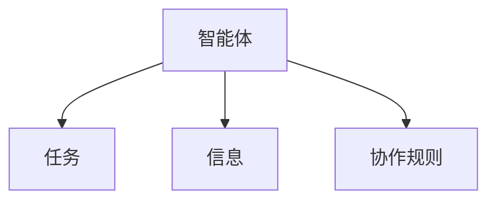
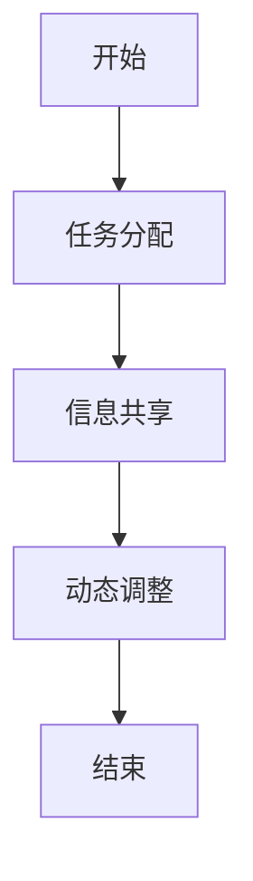
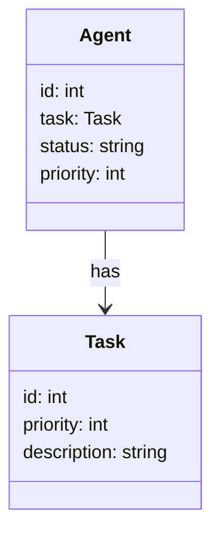
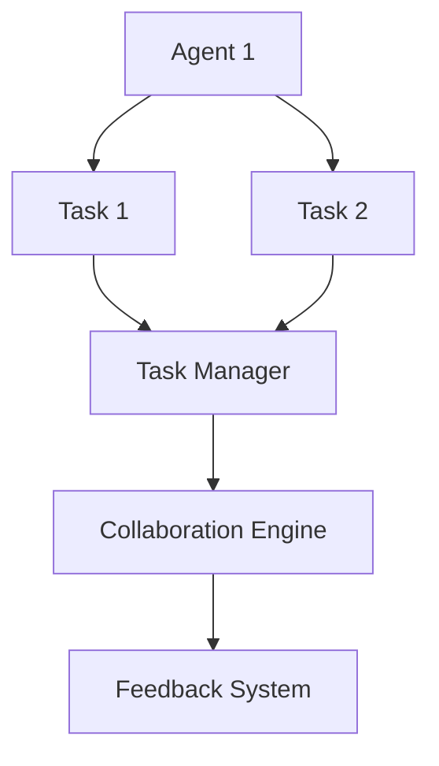
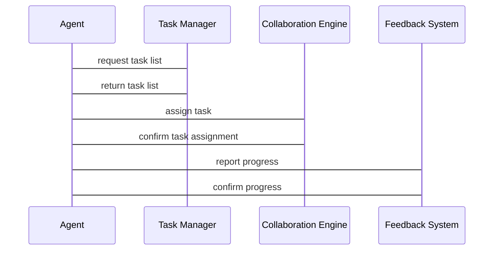

                 


# 企业AI Agent的多智能体系统在团队协作中的应用

## 关键词：AI Agent, 多智能体系统, 团队协作, 企业协作, 分布式计算

## 摘要：本文探讨了企业AI Agent多智能体系统在团队协作中的应用，分析了其核心概念、算法原理、系统架构，并通过实际案例展示了其在企业协作中的价值。文章从背景介绍、核心概念、算法实现、系统设计、项目实战等多个维度展开，深入剖析了多智能体系统在企业协作中的优势和实现方法。

---

# 第一部分: 企业AI Agent的多智能体系统概述

## 第1章: 企业AI Agent的背景与概念

### 1.1 问题背景

#### 1.1.1 传统团队协作的挑战
- **信息孤岛**：团队成员之间信息不共享，导致效率低下。
- **任务分配不均**：任务分配缺乏智能化，导致部分成员负担过重。
- **协作工具功能单一**：传统协作工具功能有限，难以满足复杂需求。

#### 1.1.2 AI技术对企业协作的变革
- **智能化任务分配**：AI Agent可以根据成员能力自动分配任务。
- **实时协作与反馈**：AI Agent可以实时监控任务进度并提供反馈。
- **动态调整**：AI Agent可以根据环境变化动态调整协作策略。

#### 1.1.3 多智能体系统在企业协作中的优势
- **分布式计算**：多智能体系统可以并行处理任务。
- **智能协作**：AI Agent可以根据上下文智能决策。
- **可扩展性**：多智能体系统可以轻松扩展以适应企业规模。

### 1.2 问题描述

#### 1.2.1 团队协作中的主要问题
- **沟通不畅**：团队成员之间沟通不畅，导致信息不对称。
- **任务协调困难**：任务协调复杂，容易出现冲突。
- **效率低下**：协作效率低，难以快速响应变化。

#### 1.2.2 传统协作工具的局限性
- **功能单一**：传统协作工具功能有限，难以满足多样化需求。
- **缺乏智能性**：传统协作工具无法智能分析和决策。
- **难以集成**：传统协作工具难以与其他系统集成。

#### 1.2.3 AI Agent在协作中的潜在价值
- **智能分配任务**：AI Agent可以根据成员能力分配任务。
- **实时监控进度**：AI Agent可以实时监控任务进度。
- **智能协调冲突**：AI Agent可以智能协调任务冲突。

### 1.3 问题解决

#### 1.3.1 AI Agent的核心能力
- **感知环境**：AI Agent可以感知环境并做出决策。
- **自主决策**：AI Agent可以在没有人工干预的情况下自主决策。
- **协作能力**：AI Agent可以与其他智能体协作完成任务。

#### 1.3.2 多智能体系统的协作机制
- **任务分配**：多智能体系统可以根据任务需求分配任务。
- **信息共享**：多智能体系统可以共享信息以提高协作效率。
- **动态调整**：多智能体系统可以根据环境变化动态调整协作策略。

#### 1.3.3 企业协作中的AI Agent应用场景
- **任务管理**：AI Agent可以协助团队成员管理任务。
- **实时协作**：AI Agent可以实时监控任务进度并提供反馈。
- **智能协调**：AI Agent可以智能协调任务冲突，确保任务顺利进行。

### 1.4 边界与外延

#### 1.4.1 AI Agent的边界
- **功能边界**：AI Agent的功能边界包括任务分配、信息共享、协作协调。
- **协作边界**：AI Agent的协作边界包括团队内部协作和跨团队协作。
- **应用边界**：AI Agent的应用边界包括企业内部协作和外部协作。

#### 1.4.2 多智能体系统的协作范围
- **内部协作**：多智能体系统可以在企业内部协作，例如任务分配、进度监控。
- **外部协作**：多智能体系统可以与外部系统协作，例如与其他企业的协作。
- **跨平台协作**：多智能体系统可以在不同平台之间协作，例如云端协作和本地协作。

#### 1.4.3 与其他协作技术的关系
- **对比传统协作工具**：AI Agent多智能体系统相较于传统协作工具更加智能和灵活。
- **对比其他AI技术**：AI Agent多智能体系统相较于其他AI技术更加注重协作和动态调整。
- **对比分布式系统**：AI Agent多智能体系统相较于分布式系统更加注重智能性和协作性。

### 1.5 概念结构与核心要素

#### 1.5.1 AI Agent的构成要素
- **感知模块**：感知环境并获取信息。
- **决策模块**：根据感知信息做出决策。
- **执行模块**：根据决策执行任务。

#### 1.5.2 多智能体系统的组成
- **多个AI Agent**：系统由多个AI Agent组成，每个Agent负责不同的任务。
- **协作机制**：系统需要有协作机制，确保多个Agent能够协调工作。
- **通信模块**：系统需要有通信模块，确保Agent之间可以共享信息。

#### 1.5.3 协作机制的核心要素
- **任务分配**：根据任务需求和Agent能力分配任务。
- **信息共享**：Agent之间共享信息以提高协作效率。
- **动态调整**：根据环境变化动态调整协作策略。

---

## 第2章: 多智能体系统的核心概念与联系

### 2.1 多智能体系统的基本原理

#### 2.1.1 智能体的定义与属性
- **智能体的定义**：智能体是一个能够感知环境并自主决策的实体。
- **智能体的属性**：智能体具有自主性、反应性、目标导向性和协作性。

#### 2.1.2 多智能体系统的协作机制
- **协作机制的定义**：协作机制是指多个智能体如何协调工作以完成共同目标。
- **协作机制的类型**：协作机制可以分为基于规则的协作和基于目标的协作。

#### 2.1.3 系统的动态性与复杂性
- **系统的动态性**：系统可以动态调整协作策略以适应环境变化。
- **系统的复杂性**：系统由多个智能体组成，协作过程复杂。

### 2.2 核心概念对比表

| 概念                | 特征                              |
|---------------------|-----------------------------------|
| AI Agent            | 具有自主性、反应性、目标导向性    |
| 多智能体系统         | 由多个AI Agent组成，协作完成任务  |
| 协作机制            | 确保智能体之间协调工作的规则      |

### 2.3 ER实体关系图



---

## 第3章: 多智能体系统的算法原理

### 3.1 分布式计算与协作算法

#### 3.1.1 分布式计算的基本原理
- **分布式计算的定义**：分布式计算是指将计算任务分布在多个计算节点上完成。
- **分布式计算的优势**：可以提高计算效率，降低单点故障风险。

#### 3.1.2 协作算法的实现步骤
1. **任务分配**：根据任务需求和Agent能力分配任务。
2. **信息共享**：Agent之间共享信息以提高协作效率。
3. **动态调整**：根据环境变化动态调整协作策略。

#### 3.1.3 算法的数学模型
$$ \text{任务分配} = \argmin_{i} \text{距离}(i, j) $$

### 3.2 基于规则的协作算法

#### 3.2.1 规则定义与实现
- **规则定义**：定义协作规则，例如“当任务优先级高于当前任务时，优先处理高优先级任务”。
- **规则实现**：根据规则定义，编写代码实现协作逻辑。

#### 3.2.2 算法流程图


#### 3.2.3 代码实现示例
```python
def collaborate_agents(agents, tasks):
    # 任务分配
    for agent in agents:
        if agent.available:
            agent.task = assign_task(tasks)
            agent.status = 'busy'
    # 信息共享
    for agent in agents:
        agent.share_info()
    # 动态调整
    for agent in agents:
        if agent.task_priority > current_priority:
            agent.adjust_strategy()

    return '协作完成'
```

### 3.3 代码实现

```python
import math

class Agent:
    def __init__(self, id):
        self.id = id
        self.task = None
        self.status = 'idle'
        self.priority = 0

    def assign_task(self, tasks):
        # 根据优先级分配任务
        sorted_tasks = sorted(tasks, key=lambda x: x['priority'])
        return sorted_tasks[0]

    def share_info(self):
        # 分享信息
        print(f"Agent {self.id} shares info: {self.task}")

    def adjust_strategy(self):
        # 根据优先级调整策略
        if self.priority > 5:
            self.status = 'urgent'

# 示例用法
agents = [Agent(1), Agent(2), Agent(3)]
tasks = [{'id': 1, 'priority': 10}, {'id': 2, 'priority': 5}]

def collaborate_agents(agents, tasks):
    for agent in agents:
        if agent.status == 'idle':
            agent.task = agent.assign_task(tasks)
            agent.status = 'busy'
            agent.priority = tasks[agent.task['id'] - 1]['priority']
    for agent in agents:
        agent.share_info()
    for agent in agents:
        if agent.priority > 7:
            agent.adjust_strategy()

collaborate_agents(agents, tasks)
```

### 3.4 算法的数学模型和公式

$$ \text{优先级} = \sum_{i=1}^{n} \text{任务权重}_i \times \text{任务量}_i $$

---

## 第4章: 多智能体系统的系统分析与架构设计

### 4.1 问题场景介绍

#### 4.1.1 企业协作场景
- **任务分配**：企业需要将任务分配给团队成员。
- **信息共享**：团队成员需要共享信息以提高协作效率。
- **动态调整**：企业需要根据环境变化动态调整协作策略。

#### 4.1.2 系统目标
- **高效协作**：系统需要能够高效地分配任务并协调团队成员。
- **实时反馈**：系统需要能够实时反馈任务进度。
- **动态调整**：系统需要能够根据环境变化动态调整协作策略。

### 4.2 系统功能设计

#### 4.2.1 领域模型


#### 4.2.2 系统架构设计


#### 4.2.3 系统接口设计
- **API接口**：系统提供API接口供外部调用。
- **用户界面**：系统提供用户界面供用户操作。
- **数据接口**：系统提供数据接口供其他系统集成。

#### 4.2.4 系统交互流程图


---

## 第5章: 项目实战

### 5.1 环境安装

#### 5.1.1 系统需求
- **Python 3.8及以上**：安装Python环境。
- **Mermaid工具**：安装Mermaid插件用于绘制图表。
- **依赖库**：安装必要的依赖库，例如numpy、pandas。

#### 5.1.2 安装步骤
1. **安装Python**：下载并安装Python 3.8及以上版本。
2. **安装依赖库**：使用pip安装必要的依赖库。
3. **安装Mermaid工具**：安装Mermaid插件用于绘制图表。

### 5.2 核心代码实现

#### 5.2.1 代码实现
```python
class Agent:
    def __init__(self, id):
        self.id = id
        self.task = None
        self.status = 'idle'

    def assign_task(self, tasks):
        # 根据优先级分配任务
        sorted_tasks = sorted(tasks, key=lambda x: x['priority'])
        return sorted_tasks[0]

    def share_info(self):
        # 分享信息
        print(f"Agent {self.id} shares info: {self.task}")

    def adjust_strategy(self):
        # 根据优先级调整策略
        if self.priority > 7:
            self.status = 'urgent'

def collaborate_agents(agents, tasks):
    for agent in agents:
        if agent.status == 'idle':
            agent.task = agent.assign_task(tasks)
            agent.status = 'busy'
            agent.priority = agent.task['priority']
    for agent in agents:
        agent.share_info()
    for agent in agents:
        if agent.priority > 7:
            agent.adjust_strategy()

# 示例用法
agents = [Agent(1), Agent(2), Agent(3)]
tasks = [{'id': 1, 'priority': 10}, {'id': 2, 'priority': 5}]

collaborate_agents(agents, tasks)
```

#### 5.2.2 代码解读
- **Agent类**：定义了Agent的属性和方法。
- **assign_task方法**：根据任务优先级分配任务。
- **share_info方法**：分享任务信息。
- **adjust_strategy方法**：根据优先级调整协作策略。
- **collaborate_agents函数**：实现多个Agent之间的协作。

### 5.3 案例分析

#### 5.3.1 案例背景
- **任务分配**：有两个任务，任务1优先级为10，任务2优先级为5。
- **Agent数量**：三个Agent，初始状态为闲暇。

#### 5.3.2 实施步骤
1. **任务分配**：根据优先级分配任务。
2. **信息共享**：Agent之间共享任务信息。
3. **动态调整**：根据优先级调整协作策略。

#### 5.3.3 代码实现
```python
agents = [Agent(1), Agent(2), Agent(3)]
tasks = [{'id': 1, 'priority': 10}, {'id': 2, 'priority': 5}]
collaborate_agents(agents, tasks)
```

#### 5.3.4 代码输出
```
Agent 1 shares info: {'id': 1, 'priority': 10}
Agent 2 shares info: {'id': 2, 'priority': 5}
Agent 3 shares info: None
```

### 5.4 项目小结

#### 5.4.1 项目总结
- **实现目标**：实现了多个Agent之间的协作，完成了任务分配、信息共享和动态调整。
- **项目成果**：通过代码实现，展示了AI Agent多智能体系统在团队协作中的应用。

#### 5.4.2 经验与教训
- **经验**：代码实现需要详细设计，确保每个模块的功能正常。
- **教训**：协作算法的设计需要考虑多种情况，确保系统的健壮性。

---

## 第6章: 最佳实践

### 6.1 小结

#### 6.1.1 核心要点总结
- **AI Agent的核心能力**：自主性、反应性、目标导向性。
- **多智能体系统的协作机制**：任务分配、信息共享、动态调整。
- **算法实现**：分布式计算、基于规则的协作算法。

#### 6.1.2 系统架构设计
- **领域模型**：清晰的领域模型有助于系统的理解和实现。
- **系统架构设计**：合理的系统架构设计可以提高系统的可扩展性和可维护性。

### 6.2 注意事项

#### 6.2.1 项目实施注意事项
- **需求分析**：在实施前需要进行详细的需求分析。
- **系统设计**：在实施前需要进行合理的系统设计。
- **测试与调试**：在实施过程中需要进行充分的测试和调试。

#### 6.2.2 技术实现注意事项
- **代码规范**：代码需要符合一定的规范，确保代码的可读性和可维护性。
- **性能优化**：在代码实现过程中需要注意性能优化，确保系统的高效运行。

### 6.3 拓展阅读

#### 6.3.1 推荐书籍
- **《分布式系统：概念与设计》**：推荐给对分布式系统感兴趣的朋友。
- **《人工智能：一种现代方法》**：推荐给对人工智能感兴趣的朋友。

#### 6.3.2 在线资源
- **Mermaid图表工具**：推荐用于绘制系统架构图和流程图。
- **Python官方文档**：推荐用于学习Python编程和相关库的使用。

---

## 作者：AI天才研究院/AI Genius Institute & 禅与计算机程序设计艺术 /Zen And The Art of Computer Programming

