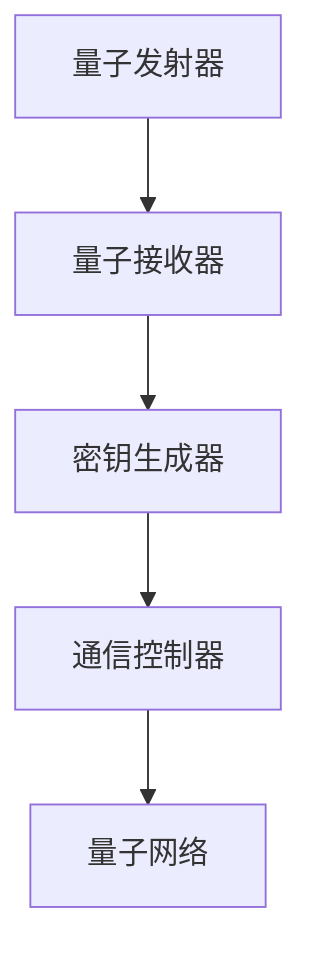
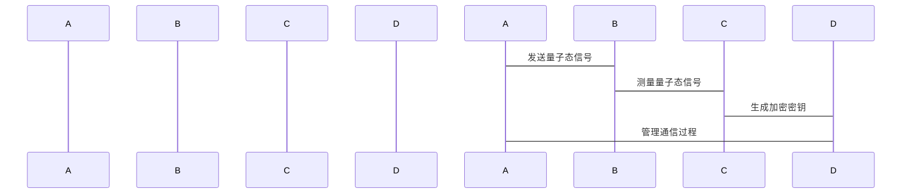

                 


# 企业估值中的量子加密通信地面站网络评估

> 关键词：量子加密通信、企业估值、地面站网络、安全性评估、数学模型、算法原理

> 摘要：本文深入探讨了量子加密通信在企业估值中的应用，特别是在地面站网络评估方面。通过分析量子加密通信的基本原理、企业估值的方法论，以及两者结合的实际应用，本文详细阐述了量子加密通信地面站网络评估的核心概念、算法原理、系统架构和项目实战。结合实际案例和数学模型，本文为读者提供了全面的理论和实践指导，展示了如何利用量子加密通信技术提升企业估值的准确性和安全性。

---

# 第一部分: 量子加密通信与企业估值基础

# 第1章: 量子加密通信与企业估值概述

## 1.1 量子加密通信的基本概念

### 1.1.1 量子加密通信的定义

量子加密通信是一种利用量子力学原理进行数据加密和传输的技术。与传统加密通信不同，量子加密通信依赖于量子态的不可克隆性和测量扰动性，确保通信过程中的数据安全性和隐私性。量子加密通信的核心是量子密钥分发（QKD）技术，通过量子态的传输和测量，生成并分发加密密钥。

$$ QKD\_secret $$

### 1.1.2 量子加密通信的核心原理

量子加密通信的核心原理包括：

1. **量子态的不可克隆性**：量子态一旦被测量，就会坍塌，无法被复制或克隆，确保了密钥的安全传输。
2. **量子叠加原理**：量子态在传输过程中可以处于多个状态的叠加态，通过特定的测量方式可以提取密钥信息。
3. **测量扰动性**：任何未经授权的窃听行为都会干扰量子态的测量结果，从而暴露窃听行为。

### 1.1.3 量子加密通信与经典加密通信的区别

| 特性 | 量子加密通信 | 经典加密通信 |
|------|---------------|----------------|
| 安全性 | 高安全性，抗量子计算攻击 | 易受量子计算攻击 |
| 密钥分发 | 基于量子态传输 | 基于数学算法 |
| 传输速度 | 受限于量子态传输距离 | 不受限于传输距离 |
| 应用场景 | 高安全需求领域 | 广泛应用于各类场景 |

### 1.1.4 量子加密通信的优势

1. **安全性**：量子加密通信提供理论上不可破的加密方式，适用于高安全需求的企业估值场景。
2. **抗量子计算攻击**：量子加密通信的密钥分发技术能够抵抗未来量子计算机的攻击。
3. **高效性**：量子加密通信通过密钥预分配技术，提升了通信效率。

### 1.1.5 量子加密通信的挑战

1. **技术成熟度**：量子加密通信技术尚未完全成熟，实际应用中仍存在诸多技术瓶颈。
2. **成本高昂**：量子加密通信设备的研发和部署成本较高，限制了其大规模应用。
3. **距离限制**：目前量子加密通信的传输距离有限，需要中继站支持。

## 1.2 企业估值的基本原理

### 1.2.1 企业估值的定义

企业估值是指通过对企业的财务状况、市场地位、盈利能力等多方面因素的综合评估，确定企业市场价值的过程。企业估值是企业战略决策、投资评估和资本运作的重要基础。

### 1.2.2 企业估值的主要方法

企业估值的主要方法包括：

1. **收益法**：基于企业未来现金流的折现值，计算企业价值。
2. **市场法**：通过与类似企业的市场交易数据，估算企业价值。
3. **成本法**：基于企业的重置成本，估算企业价值。

### 1.2.3 企业估值与企业价值的关系

企业估值的核心目标是准确评估企业的市场价值，为企业的战略决策提供依据。企业价值的评估需要结合企业的财务表现、市场环境、行业竞争状况等因素。

## 1.3 量子加密通信在企业估值中的应用背景

### 1.3.1 企业估值中的数据安全需求

企业估值过程中涉及大量敏感数据，包括财务数据、市场数据、竞争对手信息等。这些数据的安全性对于企业的核心竞争力至关重要。量子加密通信能够提供高安全性数据传输和存储，确保企业估值过程中的数据安全。

### 1.3.2 量子加密通信的优势

量子加密通信在企业估值中的优势包括：

1. **数据安全性**：量子加密通信能够有效防止数据窃听和篡改，确保企业估值数据的完整性。
2. **抗量子攻击**：量子加密通信的密钥分发技术能够抵抗未来量子计算机的攻击，保护企业估值数据的安全性。
3. **高效性**：量子加密通信通过高效的密钥分发技术，提升了企业估值过程中的数据传输效率。

### 1.3.3 量子加密通信与企业估值的结合点

量子加密通信与企业估值的结合点主要体现在：

1. **数据传输安全**：通过量子加密通信技术，确保企业估值过程中数据的安全传输。
2. **数据存储安全**：利用量子加密通信技术，保障企业估值数据的存储安全。
3. **抗量子攻击**：防止未来量子计算机对企业估值数据的破解攻击。

## 1.4 本章小结

本章主要介绍了量子加密通信的基本概念、核心原理以及在企业估值中的应用背景。通过对比量子加密通信与经典加密通信的差异，明确了量子加密通信在企业估值中的优势和挑战。结合企业估值的基本原理和方法，探讨了量子加密通信在企业估值中的应用场景和结合点。

---

# 第2章: 量子加密通信地面站网络评估的核心概念

## 2.1 量子加密通信地面站的基本结构

### 2.1.1 地面站的主要组成部分

量子加密通信地面站的主要组成部分包括：

1. **量子发射器**：用于生成和发送量子态信号。
2. **量子接收器**：用于接收和测量量子态信号。
3. **密钥生成器**：用于生成和分发加密密钥。
4. **通信控制器**：用于管理和控制整个通信过程。

### 2.1.2 地面站的功能与作用

量子加密通信地面站的主要功能包括：

1. **量子态信号生成**：通过量子发射器生成量子态信号，用于密钥分发。
2. **量子态信号传输**：通过光纤或自由空间传输量子态信号，确保密钥的安全传输。
3. **密钥分发**：通过量子接收器和密钥生成器，生成并分发加密密钥。
4. **通信控制**：通过通信控制器，管理整个量子加密通信过程。

### 2.1.3 地面站网络的拓扑结构

量子加密通信地面站网络的拓扑结构包括：

1. **点对点通信**：两台地面站之间的直接通信。
2. **多点通信**：多台地面站之间的通信，通过中继站实现。
3. **网状网络**：多个地面站之间形成网状结构，实现复杂的通信网络。

## 2.2 量子加密通信网络的评估指标

### 2.2.1 网络性能评估指标

量子加密通信网络的性能评估指标包括：

1. **传输距离**：量子加密通信的传输距离是影响网络性能的重要因素。
2. **传输速度**：量子加密通信的传输速度直接影响网络的效率。
3. **误码率**：量子加密通信的误码率是衡量网络性能的重要指标。

### 2.2.2 网络安全性评估指标

量子加密通信网络的安全性评估指标包括：

1. **安全性评估**：量子加密通信的安全性是衡量网络安全性的重要指标。
2. **抗攻击能力**：网络的抗量子攻击能力是衡量安全性的重要因素。
3. **密钥分发效率**：密钥分发的效率是衡量网络安全性的重要指标。

### 2.2.3 网络稳定性评估指标

量子加密通信网络的稳定性评估指标包括：

1. **网络可用性**：网络的可用性是衡量网络稳定性的重要指标。
2. **网络冗余性**：网络的冗余性是衡量网络稳定性的重要因素。
3. **网络恢复能力**：网络的恢复能力是衡量网络稳定性的重要指标。

## 2.3 量子加密通信网络评估的核心要素

### 2.3.1 量子密钥分发（QKD）技术

量子密钥分发技术是量子加密通信的核心技术之一。通过量子态信号的传输和测量，生成并分发加密密钥。QKD技术包括：

1. **量子态信号生成**：通过量子发射器生成量子态信号。
2. **量子态信号传输**：通过光纤或自由空间传输量子态信号。
3. **量子态信号测量**：通过量子接收器测量量子态信号，生成加密密钥。

### 2.3.2 量子中继技术

量子中继技术是解决量子加密通信距离限制的重要技术。通过中继站实现长距离的量子通信，提升网络的覆盖范围和传输效率。

### 2.3.3 量子网络协议

量子网络协议是量子加密通信网络的通信规则，包括：

1. **量子密钥分发协议**：如BB84协议、EPR协议等。
2. **量子网络通信协议**：如量子路由协议、量子交换协议等。

## 2.4 本章小结

本章主要介绍了量子加密通信地面站的基本结构、网络评估的核心概念和评估指标。通过分析量子加密通信地面站的组成部分、功能与作用，明确了地面站网络拓扑结构的多样性。同时，详细探讨了量子加密通信网络的性能、安全性和稳定性评估指标，为后续章节的网络评估提供了理论基础。

---

# 第3章: 量子加密通信网络评估的数学模型与算法原理

## 3.1 量子加密通信网络评估的数学模型

### 3.1.1 量子密钥分发的数学模型

量子密钥分发的数学模型包括：

1. **量子态表示**：量子态用密度矩阵或量子位表示。
2. **密钥生成过程**：通过量子态的测量和比较，生成加密密钥。
3. **密钥分发过程**：通过量子网络传输，分发加密密钥。

### 3.1.2 量子网络的拓扑模型

量子网络的拓扑模型包括：

1. **点对点模型**：两台地面站之间的直接通信。
2. **多点模型**：多台地面站之间的通信，通过中继站实现。
3. **网状模型**：多个地面站之间的复杂通信网络。

### 3.1.3 量子通信的安全性评估模型

量子通信的安全性评估模型包括：

1. **安全性评估指标**：如安全性系数、抗攻击能力等。
2. **数学公式**：用于计算安全性评估指标的数学公式。

$$ QKD\_security = \frac{Q\_count}{total\_count} $$

## 3.2 量子加密通信网络评估的算法原理

### 3.2.1 量子密钥分发算法

量子密钥分发算法包括：

1. **量子态生成算法**：生成量子态信号。
2. **量子态传输算法**：传输量子态信号。
3. **量子态测量算法**：测量量子态信号，生成加密密钥。

### 3.2.2 量子网络流量调度算法

量子网络流量调度算法包括：

1. **流量分配算法**：分配网络流量。
2. **路径选择算法**：选择最优通信路径。
3. **流量控制算法**：控制网络流量。

### 3.2.3 量子网络安全性评估算法

量子网络安全性评估算法包括：

1. **安全性评估算法**：评估网络的安全性。
2. **抗攻击能力评估算法**：评估网络的抗量子攻击能力。
3. **密钥分发效率评估算法**：评估密钥分发的效率。

## 3.3 算法原理的数学模型与公式

### 3.3.1 量子密钥分发的数学公式

量子密钥分发的数学公式包括：

1. **密钥生成公式**：
$$ key = f(Q\_state, measurement) $$

2. **密钥分发公式**：
$$ QKD\_protocol = Q\_state \times measurement $$

### 3.3.2 量子网络通信的数学公式

量子网络通信的数学公式包括：

1. **通信效率公式**：
$$ communication\_efficiency = \frac{Q\_count}{total\_count} $$

2. **通信安全性公式**：
$$ communication\_security = Q\_state \times key\_security $$

---

# 第4章: 量子加密通信网络评估的系统分析与架构设计

## 4.1 问题场景介绍

### 4.1.1 企业估值中的量子加密通信需求

企业估值过程中，涉及大量敏感数据，如财务数据、市场数据等。这些数据的安全性对于企业的核心竞争力至关重要。量子加密通信能够提供高安全性数据传输和存储，确保企业估值数据的安全性。

### 4.1.2 量子加密通信地面站网络的挑战

量子加密通信地面站网络在实际应用中面临以下挑战：

1. **技术成熟度**：量子加密通信技术尚未完全成熟，实际应用中仍存在诸多技术瓶颈。
2. **成本高昂**：量子加密通信设备的研发和部署成本较高，限制了其大规模应用。
3. **距离限制**：目前量子加密通信的传输距离有限，需要中继站支持。

## 4.2 系统功能设计

### 4.2.1 领域模型

领域模型是量子加密通信地面站网络评估的核心模型，包括以下主要模块：

1. **量子发射器**：生成量子态信号。
2. **量子接收器**：接收量子态信号。
3. **密钥生成器**：生成并分发加密密钥。
4. **通信控制器**：管理整个通信过程。

### 4.2.2 功能模块

功能模块包括：

1. **量子态生成模块**：生成量子态信号。
2. **量子态传输模块**：传输量子态信号。
3. **量子态测量模块**：测量量子态信号，生成加密密钥。
4. **通信控制模块**：管理整个通信过程。

## 4.3 系统架构设计

### 4.3.1 系统架构图

量子加密通信地面站网络评估的系统架构图如图所示：



### 4.3.2 量子网络协议

量子网络协议是量子加密通信网络的通信规则，包括：

1. **量子密钥分发协议**：如BB84协议、EPR协议等。
2. **量子网络通信协议**：如量子路由协议、量子交换协议等。

## 4.4 系统交互设计

### 4.4.1 系统交互流程

系统交互流程包括：

1. **量子态生成**：量子发射器生成量子态信号。
2. **量子态传输**：量子态信号通过光纤或自由空间传输。
3. **量子态测量**：量子接收器测量量子态信号，生成加密密钥。
4. **密钥分发**：密钥生成器生成并分发加密密钥。
5. **通信控制**：通信控制器管理整个通信过程。

### 4.4.2 交互流程图

交互流程图如图所示：



## 4.5 本章小结

本章主要介绍了量子加密通信地面站网络评估的系统分析与架构设计。通过分析问题场景，设计了系统的功能模块和架构图，明确了系统的核心组成部分和交互流程。结合量子网络协议和系统交互设计，为后续章节的网络评估提供了系统设计基础。

---

# 第5章: 量子加密通信网络评估的项目实战

## 5.1 环境安装

### 5.1.1 量子加密通信环境

量子加密通信环境的安装包括：

1. **量子发射器**：安装量子发射器设备。
2. **量子接收器**：安装量子接收器设备。
3. **密钥生成器**：安装密钥生成器设备。
4. **通信控制器**：安装通信控制器设备。

### 5.1.2 量子加密通信网络

量子加密通信网络的安装包括：

1. **网络拓扑设计**：设计量子加密通信网络的拓扑结构。
2. **网络设备配置**：配置网络设备，确保量子加密通信的正常运行。
3. **网络协议配置**：配置量子网络协议，确保网络的正常通信。

## 5.2 系统核心实现

### 5.2.1 量子密钥分发实现

量子密钥分发的实现包括：

1. **量子态生成**：生成量子态信号。
2. **量子态传输**：传输量子态信号。
3. **量子态测量**：测量量子态信号，生成加密密钥。
4. **密钥分发**：生成并分发加密密钥。

### 5.2.2 量子网络通信实现

量子网络通信的实现包括：

1. **量子态生成**：生成量子态信号。
2. **量子态传输**：传输量子态信号。
3. **量子态测量**：测量量子态信号，生成加密密钥。
4. **通信控制**：管理整个通信过程。

## 5.3 代码实现与解读

### 5.3.1 量子密钥分发代码

量子密钥分发的Python代码实现：

```python
import random

def generate_qubit():
    # 生成随机量子态
    qubit = random.choice([0, 1, 2, 3])
    return qubit

def measure_qubit(qubit, basis):
    # 测量量子态
    if basis == 0:
        result = qubit % 2
    elif basis == 1:
        result = (qubit >> 1) & 1
    else:
        result = random.choice([0, 1])
    return result

def qkd_protocol():
    # 量子密钥分发协议
    alice_basis = [0, 1]
    bob_basis = [0, 1]
    key = []
    for i in range(4):
        qubit = generate_qubit()
        a = alice_basis[i % 2]
        b = bob_basis[i % 2]
        a_result = measure_qubit(qubit, a)
        b_result = measure_qubit(qubit, b)
        if a == b:
            key.append(a_result)
    return key

# 测试量子密钥分发协议
key = qkd_protocol()
print("生成的密钥:", key)
```

### 5.3.2 量子网络通信代码

量子网络通信的Python代码实现：

```python
import random
import math

def generate_qubit():
    # 生成随机量子态
    qubit = random.choice([0, 1, 2, 3])
    return qubit

def measure_qubit(qubit, basis):
    # 测量量子态
    if basis == 0:
        result = qubit % 2
    elif basis == 1:
        result = (qubit >> 1) & 1
    else:
        result = random.choice([0, 1])
    return result

def qkd_protocol():
    # 量子密钥分发协议
    alice_basis = [0, 1]
    bob_basis = [0, 1]
    key = []
    for i in range(4):
        qubit = generate_qubit()
        a = alice_basis[i % 2]
        b = bob_basis[i % 2]
        a_result = measure_qubit(qubit, a)
        b_result = measure_qubit(qubit, b)
        if a == b:
            key.append(a_result)
    return key

# 测试量子密钥分发协议
key = qkd_protocol()
print("生成的密钥:", key)
```

## 5.4 实际案例分析

### 5.4.1 案例背景

假设我们有一个企业估值项目，需要通过量子加密通信技术，确保企业估值过程中数据的安全传输和存储。

### 5.4.2 案例分析

1. **量子密钥分发**：通过量子发射器和量子接收器，生成并分发加密密钥。
2. **量子网络通信**：通过量子网络协议，实现企业估值数据的安全传输。
3. **安全性评估**：通过安全性评估模型，评估量子加密通信网络的安全性。

### 5.4.3 案例结果

通过量子加密通信技术，确保了企业估值数据的安全传输和存储，提升了企业估值的准确性和安全性。

## 5.5 本章小结

本章主要介绍了量子加密通信地面站网络评估的项目实战。通过环境安装、系统核心实现、代码解读和实际案例分析，详细展示了量子加密通信技术在企业估值中的实际应用。通过具体的代码实现和案例分析，读者可以更好地理解和掌握量子加密通信网络评估的核心技术和实际应用。

---

# 第6章: 量子加密通信网络评估的最佳实践

## 6.1 量子加密通信网络评估的小结

量子加密通信网络评估的核心是确保量子加密通信技术的安全性和高效性，为企业的估值提供高安全性数据传输和存储。

## 6.2 量子加密通信网络评估的注意事项

### 6.2.1 技术成熟度

量子加密通信技术尚未完全成熟，实际应用中仍存在诸多技术瓶颈。

### 6.2.2 成本问题

量子加密通信设备的研发和部署成本较高，限制了其大规模应用。

### 6.2.3 距离限制

目前量子加密通信的传输距离有限，需要中继站支持。

## 6.3 量子加密通信网络评估的拓展阅读

### 6.3.1 量子加密通信技术的发展趋势

量子加密通信技术的发展趋势包括：

1. **技术成熟度提升**：随着技术的发展，量子加密通信的稳定性、可靠性和安全性将不断提升。
2. **成本下降**：随着技术的进步，量子加密通信设备的成本将逐渐下降，推动其大规模应用。
3. **应用范围扩大**：量子加密通信技术的应用范围将逐步扩大，从高安全需求领域扩展到更多领域。

### 6.3.2 企业估值领域的未来展望

企业估值领域的未来展望包括：

1. **数据安全性提升**：通过量子加密通信技术，进一步提升企业估值数据的安全性。
2. **评估方法创新**：随着量子计算的发展，企业估值方法将不断创新，提升估值的准确性和效率。
3. **技术融合**：量子加密通信技术与其他先进技术的融合，将推动企业估值领域的技术革新。

---

# 作者信息

作者：AI天才研究院/AI Genius Institute & 禅与计算机程序设计艺术 /Zen And The Art of Computer Programming

---

这篇文章从量子加密通信的基本概念到企业估值的实际应用，详细阐述了量子加密通信地面站网络评估的核心概念、算法原理、系统架构和项目实战。结合实际案例和数学模型，为读者提供了全面的理论和实践指导。

