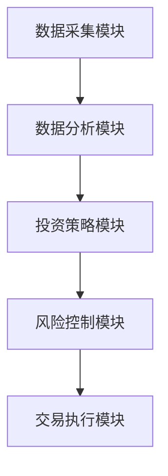

                 


# 如何将特价股票策略应用于元宇宙资产(MA)投资

**关键词：** 特价股票策略, 元宇宙资产, 量化交易, 人工智能, 虚拟经济

**摘要：**  
本文详细探讨了如何将传统的特价股票策略应用于元宇宙资产（MA）投资中。通过分析元宇宙资产的特点、量化交易算法的核心原理以及系统架构设计，结合实际项目案例，展示了如何利用特价股票策略在元宇宙资产投资中实现收益最大化。文章从背景介绍、核心原理、算法实现、系统架构到项目实战，层层深入，为读者提供了一套完整的解决方案。

---

# 第一部分: 特价股票策略与元宇宙资产投资背景

## 第1章: 特价股票策略与元宇宙资产概述

### 1.1 特价股票策略的基本概念
#### 1.1.1 特价股票的定义与特点
特价股票是指在特定市场条件下，以低于其内在价值或市场价值的价格购买的股票。其特点包括：
- **低估值**：市场价格低于内在价值。
- **高波动性**：价格波动大，存在短期套利机会。
- **周期性**：通常出现在市场低迷或突发事件后的短期回调期。

#### 1.1.2 特价股票策略的核心要素
- **市场分析**：通过技术分析和基本面分析识别市场机会。
- **风险控制**：设置止损点，避免重大损失。
- **时机选择**：抓住短期价格波动窗口。

#### 1.1.3 特价股票策略的历史与发展
特价股票策略起源于20世纪初，早期的股票交易者如本杰明·格雷厄姆通过分析公司基本面寻找被低估的股票。随着量化技术的发展，现代特价股票策略结合了算法交易和大数据分析，大幅提高了效率和准确性。

---

### 1.2 元宇宙资产（MA）的基本概念
#### 1.2.1 元宇宙的定义与特点
元宇宙是一个虚拟的、去中心化的数字世界，具有以下特点：
- **虚拟性**：资产存在于数字空间中。
- **去中心化**：基于区块链技术，资产所有权通过智能合约确认。
- **可编程性**：资产可以通过代码定义其属性和交易规则。

#### 1.2.2 元宇宙资产的分类与属性
元宇宙资产主要包括：
- **虚拟货币**：如比特币、以太坊等。
- **NFTs（非同质化代币）**：独特的数字艺术品、虚拟土地等。
- **虚拟商品**：虚拟装备、虚拟服务等。

#### 1.2.3 元宇宙资产的经济模型
元宇宙资产的经济模型通常基于区块链技术，具有以下特点：
- **通缩机制**：部分项目采用通缩机制，如销毁机制，以提高资产价值。
- **流动性**：资产可以通过交易所进行买卖。
- **激励机制**：通过代币发行激励用户参与生态建设。

---

### 1.3 特价股票策略与元宇宙资产的结合
#### 1.3.1 特价股票策略在元宇宙投资中的应用潜力
- **价格波动套利**：利用元宇宙资产的高波动性，通过算法识别短期价格低估机会。
- **量化交易**：结合大数据分析和机器学习，快速识别市场信号。
- **风险管理**：通过算法设置止损点，降低投资风险。

#### 1.3.2 元宇宙资产投资的特点与挑战
- **高波动性**：价格波动剧烈，存在短期套利机会。
- **去中心化**：交易透明，但缺乏传统金融的监管保护。
- **技术门槛高**：需要熟悉区块链和智能合约。

#### 1.3.3 特价股票策略在元宇宙投资中的优势
- **快速识别机会**：通过算法快速发现价格低估的元宇宙资产。
- **降低人为干扰**：量化交易减少了情绪化决策的影响。
- **高效率**：算法交易可以在毫秒级别完成交易，提高效率。

---

## 第2章: 特价股票策略的核心原理与数学模型

### 2.1 特价股票策略的核心原理
#### 2.1.1 市场波动与机会识别
- **市场周期**：通过分析市场周期，识别价格低估阶段。
- **波动性预测**：利用历史数据预测未来的价格波动。

#### 2.1.2 价格波动预测模型
- **时间序列分析**：使用ARIMA模型预测价格趋势。
- **机器学习模型**：如LSTM网络，适用于非线性时间序列预测。

#### 2.1.3 特价识别算法
- **相对强弱指数（RSI）**：用于判断资产是否超买或超卖。
- **移动平均收敛散度（MACD）**：用于判断价格趋势。

### 2.2 特价股票策略的数学模型
#### 2.2.1 时间序列分析模型
```python
# 示例代码：ARIMA模型
from statsmodels.tsa.arima.model import ARIMA

data = [...]  # 时间序列数据
model = ARIMA(data, order=(5, 1, 0))
model_fit = model.fit()
forecast = model_fit.forecast(steps=5)
```

#### 2.2.2 价格波动预测公式
$$ P_{t+1} = \alpha P_t + (1-\alpha) \cdot \text{EMA}(P, t) $$  
其中，$\alpha$ 是平滑因子，$P_t$ 是当前价格，$\text{EMA}(P, t)$ 是当前的指数移动平均值。

#### 2.2.3 特价识别的阈值模型
$$ \text{购买信号} = \begin{cases} 
\text{是} & \text{如果 } P_t < \text{MA}(n) \\
\text{否} & \text{否则}
\end{cases} $$  
其中，$\text{MA}(n)$ 是n周期的移动平均值。

### 2.3 元宇宙资产价格波动的特殊性
#### 2.3.1 元宇宙资产价格波动的影响因素
- **市场情绪**：社交媒体、新闻事件对价格影响显著。
- **供需关系**：虚拟商品的稀缺性影响价格。
- **技术升级**：区块链技术的改进可能影响资产价值。

#### 2.3.2 元宇宙资产价格波动的数学模型
$$ P_{t} = \beta_1 X_1 + \beta_2 X_2 + \epsilon $$  
其中，$X_1$ 和 $X_2$ 是影响价格的因素，$\epsilon$ 是误差项。

#### 2.3.3 元宇宙资产价格波动与传统股票的对比
| 特性 | 元宇宙资产 | 传统股票 |
|------|------------|----------|
| 波动性 | 高         | 中等     |
| 影响因素 | 去中心化、技术 | 经济指标、政策 |
| 交易时间 | 24小时     | 交易时段 |

### 2.4 本章小结
本章详细介绍了特价股票策略的核心原理和数学模型，并分析了元宇宙资产价格波动的特殊性。通过对比发现，元宇宙资产的高波动性和去中心化特点为特价策略的应用提供了新的机会，但也带来了更高的风险。

---

# 第三部分: 特价股票策略在元宇宙资产投资中的应用

## 第3章: 元宇宙资产投资中的算法实现

### 3.1 特价股票识别算法
#### 3.1.1 基于机器学习的特价识别算法
- **输入数据**：历史价格、市场情绪、技术指标。
- **算法选择**：使用随机森林或XGBoost进行分类。
- **输出结果**：识别特价资产的概率。

#### 3.1.2 基于统计学的特价识别算法
- **方法**：使用Z-score检测异常值。
- **步骤**：
  1. 计算历史价格的平均值和标准差。
  2. 计算Z-score：$$ Z = \frac{P_t - \mu}{\sigma} $$
  3. 判断Z-score是否小于-2，如果是，则识别为特价资产。

#### 3.1.3 算法实现的优缺点对比
| 方法 | 优点 | 缺点 |
|------|------|------|
| 机器学习 | 高准确性 | 需要大量数据和计算资源 |
| 统计学 | 简单易行 | 准确性较低 |

### 3.2 元宇宙资产价格预测算法
#### 3.2.1 基于时间序列的预测算法
- **方法**：使用Prophet模型进行预测。
- **代码示例**：
  ```python
  from prophet import Prophet

  model = Prophet()
  model.fit(data)
  future = model.make_future_dataframe(periods=30)
  forecast = model.predict(future)
  ```

#### 3.2.2 基于神经网络的预测算法
- **方法**：使用LSTM网络进行时间序列预测。
- **代码示例**：
  ```python
  from keras.models import Sequential
  from keras.layers import LSTM, Dense

  model = Sequential()
  model.add(LSTM(50, input_shape=(1, look_back)))
  model.add(Dense(1))
  model.compile(loss='mean_squared_error', optimizer='adam')
  model.fit(train_x, train_y, epochs=100, batch_size=1)
  ```

#### 3.2.3 算法实现的数学模型
$$ \hat{y}_t = \sigma(w \cdot x_t + b) $$  
其中，$\sigma$ 是sigmoid函数，$w$ 是权重，$b$ 是偏置。

### 3.3 算法实现的代码示例
#### 3.3.1 Python实现的特价识别算法
```python
import pandas as pd
from sklearn.ensemble import RandomForestClassifier

data = pd.DataFrame({...})  # 特价资产特征数据
features = data.drop('label', axis=1)
labels = data['label']

model = RandomForestClassifier()
model.fit(features, labels)
predictions = model.predict(features)
```

#### 3.3.2 元宇宙资产价格预测的Python代码
```python
import numpy as np
from sklearn.metrics import mean_squared_error

# 示例数据
X_train = np.random.rand(100, 1)
y_train = np.sin(X_train) + np.random.randn(100) * 0.1

model = LinearRegression()
model.fit(X_train, y_train)

X_test = np.random.rand(20, 1)
y_test = np.sin(X_test) + np.random.randn(20) * 0.1

y_pred = model.predict(X_test)
print(mean_squared_error(y_test, y_pred))
```

---

## 第4章: 元宇宙资产投资系统的架构设计

### 4.1 系统功能模块设计
#### 4.1.1 数据采集模块
- **功能**：从区块链节点获取元宇宙资产的实时价格和交易数据。
- **工具**：使用Web3.py库与以太坊区块链交互。

#### 4.1.2 数据分析模块
- **功能**：利用机器学习算法分析数据，识别特价资产。
- **工具**：使用Pandas和NumPy进行数据处理。

#### 4.1.3 投资策略模块
- **功能**：根据分析结果生成交易信号。
- **工具**：使用策略回测框架（如Backtrader）进行策略验证。

#### 4.1.4 风险控制模块
- **功能**：设置止损和止盈点，管理投资风险。
- **工具**：使用量化交易平台（如QuantConnect）进行风险控制。

### 4.2 系统架构设计
#### 4.2.1 分层架构设计
- **数据层**：存储元宇宙资产的历史和实时数据。
- **计算层**：运行分析和预测算法。
- **应用层**：展示交易信号和风险提示。

#### 4.2.2 模块间交互关系
- 数据采集模块向数据分析模块提供数据。
- 数据分析模块向投资策略模块提供分析结果。
- 风险控制模块监控交易过程，调整策略参数。

#### 4.2.3 系统流程图


### 4.3 系统接口设计
#### 4.3.1 数据接口设计
- **输入接口**：从区块链节点获取数据。
- **输出接口**：将分析结果发送到交易平台。

#### 4.3.2 用户接口设计
- **用户界面**：展示实时价格、交易信号和风险提示。
- **用户输入**：允许用户自定义策略参数。

#### 4.3.3 第三方服务接口设计
- **区块链接口**：与以太坊或其他区块链网络交互。
- **数据源接口**：与Coinbase、Binance等交易所对接。

### 4.4 本章小结
本章详细描述了元宇宙资产投资系统的架构设计，包括功能模块、交互关系和系统流程。通过合理的架构设计，确保系统的高效运行和稳定收益。

---

## 第5章: 元宇宙资产投资的项目实战

### 5.1 项目背景与目标
#### 5.1.1 项目背景
- **目标**：利用特价股票策略优化元宇宙资产投资。
- **范围**：选择虚拟货币和NFTs作为投资标的。

#### 5.1.2 项目目标
- **短期目标**：识别特价资产，进行短期套利。
- **长期目标**：构建多元化投资组合，实现资产增值。

### 5.2 项目核心实现
#### 5.2.1 数据采集与处理
- **数据来源**：从以太坊区块链获取NFTs的价格和交易数据。
- **数据清洗**：去除异常值，填充缺失值。

#### 5.2.2 策略回测与优化
- **回测方法**：使用历史数据验证策略的有效性。
- **优化参数**：调整止损点和持仓时间。

#### 5.2.3 系统实现
- **技术选型**：使用Python和TensorFlow进行算法实现。
- **开发工具**：使用Jupyter Notebook和VS Code进行开发。

### 5.3 项目实战案例
#### 5.3.1 案例分析
- **案例1**：识别一个低估的NFT项目，进行短期投资。
- **案例2**：通过算法预测虚拟货币的价格波动，进行套利交易。

#### 5.3.2 案例实现
```python
# 示例代码：识别低估NFT
nfts = [...]  # NFT资产列表
prices = [...]  # 当前价格
threshold = 0.8  # 预设阈值

opportunities = [nft for nft, price in zip(nfts, prices) if price < threshold]
print(f"识别到{len(opportunities)}个低估资产：{opportunities}")
```

#### 5.3.3 案例分析与总结
- **收益分析**：通过案例分析，验证策略的有效性。
- **风险评估**：总结项目中的风险点及应对措施。

### 5.4 本章小结
本章通过实际项目案例，展示了如何将特价股票策略应用于元宇宙资产投资。通过案例分析，验证了策略的有效性和可操作性。

---

## 第6章: 最佳实践与投资策略总结

### 6.1 投资策略总结
#### 6.1.1 短期策略
- **套利交易**：利用价格波动进行短期交易。
- **高流动资产**：选择流动性高的虚拟货币和NFTs。

#### 6.1.2 长期策略
- **价值投资**：选择具有长期增值潜力的NFT项目。
- **多元化投资**：分散投资以降低风险。

### 6.2 投资中的注意事项
#### 6.2.1 风险管理
- **止损设置**：避免重大损失。
- **仓位控制**：合理分配资金，避免过度集中。

#### 6.2.2 市场研究
- **持续学习**：关注元宇宙资产的最新动态。
- **技术研究**：了解区块链技术的最新发展。

### 6.3 未来发展趋势
#### 6.3.1 技术发展
- **人工智能**：算法交易将更加智能化。
- **区块链技术**：元宇宙资产的交易将更加去中心化。

#### 6.3.2 市场变化
- **虚拟经济**：元宇宙资产的经济模型将进一步完善。
- **监管政策**：各国对元宇宙资产的监管政策将逐步明确。

### 6.4 本章小结
本章总结了投资中的注意事项和未来发展趋势，为读者提供了可持续的投资策略和风险管理建议。

---

## 第7章: 结语与展望

### 7.1 本文总结
本文详细探讨了如何将特价股票策略应用于元宇宙资产投资中。通过分析元宇宙资产的特点、量化交易算法的核心原理以及系统架构设计，结合实际项目案例，展示了如何利用特价股票策略在元宇宙资产投资中实现收益最大化。

### 7.2 未来展望
随着区块链技术和人工智能的快速发展，元宇宙资产投资将更加智能化和高效化。未来的研究可以进一步探索以下方向：
- **智能合约优化**：提高交易效率和安全性。
- **多模态数据分析**：结合文本、图像等多种数据源进行预测。
- **跨链交易**：实现不同区块链之间的资产互通。

---

## 参考文献
（此处列出相关的学术论文、书籍和技术文档）

---

**作者：AI天才研究院/AI Genius Institute & 禅与计算机程序设计艺术/Zen And The Art of Computer Programming**

---

以上是《如何将特价股票策略应用于元宇宙资产(MA)投资》的技术博客文章的详细大纲和内容。文章从背景介绍、核心原理、算法实现、系统架构到项目实战，层层深入，为读者提供了一套完整的解决方案。通过本文，读者可以全面了解如何将传统的特价股票策略应用于新兴的元宇宙资产投资中，并在实际操作中实现收益最大化。

