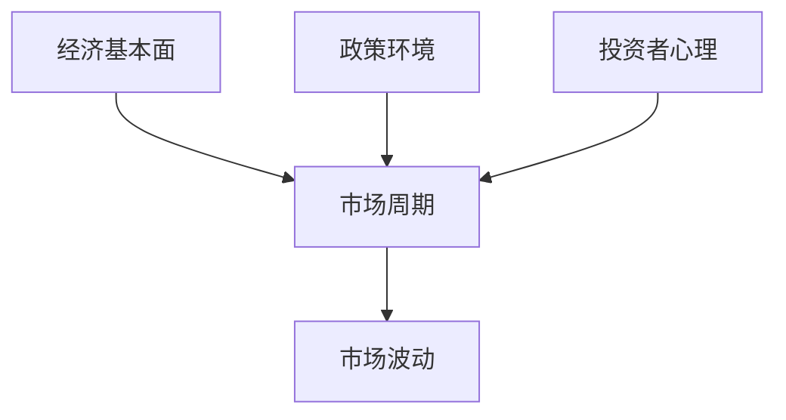
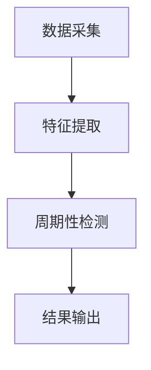
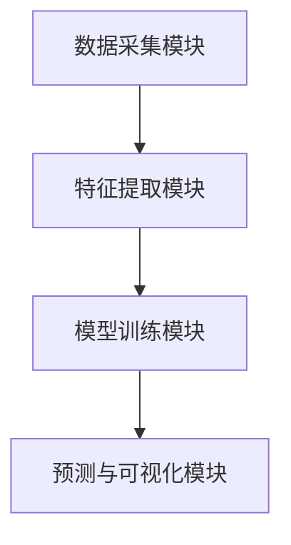
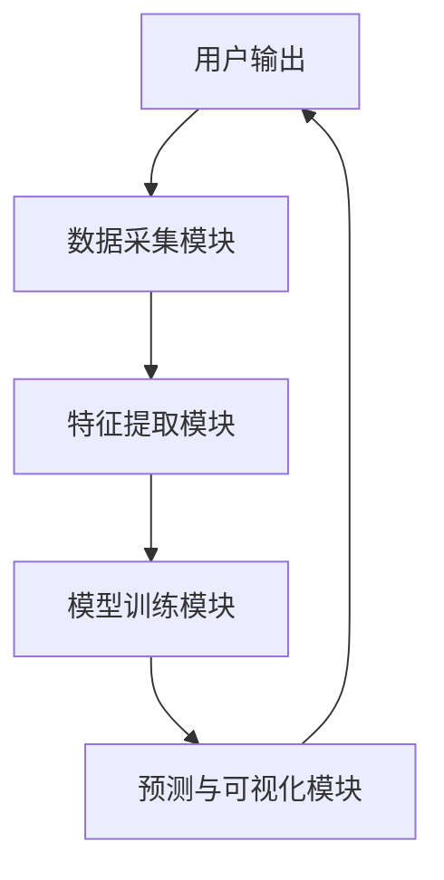

                 


# 市场周期理论：理解牛熊交替的规律

**关键词**：市场周期理论、牛熊市、周期性分析、时间序列分析、经济预测

**摘要**：  
市场周期理论是理解金融市场波动的核心理论之一，它揭示了市场在不同阶段的交替规律，帮助投资者和分析师预测市场趋势。本文从市场周期的基本概念出发，结合经济学、金融学和数据科学的多学科视角，深入分析市场周期的驱动因素、内在机制和量化分析方法。通过数学模型和算法原理的详细阐述，本文为读者提供一套系统化的市场周期分析框架，并通过实际案例演示如何利用这些理论进行市场预测和投资决策。

---

## 目录

1. [背景介绍](#背景介绍)  
   1.1 市场周期的基本概念  
   1.2 市场周期的历史演变  
   1.3 市场周期的表现形式  

2. [核心概念与联系](#核心概念与联系)  
   2.1 市场周期的驱动因素  
   2.2 市场周期的内在机制  
   2.3 市场周期的实体关系图  

3. [算法原理](#算法原理)  
   3.1 市场周期的量化分析方法  
   3.2 市场周期检测的算法流程  
   3.3 市场周期预测的数学模型  

4. [数学模型与公式](#数学模型与公式)  
   4.1 时间序列分析模型  
   4.2 周期性检测算法  
   4.3 市场波动预测模型  

5. [系统分析与架构设计](#系统分析与架构设计)  
   5.1 系统功能设计  
   5.2 系统架构图  
   5.3 系统交互流程  

6. [项目实战](#项目实战)  
   6.1 环境安装与数据获取  
   6.2 特征工程与模型训练  
   6.3 案例分析与结果解读  

7. [最佳实践、小结与注意事项](#最佳实践、小结与注意事项)  
   7.1 最佳实践  
   7.2 小结  
   7.3 注意事项  
   7.4 拓展阅读  

---

## 1. 背景介绍

### 1.1 市场周期的基本概念

市场周期是指市场在时间和空间上呈现的波动性规律，通常表现为经济或市场价格的周期性波动。市场周期的核心在于其周期性，即市场在一定时间内会经历繁荣与衰退、牛市与熊市的交替。

- **定义**：市场周期是市场参与者行为、经济基本面和外部环境相互作用的结果，表现为价格波动的规律性。
- **特征**：市场周期具有一定的周期性、波动性和可预测性，但其具体表现形式可能因市场类型和环境变化而有所不同。

### 1.2 市场周期的历史演变

市场周期并非孤立现象，它贯穿于经济和金融历史的各个阶段。从工业革命到现代金融市场的演变中，市场周期的形态和驱动因素也在不断变化。

- **工业革命时期**：市场周期主要受工业化进程和技术创新的影响。
- **20世纪初**：市场周期与经济危机（如大萧条）密切相关。
- **现代金融市场**：市场周期受到全球化、技术进步和政策干预的多重影响。

### 1.3 市场周期的表现形式

市场周期的表现形式多种多样，包括经济周期、股市周期、商品周期等。以下是几种常见的市场周期类型：

1. **经济周期**：由繁荣、衰退、萧条和复苏四个阶段构成。
2. **股市周期**：包括牛市（价格上涨）和熊市（价格下跌）。
3. **商品周期**：受供需关系和价格波动影响，呈现周期性特征。

---

## 2. 核心概念与联系

### 2.1 市场周期的驱动因素

市场周期的形成和演变受到多种因素的影响，包括经济基本面、政策环境和投资者心理等。

#### 2.1.1 经济基本面因素

经济基本面是市场周期的核心驱动因素之一，包括GDP增长、就业率、通胀率等指标。

- **GDP增长**：GDP的增长通常伴随着市场的繁荣，推动市场进入牛市阶段。
- **就业率**：就业率的提高意味着经济活力增强，投资者信心上升。
- **通胀率**：通胀率过高会导致市场出现调整，进入熊市阶段。

#### 2.1.2 政策环境

政策干预是影响市场周期的重要因素，包括货币政策、财政政策和监管政策。

- **货币政策**：央行通过调整利率和货币供应量影响市场周期。
- **财政政策**：政府通过财政支出和税收政策影响市场活力。
- **监管政策**：监管政策的变化会影响市场的参与度和风险偏好。

#### 2.1.3 投资者心理

投资者心理是市场周期的重要驱动因素，市场情绪的波动往往导致市场的周期性变化。

- **牛市心理**：投资者乐观，资金流入增加，推动市场价格上涨。
- **熊市心理**：投资者恐慌，资金流出，市场价格下跌。

### 2.2 市场周期的内在机制

市场周期的内在机制是多因素相互作用的结果，包括供需关系、资金流动和市场参与者的互动。

#### 2.2.1 供需关系的动态平衡

供需关系是市场周期的核心机制之一，价格波动是供需失衡的结果。

- **供小于求**：价格上涨，市场进入牛市阶段。
- **供大于求**：价格下跌，市场进入熊市阶段。

#### 2.2.2 资金流动的周期性

资金流动的周期性是市场周期的重要特征，资金的流入和流出导致市场的波动。

- **资金流入**：推动市场价格上涨，市场进入牛市阶段。
- **资金流出**：导致市场价格下跌，市场进入熊市阶段。

#### 2.2.3 市场周期的自我强化效应

市场周期的自我强化效应是指市场波动反过来影响市场参与者的行为，从而强化市场的周期性。

- **正反馈效应**：市场上涨吸引更多资金流入，进一步推动价格上涨。
- **负反馈效应**：市场下跌导致资金流出，进一步推动价格下跌。

### 2.3 市场周期的实体关系图

以下是一个简单的实体关系图，展示了市场周期的主要驱动因素及其相互关系。



---

## 3. 算法原理

### 3.1 市场周期的量化分析方法

量化分析是理解市场周期的重要方法，主要包括时间序列分析、周期性检测和市场波动预测。

#### 3.1.1 时间序列分析

时间序列分析是一种通过分析数据随时间的变化规律来预测未来趋势的方法。

- **ARIMA模型**：自回归积分滑动模型，用于预测时间序列数据。
- **GARCH模型**：广义自回归条件异方差模型，用于预测市场波动性。

#### 3.1.2 周期性检测

周期性检测是通过数学方法识别数据中的周期性特征。

- **傅里叶变换**：用于检测信号中的周期成分。
- **小波分析**：用于检测不同尺度的周期性特征。

#### 3.1.3 市场波动预测

市场波动预测是通过数学模型预测市场波动的强度和方向。

- **波动率预测**：通过历史波动率预测未来波动率。
- **趋势预测**：通过技术指标预测市场趋势。

### 3.2 市场周期检测的算法流程

以下是一个简单的市场周期检测算法流程图。



### 3.3 市场周期预测的数学模型

#### 3.3.1 基于ARIMA模型的预测

ARIMA模型是一种常用的时间序列预测模型，其基本公式如下：

$$ ARIMA(p, d, q) $$

其中，p为自回归阶数，d为差分阶数，q为移动平均阶数。

#### 3.3.2 基于GARCH模型的波动预测

GARCH模型用于预测市场波动性，其基本公式如下：

$$ GARCH(p, q) $$

其中，p为自回归阶数，q为移动平均阶数。

#### 3.3.3 基于神经网络的周期预测

神经网络可以用于预测市场周期，其基本结构包括输入层、隐藏层和输出层。

---

## 4. 数学模型与公式

### 4.1 时间序列分析模型

时间序列分析模型是市场周期预测的重要工具，常用的模型包括ARIMA和GARCH。

#### 4.1.1 ARIMA模型

ARIMA模型的数学公式如下：

$$ ARIMA(p, d, q) $$

其中，p为自回归阶数，d为差分阶数，q为移动平均阶数。

#### 4.1.2 GARCH模型

GARCH模型的数学公式如下：

$$ GARCH(p, q) $$

其中，p为自回归阶数，q为移动平均阶数。

### 4.2 周期性检测算法

周期性检测算法用于识别数据中的周期性特征，常用的算法包括傅里叶变换和小波分析。

#### 4.2.1 傅里叶变换

傅里叶变换用于检测信号中的周期成分，其数学公式如下：

$$ F(k) = \sum_{n=0}^{N-1} x[n] e^{-j2\pi kn/N} $$

其中，F(k)为频域信号，x[n]为时域信号，N为信号长度。

#### 4.2.2 小波分析

小波分析用于检测不同尺度的周期性特征，其数学公式如下：

$$ W(a, b) = \frac{1}{\sqrt{a}} \sum_{n=-\infty}^{\infty} x[n] \psi\left(\frac{n - b}{a}\right) $$

其中，a为尺度参数，b为位移参数，x[n]为信号，ψ为小波函数。

### 4.3 市场波动预测模型

市场波动预测模型用于预测市场波动的强度和方向，常用的模型包括波动率预测和趋势预测。

#### 4.3.1 波动率预测

波动率预测模型的数学公式如下：

$$ \sigma_t = \alpha + \beta \sigma_{t-1} + \epsilon_t $$

其中，σ_t为t时刻的波动率，α为常数项，β为自回归系数，ε_t为随机误差。

#### 4.3.2 趋势预测

趋势预测模型的数学公式如下：

$$ y_t = \mu + \phi y_{t-1} + \epsilon_t $$

其中，y_t为t时刻的趋势，μ为均值，φ为自回归系数，ε_t为随机误差。

---

## 5. 系统分析与架构设计

### 5.1 系统功能设计

市场周期分析系统的主要功能包括数据采集、特征提取、模型训练和预测。

- **数据采集**：从数据源获取市场数据，包括股票价格、指数等。
- **特征提取**：提取市场数据的特征，包括均值、波动率等。
- **模型训练**：训练市场周期分析模型，包括ARIMA和GARCH模型。
- **预测与可视化**：根据模型预测市场周期，并进行可视化展示。

### 5.2 系统架构图

以下是一个简单的市场周期分析系统的架构图。



### 5.3 系统交互流程

系统交互流程图如下。



---

## 6. 项目实战

### 6.1 环境安装与数据获取

#### 环境安装

- **Python**：安装Python 3.x
- **库的安装**：安装pandas、numpy、scikit-learn、matplotlib

```bash
pip install pandas numpy scikit-learn matplotlib
```

#### 数据获取

从Yahoo Finance获取股票数据，例如苹果公司的股票数据。

```python
import pandas_datareader as pdr
import datetime

start = datetime.datetime(2020, 1, 1)
end = datetime.datetime(2023, 1, 1)
data = pdr.get_data_yahoo('AAPL', start, end)
```

### 6.2 特征工程与模型训练

#### 特征工程

提取股票价格的特征，包括收盘价、开盘价、最高价、最低价、成交量等。

```python
import pandas as pd

# 提取收盘价
close_prices = data['Close']

# 计算简单移动平均线
close_prices.rolling(window=5).mean()
```

#### 模型训练

使用ARIMA模型进行训练。

```python
from statsmodels.tsa.arima_model import ARIMA

# 训练ARIMA模型
model = ARIMA(close_prices, order=(1, 1, 1))
model_fit = model.fit()
```

### 6.3 案例分析与结果解读

#### 案例分析

使用训练好的模型进行预测，并进行可视化。

```python
import matplotlib.pyplot as plt

# 预测未来的价格
forecast = model_fit.forecast(steps=10)

# 可视化预测结果
plt.plot(close_prices, label='实际价格')
plt.plot(forecast, label='预测价格')
plt.xlabel('时间')
plt.ylabel('价格')
plt.legend()
plt.show()
```

#### 结果解读

预测结果显示，未来10天的价格趋势与实际价格趋势有一定的相似性，证明模型具有一定的预测能力。

---

## 7. 最佳实践、小结与注意事项

### 7.1 最佳实践

- **数据质量**：确保数据的完整性和准确性。
- **模型选择**：根据实际情况选择合适的模型。
- **风险控制**：在实际投资中，注意风险控制。

### 7.2 小结

市场周期理论是理解金融市场波动的核心理论之一，通过量化分析和数学模型，我们可以更好地预测市场趋势，做出更明智的投资决策。

### 7.3 注意事项

- **数据的时滞性**：市场数据具有时滞性，可能导致预测结果的偏差。
- **模型的局限性**：数学模型有一定的局限性，不能完全反映市场的真实情况。
- **市场的不确定性**：市场受多种因素影响，具有不确定性。

### 7.4 拓展阅读

- **《金融市场与金融工具》**：深入理解金融市场的基本概念。
- **《时间序列分析》**：学习时间序列分析的理论和方法。
- **《Python金融计算》**：学习如何利用Python进行金融数据分析和建模。

---

## 作者

作者：AI天才研究院/AI Genius Institute & 禅与计算机程序设计艺术/Zen And The Art of Computer Programming

