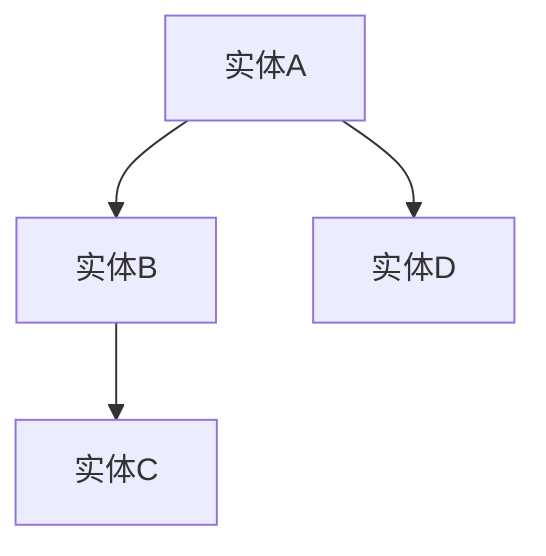
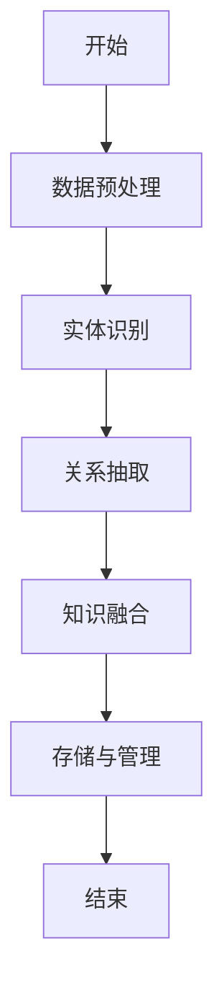
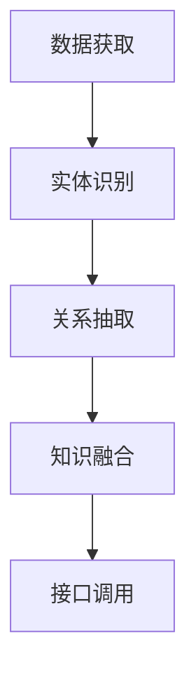
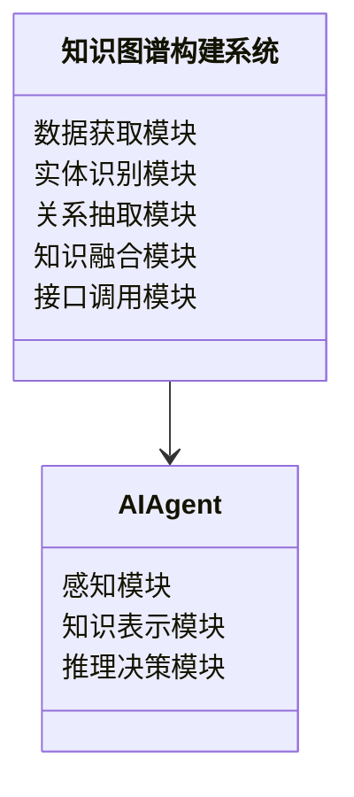
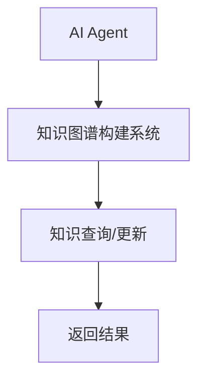
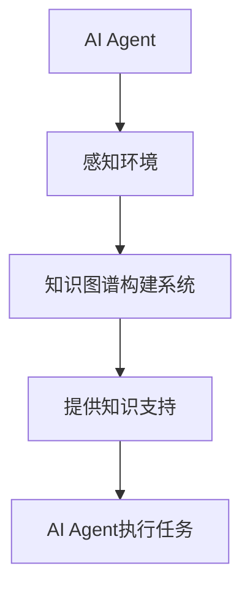

                 


# 开发具有跨领域知识图谱构建能力的AI Agent

> 关键词：知识图谱，AI Agent，跨领域，知识构建，算法原理，系统架构

> 摘要：本文深入探讨了开发具有跨领域知识图谱构建能力的AI Agent的核心技术与实现方法。从背景介绍到核心概念，从算法原理到系统架构，再到项目实战和最佳实践，详细分析了构建跨领域知识图谱所需的各个方面，为读者提供了全面的技术指导和实践参考。

---

# 第一部分: 开发具有跨领域知识图谱构建能力的AI Agent背景介绍

## 第1章: 背景与问题背景

### 1.1 问题背景
#### 1.1.1 知识图谱的定义与特点
知识图谱是一种以结构化的形式表示知识的网络，由实体（概念）和关系（属性）组成，具有语义丰富、可扩展性强、支持复杂查询等特点。

#### 1.1.2 AI Agent的定义与特点
AI Agent是一种具有感知、推理和行动能力的智能体，能够根据环境信息做出决策并执行任务，具有自主性、反应性和社会性等特点。

#### 1.1.3 跨领域知识图谱构建的必要性
随着AI技术的快速发展，跨领域知识图谱的构建需求日益增长，能够帮助AI Agent在复杂环境中更好地理解和执行任务。

### 1.2 问题描述
#### 1.2.1 知识图谱构建的挑战
知识图谱的构建涉及数据获取、实体识别、关系抽取等多个步骤，每个步骤都面临数据稀疏性、噪声干扰和语义理解等挑战。

#### 1.2.2 AI Agent在跨领域中的应用需求
AI Agent需要能够处理不同领域的知识，支持多任务和复杂场景的应用，如智能问答、推荐系统和自动驾驶等。

#### 1.2.3 当前技术的局限性与改进方向
当前技术在知识图谱的动态更新、跨领域关联和实时推理方面存在不足，需要通过改进算法和系统架构来解决。

### 1.3 问题解决
#### 1.3.1 跨领域知识图谱构建的核心目标
构建一个能够跨越多个领域，支持动态更新和语义理解的知识图谱，为AI Agent提供全面的知识支持。

#### 1.3.2 AI Agent在跨领域知识图谱中的作用
AI Agent通过感知环境、推理知识图谱中的关系，能够做出更智能的决策和行动。

#### 1.3.3 解决方案的可行性分析
通过结合自然语言处理、图嵌入和强化学习等技术，构建跨领域知识图谱是可行的。

### 1.4 边界与外延
#### 1.4.1 知识图谱的边界定义
知识图谱的边界包括实体、关系和属性，不涉及具体的应用场景和业务逻辑。

#### 1.4.2 AI Agent的功能边界
AI Agent的功能边界包括感知、推理和执行，不涉及具体的知识存储和管理。

#### 1.4.3 跨领域知识图谱的外延与应用场景
跨领域知识图谱的应用场景包括智能问答、推荐系统、知识推理和复杂任务执行等。

#### 1.4.4 概念结构与核心要素
跨领域知识图谱的核心要素包括实体、关系、属性和语义信息，AI Agent的核心功能模块包括感知模块、知识表示模块和推理决策模块。

### 1.5 本章小结
本章介绍了开发具有跨领域知识图谱构建能力的AI Agent的背景，分析了问题背景、挑战与解决方案，明确了概念结构与功能边界。

---

# 第二部分: 跨领域知识图谱构建的核心概念与联系

## 第2章: 跨领域知识图谱的核心概念

### 2.1 知识图谱的核心原理
#### 2.1.1 知识图谱的三元组表示
知识图谱通过三元组（头实体，关系，尾实体）表示知识，例如（“人”，“是”，“智能体”）。

#### 2.1.2 知识图谱的构建流程
知识图谱的构建流程包括数据获取、实体识别、关系抽取、知识融合和存储管理等步骤。

#### 2.1.3 知识图谱的存储与管理
知识图谱可以存储在图数据库中，如Neo4j，支持高效的查询和更新操作。

### 2.2 AI Agent的核心功能
#### 2.2.1 AI Agent的感知能力
AI Agent通过传感器或API获取环境中的数据，例如从文本中提取实体和关系。

#### 2.2.2 AI Agent的知识表示能力
AI Agent将感知到的知识表示为结构化的形式，例如三元组或图嵌入向量。

#### 2.2.3 AI Agent的推理与决策能力
AI Agent基于知识图谱中的关系进行推理，例如通过路径分析或逻辑推理做出决策。

### 2.3 跨领域知识图谱与AI Agent的联系
#### 2.3.1 知识图谱为AI Agent提供知识基础
知识图谱为AI Agent提供了跨领域的知识支持，例如在医疗领域提供疾病和治疗方法的知识。

#### 2.3.2 AI Agent为知识图谱提供动态更新能力
AI Agent可以通过与环境交互，实时更新知识图谱中的信息，例如发现新的实体或关系。

#### 2.3.3 跨领域知识图谱的构建需要AI Agent的协同工作
AI Agent可以协助知识图谱的构建，例如通过自动化的数据获取和关系抽取。

### 2.4 核心概念对比分析
#### 2.4.1 知识图谱与传统数据库的对比
| 特性          | 知识图谱         | 传统数据库   |
|---------------|-----------------|--------------|
| 数据结构      | 图结构          | 行列结构     |
| 查询能力      | 支持复杂查询     | 支持简单查询 |
| 应用场景      | 智能应用         | 事务处理     |

#### 2.4.2 AI Agent与传统知识推理系统的对比
| 特性          | AI Agent        | 传统知识推理系统 |
|---------------|-----------------|----------------|
| 智能性         | 高              | 中             |
| 自适应性       | 高              | 低             |
| 应用场景       | 多领域           | 单领域         |

#### 2.4.3 跨领域知识图谱与单一领域知识图谱的对比
| 特性          | 跨领域知识图谱    | 单一领域知识图谱 |
|---------------|-----------------|----------------|
| 知识范围      | 跨多个领域       | 单一领域       |
| 复杂性         | 高              | 低             |
| 应用场景       | 复杂任务         | 简单任务       |

### 2.5 ER实体关系图架构


### 2.6 本章小结
本章分析了跨领域知识图谱和AI Agent的核心概念，通过对比分析和实体关系图，明确了两者之间的联系与区别。

---

# 第三部分: 跨领域知识图谱构建的算法原理

## 第3章: 知识图谱构建算法

### 3.1 知识图谱构建的算法原理
#### 3.1.1 基于统计的实体识别算法
基于统计的实体识别算法通过分析文本中的上下文信息，利用概率模型识别实体，例如条件随机场（CRF）。

#### 3.1.2 基于规则的关系抽取算法
基于规则的关系抽取算法通过预定义的规则和模式匹配，从文本中抽取关系，例如基于正则表达式的模式匹配。

#### 3.1.3 基于深度学习的实体链接算法
基于深度学习的实体链接算法通过训练模型，将实体映射到知识图谱中的节点，例如使用图嵌入模型（TransE、TransH）。

### 3.2 知识图谱构建的数学模型
#### 3.2.1 实体表示的向量空间模型
实体表示可以通过向量空间模型表示，例如Word2Vec或 GloVe。

#### 3.2.2 关系表示的图嵌入模型
关系可以通过图嵌入模型表示，例如TransE模型将实体和关系表示为向量。

#### 3.2.3 知识图谱的统一表示模型
知识图谱可以通过统一的表示模型表示，例如将实体和关系嵌入到同一个向量空间中。

### 3.3 算法流程图


### 3.4 本章小结
本章详细介绍了知识图谱构建的算法原理，包括实体识别、关系抽取和知识融合等步骤，并通过流程图展示了构建过程。

---

# 第四部分: 跨领域知识图谱构建的系统架构与实现

## 第4章: 系统架构设计

### 4.1 系统功能设计
#### 4.1.1 系统功能模块
- 数据获取模块：负责从多种数据源获取知识数据，例如网页、数据库和API。
- 实体识别模块：负责识别文本中的实体。
- 关系抽取模块：负责抽取实体之间的关系。
- 知识融合模块：负责将抽取的关系合并到知识图谱中。
- 接口调用模块：负责与AI Agent进行交互，提供知识查询和更新服务。

#### 4.1.2 系统功能流程


### 4.2 系统架构设计
#### 4.2.1 系统架构图


### 4.3 系统接口设计
#### 4.3.1 系统接口描述
- 数据获取接口：提供从多种数据源获取数据的功能。
- 知识查询接口：提供根据实体或关系查询知识图谱的功能。
- 知识更新接口：提供动态更新知识图谱的功能。

#### 4.3.2 接口交互流程


### 4.4 系统交互设计
#### 4.4.1 系统交互流程


### 4.5 本章小结
本章详细设计了跨领域知识图谱构建系统的架构，包括功能模块、架构图和接口设计，为后续的实现提供了基础。

---

# 第五部分: 项目实战与最佳实践

## 第5章: 项目实战

### 5.1 环境安装与配置
#### 5.1.1 环境需求
- Python 3.8+
- 图数据库：Neo4j
- 自然语言处理库：spaCy
- 深度学习框架：TensorFlow或PyTorch

### 5.2 系统核心实现
#### 5.2.1 实体识别模块实现
```python
import spacy

nlp = spacy.load("en_core_web_sm")
text = "AI Agent is an intelligent system."
doc = nlp(text)
for ent in doc.ents:
    print(ent.text, ent.label_)
```

#### 5.2.2 关系抽取模块实现
```python
from transformers import pipeline

nlp = pipeline("ner")
text = "AI Agent is an intelligent system."
result = nlp(text)
print(result)
```

#### 5.2.3 知识融合模块实现
```python
from neo4j import GraphDatabase

driver = GraphDatabase.driver("bolt://localhost:7687", auth=("neo4j", "password"))
session = driver.session()
session.run("CREATE (a:Entity {name: 'AI Agent'})")
session.run("CREATE (b:Entity {name: 'Intelligent System'})")
session.run("CREATE (a)-[:IS]->(b)")
```

### 5.3 代码应用解读与分析
#### 5.3.1 实体识别模块
上述代码使用spaCy库进行实体识别，能够从文本中提取出实体及其标签。

#### 5.3.2 关系抽取模块
上述代码使用Hugging Face的transformers库进行关系抽取，能够识别出文本中的实体及其关系。

#### 5.3.3 知识融合模块
上述代码使用Neo4j图数据库进行知识融合，将实体和关系存储到图数据库中，形成知识图谱。

### 5.4 实际案例分析
#### 5.4.1 案例背景
假设我们有一个医疗领域的知识图谱，包含疾病、症状和治疗方法等实体。

#### 5.4.2 案例分析
AI Agent可以通过知识图谱查询疾病与症状之间的关系，帮助医生进行诊断。

### 5.5 本章小结
本章通过实际项目实战，详细介绍了环境配置、核心模块实现和案例分析，为读者提供了实践参考。

---

# 第六部分: 最佳实践与注意事项

## 第6章: 最佳实践

### 6.1 小结
跨领域知识图谱的构建需要结合多种技术，包括自然语言处理、图嵌入和深度学习等。

### 6.2 注意事项
- 数据质量：确保数据来源可靠，减少噪声干扰。
- 知识表示：选择合适的知识表示方法，确保语义的准确性和可扩展性。
- 系统性能：优化系统的性能，提高知识查询和更新的效率。

### 6.3 拓展阅读
- 《Knowledge Graph Construction: A Survey》
- 《Neural-symbolic AI: A New Frontier in AI Research》

### 6.4 本章小结
本章总结了开发具有跨领域知识图谱构建能力的AI Agent的最佳实践，提出了注意事项和拓展阅读建议。

---

# 第七部分: 作者信息

## 作者：AI天才研究院/AI Genius Institute & 禅与计算机程序设计艺术 /Zen And The Art of Computer Programming

---

**以上是《开发具有跨领域知识图谱构建能力的AI Agent》的技术博客文章的完整目录大纲和部分章节内容。如需进一步扩展或调整，请随时告知！**

