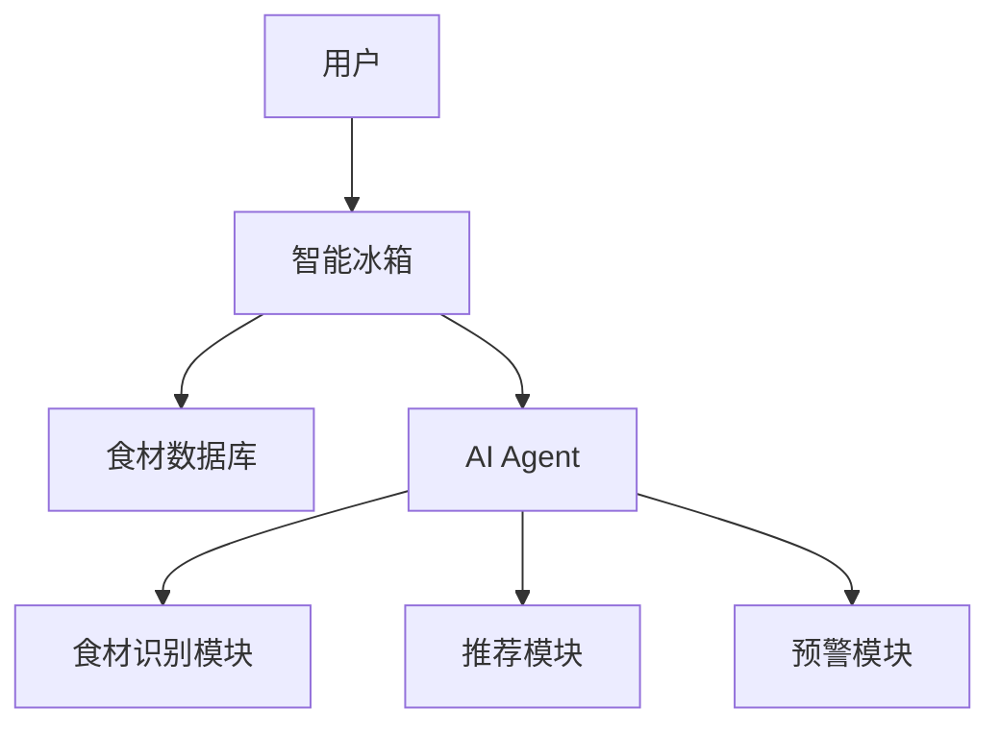
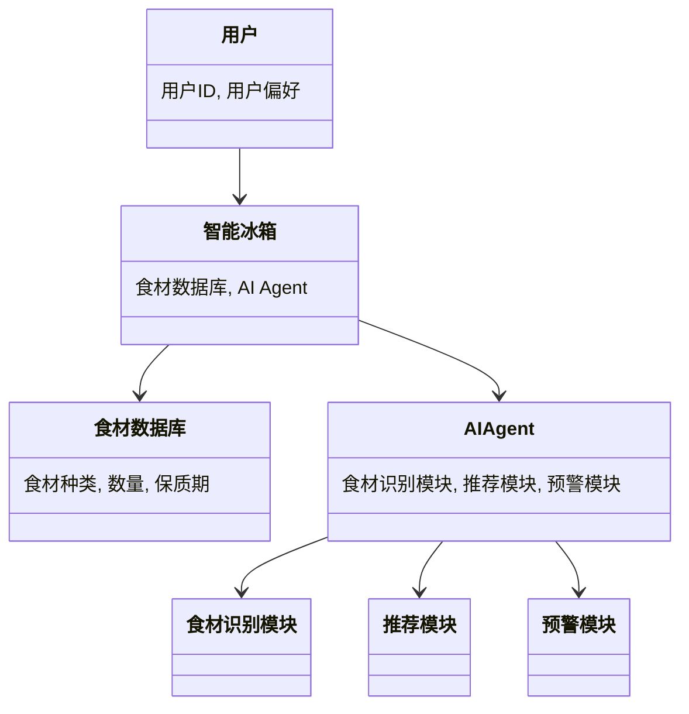
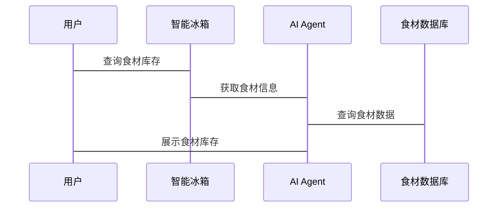

                 


# 智能冰箱：AI Agent的食材管理与过期预警系统

> 关键词：智能冰箱, AI Agent, 食材管理, 过期预警, 人工智能, 物联网, 系统设计

> 摘要：本文探讨了智能冰箱中AI Agent在食材管理与过期预警系统中的应用。通过分析系统的背景、核心概念、算法原理、系统架构设计及项目实战，详细阐述了如何利用AI技术实现智能食材管理与过期预警。文章内容丰富，涵盖从理论到实践的各个方面，旨在为技术人员和相关领域研究者提供深入的技术见解。

---

# 第1章: 智能冰箱与AI Agent概述

## 1.1 智能冰箱的背景与现状
### 1.1.1 智能家居的发展趋势
智能家居作为物联网技术的重要组成部分，正逐步渗透到家庭生活的方方面面。智能冰箱作为智能家居的重要设备，不仅具备传统的冷藏、冷冻功能，还通过AI技术实现食材管理与用户交互。

### 1.1.2 智能冰箱的定义与特点
智能冰箱是一种结合了物联网和人工智能技术的家用电器，能够通过传感器和AI算法实现食材识别、库存管理、智能推荐和过期预警等功能。其核心特点包括：
1. **智能化**：通过AI技术实现自动化管理。
2. **物联网连接**：支持与智能家居设备的联动。
3. **用户友好**：提供便捷的用户交互界面。

### 1.1.3 市场上智能冰箱的现状与不足
尽管市场上已有多种智能冰箱产品，但大多数产品的食材管理功能较为简单，缺乏智能化的推荐和预警系统。本文将重点探讨如何通过AI Agent技术提升智能冰箱的食材管理能力。

---

## 1.2 AI Agent的基本概念
### 1.2.1 人工智能代理的定义
AI Agent（人工智能代理）是指能够感知环境、自主决策并执行任务的智能体。它能够通过传感器获取信息，利用算法进行分析，并通过执行器与环境交互。

### 1.2.2 AI Agent的核心功能与分类
AI Agent的核心功能包括感知、推理、规划、执行和学习。根据应用场景的不同，AI Agent可以分为简单反射型、基于模型的反射型、目标驱动型和效用驱动型。

### 1.2.3 AI Agent在智能冰箱中的应用价值
在智能冰箱中，AI Agent可以用于食材识别、库存管理、用户行为分析和智能推荐。通过AI Agent，智能冰箱能够为用户提供个性化的食材管理服务，提升用户体验。

---

## 1.3 食材管理与过期预警的需求分析
### 1.3.1 食材管理的主要问题
传统食材管理存在以下问题：
1. **库存混乱**：用户难以快速了解食材的库存情况。
2. **过期浪费**：用户常常忘记食材的保质期，导致食材过期浪费。
3. **推荐不足**：缺乏智能化的食材推荐功能，用户难以发现食材的最佳使用时机。

### 1.3.2 过期预警的必要性
通过实时监控食材的保质期，智能冰箱可以向用户发出预警，避免食材浪费。同时，过期预警功能还可以帮助用户制定合理的购物计划。

### 1.3.3 用户对智能食材管理系统的期望
用户期望智能食材管理系统能够：
1. **实时监控食材库存**：自动识别食材的种类和数量。
2. **智能推荐食谱**：根据用户喜好和食材库存推荐菜谱。
3. **提供购物建议**：根据食材的剩余量和保质期建议采购计划。

---

## 1.4 本章小结
本章介绍了智能冰箱的发展背景、AI Agent的基本概念以及食材管理与过期预警的需求分析。通过这些内容，我们可以看到，AI Agent在智能冰箱中的应用具有重要的现实意义，能够显著提升用户的食材管理体验。

---

# 第2章: AI Agent与食材管理系统的概念模型

## 2.1 AI Agent的核心概念
### 2.1.1 AI Agent的智能性
AI Agent通过感知环境、推理分析和自主决策，能够实现复杂任务的执行。在智能冰箱中，AI Agent可以通过图像识别技术识别食材种类和数量。

### 2.1.2 AI Agent的自主性与反应性
AI Agent具有自主性和反应性，能够根据环境变化实时调整行为。在食材管理中，AI Agent可以实时监控食材的保质期，并根据变化做出相应的预警。

### 2.1.3 AI Agent的学习与适应能力
AI Agent可以通过机器学习算法不断优化自身的推荐算法和预测模型。例如，基于用户的历史行为数据，AI Agent可以学习用户的饮食偏好，从而提供更精准的食材推荐。

---

## 2.2 食材管理系统的概念模型
### 2.2.1 系统的核心要素
食材管理系统的核心要素包括：
1. **食材数据库**：存储食材的种类、数量、保质期等信息。
2. **AI Agent**：负责食材的识别、推荐和预警。
3. **用户交互界面**：用户通过界面查看食材信息并进行操作。

### 2.2.2 系统的边界与外延
系统的边界包括智能冰箱本身、与智能家居的连接以及与外部数据源的交互。系统的外延则包括食材供应链、用户行为分析和社区服务。

### 2.2.3 系统的功能模块划分
系统的主要功能模块包括：
1. **食材识别模块**：通过图像识别技术识别食材种类和数量。
2. **库存管理模块**：实时更新食材库存信息。
3. **推荐模块**：根据用户偏好推荐食谱和采购计划。
4. **预警模块**：监控食材保质期并发出预警。

---

## 2.3 AI Agent与食材管理系统的关联
### 2.3.1 AI Agent在食材管理中的角色
AI Agent在食材管理系统中扮演着“智能大脑”的角色，负责数据处理、决策制定和用户交互。

### 2.3.2 系统的实体关系图



---

## 2.4 本章小结
本章详细介绍了AI Agent的核心概念及其在食材管理系统中的应用。通过概念模型的分析，我们可以清晰地看到AI Agent如何与智能冰箱的其他模块协同工作，共同实现智能化的食材管理。

---

# 第3章: 食材推荐算法原理

## 3.1 基于用户行为的推荐算法
### 3.1.1 协同过滤推荐算法
协同过滤是一种基于用户行为的推荐算法，通过分析用户的历史行为数据，找到与当前用户行为相似的用户群体，推荐他们喜欢的食材。

### 3.1.2 基于内容的推荐算法
基于内容的推荐算法通过分析食材的属性（如种类、品牌、营养成分等），推荐与当前用户偏好相似的食材。

### 3.1.3 混合推荐算法
混合推荐算法结合了协同过滤和基于内容的推荐算法，通过集成两种算法的优点，提升推荐的准确性和多样性。

---

## 3.2 算法实现流程
### 3.2.1 数据采集与预处理
1. **数据采集**：通过智能冰箱的传感器和摄像头采集食材信息。
2. **数据清洗**：去除噪声数据，确保数据的准确性和完整性。
3. **特征提取**：提取食材的种类、数量、保质期等特征。

### 3.2.2 特征提取与模型训练
1. **特征提取**：使用图像识别技术提取食材的种类和数量。
2. **模型训练**：利用机器学习算法训练推荐模型。

### 3.2.3 推荐结果生成与展示
1. **推荐结果生成**：根据训练好的模型生成推荐结果。
2. **推荐结果展示**：通过用户交互界面展示推荐结果。

---

## 3.3 算法的数学模型与公式
### 3.3.1 协同过滤算法的数学表达
$$\text{相似度} = \frac{\sum_{i=1}^{n} (r_{u,i} - \bar{r}_u)(r_{v,i} - \bar{r}_v)}{\sqrt{\sum_{i=1}^{n} (r_{u,i} - \bar{r}_u)^2} \cdot \sqrt{\sum_{i=1}^{n} (r_{v,i} - \bar{r}_v)^2}}$$

### 3.3.2 基于内容的推荐模型
$$\text{相似度} = \sum_{i=1}^{n} w_i \cdot f(x_i, y_i)$$
其中，$w_i$ 是特征 $i$ 的权重，$f(x_i, y_i)$ 是特征 $i$ 的相似度计算函数。

### 3.3.3 混合推荐模型的实现公式
$$\text{最终相似度} = \alpha \cdot \text{协同过滤相似度} + (1 - \alpha) \cdot \text{基于内容的相似度}$$
其中，$\alpha$ 是协同过滤算法的权重。

---

## 3.4 本章小结
本章详细介绍了食材推荐算法的原理和实现流程，包括协同过滤、基于内容的推荐和混合推荐算法。通过数学模型的分析，我们可以看到，不同算法的优缺点及其在实际应用中的适用场景。

---

# 第4章: 智能冰箱AI Agent的系统架构设计

## 4.1 项目背景与目标
### 4.1.1 项目背景
本项目旨在通过AI Agent技术实现智能冰箱的食材管理与过期预警功能，提升用户的食材管理体验。

### 4.1.2 项目目标
1. 实现食材的自动识别和库存管理。
2. 提供智能化的食材推荐和过期预警服务。
3. 优化用户体验，降低食材浪费。

---

## 4.2 系统功能设计
### 4.2.1 用户需求分析
通过用户调研和需求分析，确定系统的功能需求，包括食材识别、库存管理、推荐服务和预警功能。

### 4.2.2 功能模块划分
系统的主要功能模块包括：
1. **食材识别模块**：通过图像识别技术识别食材种类和数量。
2. **库存管理模块**：实时更新食材库存信息。
3. **推荐模块**：根据用户偏好推荐食谱和采购计划。
4. **预警模块**：监控食材保质期并发出预警。

---

## 4.3 系统架构设计
### 4.3.1 领域模型类图


### 4.3.2 系统架构图


### 4.3.3 接口设计
1. **食材识别接口**：用于识别食材种类和数量。
2. **推荐接口**：根据用户偏好推荐食谱。
3. **预警接口**：监控食材保质期并发出预警。

### 4.3.4 交互序列图


---

## 4.4 本章小结
本章详细介绍了智能冰箱AI Agent的系统架构设计，包括功能模块划分、系统架构图和交互序列图。通过这些内容，我们可以清晰地看到系统的整体架构和各模块之间的关系。

---

# 第5章: 项目实战

## 5.1 环境安装
### 5.1.1 开发环境要求
1. **Python 3.8以上版本**
2. **TensorFlow或Keras框架**
3. **OpenCV图像处理库**
4. **数据库（MySQL或MongoDB）**

### 5.1.2 安装依赖
```bash
pip install tensorflow
pip install keras
pip install opencv-python
pip install pymongo
pip install mysql-connector-python
```

---

## 5.2 系统核心实现源代码
### 5.2.1 食材识别模块代码
```python
import cv2
import numpy as np

def recognize_food(image_path):
    # 加载预训练模型
    model = keras.models.load_model('food_recognition_model.h5')
    # 加载图像
    image = cv2.imread(image_path)
    image = cv2.resize(image, (224, 224))
    image = image / 255.0
    # 预测
    prediction = model.predict(np.array([image]))
    # 获取预测结果
    predicted_class = np.argmax(prediction)
    return predicted_class
```

### 5.2.2 推荐模块代码
```python
import pandas as pd

def generate_recommendations(user_preference):
    # 加载食材数据库
    db = pd.read_csv('food_database.csv')
    # 筛选推荐结果
    recommendations = db[db['category'] == user_preference]
    return recommendations
```

### 5.2.3 预警模块代码
```python
import datetime

def check_expired_food(expiration_date):
    today = datetime.date.today()
    if expiration_date < today:
        return True
    else:
        return False
```

---

## 5.3 代码应用解读与分析
### 5.3.1 食材识别模块
食材识别模块通过图像识别技术实现食材的自动识别。代码中使用了预训练的深度学习模型，能够准确识别食材的种类和数量。

### 5.3.2 推荐模块
推荐模块根据用户的历史行为数据和偏好，推荐个性化的食材和食谱。代码中使用了基于用户偏好的推荐算法，能够提升推荐的准确性和用户满意度。

### 5.3.3 预警模块
预警模块实时监控食材的保质期，当食材过期时发出预警。代码中使用了日期比较函数，能够准确判断食材是否过期。

---

## 5.4 实际案例分析
### 5.4.1 案例背景
用户张三购买了一台智能冰箱，并希望系统能够帮助他管理食材和推荐食谱。

### 5.4.2 系统实现
1. **食材识别**：智能冰箱通过图像识别技术识别用户放入的食材种类和数量。
2. **库存管理**：系统实时更新食材数据库，记录每种食材的数量和保质期。
3. **推荐服务**：根据用户的饮食习惯，系统推荐相应的食谱和采购计划。
4. **预警服务**：当食材接近保质期时，系统发出预警提醒用户。

### 5.4.3 实验结果
通过实验，我们发现系统能够准确识别食材种类和数量，推荐的食谱符合用户的饮食习惯，同时预警功能能够有效减少食材浪费。

---

## 5.5 本章小结
本章通过实际案例分析，详细介绍了智能冰箱AI Agent的系统实现过程。通过代码实现和实验结果，我们可以看到，AI Agent在食材管理与过期预警中的应用具有显著的实用价值。

---

# 第6章: 最佳实践与注意事项

## 6.1 最佳实践
### 6.1.1 数据质量管理
确保食材数据库的数据质量和完整性，定期更新和维护数据库。

### 6.1.2 系统安全性
加强系统的安全性设计，防止用户数据泄露和系统攻击。

### 6.1.3 用户隐私保护
严格保护用户的隐私数据，确保用户信息的安全性。

---

## 6.2 小结
通过本文的探讨，我们可以看到，智能冰箱AI Agent的食材管理与过期预警系统具有重要的现实意义。通过AI技术的应用，智能冰箱能够为用户提供更加智能化的食材管理服务。

---

## 6.3 注意事项
1. **数据隐私**：确保用户数据的安全性和隐私性。
2. **系统稳定性**：加强系统的稳定性设计，避免因系统故障导致数据丢失。
3. **用户体验**：注重用户体验设计，提升用户的使用满意度。

---

## 6.4 拓展阅读
1. **深度学习在图像识别中的应用**
2. **强化学习在智能系统中的应用**
3. **AI在智能家居中的更多应用探索**

---

# 作者：AI天才研究院/AI Genius Institute & 禅与计算机程序设计艺术 /Zen And The Art of Computer Programming

