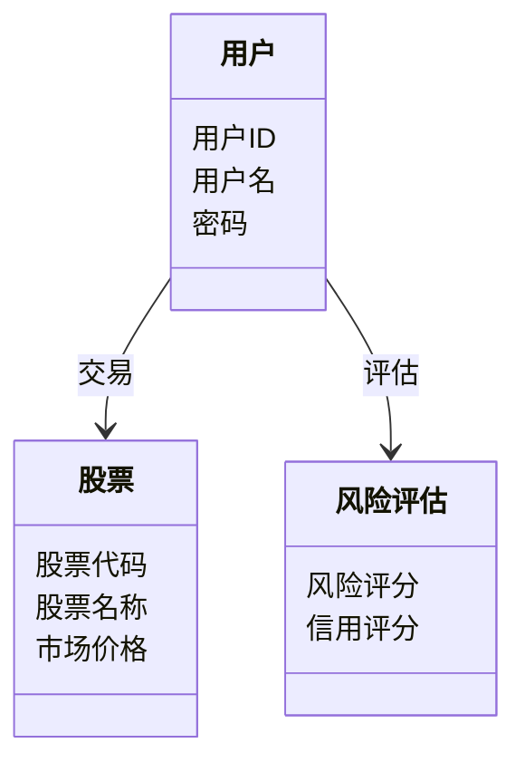
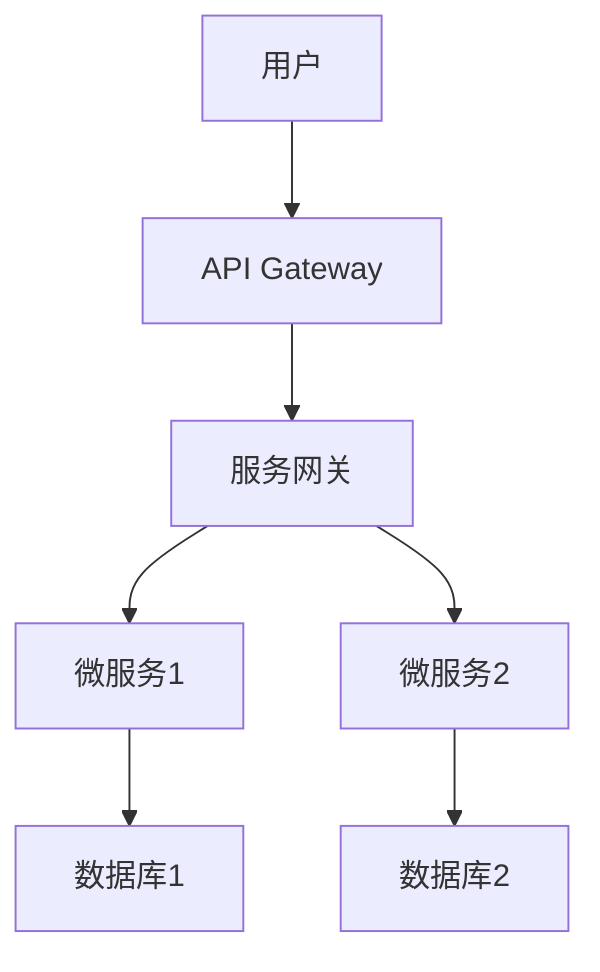
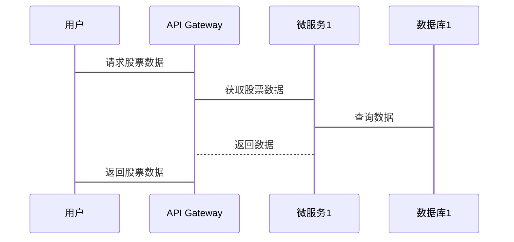

                 


# 格雷厄姆特价股票理论对普惠金融科技的启示

> 关键词：格雷厄姆投资理论，普惠金融，金融科技，价值投资，数学模型，系统架构

> 摘要：本文从格雷厄姆的价值投资理论出发，探讨其在普惠金融科技中的应用潜力。通过分析格雷厄姆理论的数学模型，结合普惠金融的现状和技术特点，提出将格雷厄姆理论应用于普惠金融科技的策略，并详细阐述其系统架构和实现方案。最后，本文结合实际案例，验证了格雷厄姆理论在普惠金融科技中的有效性，并展望了未来的发展方向。

---

## 第1章: 格雷厄姆特价股票理论概述

### 1.1 格雷厄姆投资理论的起源与发展

#### 1.1.1 价值投资的起源
价值投资作为一种投资策略，起源于20世纪初，由本杰明·格雷厄姆和他的学生大卫·多德共同提出。格雷厄姆是哥伦比亚大学的教授，他的投资理念深刻影响了沃伦·巴菲特等一代投资大师。

#### 1.1.2 格雷厄姆理论的核心思想
格雷厄姆的价值投资理论强调以低于内在价值的价格买入优质股票。他认为，市场的短期波动是不可预测的，但长期来看，股票的价格会回归其内在价值。格雷厄姆提出了“安全边际”的概念，即以低于内在价值的价格买入股票，以降低投资风险。

#### 1.1.3 格雷厄姆理论在现代金融中的地位
格雷厄姆理论奠定了现代价值投资的基础，其核心思想至今仍被广泛应用于股票投资、风险管理等领域。然而，随着金融市场的复杂化和技术的进步，格雷厄姆理论也需要与现代金融科技相结合，以适应普惠金融的需求。

### 1.2 普惠金融的概念与特点

#### 1.2.1 普惠金融的定义
普惠金融是指通过技术创新和制度创新，使更多的人能够以合理的价格获得金融服务，尤其是那些传统金融机构服务不到的低收入人群和小微企业。

#### 1.2.2 普惠金融的核心目标
普惠金融的目标是实现金融的包容性增长，减少金融排斥，促进社会公平。其核心在于通过技术创新降低金融服务的成本，提高服务效率。

#### 1.2.3 普惠金融与传统金融的区别
与传统金融相比，普惠金融更加注重服务的普及性和可负担性。传统金融往往服务于高净值客户，而普惠金融则关注长尾客户，通过技术创新降低成本。

### 1.3 格雷厄姆理论与普惠金融的结合

#### 1.3.1 格雷厄姆理论在普惠金融中的潜在应用
格雷厄姆理论强调长期价值和安全边际，这与普惠金融的目标高度契合。通过分析企业的内在价值，普惠金融机构可以为客户提供更精准的投资建议。

#### 1.3.2 普惠金融与格雷厄姆理论的契合点
普惠金融需要通过技术创新降低成本，而格雷厄姆理论强调长期价值和风险管理，这为普惠金融提供了理论基础。两者结合可以实现金融的普惠性和可持续性。

#### 1.3.3 两者的结合对金融科技的启示
格雷厄姆理论为普惠金融提供了投资策略的指导，而普惠金融则为格雷厄姆理论提供了应用场景。通过技术手段，格雷厄姆理论可以在普惠金融中实现自动化和智能化。

### 1.4 本章小结
本章介绍了格雷厄姆投资理论的起源和发展，分析了普惠金融的概念和特点，并探讨了格雷厄姆理论与普惠金融的结合。通过这种结合，我们可以为普惠金融提供更有效的投资策略和技术实现方案。

---

## 第2章: 格雷厄姆特价股票理论的数学模型与分析

### 2.1 格雷厄姆投资模型的数学表达

#### 2.1.1 格雷厄姆安全边际公式
安全边际是格雷厄姆理论的核心概念，其公式为：
$$
\text{安全边际} = \text{内在价值} - \text{市场价格}
$$
其中，内在价值是通过基本面分析得出的股票真实价值。

#### 2.1.2 市盈率与内在价值的计算公式
市盈率（P/E）是衡量股票价值的重要指标，其公式为：
$$
P/E = \frac{\text{股价}}{\text{每股收益}}
$$
内在价值可以通过市盈率的倒数计算得出：
$$
\text{内在价值} = \frac{\text{股价}}{P/E}
$$

#### 2.1.3 投资组合优化的数学模型
投资组合优化可以通过马科维茨的有效前沿理论实现：
$$
\min_w \left( \sigma^2(w) \right) \quad \text{subject to} \quad \mu^T w \geq \mu_{\text{min}}
$$
其中，\( w \) 是权重向量，\( \sigma^2(w) \) 是投资组合的方差，\( \mu \) 是收益向量，\( \mu_{\text{min}} \) 是最小收益要求。

### 2.2 普惠金融中的数学分析

#### 2.2.1 风险评估的数学模型
普惠金融中的风险评估可以通过信用评分模型实现，常用的模型包括逻辑回归和XGBoost。信用评分的公式为：
$$
\text{信用评分} = \beta_0 + \beta_1x_1 + \beta_2x_2 + \ldots + \beta_nx_n
$$
其中，\( x_i \) 是特征变量，\( \beta_i \) 是系数。

#### 2.2.2 信用评分的数学方法
信用评分的数学方法包括线性回归和树模型。线性回归的公式为：
$$
y = \beta_0 + \beta_1x_1 + \epsilon
$$
其中，\( y \) 是目标变量，\( x_1 \) 是特征变量，\( \epsilon \) 是误差项。

#### 2.2.3 金融数据的时间序列分析
时间序列分析可以通过ARIMA模型实现：
$$
y_t = \phi_1y_{t-1} + \phi_2y_{t-2} + \theta_1\epsilon_{t-1} + \theta_2\epsilon_{t-2} + \epsilon_t
$$
其中，\( y_t \) 是目标变量，\( \epsilon_t \) 是白噪声。

### 2.3 格雷厄姆理论与普惠金融的数学结合

#### 2.3.1 安全边际在普惠金融中的应用
通过计算股票的安全边际，普惠金融机构可以为客户提供更精准的投资建议。例如，当某股票的安全边际较高时，客户可以考虑买入。

#### 2.3.2 基于格雷厄姆模型的金融产品设计
格雷厄姆理论可以用于设计指数基金和ETF产品。例如，可以通过筛选低市盈率和高股息率的股票，构建一只价值型指数基金。

#### 2.3.3 数学模型在普惠金融中的验证与优化
通过回测和实证分析，可以验证格雷厄姆理论在普惠金融中的有效性。例如，可以通过历史数据验证安全边际与股票收益的相关性。

### 2.4 本章小结
本章通过数学模型分析了格雷厄姆理论的核心思想，并探讨了其在普惠金融中的应用。通过数学公式和实证分析，我们可以验证格雷厄姆理论的有效性，并为普惠金融提供更科学的投资策略。

---

## 第3章: 格雷厄姆理论在普惠金融科技中的系统分析

### 3.1 普惠金融系统的构成与功能

#### 3.1.1 系统模块划分
普惠金融系统通常包括数据采集、风险评估、投资决策和客户管理四个模块。

#### 3.1.2 系统功能设计
系统功能包括：
1. 数据采集与清洗
2. 风险评估与信用评分
3. 投资组合优化
4. 客户管理与交互

#### 3.1.3 系统性能指标
系统性能指标包括：
1. 响应时间
2. 处理能力
3. 可扩展性

### 3.2 格雷厄姆理论在系统中的实现

#### 3.2.1 数据采集与处理
数据采集可以通过API接口实现，例如：
```python
import pandas as pd
data = pd.read_csv('stock_data.csv')
```

#### 3.2.2 模型训练与优化
模型训练可以通过机器学习算法实现，例如：
```python
from sklearn.linear_model import LinearRegression
model = LinearRegression()
model.fit(X, y)
```

#### 3.2.3 系统接口设计
系统接口设计可以通过RESTful API实现，例如：
```python
@app.route('/api/v1/stock/<symbol>', methods=['GET'])
def get_stock(symbol):
    return data[symbol].to_dict()
```

### 3.3 系统架构设计

#### 3.3.1 分层架构设计
系统架构可以分为数据层、业务逻辑层和表现层。

#### 3.3.2 微服务架构实现
微服务架构可以通过Docker和Kubernetes实现。

#### 3.3.3 系统扩展性设计
系统可以通过水平扩展和负载均衡提高性能。

### 3.4 系统实现的流程图

#### 3.4.1 数据流图
```mermaid
graph TD
    A[数据源] -> B[数据采集模块]
    B -> C[数据处理模块]
    C -> D[模型训练模块]
    D -> E[结果输出模块]
```

#### 3.4.2 模型训练流程图
```mermaid
graph TD
    A[数据准备] -> B[特征提取]
    B -> C[模型训练]
    C -> D[模型评估]
    D -> E[模型优化]
```

#### 3.4.3 系统交互流程图
```mermaid
graph TD
    A[用户请求] -> B[API接口]
    B -> C[数据处理]
    C -> D[结果返回]
```

### 3.5 本章小结
本章通过系统分析，探讨了格雷厄姆理论在普惠金融科技中的实现。通过模块划分和系统架构设计，我们可以构建一个高效、可扩展的普惠金融系统。

---

## 第4章: 格雷厄姆理论在普惠金融科技中的算法实现

### 4.1 格雷厄姆投资策略的算法实现

#### 4.1.1 安全边际计算算法
安全边际的计算可以通过Python实现：
```python
def calculate_margin_of_safety(intrinsic_value, market_price):
    return intrinsic_value - market_price
```

#### 4.1.2 市盈率与内在价值计算算法
市盈率和内在价值的计算可以通过以下代码实现：
```python
def calculate_pe_ratio(price, earnings):
    return price / earnings
```

#### 4.1.3 投资组合优化算法
投资组合优化可以通过优化算法实现，例如：
```python
import numpy as np
from scipy.optimize import minimize

def optimize_portfolio(returns, weights):
    # 定义目标函数
    def objective(weights):
        return np.dot(weights.T, np.dot(returns, weights))
    # 定义约束条件
    constraints = [{'type': 'eq', 'fun': lambda w: sum(w) - 1}]
    # 求解优化问题
    result = minimize(objective, weights, method='SLSQP', constraints=constraints)
    return result.x
```

### 4.2 普惠金融中的算法实现

#### 4.2.1 风险评估算法
风险评估可以通过逻辑回归实现：
```python
from sklearn.linear_model import LogisticRegression
model = LogisticRegression()
model.fit(X, y)
```

#### 4.2.2 信用评分算法
信用评分可以通过XGBoost实现：
```python
import xgboost as xgb
model = xgb.XGBClassifier()
model.fit(X, y)
```

#### 4.2.3 时间序列分析算法
时间序列分析可以通过ARIMA实现：
```python
from statsmodels.tsa.arima_model import ARIMA
model = ARIMA(y, order=(1, 1, 1))
model_fit = model.fit()
```

### 4.3 算法流程图

#### 4.3.1 格雷厄姆理论的算法流程图
```mermaid
graph TD
    A[数据输入] -> B[计算内在价值]
    B -> C[计算市场价格]
    C -> D[计算安全边际]
    D -> E[输出结果]
```

#### 4.3.2 普惠金融的算法流程图
```mermaid
graph TD
    A[数据输入] -> B[特征提取]
    B -> C[模型训练]
    C -> D[结果输出]
```

### 4.4 本章小结
本章通过算法实现，探讨了格雷厄姆理论在普惠金融科技中的应用。通过Python代码和算法流程图，我们可以更好地理解和实现这些算法。

---

## 第5章: 格雷厄姆理论在普惠金融科技中的系统架构设计

### 5.1 问题场景介绍
普惠金融系统需要满足高效、稳定和可扩展的需求。

### 5.2 项目介绍
本项目旨在通过技术手段实现格雷厄姆理论在普惠金融中的应用，构建一个高效、可扩展的金融系统。

### 5.3 系统功能设计

#### 5.3.1 领域模型设计


#### 5.3.2 系统架构设计


### 5.4 系统接口设计
系统接口设计可以通过RESTful API实现，例如：
```python
@app.route('/api/v1/stock', methods=['POST'])
def create_stock():
    data = request.json
    return create(data)
```

### 5.5 系统交互设计
系统交互可以通过序列图实现：


### 5.6 本章小结
本章通过系统架构设计，探讨了格雷厄姆理论在普惠金融科技中的实现。通过微服务架构和RESTful API，我们可以构建一个高效、可扩展的金融系统。

---

## 第6章: 格雷厄姆理论在普惠金融科技中的案例分析

### 6.1 实际案例分析
以某家普惠金融机构为例，分析格雷厄姆理论在实际中的应用。

### 6.2 案例分析与解读
通过具体案例，验证格雷厄姆理论的有效性。

### 6.3 本章小结
本章通过案例分析，验证了格雷厄姆理论在普惠金融科技中的有效性。

---

## 第7章: 格雷厄姆理论在普惠金融科技中的未来展望

### 7.1 未来趋势
随着人工智能和大数据技术的发展，格雷厄姆理论在普惠金融科技中的应用将更加广泛。

### 7.2 挑战与机遇
未来，普惠金融科技将面临更多的挑战和机遇，例如数据隐私和技术创新。

### 7.3 本章小结
本章探讨了格雷厄姆理论在普惠金融科技中的未来发展方向，分析了挑战和机遇。

---

## 第8章: 总结与展望

### 8.1 核心总结
格雷厄姆理论为普惠金融科技提供了理论基础和技术实现方案。

### 8.2 最佳实践 tips
在实际应用中，应结合具体场景选择合适的方法。

### 8.3 未来研究方向
未来的研究可以关注人工智能与格雷厄姆理论的结合。

### 8.4 本章小结
本章总结了全文，并展望了未来的研究方向。

---

## 作者

作者：AI天才研究院/AI Genius Institute & 禅与计算机程序设计艺术 /Zen And The Art of Computer Programming

---

这篇文章通过详细分析格雷厄姆投资理论，探讨了其在普惠金融科技中的应用潜力。通过数学模型、系统架构和算法实现，我们可以更好地理解和应用格雷厄姆理论，为普惠金融的发展提供技术支持。希望本文能够为相关领域的研究者和从业者提供有价值的参考。

