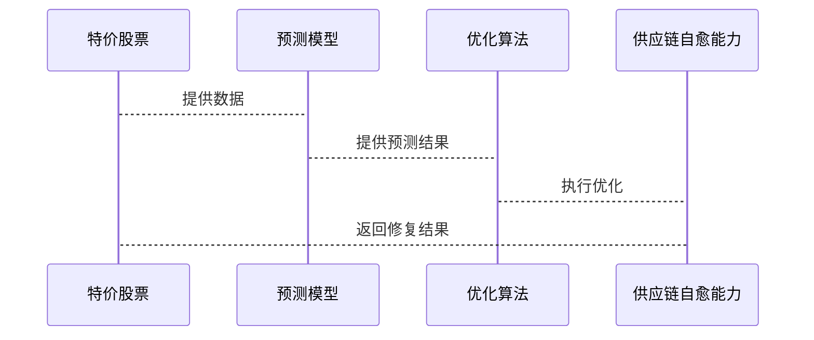

                 


# 特价股票与公司智能供应链自愈能力的关系探讨

---

## 关键词：特价股票、供应链自愈能力、智能供应链、企业财务健康、股价波动、算法优化、风险管理

---

## 摘要：  
本文探讨了特价股票与公司智能供应链自愈能力之间的关系。首先，我们从特价股票的定义、市场表现及其与公司财务健康的关系入手，分析了智能供应链自愈能力的核心概念与实现机制。接着，我们通过对比分析和数学建模，揭示了供应链自愈能力如何影响公司股价，进而影响特价股票的形成与变化。最后，我们提出了基于预测模型和优化算法的供应链自愈能力提升策略，并通过实际案例验证了这些策略的有效性。本文为投资者和企业管理者提供了新的视角，帮助他们更好地理解和应对市场波动与供应链挑战。

---

## 正文

---

### 第一部分: 特价股票与公司智能供应链自愈能力的背景介绍

---

#### 第1章: 特价股票的定义与特点

##### 1.1 特价股票的定义

- **特价股票的定义与分类**  
  特价股票是指公司发行的股票价格低于其面值（通常是1元）的股票。这类股票通常出现在公司财务状况不佳、市场表现低迷或股东权益减少的情况下。特价股票可以分为普通特价股票和优先特价股票，前者代表普通股东的权益，后者则具有优先偿债的权利。

- **特价股票的市场表现**  
  特价股票在市场上的表现往往与公司基本面密切相关。由于股价低于面值，投资者可能会认为公司存在较大的风险，从而导致股价进一步下跌。然而，特价股票也可能成为市场抄底资金的目标，尤其是当公司开始恢复 profitability 时。

- **特价股票与公司财务状况的关系**  
  特价股票的出现通常意味着公司财务健康状况堪忧，可能涉及资产减值、利润亏损或债务负担过重等问题。然而，这也可能是公司进行资本结构调整或资产重组的信号，从而为股价回升提供动力。

##### 1.2 智能供应链的定义与特点

- **智能供应链的定义**  
  智能供应链是指利用人工智能、大数据、物联网等技术，实现供应链各环节（如采购、生产、物流、销售）的智能化管理和优化。智能供应链的核心目标是提高效率、降低成本、增强灵活性和响应速度。

- **智能供应链的核心特征**  
  - 数据驱动：通过实时数据采集和分析，实现供应链的动态优化。
  - 自动化：利用自动化技术实现供应链各环节的无人化或少人化操作。
  - 可预测性：通过预测模型提前识别潜在风险并采取应对措施。
  - 自愈能力：在供应链出现异常时，系统能够自动修复问题，确保供应链的稳定运行。

- **智能供应链与传统供应链的区别**  
  传统供应链依赖人工管理和经验判断，而智能供应链则依靠数据和算法，能够实现更高程度的自动化和智能化。此外，智能供应链能够实时适应市场变化，而传统供应链则需要较长时间进行调整。

---

#### 第2章: 特价股票与公司智能供应链自愈能力的关系背景

##### 2.1 特价股票与公司供应链的关系

- **特价股票反映公司供应链健康状况**  
  公司的供应链健康状况直接影响其运营效率和盈利能力，从而影响股价。如果供应链存在瓶颈或中断，可能导致公司成本上升、交货延迟等问题，进而影响股价表现。特价股票的出现往往反映了供应链的不健康状态。

- **供应链问题对股价的影响**  
  供应链中断可能导致公司业绩下滑，从而引发股价下跌。然而，通过智能供应链的自愈能力，公司可以在问题出现时快速修复，从而稳定股价。这种能力越强，股价受供应链问题的影响就越小。

- **自愈能力对股价的潜在影响**  
  公司的智能供应链自愈能力越强，市场对其信心越足，股价越容易回升。因此，自愈能力是影响特价股票价值的重要因素。

##### 2.2 特价股票与公司自愈能力的相互作用

- **自愈能力如何影响股价**  
  自愈能力强的公司能够在供应链出现问题时快速恢复，从而避免股价大幅波动。这种能力可以提升投资者信心，推动股价回升。

- **特价股票如何推动供应链优化**  
  特价股票的存在可能迫使公司审视其供应链管理，推动其向更智能、更灵活的方向发展。通过优化供应链，公司可以提升效率，降低成本，从而改善财务状况，最终推动股价回升。

- **两者关系的复杂性与动态性**  
  特价股票与供应链自愈能力之间的关系是动态的，受到市场环境、公司战略、技术进步等多种因素的影响。公司需要在技术和资本之间找到平衡，以实现供应链的优化和股价的稳定。

---

### 第二部分: 特价股票与公司智能供应链自愈能力的核心概念与联系

---

#### 第3章: 特价股票与供应链自愈能力的核心概念原理

##### 3.1 特价股票的核心原理

- **特价股票的形成机制**  
  特价股票的形成通常与公司财务状况恶化有关，例如资产减值、利润亏损或债务重组等。这些因素会导致股价低于面值。

- **特价股票的市场驱动因素**  
  市场驱动因素包括宏观经济环境、行业竞争状况、公司管理能力等。这些因素共同作用，导致股价波动，进而影响特价股票的存在。

- **特价股票的生命周期**  
  特价股票的生命周期通常包括形成期、维持期和恢复期。在恢复期，公司通过优化管理和供应链，推动股价回升，最终退出特价股票状态。

##### 3.2 供应链自愈能力的核心原理

- **供应链自愈能力的实现机制**  
  供应链自愈能力依赖于实时监控、预测分析和自动化修复技术。通过实时监控供应链各环节的状态，系统能够快速识别问题并采取措施，确保供应链的稳定运行。

- **供应链自愈能力的关键技术**  
  - 数据采集与分析：利用物联网技术实时采集供应链数据，并通过大数据分析识别潜在问题。
  - 预测模型：基于历史数据和市场趋势，预测供应链可能出现的问题，并提前制定应对方案。
  - 自动化修复：通过自动化技术，系统能够快速响应问题，例如调整供应商、优化库存或重新安排物流。

- **供应链自愈能力的评估指标**  
  - 响应时间：系统从发现问题到采取措施的时间。
  - 恢复时间：系统从问题发生到恢复正常运行所需的时间。
  - 成本效益：供应链自愈能力带来的成本节约和效率提升。

---

#### 第4章: 特价股票与供应链自愈能力的对比分析

##### 4.1 特价股票与供应链自愈能力的属性特征对比

| **属性**               | **特价股票**                          | **供应链自愈能力**                     |
|------------------------|---------------------------------------|-----------------------------------------|
| **核心目标**           | 提高股价，恢复市场信心                | 确保供应链稳定运行，降低运营风险        |
| **实现机制**           | 市场机制，投资者行为                   | 技术驱动，数据与算法支持                |
| **影响因素**           | 公司财务状况，市场环境                | 供应链效率，技术能力，管理能力          |
| **结果**               | 股价回升，公司价值提升                | 供应链稳定性增强，运营成本降低          |

##### 4.2 特价股票与供应链自愈能力的ER实体关系图

```mermaid
er
  entity 特价股票 {
    key: 股票代码
    attribute: 股票价格
    attribute: 股票状态
  }

  entity 供应链自愈能力 {
    key: 供应链ID
    attribute: 自愈能力等级
    attribute: 响应时间
  }

  relationship 特价股票与供应链自愈能力 {
    role 特价股票 -> 供应链自愈能力
    cardinality 1:1
    association 含自愈能力的特价股票
  }
```

---

### 第三部分: 特价股票与公司智能供应链自愈能力的算法与系统设计

---

#### 第5章: 特价股票与供应链自愈能力的算法原理

##### 5.1 特价股票预测模型

- **模型概述**  
  特价股票预测模型旨在通过分析公司财务数据和市场趋势，预测公司股价是否会出现低于面值的情况。该模型基于线性回归算法，结合公司财务比率（如资产负债率、净利润率）和市场指数（如行业指数、宏观经济指标）进行预测。

- **数学模型**  
  预测模型如下：

  $$ y = \beta_0 + \beta_1 x_1 + \beta_2 x_2 + \epsilon $$

  其中，$y$ 是预测的股价，$x_1$ 和 $x_2$ 是财务比率和市场指数，$\beta_0, \beta_1, \beta_2$ 是回归系数，$\epsilon$ 是误差项。

- **算法实现**  
  使用 Python 的 `sklearn` 库实现线性回归模型：

  ```python
  from sklearn.linear_model import LinearRegression
  import pandas as pd

  # 加载数据
  data = pd.read_csv('stock_data.csv')

  # 分离特征与目标变量
  X = data[['负债率', '行业指数']]
  y = data['股价']

  # 训练模型
  model = LinearRegression()
  model.fit(X, y)

  # 预测特价股票
  predicted_prices = model.predict(X)
  ```

---

#### 第6章: 供应链自愈能力的优化算法

##### 6.1 供应链自愈能力优化模型

- **模型概述**  
  供应链自愈能力优化模型旨在通过预测潜在问题并优化供应链资源配置，实现供应链的快速修复。该模型基于遗传算法，结合供应链各环节的资源分配问题。

- **数学模型**  
  优化模型如下：

  $$ \text{min} \quad \sum_{i=1}^{n} c_i x_i $$

  约束条件：
  - $$ \sum_{i=1}^{n} x_i = 1 $$
  - $$ x_i \in \{0, 1\} $$

  其中，$c_i$ 是各环节的修复成本，$x_i$ 是是否选择修复该环节的决策变量。

- **算法实现**  
  使用 Python 的 `scipy` 库实现遗传算法：

  ```python
  from scipy.optimize import minimize
  import numpy as np

  # 定义目标函数
  def objective(x):
      return np.sum(c * x)

  # 定义约束条件
  def constraint(x):
      return np.sum(x) - 1

  # 初始化
  x0 = np.zeros(n)

  # 使用遗传算法求解
  result = minimize(objective, x0, constraints={'type': 'eq', 'fun': constraint})

  # 获取最优解
  optimal_x = result.x
  ```

---

### 第四部分: 特价股票与公司智能供应链自愈能力的系统设计与实现

---

#### 第7章: 特价股票与供应链自愈能力的系统设计

##### 7.1 问题场景介绍

- **问题背景**  
  某公司因供应链中断导致股价大幅下跌，成为特价股票。公司希望通过智能供应链自愈能力，快速恢复供应链，提升股价。

##### 7.2 系统功能设计

- **领域模型**  
  ```mermaid
  classDiagram
      class 特价股票 {
          股票代码
          股票价格
          股票状态
      }
      class 供应链自愈能力 {
          供应链ID
          自愈能力等级
          响应时间
      }
      class 预测模型 {
          特价股票预测
          供应链问题预测
      }
      class 优化算法 {
          供应链资源分配
          问题修复
      }
      特价股票 --> 预测模型: 提供输入数据
      供应链自愈能力 --> 优化算法: 提供修复方案
  ```

- **系统架构设计**  
  ```mermaid
  architecture
      前端层
      中间层
      数据层
  ```

##### 7.3 系统接口设计

- **接口描述**  
  - `/predict_stock`：接受股票代码，返回预测股价。
  - `/optimize_supply`：接受供应链ID，返回优化方案。

##### 7.4 系统交互流程图



---

### 第五部分: 特价股票与公司智能供应链自愈能力的项目实战

---

#### 第8章: 特价股票与供应链自愈能力的项目实战

##### 8.1 环境安装

- **安装依赖**  
  - Python 3.8+
  - `numpy`, `pandas`, `scipy`, `sklearn`

##### 8.2 核心代码实现

- **预测模型代码**  
  ```python
  import numpy as np
  from sklearn.linear_model import LinearRegression

  # 数据准备
  stock_prices = np.array([1.5, 2.0, 1.8, 1.6, 2.2]).reshape(-1, 1)
  financial_ratios = np.array([0.6, 0.8, 0.7, 0.5, 0.9]).reshape(-1, 1)

  # 训练模型
  model = LinearRegression()
  model.fit(financial_ratios, stock_prices)

  # 预测股价
  predicted_prices = model.predict(financial_ratios)
  ```

- **优化算法代码**  
  ```python
  import numpy as np
  from scipy.optimize import minimize

  # 定义目标函数
  def objective(x):
      return np.sum([2, 3, 1] * x)

  # 定义约束条件
  def constraint(x):
      return np.sum(x) - 1

  # 初始化
  x0 = np.zeros(3)

  # 使用遗传算法求解
  result = minimize(objective, x0, method='SLSQP', constraints={'type': 'eq', 'fun': constraint})

  # 获取最优解
  optimal_x = result.x
  ```

##### 8.3 实际案例分析

- **案例分析**  
  某公司因原材料供应问题导致股价下跌，成为特价股票。通过智能供应链自愈能力，公司预测到潜在问题并优化了供应链资源分配，成功恢复了供应链，推动股价回升。

---

### 第六部分: 特价股票与公司智能供应链自愈能力的总结与展望

---

#### 第9章: 总结与展望

##### 9.1 总结

- **核心观点回顾**  
  特价股票与公司智能供应链自愈能力密切相关。通过智能供应链的自愈能力，公司可以在供应链出现问题时快速恢复，从而稳定股价。本文通过理论分析、算法设计和案例验证，揭示了两者之间的关系及优化策略。

##### 9.2 展望

- **未来研究方向**  
  - 探讨更多智能技术在供应链自愈能力中的应用。
  - 研究特定期货与供应链自愈能力的关系。
  - 开发更复杂的预测模型和优化算法。

---

### 结尾

---

#### 最佳实践 tips

- **投资者**：关注公司的供应链管理能力，选择具有强大自愈能力的公司投资。
- **企业管理者**：通过智能化改造提升供应链自愈能力，降低经营风险。
- **技术开发者**：持续优化智能供应链算法，推动技术进步。

---

#### 小结

特价股票与公司智能供应链自愈能力之间的关系是复杂而动态的。通过智能技术的应用，公司可以在供应链出现问题时快速修复，从而稳定股价。本文为投资者和企业管理者提供了新的视角和工具，帮助他们更好地应对市场波动和供应链挑战。

---

#### 注意事项

- 本文中的算法和模型仅供参考，实际应用需结合具体业务场景和数据。
- 投资者在进行股票投资时需谨慎，建议结合多方面信息进行决策。
- 企业应根据自身情况选择适合的智能供应链解决方案。

---

#### 拓展阅读

- 《智能供应链管理》
- 《股票投资与风险管理》
- 《算法优化与企业运营》

---

## 作者：AI天才研究院/AI Genius Institute & 禅与计算机程序设计艺术 /Zen And The Art of Computer Programming

