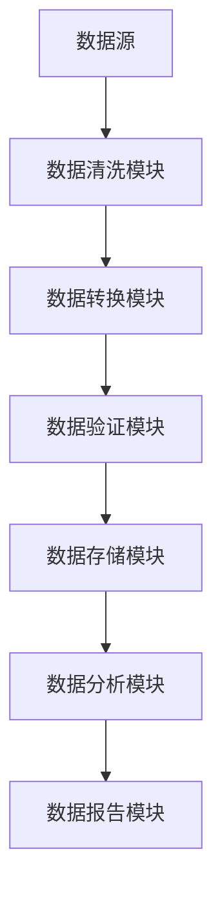
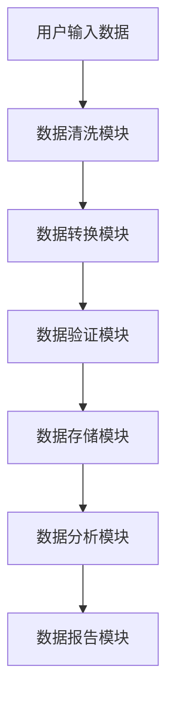
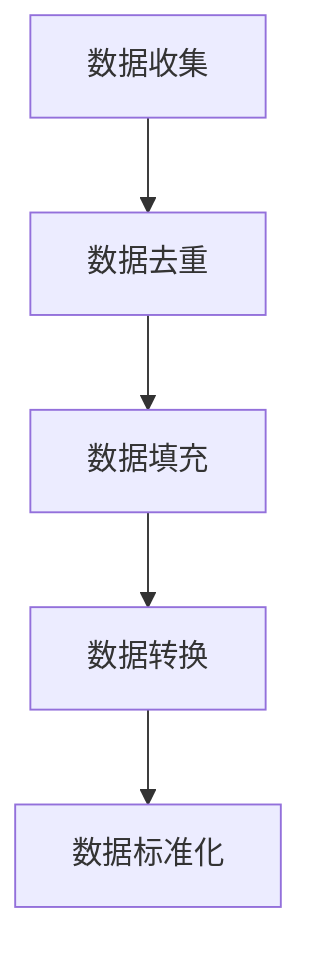
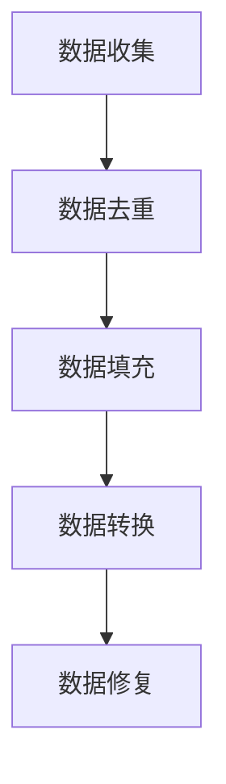

                 


# AI Agent在企业数据质量管理与治理中的全面应用

## 关键词
AI Agent, 企业数据质量管理, 数据治理, 人工智能, 数据清洗, 数据修复, 数据安全

## 摘要
本文深入探讨了AI Agent在企业数据质量管理中的全面应用，详细分析了数据质量管理的挑战与解决方案，结合AI Agent的核心算法与系统架构，通过实际案例展示了AI Agent在数据清洗、修复和分析中的优势。文章还提供了系统设计、项目实战和最佳实践，帮助读者全面理解并有效应用AI Agent技术于数据质量管理领域。

---

# 第1章: 问题背景与核心概念

## 1.1 数据质量管理的挑战

### 1.1.1 企业数据质量管理的现状
企业数据质量管理（Data Quality Management, DQM）是确保数据准确、完整、一致和可靠的系统性过程。然而，随着企业规模的扩大和数据类型的多样化，数据质量管理面临以下挑战：
- 数据源多样，格式复杂，难以统一处理。
- 数据量大，人工检查效率低，成本高。
- 数据质量问题隐蔽性强，难以发现和修复。
- 数据安全与隐私保护要求日益严格。

### 1.1.2 数据质量问题的根源
数据质量问题通常来源于以下几个方面：
- 数据录入错误，如输入错误或格式不一致。
- 数据传输过程中的丢失或损坏。
- 数据存储过程中的格式转换问题。
- 数据使用过程中的误操作或误删。

### 1.1.3 数据质量管理的重要性
数据质量管理是企业运营的基础，直接影响决策的准确性和业务效率。高质量的数据能够：
- 提高数据分析的准确性。
- 优化业务流程，降低成本。
- 提升客户满意度和企业竞争力。

---

## 1.2 AI Agent的定义与特点

### 1.2.1 AI Agent的基本概念
AI Agent（人工智能代理）是一种能够感知环境、自主决策并执行任务的智能实体。它能够通过传感器获取信息，利用算法进行分析，并通过执行器完成操作。AI Agent的核心特征包括：
- **自主性**：能够在没有外部干预的情况下独立运行。
- **反应性**：能够实时感知环境变化并做出反应。
- **学习性**：能够通过经验改进自身性能。

### 1.2.2 AI Agent的核心特点
AI Agent在数据质量管理中的应用具有以下特点：
- **智能化**：能够自动识别数据问题并提出解决方案。
- **高效性**：通过机器学习算法快速处理海量数据。
- **适应性**：能够根据数据特点动态调整处理策略。

### 1.2.3 AI Agent与传统数据治理工具的区别
与传统数据治理工具相比，AI Agent具有以下优势：
| 对比维度 | 传统数据治理工具 | AI Agent |
|----------|------------------|----------|
| 处理效率 | 依赖人工操作，效率低 | 自动化处理，效率高 |
| 决策能力 | 基于规则，缺乏灵活性 | 基于学习，具有灵活性 |
| 学习能力 | 无法自我优化 | 能够通过反馈优化性能 |

---

## 1.3 AI Agent在数据质量管理中的应用前景

### 1.3.1 数据质量管理的潜在应用场景
AI Agent在数据质量管理中的应用场景广泛，主要包括：
- 数据清洗：自动识别并修复数据中的错误。
- 数据修复：通过机器学习模型预测缺失值。
- 数据分析：利用AI Agent生成数据质量报告。

### 1.3.2 企业采用AI Agent的优势
- 提高数据处理效率，降低人工成本。
- 实现数据质量管理的自动化，减少人为错误。
- 通过智能化分析，发现潜在数据问题。

### 1.3.3 数据质量管理中的挑战与机遇
- **挑战**：数据隐私保护、算法模型的可解释性、多源数据的整合难度。
- **机遇**：AI Agent技术的引入能够显著提升数据质量管理的效率和精度。

---

# 第2章: 核心概念与联系

## 2.1 数据质量管理的理论基础

### 2.1.1 数据质量管理的定义
数据质量管理是指通过一系列技术和管理手段，确保数据的准确性、完整性、一致性和及时性。

### 2.1.2 数据质量管理的核心要素
数据质量管理的核心要素包括：
- **准确性**：数据反映真实情况。
- **完整性**：数据无缺失或不完整。
- **一致性**：数据在不同系统中保持一致。
- **及时性**：数据能够及时更新。

### 2.1.3 数据质量管理的流程模型
数据质量管理的典型流程包括：
1. 数据收集：从多个来源获取数据。
2. 数据清洗：去除噪声数据。
3. 数据转换：将数据转换为统一格式。
4. 数据验证：检查数据是否符合要求。
5. 数据存储：将数据存储到数据库中。
6. 数据分析：利用数据进行业务分析。

---

## 2.2 AI Agent的原理与机制

### 2.2.1 AI Agent的基本原理
AI Agent通过感知环境、分析数据、制定决策并执行操作来完成任务。其基本原理包括：
1. **感知**：通过传感器或接口获取环境信息。
2. **分析**：利用机器学习算法对数据进行分析。
3. **决策**：基于分析结果制定行动方案。
4. **执行**：通过执行器完成任务。

### 2.2.2 AI Agent的感知与决策机制
AI Agent的感知与决策机制包括：
- **监督学习**：基于标记数据进行分类或回归。
- **无监督学习**：通过聚类或关联规则挖掘发现数据模式。
- **强化学习**：通过试错优化决策策略。

### 2.2.3 AI Agent的学习与优化算法
AI Agent的学习与优化算法主要包括：
- **监督学习算法**：如线性回归、支持向量机（SVM）。
- **无监督学习算法**：如K-means聚类、关联规则挖掘。
- **强化学习算法**：如Q-learning、Deep Q-Networks（DQN）。

---

## 2.3 数据质量管理与AI Agent的关系

### 2.3.1 数据质量管理的痛点与难点
数据质量管理的痛点包括：
- 数据来源复杂，难以统一处理。
- 数据质量问题隐蔽性强，难以发现。
- 数据处理效率低，成本高。

### 2.3.2 AI Agent如何解决数据质量管理问题
AI Agent通过智能化的感知和分析能力，能够：
- 自动识别数据问题。
- 快速修复数据错误。
- 提供数据质量报告。

### 2.3.3 数据质量管理与AI Agent的协同作用
数据质量管理与AI Agent的协同作用体现在：
- 数据质量管理为AI Agent提供高质量的输入数据。
- AI Agent通过自动化处理提升数据质量管理的效率。

---

# 第3章: 数据质量管理的系统分析

## 3.1 数据质量管理的系统架构

### 3.1.1 数据质量管理的分层架构
数据质量管理的分层架构包括：
- **数据源层**：数据的原始存储位置。
- **数据处理层**：数据清洗和转换的处理逻辑。
- **数据管理层**：数据的存储和管理。
- **数据分析层**：数据的分析和报告生成。

### 3.1.2 数据质量管理的核心模块
数据质量管理的核心模块包括：
- 数据清洗模块：去除噪声数据。
- 数据转换模块：将数据转换为统一格式。
- 数据验证模块：检查数据是否符合要求。

### 3.1.3 数据质量管理的交互流程
数据质量管理的交互流程包括：
1. 数据收集：从多个来源获取数据。
2. 数据清洗：去除噪声数据。
3. 数据转换：将数据转换为统一格式。
4. 数据验证：检查数据是否符合要求。
5. 数据存储：将数据存储到数据库中。
6. 数据分析：利用数据进行业务分析。

---

## 3.2 数据质量管理的功能设计

### 3.2.1 数据清洗与转换功能
数据清洗与转换功能包括：
- **数据清洗**：去除噪声数据，如重复数据、缺失值等。
- **数据转换**：将数据转换为统一格式，如日期格式、数值格式等。

### 3.2.2 数据校验与验证功能
数据校验与验证功能包括：
- **数据校验**：检查数据是否符合预定义的规则，如数值范围、格式要求等。
- **数据验证**：通过验证算法检查数据的准确性。

### 3.2.3 数据分析与报告功能
数据分析与报告功能包括：
- **数据分析**：利用数据分析工具对数据进行统计分析和挖掘。
- **数据报告**：生成数据质量报告，包括数据清洗结果、数据修复建议等。

---

## 3.3 数据质量管理的系统接口

### 3.3.1 数据源接口设计
数据源接口设计包括：
- 数据源类型：数据库、文件、API等。
- 数据格式：如JSON、XML、CSV等。
- 数据获取方式：如查询API、文件读取等。

### 3.3.2 数据处理接口设计
数据处理接口设计包括：
- 数据清洗接口：接收原始数据，返回清洗后的数据。
- 数据转换接口：接收清洗后的数据，返回转换后的数据。

### 3.3.3 数据输出接口设计
数据输出接口设计包括：
- 数据存储接口：将处理后的数据存储到数据库中。
- 数据报告接口：生成数据质量报告并输出。

---

## 3.4 数据质量管理的系统架构

### 3.4.1 系统架构图
以下是数据质量管理系统的架构图：



### 3.4.2 系统功能模块
系统功能模块包括：
- 数据清洗模块：负责去除噪声数据。
- 数据转换模块：负责将数据转换为统一格式。
- 数据验证模块：负责检查数据是否符合要求。
- 数据存储模块：负责存储处理后的数据。
- 数据分析模块：负责对数据进行分析。
- 数据报告模块：负责生成数据质量报告。

---

## 3.5 数据质量管理的交互流程

### 3.5.1 交互流程图
以下是数据质量管理的交互流程图：



---

# 第4章: AI Agent的算法原理

## 4.1 AI Agent的核心算法

### 4.1.1 监督学习算法
监督学习算法包括：
- **线性回归**：用于预测连续型变量。
- **支持向量机（SVM）**：用于分类和回归。
- **随机森林**：用于分类和回归。

### 4.1.2 无监督学习算法
无监督学习算法包括：
- **K-means聚类**：用于将数据划分为不同的簇。
- **关联规则挖掘**：用于发现数据中的关联规则。
- **主成分分析（PCA）**：用于降维。

### 4.1.3 强化学习算法
强化学习算法包括：
- **Q-learning**：基于值函数的强化学习算法。
- **Deep Q-Networks（DQN）**：基于深度学习的强化学习算法。

---

## 4.2 数据清洗与修复的算法实现

### 4.2.1 数据清洗的步骤与流程
数据清洗的步骤包括：
1. 数据收集：从多个来源获取数据。
2. 数据去重：去除重复数据。
3. 数据填充：修复缺失值。
4. 数据转换：将数据转换为统一格式。
5. 数据标准化：对数据进行标准化处理。

### 4.2.2 数据修复的数学模型
数据修复的数学模型可以表示为：

$$
\text{修复值} = \text{原值} + \text{修复量}
$$

其中，修复量可以通过机器学习算法计算得出。

### 4.2.3 数据修复的算法优化
数据修复的算法优化包括：
- **参数调整**：调整算法的参数以提高修复精度。
- **模型优化**：通过深度学习模型提高修复效果。
- **反馈机制**：根据修复结果优化算法。

---

## 4.3 数据清洗与修复的实现细节

### 4.3.1 数据清洗的实现细节
数据清洗的实现细节包括：
- **去重**：通过哈希表或排序去重。
- **填充**：使用均值、中位数或插值法填充缺失值。
- **转换**：将数据转换为统一格式，如日期格式、数值格式等。

### 4.3.2 数据修复的实现细节
数据修复的实现细节包括：
- **基于规则的修复**：根据预定义的规则修复数据。
- **基于机器学习的修复**：通过机器学习模型修复数据。
- **基于深度学习的修复**：通过深度学习模型修复数据。

---

## 4.4 数据清洗与修复的算法流程

### 4.4.1 数据清洗流程图
以下是数据清洗的流程图：



### 4.4.2 数据修复流程图
以下是数据修复的流程图：



---

# 第5章: 数据质量管理的系统架构设计

## 5.1 数据质量管理的系统架构

### 5.1.1 系统架构图
以下是数据质量管理系统的架构图：


### 5.1.2 系统功能模块
系统功能模块包括：
- 数据清洗模块：负责去除噪声数据。
- 数据转换模块：负责将数据转换为统一格式。
- 数据验证模块：负责检查数据是否符合要求。
- 数据存储模块：负责存储处理后的数据。
- 数据分析模块：负责对数据进行分析。
- 数据报告模块：负责生成数据质量报告。

---

## 5.2 数据质量管理的系统接口

### 5.2.1 数据源接口设计
数据源接口设计包括：
- 数据源类型：数据库、文件、API等。
- 数据格式：如JSON、XML、CSV等。
- 数据获取方式：如查询API、文件读取等。

### 5.2.2 数据处理接口设计
数据处理接口设计包括：
- 数据清洗接口：接收原始数据，返回清洗后的数据。
- 数据转换接口：接收清洗后的数据，返回转换后的数据。

### 5.2.3 数据输出接口设计
数据输出接口设计包括：
- 数据存储接口：将处理后的数据存储到数据库中。
- 数据报告接口：生成数据质量报告并输出。

---

## 5.3 数据质量管理的系统交互

### 5.3.1 交互流程图
以下是数据质量管理的交互流程图：


---

# 第6章: 项目实战

## 6.1 项目环境安装

### 6.1.1 安装Python
安装Python的步骤如下：
1. 访问Python官网（https://www.python.org/）。
2. 下载并安装适合的Python版本。
3. 配置环境变量。

### 6.1.2 安装机器学习库
安装机器学习库的步骤如下：
1. 打开终端或命令提示符。
2. 执行命令：`pip install numpy pandas scikit-learn`。

---

## 6.2 系统核心实现

### 6.2.1 数据清洗模块实现
数据清洗模块的实现代码如下：

```python
import pandas as pd

def clean_data(df):
    # 去重
    df.drop_duplicates(inplace=True)
    # 填充缺失值
    df.fillna(method='ffill', inplace=True)
    # 转换日期格式
    df['date'] = pd.to_datetime(df['date'])
    return df
```

### 6.2.2 数据修复模块实现
数据修复模块的实现代码如下：

```python
from sklearn.impute import KNNImputer

def repair_data(df):
    # 初始化KNNImputer
    imputer = KNNImputer(n_neighbors=5)
    # 修复缺失值
    repaired_df = imputer.fit_transform(df)
    return repaired_df
```

---

## 6.3 项目案例分析

### 6.3.1 案例背景
假设我们有一个销售数据集，包含销售金额、日期、客户ID等信息，但数据中存在缺失值和格式不一致的问题。

### 6.3.2 数据清洗与修复
使用上述数据清洗和修复模块对数据进行处理，最终得到高质量的数据。

---

## 6.4 项目小结

### 6.4.1 项目总结
通过本项目，我们成功地使用AI Agent技术解决了数据质量管理中的数据清洗和修复问题。

### 6.4.2 经验总结
- 数据清洗和修复需要结合具体业务场景。
- 机器学习算法能够显著提高数据处理效率。

---

# 第7章: 最佳实践、小结与注意事项

## 7.1 最佳实践

### 7.1.1 数据质量管理的最佳实践
- 定期检查数据质量。
- 建立数据质量管理标准。
- 培训相关人员的数据管理能力。

### 7.1.2 AI Agent应用的最佳实践
- 结合具体业务场景选择合适的AI Agent技术。
- 定期优化AI Agent算法。

---

## 7.2 小结

### 7.2.1 数据质量管理的核心要点
- 数据质量管理是企业运营的基础。
- AI Agent技术能够显著提高数据质量管理的效率和精度。

### 7.2.2 AI Agent在数据质量管理中的优势
- 自动化处理数据问题。
- 提高数据处理效率。
- 通过智能化分析提升数据质量。

---

## 7.3 注意事项

### 7.3.1 数据隐私保护
在数据质量管理过程中，必须注意数据隐私保护，遵守相关法律法规。

### 7.3.2 数据安全
数据质量管理过程中，必须确保数据安全，防止数据泄露。

### 7.3.3 算法可解释性
AI Agent算法的可解释性是数据质量管理中的一个重要问题，必须加以重视。

---

## 7.4 拓展阅读

### 7.4.1 推荐书籍
- 《Data Quality: The End-Goal Is Better Decision Making》
- 《Hands-On Machine Learning with Scikit-Learn, Keras, and TensorFlow》

### 7.4.2 推荐文章
- "Data Quality Dimensions: Integrity, Consistency, Completeness, Timeliness, Accuracy, and Normativity"
- "Introduction to AI Agents: Theory and Practice"

---

# 作者：AI天才研究院/AI Genius Institute & 禅与计算机程序设计艺术 /Zen And The Art of Computer Programming

