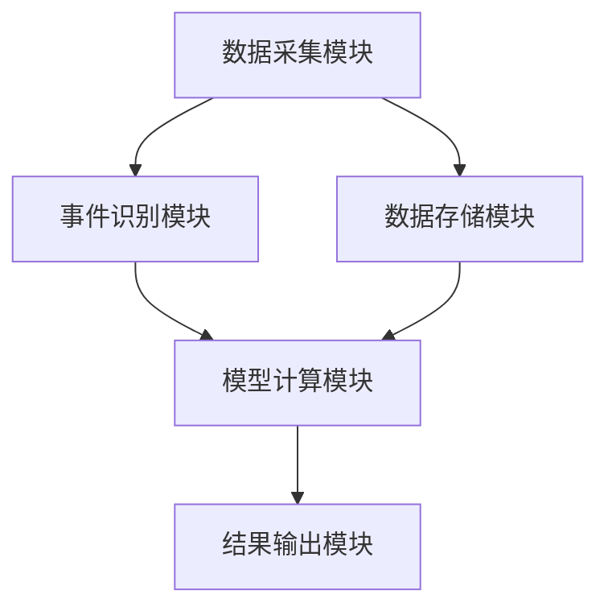
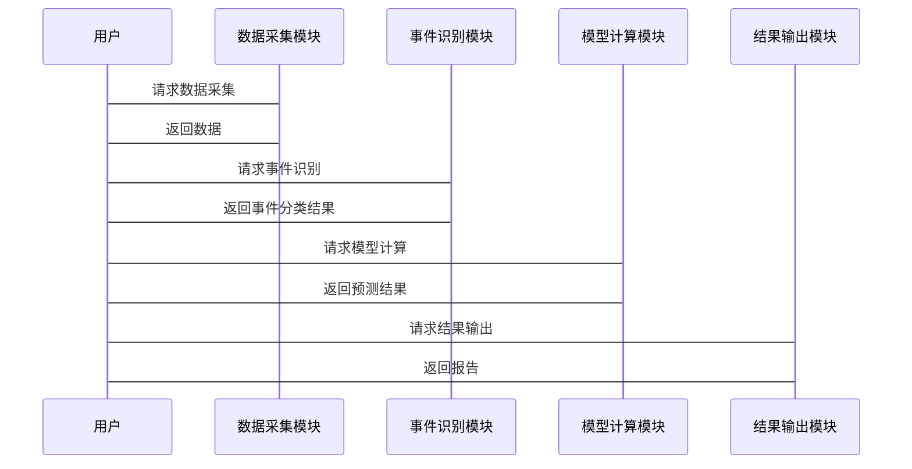

                 


# 事件驱动投资：从公司行为中获取Alpha

---

## 关键词：
事件驱动投资、Alpha、公司行为、市场事件、投资策略、数学模型

---

## 摘要：
本文深入探讨了事件驱动投资的核心概念、数学模型、系统架构和实际应用。通过分析公司行为与市场事件的关联性，结合具体的数学模型和算法，展示了如何从公司行为中捕捉投资机会，获取超额收益（Alpha）。文章还详细介绍了系统的实现过程，包括数据采集、事件识别、模型计算和结果输出，并通过实际案例分析，帮助读者理解如何将理论应用于实践。

---

## 第一部分: 事件驱动投资的背景与概念

### 第1章: 事件驱动投资的定义与背景

#### 1.1 事件驱动投资的定义
事件驱动投资是一种基于对公司行为或市场事件的分析，以捕捉短期或中期价格波动的投资策略。其核心在于通过识别和预测特定事件对公司股价的影响，从而在市场中获取超额收益（Alpha）。

- **事件驱动投资的核心要素**：
  - **公司行为**：如并购、重组、分红、高管变动等。
  - **市场事件**：如行业政策变化、经济指标发布、国际局势等。
  - **事件影响**：事件对公司财务状况、市场地位和股价的影响程度。

- **与其他投资策略的区别**：
  - 事件驱动投资注重短期事件的驱动因素，而其他策略如价值投资注重长期基本面分析。
  - 事件驱动投资具有较高的风险和不确定性，而其他策略更注重稳定性和可持续性。

#### 1.2 事件驱动投资的优势与劣势

- **优势**：
  - **快速捕捉市场机会**：通过识别突发事件，投资者可以迅速做出反应，抓住短期价格波动。
  - **差异化收益**：事件驱动投资能够在市场中找到未被充分定价的机会，从而获得超额收益。
  - **灵活性**：适用于多种市场环境，能够在不同经济周期中发挥作用。

- **劣势**：
  - **高风险与不确定性**：突发事件的影响难以预测，可能导致较大的投资损失。
  - **高竞争性**：由于事件驱动投资的策略较为公开，可能导致市场反应迅速，难以获取持续收益。

#### 1.3 事件驱动投资的起源与发展

- 事件驱动投资的起源可以追溯到20世纪60年代的行为主义心理学研究，强调市场参与者行为对公司股价的影响。
- 随着信息技术的发展，事件驱动投资逐渐从理论研究走向实际应用，特别是在高频交易和算法交易中占据重要地位。

---

## 第二部分: 事件驱动投资的核心概念与分析框架

### 第2章: 公司行为与市场事件的关联性

#### 2.1 公司行为的分类与影响

- **公司行为的主要类型**：
  - **并购与重组**：影响公司市场地位和财务状况，可能导致股价大幅波动。
  - **分红与股息调整**：影响投资者的现金流预期，可能影响股价。
  - **高管变动**：影响公司管理能力和战略方向，可能引发股价波动。

- **公司行为对市场的影响机制**：
  - **直接影响**：如并购事件直接影响公司市值。
  - **间接影响**：如高管变动可能影响市场对公司未来业绩的预期。

#### 2.2 市场事件的分类与特征

- **市场事件的主要类型**：
  - **宏观经济事件**：如经济指标发布、货币政策变化。
  - **行业政策变化**：如行业法规调整、税收政策变化。
  - **国际局势**：如国际贸易摩擦、地缘政治冲突。

- **市场事件的特征**：
  - **突发性**：许多市场事件具有突发性，难以预测。
  - **广泛性**：影响范围可能涵盖多个行业或市场。
  - **可测量性**：通过数据分析，可以量化事件的影响程度。

#### 2.3 公司行为与市场事件的关联性分析

- **关联性的定义与度量**：
  - 关联性指公司行为与市场事件之间存在因果或相关关系。
  - 关联性的度量可以通过统计方法（如相关系数）或机器学习模型（如因果推断）进行。

- **关联性分析的方法与工具**：
  - **统计方法**：如回归分析、时间序列分析。
  - **机器学习**：如随机森林、神经网络。

#### 2.4 本章小结

通过分析公司行为和市场事件的关联性，投资者可以更好地理解事件对公司股价的影响机制，从而制定更为精准的投资策略。

---

## 第三部分: 事件驱动投资的数学模型与算法原理

### 第3章: 事件驱动投资的数学模型

#### 3.1 事件驱动投资的核心假设

- **市场效率假说**：市场在短期内是有效的，但突发事件可能导致市场暂时失灵，为投资者提供套利机会。
- **事件影响的可量化性**：通过数学模型，可以量化公司行为和市场事件对公司股价的影响。
- **投资者行为的理性假设**：假设投资者在决策时是理性的，市场参与者的理性行为共同影响市场价格。

#### 3.2 事件驱动投资的数学模型构建

- **模型的输入变量**：
  - 公司行为数据（如并购、重组、分红等）。
  - 市场事件数据（如宏观经济指标、政策变化等）。
  - 历史股价数据。

- **模型的输出变量**：
  - 预测的股价变化。
  - 预测的Alpha值。

- **模型的数学表达式**：
  - 假设公司i在时间t发生事件E，其对股价的影响可以用以下公式表示：
    $$ \text{Alpha}_i(t) = \beta_i \cdot r_f + \text{EventImpact}_i(t) $$
    其中，\( \beta_i \) 是公司i的贝塔系数，\( r_f \) 是无风险利率，\( \text{EventImpact}_i(t) \) 是事件对股价的影响。

#### 3.3 事件驱动投资的算法流程

- **数据采集与预处理**：
  - 采集公司行为数据和市场事件数据，进行清洗和标准化处理。
  - 使用时间序列数据，确保数据的时间一致性。

- **事件识别与分类**：
  - 使用自然语言处理（NLP）技术，从新闻、公告中识别和分类事件。
  - 使用机器学习模型，对事件进行自动分类。

- **模型计算与结果输出**：
  - 输入事件数据和股价数据，计算事件影响。
  - 输出预测的股价变化和Alpha值。

#### 3.4 本章小结

通过数学模型和算法，可以量化公司行为和市场事件的影响，帮助投资者更好地理解事件驱动投资的内在机制。

---

## 第四部分: 事件驱动投资的系统架构与实现

### 第4章: 系统架构设计

#### 4.1 系统功能模块划分

- **数据采集模块**：
  - 负责采集公司行为数据和市场事件数据。
  - 数据来源包括新闻网站、公司公告、政府公告等。

- **事件识别模块**：
  - 使用NLP技术，从文本数据中识别和分类事件。
  - 使用规则引擎，根据预设规则识别特定事件。

- **模型计算模块**：
  - 使用数学模型，计算事件对公司股价的影响。
  - 输出预测的股价变化和Alpha值。

- **结果输出模块**：
  - 将计算结果输出为报告或可视化界面。
  - 提供投资建议和风险提示。

#### 4.2 系统架构图



#### 4.3 系统接口设计

- **数据接口**：
  - 输入：公司行为数据、市场事件数据。
  - 输出：清洗后的数据。

- **模型接口**：
  - 输入：清洗后的数据。
  - 输出：预测的股价变化和Alpha值。

#### 4.4 系统交互序列图



#### 4.5 本章小结

通过系统架构设计，可以实现事件驱动投资的自动化和高效化，帮助投资者更好地捕捉市场机会。

---

## 第五部分: 事件驱动投资的项目实战

### 第5章: 项目实战

#### 5.1 环境安装

- **安装Python**：
  - 安装Python 3.x版本。
  - 安装必要的库，如pandas、numpy、scikit-learn、beautifulsoup4、requests。

- **安装其他工具**：
  - 安装Jupyter Notebook用于数据可视化。
  - 安装数据库用于数据存储。

#### 5.2 核心代码实现

- **数据采集代码**：
  ```python
  import requests
  from bs4 import BeautifulSoup

  def get_company_events():
      url = "https://www.reuters.com/business"
      response = requests.get(url)
      soup = BeautifulSoup(response.text, 'html.parser')
      events = []
      for article in soup.find_all('article'):
          title = article.find('h2').text
          date = article.find('time').text
          events.append({'title': title, 'date': date})
      return events

  events = get_company_events()
  print(events)
  ```

- **事件识别代码**：
  ```python
  from sklearn.feature_extraction.text import TfidfVectorizer
  from sklearn.naive_bayes import MultinomialNB

  def train_event_classifier(X, y):
      vectorizer = TfidfVectorizer()
      X_vec = vectorizer.fit_transform(X)
      clf = MultinomialNB()
      clf.fit(X_vec, y)
      return clf, vectorizer

  def predict_events(clf, vectorizer, new_events):
      new_X = vectorizer.transform(new_events)
      predictions = clf.predict(new_X)
      return predictions

  # 示例数据
  X = ["Mergers and Acquisitions", "Dividend Increase", "CEO Change"]
  y = [0, 1, 2]

  clf, vectorizer = train_event_classifier(X, y)
  new_event = ["New CEO appointed"]
  predictions = predict_events(clf, vectorizer, new_event)
  print(predictions)
  ```

- **模型计算代码**：
  ```python
  import pandas as pd
  import numpy as np

  def calculate_alpha(events, prices):
      # 假设events为事件列表，prices为股价数据
      # 计算事件影响
      alpha = np.zeros(len(prices))
      for i in range(len(events)):
          if events[i]['type'] == 'merger':
              alpha[i] = 0.5 * prices[i] + 0.5 * events[i]['impact']
          else:
              alpha[i] = prices[i] + events[i]['impact']
      return alpha

  events = [{'type': 'merger', 'impact': 0.2}, {'type': 'dividend', 'impact': 0.1}]
  prices = [100, 110]
  alpha = calculate_alpha(events, prices)
  print(alpha)
  ```

#### 5.3 案例分析

- **案例背景**：
  某公司宣布并购一家竞争对手，市场预期其股价将上涨。

- **数据采集与处理**：
  使用网络爬虫采集公司公告和相关新闻，清洗数据后进行事件识别。

- **模型计算**：
  使用训练好的模型计算事件对公司股价的影响，预测股价变化。

- **结果分析**：
  根据模型预测，公司股价在并购事件后将上涨15%，投资者可以在此事件发生前买入股票，获取超额收益。

#### 5.4 本章小结

通过实际案例分析，展示了如何将理论应用于实践，帮助投资者在事件驱动投资中获取Alpha。

---

## 第六部分: 事件驱动投资的最佳实践

### 第6章: 最佳实践

#### 6.1 小结

- 事件驱动投资是一种基于公司行为和市场事件的投资策略，能够帮助投资者捕捉短期价格波动。
- 通过数学模型和算法，可以量化事件影响，辅助投资决策。

#### 6.2 注意事项

- **数据质量**：确保数据的准确性和及时性，避免因数据错误导致的投资损失。
- **模型优化**：根据市场变化不断优化模型，提高预测精度。
- **风险管理**：制定风险管理策略，降低投资风险。

#### 6.3 拓展阅读

- 建议阅读《投资学基础》（amentals of Investment）了解投资学的基本理论。
- 建议阅读《算法交易：从零到实战》（Algorithmic Trading: From Theory to Practice）学习算法交易的相关知识。

---

## 结语

事件驱动投资是一种高效的投资策略，通过分析公司行为和市场事件，投资者可以在市场中获取超额收益。然而，事件驱动投资也面临高风险和高竞争性，需要投资者具备较高的分析能力和技术能力。通过本文的介绍，读者可以更好地理解事件驱动投资的核心概念和实现方法，为实际投资决策提供参考。

---

## 作者：AI天才研究院/AI Genius Institute & 禅与计算机程序设计艺术 /Zen And The Art of Computer Programming

