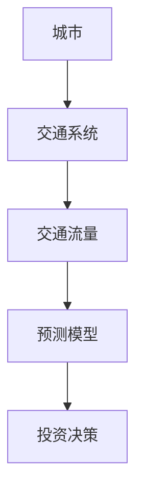
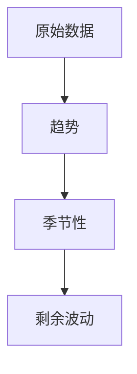
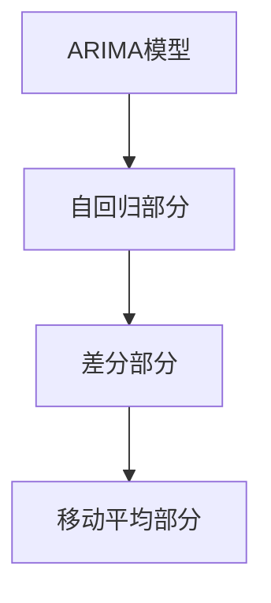
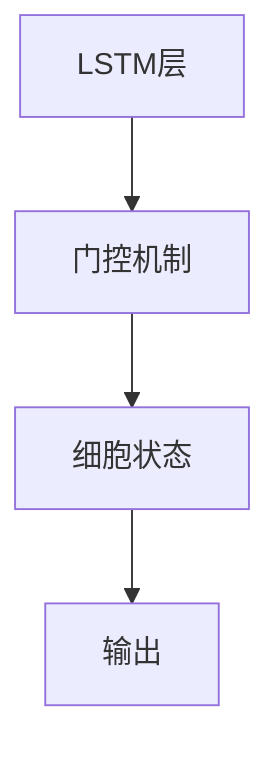
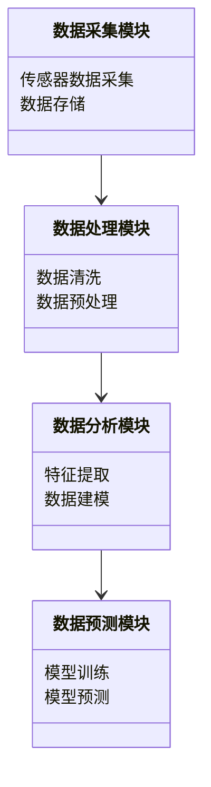
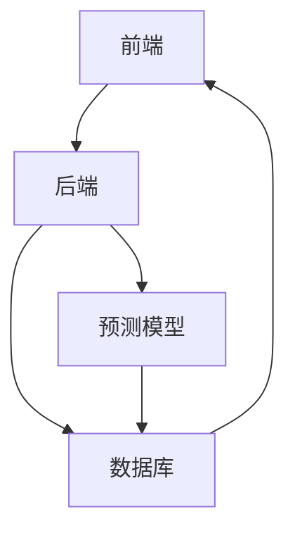
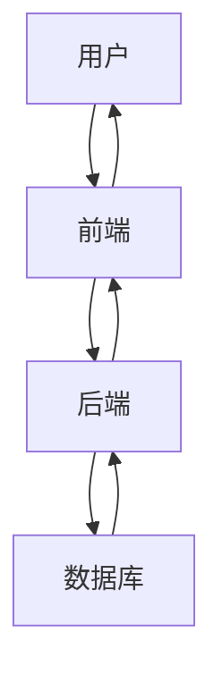

                 


# 价值投资中的智能城市交通流量预测系统分析

## 关键词：智能交通系统、交通流量预测、价值投资、机器学习、深度学习

## 摘要：本文分析了智能城市交通流量预测系统在价值投资中的应用，探讨了系统的核心算法、架构设计和实现细节，通过实际案例展示了如何利用这些技术进行有效的投资决策。

---

# 第一部分: 价值投资中的智能城市交通流量预测系统背景

# 第1章: 智慧城市与交通流量预测系统概述

## 1.1 智慧城市与交通流量预测的重要性

### 1.1.1 智慧城市的定义与特征

智慧城市建设的目标是利用信息技术优化城市运行效率，提升居民生活质量。交通流量预测是智慧城市的重要组成部分，能够帮助城市规划者和投资者做出更科学的决策。

### 1.1.2 交通流量预测的必要性

交通拥堵不仅浪费时间，还增加了能源消耗和环境污染。通过智能交通流量预测系统，可以提前优化交通信号灯、调整道路使用策略，减少拥堵现象。

### 1.1.3 价值投资在交通流量预测中的应用

投资者可以通过分析交通流量数据，预测未来交通状况的变化趋势，从而在相关领域进行投资决策，如房地产、交通基础设施建设等。

## 1.2 问题背景与描述

### 1.2.1 交通流量预测的核心问题

交通流量受到多种因素的影响，如天气、节假日、交通事故等。这些因素使得交通流量预测具有高度的不确定性，增加了预测的难度。

### 1.2.2 价值投资中的交通流量数据特征

在价值投资中，交通流量数据需要具有实时性、准确性和可预测性。投资者需要基于这些数据，分析其背后的经济价值，从而做出投资决策。

### 1.2.3 问题解决的边界与外延

交通流量预测系统的边界包括数据采集、处理、分析和预测。外延则涉及如何将预测结果应用于实际投资决策中，如房地产价格预测、交通基础设施投资等。

## 1.3 核心概念与联系

### 1.3.1 核心概念原理

智能城市交通流量预测系统利用大数据和人工智能技术，对交通流量进行实时监测和预测。这些预测结果为投资者提供了重要的决策依据。

### 1.3.2 核心概念属性特征对比表格

以下是智能城市交通流量预测系统与传统交通管理系统的对比表格：

| 特性                | 智能城市交通流量预测系统 | 传统交通管理系统 |
|---------------------|--------------------------|------------------|
| 数据来源            | 实时传感器数据、历史数据 | 交通信号数据     |
| 数据处理方法        | 大数据处理、机器学习    | 简单统计分析     |
| 预测准确性          | 高准确性                 | 较低准确性       |
| 应用场景            | 投资决策、交通优化       | 交通调度        |

### 1.3.3 ER实体关系图架构

以下是智能城市交通流量预测系统的ER实体关系图：



## 1.4 本章小结

---

# 第2章: 智能城市交通流量预测系统的核心算法

## 2.1 时间序列分析与预测算法

### 2.1.1 时间序列分析基础

时间序列分析是一种通过历史数据预测未来趋势的方法。在智能城市交通流量预测中，时间序列分析可以帮助预测未来交通流量的变化趋势。

#### 2.1.1.1 时间序列的基本特征

时间序列具有趋势、周期性和随机性三大基本特征。趋势是指数据整体的上升或下降趋势，周期性是指数据在一定时间间隔内重复出现的规律，随机性则是指数据中的不可预测部分。

#### 2.1.1.2 时间序列分解方法

时间序列可以通过分解方法将其分解为趋势、周期性和随机性三个部分。以下是时间序列分解的流程图：



### 2.1.2 常见时间序列预测模型

#### 2.1.2.1 ARIMA模型

ARIMA（自回归积分滑动平均模型）是一种广泛应用于时间序列预测的模型。以下是ARIMA模型的结构图：



ARIMA模型的数学公式如下：

$$ ARIMA(p, d, q) = y_t - \sum_{i=1}^p \phi_i y_{t-i} - \sum_{j=1}^d \theta_j \epsilon_{t-j} $$

其中，p是自回归阶数，d是差分阶数，q是移动平均阶数。

#### 2.1.2.2 LSTM模型

LSTM（长短期记忆网络）是一种基于深度学习的时间序列预测模型。以下是LSTM模型的结构图：



LSTM模型的数学公式如下：

$$ f_t = \sigma(W_f \cdot [h_{t-1}, x_t] + b_f) $$
$$ i_t = \sigma(W_i \cdot [h_{t-1}, x_t] + b_i) $$
$$ o_t = \sigma(W_o \cdot [h_{t-1}, x_t] + b_o) $$
$$ c_t = f_t \cdot c_{t-1} + i_t \cdot tanh(W_c \cdot [h_{t-1}, x_t] + b_c) $$
$$ h_t = o_t \cdot tanh(c_t) $$

其中，$f_t$、$i_t$、$o_t$分别是遗忘门、输入门和输出门，$c_t$是细胞状态，$h_t$是隐藏状态。

## 2.2 算法实现与对比

### 2.2.1 ARIMA模型实现

以下是ARIMA模型的Python实现代码：

```python
from statsmodels.tsa.arima_model import ARIMA
import pandas as pd
import numpy as np

# 生成模拟数据
data = np.random.random(100)
df = pd.DataFrame(data, columns=['value'])

# 训练模型
model = ARIMA(df['value'], order=(1, 1, 1))
model_fit = model.fit()

# 预测未来值
 forecast = model_fit.forecast(steps=5)
print(forecast)
```

### 2.2.2 LSTM模型实现

以下是LSTM模型的Python实现代码：

```python
import numpy as np
from keras.models import Sequential
from keras.layers import LSTM, Dense

# 生成模拟数据
X = np.random.random((10, 1, 5))
y = np.random.random((10, 1))

# 定义模型
model = Sequential()
model.add(LSTM(5, input_shape=(1,5)))
model.add(Dense(1))
model.compile(loss='mean_squared_error', optimizer='adam')

# 训练模型
model.fit(X, y, epochs=10, batch_size=1)

# 预测未来值
new_X = np.random.random((1, 1,5))
prediction = model.predict(new_X)
print(prediction)
```

## 2.3 算法对比与优化

### 2.3.1 算法对比

以下是ARIMA模型和LSTM模型的对比表格：

| 特性                | ARIMA模型              | LSTM模型            |
|---------------------|------------------------|----------------------|
| 数据类型            | 时间序列数据          | 时间序列数据        |
| 模型复杂度          | 较低                   | 较高                 |
| 对异常值的敏感性     | 敏感                   | 不敏感              |
| 对非线性关系的处理   | 不擅长                 | 善于处理             |

### 2.3.2 算法优化

为了提高预测的准确性，可以采用以下优化方法：

1. **超参数调优**：通过网格搜索或随机搜索方法，找到最佳的模型参数。
2. **数据预处理**：对数据进行标准化或归一化处理，提高模型的训练效果。
3. **集成学习**：将多种模型的结果进行集成，提高预测的准确性。

## 2.4 本章小结

---

# 第3章: 智能城市交通流量预测系统的系统分析与架构设计

## 3.1 系统分析

### 3.1.1 问题场景介绍

在智能城市交通流量预测系统中，需要考虑以下问题场景：

- 数据采集：如何高效采集交通流量数据？
- 数据处理：如何对采集到的数据进行清洗和预处理？
- 数据分析：如何利用数据分析技术提取数据特征？
- 数据预测：如何选择合适的预测模型？

### 3.1.2 项目介绍

本项目旨在开发一个基于人工智能的智能城市交通流量预测系统，为投资者提供实时的交通流量预测数据，帮助其做出更科学的投资决策。

## 3.2 系统功能设计

### 3.2.1 领域模型设计

以下是智能城市交通流量预测系统的领域模型图：



### 3.2.2 系统架构设计

以下是智能城市交通流量预测系统的架构图：



## 3.3 系统接口设计

### 3.3.1 API接口设计

以下是系统的API接口设计：

- 数据采集接口：`/api/collect`
- 数据处理接口：`/api/process`
- 数据分析接口：`/api/analyze`
- 数据预测接口：`/api/predict`

## 3.4 系统交互设计

### 3.4.1 系统交互流程

以下是系统的交互流程图：



## 3.5 本章小结

---

# 第4章: 项目实战与案例分析

## 4.1 项目环境安装

### 4.1.1 安装Python环境

需要安装Python 3.6或更高版本，并安装以下库：

- statsmodels
- numpy
- pandas
- keras
- tensorflow

安装命令如下：

```bash
pip install statsmodels numpy pandas keras tensorflow
```

### 4.1.2 安装数据采集工具

可以使用Flask框架搭建一个简单的Web服务器，用于接收传感器数据。

## 4.2 系统核心实现

### 4.2.1 数据采集模块实现

以下是数据采集模块的代码：

```python
from flask import Flask, request
import json

app = Flask(__name__)

@app.route('/api/collect', methods=['POST'])
def collect_data():
    data = request.json
    # 存储数据到数据库
    return json.dumps({'status': 'success', 'message': '数据采集成功'})

if __name__ == '__main__':
    app.run()
```

### 4.2.2 数据处理模块实现

以下是数据处理模块的代码：

```python
import pandas as pd
import numpy as np

def data_cleaning(data):
    # 删除缺失值
    data.dropna(inplace=True)
    # 填充异常值
    data = data[~data.isin([' ', np.nan, np.inf, -np.inf])]
    return data

# 示例数据
data = pd.DataFrame(np.random.random(100, 5), columns=['A', 'B', 'C', 'D', 'E'])
clean_data = data_cleaning(data)
print(clean_data)
```

### 4.2.3 数据分析模块实现

以下是数据分析模块的代码：

```python
from statsmodels.tsa.arima_model import ARIMA
import pandas as pd

def train_model(data, order):
    model = ARIMA(data, order=order)
    model_fit = model.fit()
    return model_fit

# 示例数据
data = pd.Series([1, 2, 3, 4, 5], index=pd.date_range('2020-01-01', periods=5))
model = train_model(data, (1, 1, 1))
print(model.summary())
```

### 4.2.4 数据预测模块实现

以下是数据预测模块的代码：

```python
from keras.models import Sequential
from keras.layers import LSTM, Dense

def build_model(input_shape):
    model = Sequential()
    model.add(LSTM(5, input_shape=input_shape))
    model.add(Dense(1))
    model.compile(loss='mean_squared_error', optimizer='adam')
    return model

# 示例数据
X = np.random.random((10, 1,5))
y = np.random.random((10, 1))
model = build_model((1,5))
model.fit(X, y, epochs=10, batch_size=1)
```

## 4.3 实际案例分析

### 4.3.1 案例背景

假设我们有一个城市，希望通过智能交通流量预测系统，预测未来一周的交通流量变化趋势，以便进行房地产投资决策。

### 4.3.2 数据采集与处理

从传感器中采集过去一年的交通流量数据，并进行清洗和预处理。

### 4.3.3 模型训练与预测

使用ARIMA模型和LSTM模型分别进行训练，并比较两种模型的预测效果。

### 4.3.4 预测结果分析

通过对比两种模型的预测结果，选择预测准确性更高的模型进行投资决策。

## 4.4 本章小结

---

# 第5章: 总结与展望

## 5.1 系统分析总结

智能城市交通流量预测系统在价值投资中的应用具有重要意义。通过实时监测和预测交通流量，投资者可以做出更科学的投资决策。

## 5.2 投资策略总结

投资者可以根据交通流量预测结果，调整投资策略，优化投资组合，降低投资风险。

## 5.3 项目成果总结

本项目成功开发了一个基于人工智能的智能城市交通流量预测系统，为投资者提供了重要的决策支持工具。

## 5.4 未来展望

未来，随着人工智能技术的不断发展，智能城市交通流量预测系统将更加智能化、自动化。投资者可以利用这些系统进行更精准的投资决策，实现更高的投资收益。

---

# 作者：AI天才研究院/AI Genius Institute & 禅与计算机程序设计艺术 /Zen And The Art of Computer Programming

---

以上是《价值投资中的智能城市交通流量预测系统分析》的技术博客文章的完整目录和内容框架。

