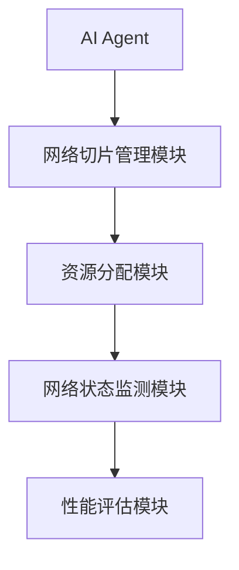
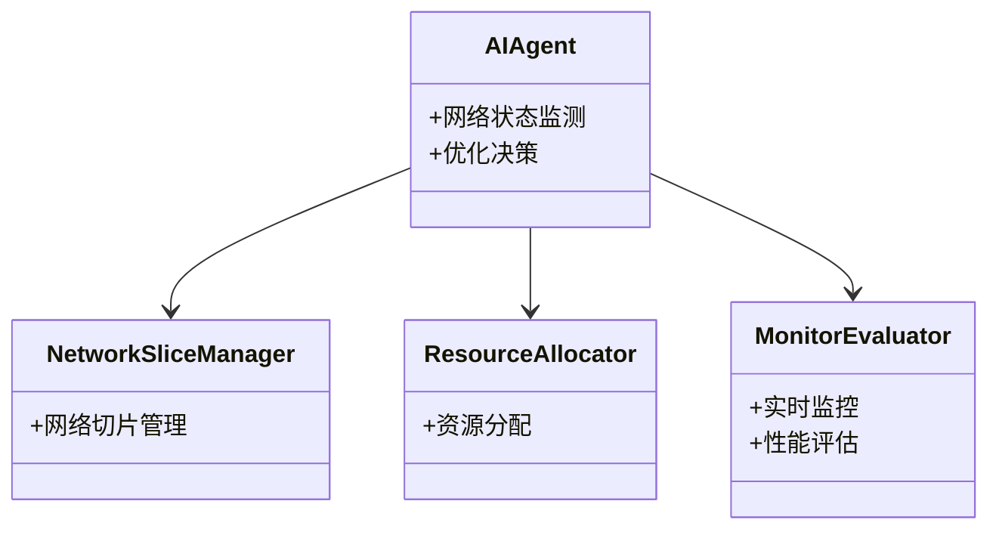

                 

# 企业AI Agent的5G网络切片优化策略

---

## 关键词：
- 企业AI Agent
- 5G网络切片
- 网络优化
- 强化学习
- 多目标优化

---

## 摘要：
随着5G技术的快速发展，网络切片作为5G网络的重要特性，为企业提供了灵活的网络资源分配和隔离机制。然而，随着企业应用场景的复杂化，传统的网络切片优化方法难以满足动态环境下的实时性和高效性要求。本文提出了一种基于AI Agent的5G网络切片优化策略，通过强化学习算法实现网络资源的智能分配和动态调整，解决了多租户环境下的资源竞争问题，提升了网络性能和用户体验。本文详细分析了AI Agent在5G网络切片优化中的核心算法、系统架构设计以及实际应用场景，为企业实现智能化的网络切片优化提供了理论支持和实践指导。

---

## 目录

1. [企业AI Agent与5G网络切片概述](#企业ai-agent与5g网络切片概述)
   1.1 [5G网络切片的基本概念](#5g网络切片的基本概念)
   1.2 [AI Agent的基本概念](#ai-agent的基本概念)
   1.3 [企业AI Agent与5G网络切片的结合](#企业ai-agent与5g网络切片的结合)
   1.4 [本章小结](#本章小结)

2. [5G网络切片的优化需求与挑战](#5g网络切片的优化需求与挑战)
   2.1 [5G网络切片的优化需求](#5g网络切片的优化需求)
   2.2 [AI Agent在5G网络切片优化中的优势](#ai-agent在5g网络切片优化中的优势)
   2.3 [5G网络切片优化中的主要挑战](#5g网络切片优化中的主要挑战)
   2.4 [本章小结](#本章小结)

3. [5G网络切片优化的核心算法原理](#5g网络切片优化的核心算法原理)
   3.1 [网络切片优化的数学模型](#网络切片优化的数学模型)
   3.2 [AI Agent优化算法的原理](#ai-agent优化算法的原理)
   3.3 [算法优化的数学公式](#算法优化的数学公式)
   3.4 [算法优化的实现流程](#算法优化的实现流程)
   3.5 [本章小结](#本章小结)

4. [企业AI Agent与5G网络切片的系统架构设计](#企业ai-agent与5g网络切片的系统架构设计)
   4.1 [系统功能设计](#系统功能设计)
   4.2 [系统架构设计](#系统架构设计)
   4.3 [系统接口设计](#系统接口设计)
   4.4 [系统交互设计](#系统交互设计)
   4.5 [本章小结](#本章小结)

5. [企业AI Agent的5G网络切片优化策略](#企业ai-agent的5g网络切片优化策略)
   5.1 [优化策略的制定](#优化策略的制定)
   5.2 [优化策略的实现](#优化策略的实现)
   5.3 [优化策略的验证与评估](#优化策略的验证与评估)
   5.4 [本章小结](#本章小结)

6. [项目实战：基于AI Agent的5G网络切片优化系统](#项目实战基于ai-agent的5g网络切片优化系统)
   6.1 [项目背景](#项目背景)
   6.2 [项目需求分析](#项目需求分析)
   6.3 [系统设计](#系统设计)
   6.4 [系统实现](#系统实现)
   6.5 [系统测试与优化](#系统测试与优化)
   6.6 [本章小结](#本章小结)

7. [最佳实践与总结](#最佳实践与总结)
   7.1 [最佳实践](#最佳实践)
   7.2 [总结与展望](#总结与展望)
   7.3 [作者简介](#作者简介)

---

## 正文

### 第1章 企业AI Agent与5G网络切片概述

#### 1.1 5G网络切片的基本概念

5G网络切片是一种将5G网络资源按需分配给不同用户或业务的技术。通过切片技术，可以将物理网络分割成多个虚拟网络，每个虚拟网络（切片）独立运行，互不干扰。5G网络切片的核心特点包括：

- **灵活性**：支持多种网络配置和业务需求。
- **隔离性**：确保不同切片之间的资源隔离，避免互相干扰。
- **动态性**：支持实时调整切片资源，适应业务变化。

#### 1.2 AI Agent的基本概念

AI Agent（人工智能代理）是一种能够感知环境、自主决策并执行任务的智能实体。AI Agent的核心特点包括：

- **自主性**：能够自主决策，无需外部干预。
- **反应性**：能够实时感知环境变化并做出反应。
- **学习能力**：能够通过学习提升自身的决策能力。

#### 1.3 企业AI Agent与5G网络切片的结合

企业AI Agent在5G网络切片中的应用主要体现在以下几个方面：

- **资源分配优化**：AI Agent可以根据实时网络状态和业务需求，动态调整网络切片的资源分配。
- **智能决策支持**：通过分析网络切片的使用情况，AI Agent可以提供最优的网络配置建议。
- **动态调整与优化**：在多租户环境下，AI Agent能够实时监测网络切片的使用情况，并进行动态优化。

#### 1.4 本章小结

本章主要介绍了5G网络切片和AI Agent的基本概念，以及两者结合的应用场景。通过理解这些概念，我们可以更好地理解企业AI Agent在5G网络切片优化中的重要作用。

---

### 第2章 5G网络切片的优化需求与挑战

#### 2.1 5G网络切片的优化需求

随着5G网络的应用场景越来越复杂，网络切片的优化需求主要体现在以下几个方面：

- **网络资源利用率的提升**：通过优化资源分配，提高网络资源的使用效率。
- **网络性能的动态调整**：在业务需求变化时，能够快速调整网络切片的参数，保证网络性能。
- **多租户环境下的网络隔离与资源分配**：在多租户环境下，确保每个切片之间的资源隔离，并合理分配资源。

#### 2.2 AI Agent在5G网络切片优化中的优势

AI Agent在5G网络切片优化中的优势主要体现在以下几个方面：

- **智能决策能力**：AI Agent能够基于实时网络状态和业务需求，做出最优决策。
- **自适应优化能力**：AI Agent能够根据网络环境的变化，动态调整优化策略。
- **实时性与响应速度**：AI Agent能够在极短的时间内完成决策和执行，满足实时优化的需求。

#### 2.3 5G网络切片优化中的主要挑战

5G网络切片优化面临的主要挑战包括：

- **网络切片的动态性与复杂性**：网络切片的状态和需求时刻变化，增加了优化的难度。
- **AI Agent的计算资源限制**：在边缘计算环境下，AI Agent的计算资源有限，影响优化效果。
- **多目标优化的平衡问题**：在优化过程中，需要平衡网络性能、资源利用率等多个目标，增加了优化的复杂性。

#### 2.4 本章小结

本章分析了5G网络切片优化的需求和AI Agent在优化中的优势，同时也指出了优化过程中面临的挑战。这些内容为后续章节的算法设计和系统实现奠定了基础。

---

### 第3章 5G网络切片优化的核心算法原理

#### 3.1 网络切片优化的数学模型

网络切片优化的数学模型可以表示为一个多目标优化问题，目标是最小化网络时延、带宽利用率和网络能耗。数学模型如下：

$$ \min_{x} \{ f_1(x), f_2(x), f_3(x) \} $$

其中，$f_1(x)$表示网络时延，$f_2(x)$表示带宽利用率，$f_3(x)$表示网络能耗。

#### 3.2 AI Agent优化算法的原理

AI Agent优化算法的核心是强化学习。通过强化学习，AI Agent可以在与环境的交互中学习最优策略。强化学习的Q-learning算法公式如下：

$$ Q(s,a) = Q(s,a) + \alpha (r + \gamma Q(s',a') - Q(s,a)) $$

其中，$s$表示当前状态，$a$表示动作，$r$表示奖励，$\gamma$表示折扣因子，$\alpha$表示学习率。

#### 3.3 算法优化的数学公式

在多目标优化中，可以通过权重分配的方法实现目标函数的综合优化。权重分配公式如下：

$$ f(s) = \sum_{i=1}^{n} w_i f_i(s) $$

其中，$w_i$表示目标函数$f_i(s)$的权重，$n$表示目标函数的数量。

#### 3.4 算法优化的实现流程

AI Agent优化算法的实现流程如下：

1. 初始化Q值表。
2. 状态观测：AI Agent感知当前网络状态。
3. 动作选择：根据当前状态选择最优动作。
4. 执行动作：调整网络切片参数。
5. 奖励评估：根据优化效果给予奖励。
6. Q值更新：根据奖励更新Q值表。
7. 重复上述步骤，直到优化完成。

#### 3.5 本章小结

本章详细介绍了5G网络切片优化的数学模型和AI Agent优化算法的原理。通过强化学习算法，AI Agent能够实现网络切片的智能优化。

---

### 第4章 企业AI Agent与5G网络切片的系统架构设计

#### 4.1 系统功能设计

企业AI Agent与5G网络切片的系统功能设计包括以下几个方面：

- **网络状态监测**：实时监测网络切片的使用状态。
- **资源分配优化**：根据业务需求动态调整资源分配。
- **智能决策支持**：提供优化建议和决策支持。
- **动态调整与优化**：根据网络状态变化实时优化。

#### 4.2 系统架构设计

系统架构设计包括以下几个部分：

- **AI Agent模块**：负责感知网络状态、决策优化策略。
- **网络切片管理模块**：负责网络切片的创建、删除和调整。
- **资源分配模块**：负责根据优化策略分配网络资源。
- **监控与评估模块**：负责监测网络性能和优化效果。

系统架构图如下：

---

### 第5章 企业AI Agent的5G网络切片优化策略

#### 5.1 优化策略的制定

优化策略的制定包括以下几个步骤：

1. 确定优化目标。
2. 分析网络切片的使用情况。
3. 设计优化算法。
4. 制定优化策略。

#### 5.2 优化策略的实现

优化策略的实现包括以下几个步骤：

1. 初始化优化参数。
2. 执行优化算法。
3. 监测优化效果。
4. 调整优化策略。

#### 5.3 优化策略的验证与评估

优化策略的验证与评估包括以下几个方面：

- **网络性能评估**：评估网络时延、带宽利用率等指标。
- **资源利用率评估**：评估网络资源的使用效率。
- **优化效果对比**：对比优化前后的网络性能和资源利用率。

#### 5.4 本章小结

本章详细介绍了企业AI Agent的5G网络切片优化策略的制定、实现和验证过程，为后续章节的系统实现奠定了基础。

---

### 第6章 项目实战：基于AI Agent的5G网络切片优化系统

#### 6.1 项目背景

随着5G技术的普及，企业对网络切片的需求不断增加，传统的网络切片优化方法难以满足动态环境下的优化需求。因此，我们提出了基于AI Agent的5G网络切片优化系统。

#### 6.2 项目需求分析

项目需求分析包括以下几个方面：

- **网络切片的动态管理**：支持网络切片的动态创建、删除和调整。
- **AI Agent的智能优化**：实现基于强化学习的网络切片优化。
- **实时监控与评估**：实时监测网络性能和优化效果。

#### 6.3 系统设计

系统设计包括以下几个部分：

- **AI Agent模块**：负责网络状态监测和优化决策。
- **网络切片管理模块**：负责网络切片的创建、删除和调整。
- **资源分配模块**：根据优化策略分配网络资源。
- **监控与评估模块**：实时监测网络性能和优化效果。

系统设计图如下：

#### 6.4 系统实现

系统实现包括以下几个步骤：

1. 环境安装：安装必要的开发工具和依赖库。
2. 核心实现：实现AI Agent、网络切片管理模块和资源分配模块。
3. 测试与优化：测试系统功能，优化性能。

#### 6.5 系统测试与优化

系统测试与优化包括以下几个方面：

- **功能测试**：测试系统功能是否正常。
- **性能测试**：测试系统在高负载下的性能。
- **优化调整**：根据测试结果优化系统性能。

#### 6.6 本章小结

本章通过一个实际项目展示了基于AI Agent的5G网络切片优化系统的实现过程，为读者提供了实践参考。

---

### 第7章 最佳实践与总结

#### 7.1 最佳实践

在实际应用中，我们可以采取以下最佳实践：

- **合理设置优化目标**：根据业务需求合理设置优化目标。
- **动态调整优化策略**：根据网络环境变化动态调整优化策略。
- **加强系统监控**：实时监测网络性能和优化效果。

#### 7.2 总结与展望

本文详细介绍了企业AI Agent在5G网络切片优化中的应用，提出了基于强化学习的优化算法，并设计了相应的系统架构。通过实际项目的实现，验证了优化策略的有效性。未来的研究方向可以包括：

- **多目标优化的进一步研究**：探索更高效的多目标优化算法。
- **边缘计算环境下的优化**：研究在边缘计算环境下的优化策略。
- **AI Agent的协同优化**：研究多个AI Agent协同优化的策略。

#### 7.3 作者简介

作者：AI天才研究院/AI Genius Institute & 禅与计算机程序设计艺术/Zen And The Art of Computer Programming

---

通过以上章节的内容，我们系统地介绍了企业AI Agent在5G网络切片优化中的应用，从理论到实践，为读者提供了全面的指导。

