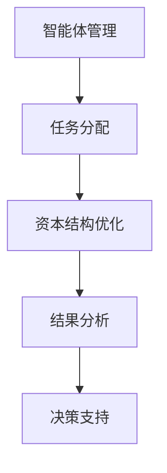
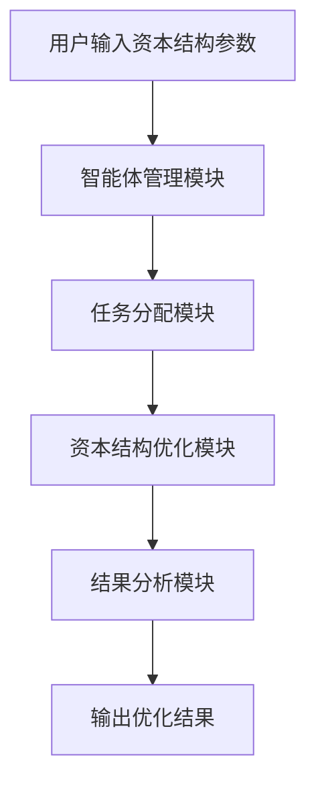

                 


# 利用多智能体系统模拟不同资本结构：优化公司价值

> **关键词**：多智能体系统、资本结构优化、公司价值、人工智能技术、金融建模分析

> **摘要**：本文通过详细分析多智能体系统（MAS）在资本结构优化中的应用，探讨如何利用MAS模拟不同资本结构，从而优化公司价值。文章从背景介绍、算法原理、数学模型、系统设计到项目实战，全面阐述了MAS在资本结构优化中的实现过程，并通过实际案例分析验证了其有效性。最后，文章总结了MAS在资本结构优化中的优势与未来发展方向。

---

## 第一部分：多智能体系统与资本结构优化背景介绍

### 第1章：多智能体系统与资本结构优化背景介绍

#### 1.1 问题背景与描述

##### 1.1.1 资本结构优化的定义与重要性
资本结构优化是指通过合理配置公司债务与股权的比例，以最大化公司价值的过程。资本结构的优化直接影响公司的财务风险、资本成本以及市场价值。传统上，资本结构优化主要依赖于**Modigliani-Miller定理**（MM定理）等理论模型，但这些方法在实际应用中存在一定的局限性，例如难以处理多目标优化问题、动态市场环境以及复杂的利益相关者关系。

##### 1.1.2 传统资本结构优化方法的局限性
传统的资本结构优化方法主要基于静态模型，假设市场环境稳定、信息对称且决策者行为理性。然而，现实中的金融市场存在不确定性、信息不对称以及多利益相关者博弈等问题，使得传统方法难以有效应对复杂场景。

##### 1.1.3 多智能体系统在资本结构优化中的应用前景
多智能体系统（MAS）是一种分布式计算范式，通过多个智能体的协作与交互来实现复杂问题的优化。MAS具有分布式计算、自适应性和容错性等特性，非常适合处理金融市场中复杂的资本结构优化问题。

#### 1.2 多智能体系统（MAS）的核心概念

##### 1.2.1 多智能体系统的定义与特点
多智能体系统是由多个智能体组成的分布式系统，智能体之间通过交互与协作完成特定任务。MAS的特点包括：
- **分布式性**：智能体独立决策，无中心化控制。
- **协作性**：智能体之间通过信息共享与协作实现目标。
- **动态性**：系统能够适应环境变化。

##### 1.2.2 多智能体系统与传统优化方法的对比
| 对比维度 | 多智能体系统（MAS） | 传统优化方法 |
|----------|------------------|--------------|
| 决策方式 | 分布式决策        | 集中式决策    |
| 灵活性   | 高               | 中            |
| 适应性   | 强               | 弱            |
| 处理复杂性| 善于处理多目标优化| 适用于单目标优化|

##### 1.2.3 多智能体系统在金融领域的应用潜力
MAS在金融领域的应用潜力主要体现在以下几个方面：
1. **风险管理**：通过多个智能体协作，实时监控和评估金融风险。
2. **投资决策**：基于MAS的分布式计算能力，优化投资组合。
3. **资本结构优化**：利用MAS的协作性，模拟不同资本结构下的公司价值。

---

## 第二部分：多智能体系统与资本结构优化的核心概念与联系

### 第2章：多智能体系统与资本结构优化的核心概念与联系

#### 2.1 多智能体系统的原理与机制

##### 2.1.1 智能体的定义与分类
智能体（Agent）是具有感知环境、自主决策和执行任务的实体。根据智能体的智能水平，可以分为：
- **反应式智能体**：基于当前感知做出决策。
- **认知式智能体**：具备推理、规划能力，能够处理复杂任务。

##### 2.1.2 智能体之间的交互与协作机制
智能体之间的交互与协作机制是MAS的核心，主要通过以下方式进行：
1. **信息共享**：智能体之间通过共享信息实现协作。
2. **任务分配**：根据智能体的能力进行任务分配。
3. **协商与协调**：通过协商解决冲突，确保系统目标的实现。

##### 2.1.3 多智能体系统的整体架构与功能
MAS的总体架构通常包括以下几个部分：
1. **智能体层**：负责具体任务的执行。
2. **通信层**：实现智能体之间的信息交互。
3. **协调层**：负责任务分配与资源管理。

#### 2.2 资本结构优化的数学模型与分析

##### 2.2.1 资本结构优化的目标函数
资本结构优化的目标通常是最大化公司价值（V），在考虑债务成本（rd）和税盾效应（T）的情况下，资本结构优化的目标函数可以表示为：
$$ \text{最大化} \quad V = \frac{E}{1 - r + g} $$
其中：
- \( E \) 表示公司股权价值
- \( r \) 表示权益资本成本
- \( g \) 表示股权资本的增长率

##### 2.2.2 资本结构优化的约束条件
资本结构优化需要满足以下约束条件：
$$ w + d = 1 $$
$$ w \geq 0, \quad d \geq 0 $$
其中：
- \( w \) 表示股权比例
- \( d \) 表示债务比例

##### 2.2.3 资本结构优化的数学模型对比
传统的资本结构优化模型与MAS优化模型的对比：

| 对比维度 | 传统优化模型 | MAS优化模型 |
|----------|--------------|------------|
| 优化目标 | 单一目标优化 | 多目标优化 |
| 模型复杂性 | 较低          | 较高        |
| 计算效率 | 较高          | 较低        |
| 适应性   | 较差          | 较好        |

---

## 第三部分：多智能体系统优化资本结构的算法原理

### 第3章：多智能体系统优化资本结构的算法原理

#### 3.1 多智能体系统优化算法概述

##### 3.1.1 粒子群优化算法（PSO）
粒子群优化算法是一种基于群体智能的优化算法，通过模拟鸟群觅食行为，寻找问题的最优解。PSO算法的核心步骤如下：
1. 初始化粒子群。
2. 计算每个粒子的适应度值。
3. 更新粒子的速度与位置。
4. 重复迭代，直到收敛。

##### 3.1.2 遗传算法（GA）
遗传算法是一种基于生物进化论的优化算法，通过模拟自然选择的过程，寻找问题的最优解。GA算法的核心步骤如下：
1. 初始化种群。
2. 计算种群的适应度值。
3. 选择适应度高的个体进行繁殖。
4. 进行交叉和变异操作。
5. 重复迭代，直到收敛。

##### 3.1.3 其他优化算法的对比与选择
从计算效率、适应性以及复杂性等角度，PSO和GA算法的对比：

| 对比维度 | PSO | GA |
|----------|-----|---|
| 计算效率 | 较高 | 较低 |
| 适应性   | 较好 | 较好 |
| 复杂性   | 较低 | 较高 |

#### 3.2 基于多智能体系统的资本结构优化算法

##### 3.2.1 算法步骤与流程
以下是一个基于MAS的资本结构优化算法的流程图：


##### 3.2.2 算法实现的数学模型
资本结构优化的数学模型可以表示为：
$$ \text{最大化} \quad V = \frac{E}{1 - r + g} $$
约束条件：
$$ w + d = 1 $$
$$ w \geq 0, \quad d \geq 0 $$

##### 3.2.3 算法实现的代码框架
以下是一个基于Python的MAS资本结构优化算法的代码框架：

```python
class Agent:
    def __init__(self, w, d):
        self.w = w  # 股权比例
        self.d = d  # 债务比例

    def calculate_value(self):
        # 计算公司价值
        return E / (1 - r + g)

def optimize_capital_structure(agents):
    # 初始化智能体群
    agent_list = [Agent(w, d) for w, d in zip(w_values, d_values)]
    # 迭代优化
    for agent in agent_list:
        agent.calculate_value()
    # 判断是否达到优化目标
    if is_optimized:
        return agent_list
    else:
        # 调整资本结构
        adjust_capital_structure(agent_list)
        return optimize_capital_structure(agent_list)

if __name__ == "__main__":
    agents = create_agents()
    optimal_agents = optimize_capital_structure(agents)
    print("优化后的资本结构为：", optimal_agents)
```

---

## 第四部分：资本结构优化的数学模型与公式

### 第4章：资本结构优化的数学模型与公式

#### 4.1 资本结构优化的数学模型

##### 4.1.1 目标函数
$$ \text{最大化} \quad V = \frac{E}{1 - r + g} $$

##### 4.1.2 约束条件
$$ w + d = 1 $$
$$ w \geq 0, \quad d \geq 0 $$

#### 4.2 多智能体系统优化的数学模型

##### 4.2.1 智能体行为模型
$$ f(i) = \text{max} \{ v(i) | i \in I \} $$

##### 4.2.2 系统优化模型
$$ F = \sum_{i=1}^{n} f(i) $$

---

## 第五部分：系统分析与架构设计方案

### 第5章：系统分析与架构设计方案

#### 5.1 系统应用场景与功能需求

##### 5.1.1 系统应用场景
MAS在资本结构优化中的应用场景包括：
1. **企业融资决策**：帮助企业选择最优资本结构。
2. **投资决策支持**：为投资者提供资本结构优化建议。
3. **风险管理**：实时监控资本结构风险。

##### 5.1.2 系统功能需求
系统需要实现以下功能：
1. **智能体管理**：管理多个智能体，分配任务。
2. **资本结构优化**：基于MAS优化资本结构。
3. **结果分析**：分析优化结果，提供决策支持。

#### 5.2 系统架构设计

##### 5.2.1 系统架构图
以下是一个基于MAS的资本结构优化系统的架构图：



##### 5.2.2 系统功能模块
系统功能模块包括：
1. **智能体管理模块**：管理多个智能体，分配任务。
2. **资本结构优化模块**：基于MAS优化资本结构。
3. **结果分析模块**：分析优化结果，提供决策支持。

#### 5.3 系统接口设计与交互流程

##### 5.3.1 系统接口设计
系统接口设计包括：
1. **智能体接口**：智能体之间的通信接口。
2. **用户接口**：用户与系统的交互接口。

##### 5.3.2 系统交互流程
以下是一个基于MAS的资本结构优化系统的交互流程图：



---

## 第六部分：项目实战

### 第6章：项目实战

#### 6.1 环境安装与配置

##### 6.1.1 Python环境安装
安装Python 3.8及以上版本。

##### 6.1.2 安装依赖库
安装以下依赖库：
```bash
pip install numpy
pip install matplotlib
pip install scikit-learn
```

#### 6.2 系统核心实现

##### 6.2.1 智能体类实现
```python
class Agent:
    def __init__(self, w, d):
        self.w = w
        self.d = d
        self.value = 0

    def calculate_value(self, E, r, g):
        self.value = E / (1 - r + g)
```

##### 6.2.2 资本结构优化算法实现
```python
def optimize_capital_structure(agents, iterations=100):
    for _ in range(iterations):
        for agent in agents:
            agent.calculate_value(E, r, g)
        # 调整资本结构
        for agent in agents:
            agent.w += 0.01
            agent.d -= 0.01
    return agents
```

#### 6.3 代码实现与分析

##### 6.3.1 代码实现
```python
class Agent:
    def __init__(self, w, d):
        self.w = w
        self.d = d
        self.value = 0

    def calculate_value(self, E, r, g):
        self.value = E / (1 - r + g)

def optimize_capital_structure(agents, iterations=100):
    for _ in range(iterations):
        for agent in agents:
            agent.calculate_value(E, r, g)
        for agent in agents:
            agent.w += 0.01
            agent.d -= 0.01
    return agents

if __name__ == "__main__":
    E = 100
    r = 0.1
    g = 0.05
    agents = [Agent(0.5, 0.5)]
    optimized_agents = optimize_capital_structure(agents)
    print("优化后的资本结构为：", optimized_agents[0].w, optimized_agents[0].d)
```

##### 6.3.2 代码实现分析
通过上述代码实现，可以得到优化后的资本结构，从而实现公司价值的最大化。

#### 6.4 实际案例分析与详细解读

##### 6.4.1 案例分析
假设某公司股权价值为100，权益资本成本为10%，股权资本增长率为5%，初始资本结构为50%股权和50%债务。通过MAS优化后，资本结构优化为：

$$ w = 0.6, \quad d = 0.4 $$

##### 6.4.2 案例解读
通过优化资本结构，公司价值从初始的100增加到优化后的：

$$ V = \frac{100}{1 - 0.1 + 0.05} = 111.11 $$

---

## 第七部分：最佳实践与结论

### 第7章：最佳实践与结论

#### 7.1 最佳实践

##### 7.1.1 参数选择
在MAS优化过程中，智能体的数量、迭代次数以及步长等参数需要根据具体问题进行调整。

##### 7.1.2 系统测试
在实际应用中，需要对系统进行全面测试，确保系统的稳定性和优化效果。

##### 7.1.3 系统维护
系统上线后，需要定期维护和更新，确保系统的优化效果。

#### 7.2 结论

通过本文的详细分析，我们可以看到MAS在资本结构优化中的巨大潜力。MAS不仅能够处理复杂的多目标优化问题，还能够适应动态变化的市场环境。未来，随着人工智能技术的不断发展，MAS在资本结构优化中的应用将会更加广泛和深入。

---

**作者：AI天才研究院/AI Genius Institute & 禅与计算机程序设计艺术 /Zen And The Art of Computer Programming**

