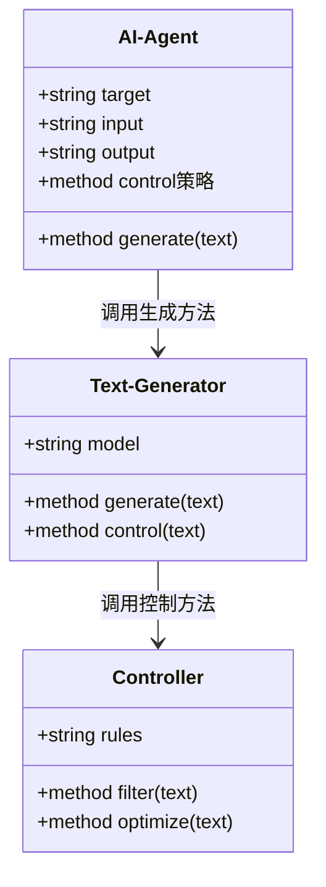
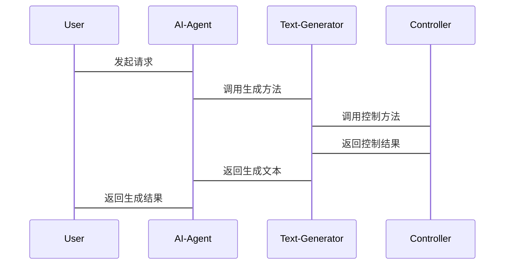

                 


# 开发AI Agent的文本生成控制能力

## 关键词：
AI Agent，文本生成，控制能力，生成式AI，强化学习

## 摘要：
本文旨在探讨如何开发具有文本生成控制能力的AI Agent。通过分析生成式AI的基本原理、控制策略的设计与实现，以及系统的架构和项目实战，本文详细讲解了AI Agent中文本生成控制的核心概念、算法原理、系统架构设计、项目实现及最佳实践，帮助读者全面理解和掌握AI Agent的文本生成控制能力开发。

---

# 第1章 AI Agent与文本生成控制概述

## 1.1 AI Agent的基本概念

### 1.1.1 什么是AI Agent
AI Agent（人工智能代理）是一种智能实体，能够感知环境、自主决策并执行任务。AI Agent的核心能力包括感知、推理、学习和执行。在文本生成领域，AI Agent需要具备理解和生成人类语言的能力，以便与用户进行有效的交互。

### 1.1.2 AI Agent的分类
AI Agent可以分为以下几类：
1. **基于规则的AI Agent**：通过预定义的规则和逻辑进行决策和行动。
2. **基于机器学习的AI Agent**：通过训练数据学习模式和规律，自主进行决策。
3. **基于强化学习的AI Agent**：通过与环境的交互，学习最优策略以实现目标。
4. **混合型AI Agent**：结合多种方法，综合运用规则和机器学习技术。

### 1.1.3 文本生成在AI Agent中的作用
文本生成是AI Agent与用户进行交互的重要方式之一。通过生成自然流畅的文本，AI Agent能够更好地理解用户需求并提供准确的信息。文本生成控制能力则是确保生成文本符合特定目标、风格和格式的关键。

---

## 1.2 文本生成的挑战与控制需求

### 1.2.1 文本生成的常见问题
1. **内容不相关**：生成的文本可能偏离用户的需求。
2. **生成低质量**：文本可能存在语法错误或逻辑不通。
3. **风格不统一**：生成的文本可能缺乏一致性，尤其是在多轮对话中。
4. **伦理和安全问题**：生成的文本可能包含敏感信息或不当内容。

### 1.2.2 控制文本生成的重要性
控制文本生成能力是确保AI Agent能够准确理解用户需求并生成高质量文本的关键。通过控制生成过程，可以避免上述问题，提升用户体验和系统可靠性。

### 1.2.3 AI Agent中文本生成控制的目标
1. **内容准确性**：生成的文本应准确反映用户需求。
2. **风格一致性**：确保生成文本在风格、语气上保持一致。
3. **可解释性**：生成文本的决策过程应可追溯和解释。
4. **效率与性能**：在保证生成质量的同时，提高生成速度。

---

## 1.3 本章小结
本章介绍了AI Agent的基本概念及其分类，重点阐述了文本生成在AI Agent中的作用。通过分析文本生成的常见问题和控制需求，明确了开发AI Agent文本生成控制能力的目标和重要意义。

---

# 第2章 生成式AI与控制策略

## 2.1 生成式AI的核心原理

### 2.1.1 生成式AI的基本原理
生成式AI通过训练大规模数据，学习语言的结构和模式，生成符合语法规则的文本。其核心是通过深度学习模型（如Transformer）捕捉上下文信息，并预测下一个词或字符。

### 2.1.2 常见的生成式AI模型
1. **Transformer模型**：基于自注意力机制，广泛应用于文本生成任务。
2. **LSTM模型**：通过长短期记忆单元捕捉序列信息。
3. **GPT系列模型**：基于Transformer的开源模型，具备强大的生成能力。

### 2.1.3 生成式AI的优缺点
- **优点**：生成文本质量高，能够处理长序列信息。
- **缺点**：生成过程不可控，可能生成不相关或有害内容。

---

## 2.2 控制策略的实现方法

### 2.2.1 基于规则的控制策略
基于规则的控制策略通过预定义的规则过滤生成文本。例如，通过关键词过滤敏感内容，或限制生成文本的长度。

### 2.2.2 基于强化学习的控制策略
基于强化学习的控制策略通过与环境的交互，学习最优策略。例如，使用策略梯度方法优化生成文本的奖励函数，提升生成质量。

### 2.2.3 基于生成对抗网络的控制策略
生成对抗网络（GAN）通过生成器和判别器的对抗训练，优化生成文本的质量。生成器负责生成文本，判别器负责评估生成文本的准确性。

---

## 2.3 AI Agent中的生成与控制关系

### 2.3.1 生成与控制的协同关系
生成与控制是相辅相成的过程。生成提供文本内容，控制确保生成内容符合目标。通过协同工作，生成式AI和控制策略能够共同提升生成文本的质量。

### 2.3.2 控制策略对生成效果的影响
控制策略直接影响生成文本的准确性和相关性。例如，通过强化学习优化生成策略，可以显著提升生成文本的质量。

### 2.3.3 生成式AI与控制策略的结合案例
案例：在客服对话系统中，生成式AI负责生成回复内容，控制策略确保回复符合用户需求和公司政策。

---

## 2.4 本章小结
本章详细介绍了生成式AI的核心原理和控制策略的实现方法，分析了生成与控制的协同关系。通过案例分析，明确了生成式AI与控制策略结合的重要性。

---

# 第3章 文本生成算法原理

## 3.1 常见文本生成算法概述

### 3.1.1 Transformer模型
Transformer模型通过自注意力机制捕捉文本中的长距离依赖关系。其核心公式如下：
$$ \text{Attention}(Q,K,V) = \text{softmax}\left(\frac{QK^T}{\sqrt{d_k}}\right)V $$

### 3.1.2 LSTM模型
LSTM模型通过长短期记忆单元捕捉序列信息，其核心公式如下：
$$ a_t = \text{激活函数}(W_a x_t + U_a h_{t-1}) $$
$$ h_t = \text{激活函数}(W_h x_t + U_h h_{t-1} + V_a a_t) $$

### 3.1.3 GPT系列模型
GPT模型基于Transformer架构，通过自监督学习预训练大规模文本数据，具备强大的生成能力。

---

## 3.2 文本生成的数学模型

### 3.2.1 Transformer模型的数学公式
$$ \text{Positional Encoding}(i) = \sum_{k=0}^{n-1} \text{pos}_k \cdot \text{exp}(-1 \cdot 2^{k} \cdot \ln(10) \cdot \frac{i}{d_{\text{model}}}) $$

### 3.2.2 LSTM模型的数学公式
$$ f_t = \text{激活函数}(W_f x_t + U_f h_{t-1}) $$
$$ i_t = \text{激活函数}(W_i x_t + U_i h_{t-1}) $$
$$ o_t = \text{激活函数}(W_o x_t + U_o h_{t-1}) $$
$$ h_t = f_t \cdot c_{t-1} + i_t \cdot g(h_{t-1}) $$

---

## 3.3 算法实现与优化

### 3.3.1 基于Transformer的文本生成实现
代码示例：
```python
import torch
def generate_text(model, tokenizer, max_length=50):
    input_ids = tokenizer.encode("Given prompt", return_tensors="pt")
    input_ids = input_ids.to(device)
    for _ in range(max_length):
        outputs = model.generate(input_ids)
        generated_token = outputs[-1]
        input_ids = torch.cat([input_ids, generated_token])
        print(tokenizer.decode(generated_token))
```

### 3.3.2 基于LSTM的文本生成实现
代码示例：
```python
import torch
class LSTMGenerator(torch.nn.Module):
    def __init__(self, vocab_size, embedding_dim, hidden_dim):
        super(LSTMGenerator, self).__init__()
        self.embedding = torch.nn.Embedding(vocab_size, embedding_dim)
        self.lstm = torch.nn.LSTM(embedding_dim, hidden_dim, batch_first=True)
        self.fc = torch.nn.Linear(hidden_dim, vocab_size)
    
    def forward(self, input, hidden=None):
        embeds = self.embedding(input)
        lstm_out, hidden = self.lstm(embeds, hidden)
        output = self.fc(lstm_out[:, -1])
        return output, hidden
```

---

## 3.4 本章小结
本章详细讲解了常见文本生成算法的核心原理和数学公式，通过代码示例展示了算法的实现方法。通过分析不同算法的优缺点，为后续的控制策略设计提供了理论基础。

---

# 第4章 系统分析与架构设计

## 4.1 问题场景介绍
在开发AI Agent的文本生成控制能力时，需要考虑生成文本的准确性、相关性和可解释性。通过系统架构设计，可以实现生成文本的高效控制和优化。

---

## 4.2 项目介绍

### 4.2.1 项目目标
开发一个具备文本生成控制能力的AI Agent，能够根据用户需求生成高质量文本。

### 4.2.2 项目范围
涵盖文本生成、文本控制、用户交互和系统管理等功能。

---

## 4.3 系统功能设计

### 4.3.1 领域模型（Mermaid类图）


### 4.3.2 系统架构设计（Mermaid架构图）


---

## 4.4 系统接口设计

### 4.4.1 输入接口
1. **文本生成接口**：接收用户输入，生成相应文本。
2. **控制策略接口**：接收控制参数，调整生成过程。

### 4.4.2 输出接口
1. **文本输出接口**：返回生成的文本内容。
2. **反馈接口**：返回生成结果的反馈信息，用于优化生成策略。

---

## 4.5 系统交互流程（Mermaid序列图）


---

## 4.6 本章小结
本章通过系统架构设计和交互流程分析，明确了AI Agent中文本生成控制能力的实现方式。通过类图和序列图展示了系统各部分之间的关系，为后续的项目实现提供了清晰的指导。

---

# 第5章 项目实战

## 5.1 环境安装与配置

### 5.1.1 安装Python环境
使用Anaconda或虚拟环境安装Python 3.8及以上版本。

### 5.1.2 安装依赖库
安装PyTorch、Hugging Face Transformers等库：
```bash
pip install torch transformers
```

---

## 5.2 系统核心功能实现

### 5.2.1 文本生成实现
基于Hugging Face Transformers库实现文本生成：
```python
from transformers import AutoTokenizer, AutoModelForCausalLM
tokenizer = AutoTokenizer.from_pretrained('gpt2')
model = AutoModelForCausalLM.from_pretrained('gpt2')
inputs = tokenizer("Given prompt", return_tensors="pt")
outputs = model.generate(inputs.input_ids, max_length=50)
print(tokenizer.decode(outputs[0], skip_special_tokens=True))
```

### 5.2.2 控制策略实现
基于强化学习的控制策略实现：
```python
import torch
class Controller(torch.nn.Module):
    def __init__(self):
        super(Controller, self).__init__()
        self.fc = torch.nn.Linear(512, 1)
    
    def forward(self, input):
        output = self.fc(input)
        return output
```

---

## 5.3 项目小结
通过本章的项目实战，读者可以掌握AI Agent中文本生成控制能力的实现方法。通过具体代码示例和实现步骤，帮助读者快速上手开发相关系统。

---

# 第6章 最佳实践与小结

## 6.1 最佳实践

### 6.1.1 环境管理
确保开发环境和依赖库版本一致，避免冲突。

### 6.1.2 代码规范
遵循Python代码规范，保持代码的可读性和可维护性。

### 6.1.3 调试技巧
使用调试工具（如PyCharm、Jupyter Notebook）进行调试和排错。

### 6.1.4 性能优化
通过减少模型参数、优化算法和并行计算提升生成效率。

---

## 6.2 小结与注意事项

### 6.2.1 小结
本文通过理论分析和项目实战，详细讲解了AI Agent中文本生成控制能力的开发方法。通过系统架构设计和最佳实践，为读者提供了全面的开发指导。

### 6.2.2 注意事项
1. **模型选择**：根据具体需求选择合适的生成模型。
2. **控制策略优化**：通过实验和反馈不断优化控制策略。
3. **安全性评估**：确保生成内容的安全性和合规性。

---

## 6.3 未来发展方向

### 6.3.1 智能化控制策略
通过深度学习和强化学习进一步优化控制策略，提升生成文本的质量。

### 6.3.2 多模态生成
结合视觉、听觉等多模态信息，提升生成能力。

### 6.3.3 高效生成算法
研究更高效的生成算法，提升生成速度和质量。

---

## 6.4 拓展阅读

### 6.4.1 推荐书籍
1. 《Deep Learning》—— Ian Goodfellow
2. 《生成式人工智能：基础与实践》—— 人民邮电出版社

### 6.4.2 推荐博客与技术文章
1. Hugging Face官方博客
2. AI Researcher的GitHub仓库

---

# 附录

## 附录A 工具安装指南

### A.1 安装Python环境
使用Anaconda或虚拟环境安装Python 3.8及以上版本。

### A.2 安装依赖库
```bash
pip install torch transformers
```

---

## 附录B API文档

### B.1 Hugging Face Transformers API
参考Hugging Face官方文档：
https://huggingface.co/transformers/

---

## 附录C 参考文献

1. Vaswani, A., et al. "Attention Is All You Need." arXiv preprint arXiv:1706.03798, 2017.
2. Hochreiter, S., and J. Schmidhuber. "Long short-term memory." Neural computation, 1997.
3. Radford, A., et al. "Language models are few-shot learners." arXiv preprint arXiv:1909.08899, 2019.

---

# 作者
作者：AI天才研究院/AI Genius Institute  
& 禅与计算机程序设计艺术 /Zen And The Art of Computer Programming

