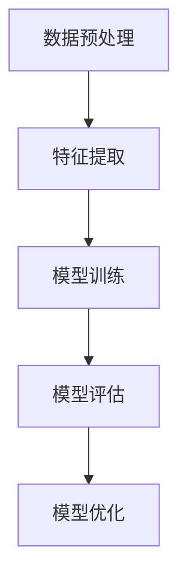
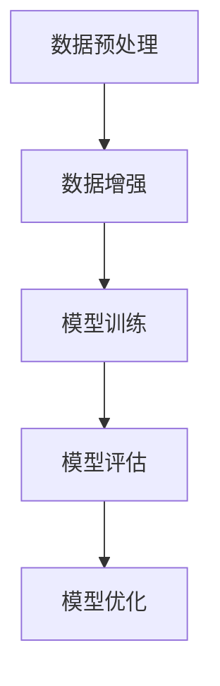
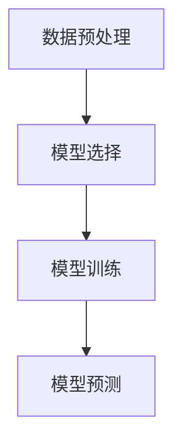
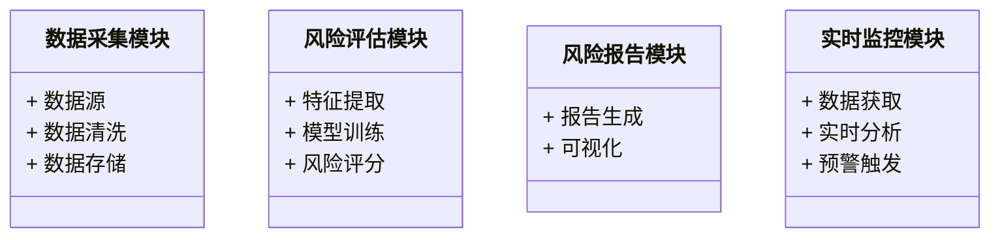
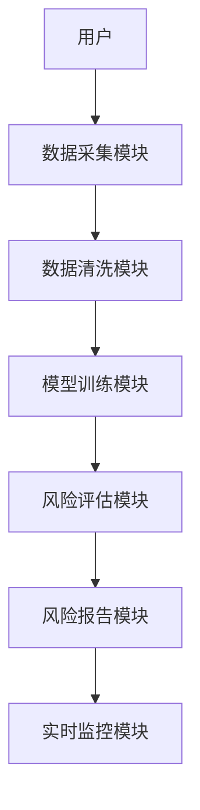
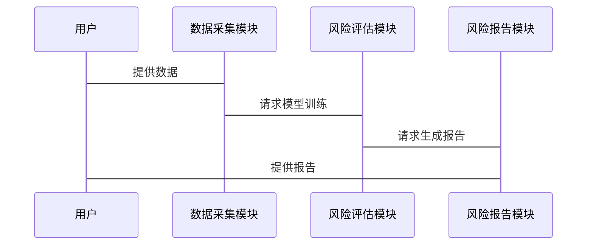

                 


# 开发AI辅助的企业财务风险量化评估工具

**关键词**：AI辅助、企业财务风险管理、风险量化评估、机器学习、深度学习

**摘要**：  
随着全球经济的快速发展，企业财务风险管理的重要性日益凸显。传统的财务风险管理方法往往依赖人工经验，存在效率低、主观性强、覆盖面窄等问题。而人工智能（AI）技术的快速发展为财务风险管理提供了新的解决方案。本文将详细探讨如何利用AI技术开发企业财务风险量化评估工具，从背景介绍、核心概念、算法原理、系统架构到项目实战，逐步分析实现过程，为读者提供一个全面的技术指南。

---

## 第1章: 企业财务风险量化评估工具的背景与问题背景

### 1.1 问题背景

#### 1.1.1 企业财务风险管理的重要性
企业财务风险管理是企业稳健经营的核心保障。通过识别、评估和控制财务风险，企业可以避免重大财务损失，确保资金链的安全。然而，传统财务风险管理方法依赖人工经验，存在以下问题：

- 数据处理效率低，难以应对海量数据。
- 风险评估的主观性较强，难以量化。
- 风险预测的准确性不足，难以实时响应。

#### 1.1.2 问题描述
企业财务风险的种类繁多，包括信用风险、市场风险、流动性风险等。这些风险往往具有复杂性、动态性和不确定性，传统的基于经验的评估方法难以满足现代企业的需求。例如：

- 信用风险：企业因客户违约导致的损失。
- 市场风险：市场波动对企业资产价值的影响。
- 流动性风险：企业无法及时获得所需资金的风险。

#### 1.1.3 AI技术在财务风险管理中的潜力
AI技术可以通过以下方式提升企业财务风险管理能力：

- **数据处理能力**：利用机器学习算法快速处理海量财务数据，提取关键特征。
- **风险量化**：通过深度学习模型对风险进行量化评估，提供更精确的风险指标。
- **实时监控**：AI可以实时分析市场波动和企业财务状况，及时预警潜在风险。

### 1.2 问题解决

#### 1.2.1 AI技术在财务风险管理中的应用方向
AI技术在财务风险管理中的应用方向包括：

- **信用评分**：利用机器学习模型对企业或个人的信用风险进行评估。
- **市场风险预测**：通过时间序列分析模型预测市场波动对财务状况的影响。
- **风险缓解策略**：基于AI分析结果，制定最优的风险控制策略。

#### 1.2.2 AI辅助财务风险量化评估的解决方案
AI辅助财务风险量化评估的解决方案包括以下步骤：

1. **数据收集**：收集企业的财务数据、市场数据和行业数据。
2. **数据预处理**：清洗数据，去除噪声，补充缺失值。
3. **特征提取**：利用AI技术提取关键特征，例如财务比率、市场指标等。
4. **模型训练**：训练机器学习或深度学习模型，进行风险评估。
5. **风险量化**：基于模型输出风险量化结果，并生成风险报告。
6. **实时监控**：对企业的财务状况进行实时监控，及时预警潜在风险。

#### 1.2.3 解决方案的技术路线与实施步骤
技术路线如下：

1. 数据收集与预处理。
2. 特征提取与选择。
3. 模型训练与优化。
4. 风险量化与报告生成。
5. 实时监控与预警。

### 1.3 边界与外延

#### 1.3.1 财务风险管理的边界
- 仅关注财务风险，不涉及其他类型的风险（如操作风险）。
- 仅针对企业内部的财务数据，不考虑外部环境的全部影响。

#### 1.3.2 AI辅助工具的适用范围
- 适用于数据量较大、需要快速处理和分析的企业。
- 适用于需要精确量化风险的场景，如信用评分和市场风险预测。

#### 1.3.3 与传统财务风险管理的区别
- **数据处理能力**：AI工具能够快速处理海量数据，提高效率。
- **风险量化**：AI工具能够提供精确的量化指标，减少主观性。
- **实时性**：AI工具能够实时监控财务状况，及时预警。

### 1.4 本章小结

---

## 第2章: AI辅助企业财务风险量化评估的核心概念

### 2.1 核心概念与原理

#### 2.1.1 AI技术在财务风险评估中的核心原理
AI技术在财务风险评估中的核心原理包括：

- **机器学习**：通过训练数据，模型能够自动学习财务风险的特征，从而进行风险分类。
- **深度学习**：通过神经网络模型，深度学习能够捕捉复杂的财务数据特征，提高风险预测的准确性。
- **时间序列分析**：通过分析历史财务数据，预测未来的财务风险。

#### 2.1.2 机器学习在风险量化中的应用
机器学习在风险量化中的应用包括：

- **监督学习**：用于分类问题，如信用评分。
- **无监督学习**：用于聚类问题，如客户分群。

#### 2.1.3 深度学习在风险预测中的优势
深度学习在风险预测中的优势包括：

- **非线性特征提取**：深度学习能够捕捉复杂的非线性特征，提高预测准确性。
- **自动特征提取**：深度学习模型能够自动提取特征，减少人工干预。

### 2.2 核心概念的属性特征对比

#### 2.2.1 不同AI模型的特征对比
以下是对不同AI模型的特征对比：

| 模型类型     | 数据类型         | 特征提取能力 | 训练复杂度 | 适用场景               |
| ------------ | ---------------- | ------------ | ---------- | ---------------------- |
| 机器学习     | 结构化数据       | 弱            | 低         | 分类、回归             |
| 深度学习     | 结构化/非结构化数据 | 强            | 高         | 时间序列预测、NLP      |

#### 2.2.2 各模型的优缺点分析
- **机器学习**：
  - 优点：训练速度快，易于解释。
  - 缺点：特征提取能力较弱，适合线性问题。

- **深度学习**：
  - 优点：特征提取能力强，适合复杂非线性问题。
  - 缺点：训练时间长，计算资源需求高。

### 2.3 ER实体关系图

#### 2.3.1 实体关系图的绘制
以下是一个简单的ER实体关系图，展示了企业财务风险量化评估工具的核心实体关系：

```mermaid
erd
    企业
    财务数据
    风险评估结果
    市场数据

    企业 --> 财务数据: 提供
    企业 --> 市场数据: 获取
    财务数据 --> 风险评估结果: 输入
    市场数据 --> 风险评估结果: 输入
```

---

## 第3章: AI算法原理与实现

### 3.1 算法原理

#### 3.1.1 机器学习算法在财务风险评估中的应用
机器学习算法在财务风险评估中的应用包括：

- **随机森林**：用于分类问题，如信用评分。
- **逻辑回归**：用于风险概率预测。

#### 3.1.2 深度学习算法的原理
深度学习算法的原理包括：

- **神经网络**：通过多层神经网络模型，捕捉复杂的财务数据特征。
- **长短期记忆网络（LSTM）**：用于时间序列分析，预测未来的财务风险。

#### 3.1.3 时间序列分析算法的原理
时间序列分析算法的原理包括：

- **ARIMA**：用于预测未来的财务指标。
- **Prophet**：用于时间序列的外推预测。

### 3.2 算法流程图

#### 3.2.1 机器学习算法的流程图
以下是一个机器学习算法的流程图：



#### 3.2.2 深度学习算法的流程图
以下是一个深度学习算法的流程图：



#### 3.2.3 时间序列分析的流程图
以下是一个时间序列分析的流程图：



### 3.3 算法实现

#### 3.3.1 机器学习算法的Python实现
以下是一个随机森林算法的Python实现示例：

```python
from sklearn.ensemble import RandomForestClassifier
from sklearn.model_selection import train_test_split
import pandas as pd

# 加载数据
data = pd.read_csv('financial_data.csv')
X = data.drop('target', axis=1)
y = data['target']

# 划分训练集和测试集
X_train, X_test, y_train, y_test = train_test_split(X, y, test_size=0.2, random_state=42)

# 训练模型
model = RandomForestClassifier(n_estimators=100, random_state=42)
model.fit(X_train, y_train)

# 预测
y_pred = model.predict(X_test)
```

#### 3.3.2 深度学习算法的TensorFlow实现
以下是一个LSTM模型的TensorFlow实现示例：

```python
import tensorflow as tf
from tensorflow.keras import layers

# 定义模型
model = tf.keras.Sequential()
model.add(layers.LSTM(64, input_shape=(timesteps, features)))
model.add(layers.Dense(1, activation='sigmoid'))

# 编译模型
model.compile(optimizer='adam', loss='binary_crossentropy', metrics=['accuracy'])

# 训练模型
model.fit(X_train, y_train, epochs=10, batch_size=32, validation_data=(X_val, y_val))
```

#### 3.3.3 时间序列分析的Python实现
以下是一个ARIMA模型的Python实现示例：

```python
from statsmodels.tsa.arima_model import ARIMA

# 定义模型
model = ARIMA(y, order=(5, 1, 0))

# 训练模型
model_fit = model.fit(disp=0)

# 预测
forecast = model_fit.forecast(steps=5)
```

---

## 第4章: 数学模型与公式

### 4.1 数学模型

#### 4.1.1 机器学习模型的数学表达
随机森林算法的数学表达可以表示为：

$$
y = \sum_{i=1}^{n} \text{Tree}(x_i)
$$

其中，$x_i$ 表示输入特征，$\text{Tree}$ 表示单个决策树的预测结果。

#### 4.1.2 深度学习模型的数学表达
LSTM模型的数学表达可以表示为：

$$
h_t = \text{LSTM}(h_{t-1}, x_t)
$$

其中，$h_t$ 表示隐藏状态，$x_t$ 表示输入特征。

#### 4.1.3 时间序列分析模型的数学表达
ARIMA模型的数学表达可以表示为：

$$
y_t = \phi_1 y_{t-1} + \phi_2 y_{t-2} + \epsilon_t
$$

其中，$\phi_1$ 和 $\phi_2$ 是自回归系数，$\epsilon_t$ 是误差项。

### 4.2 数学公式

#### 4.2.1 机器学习模型的公式
随机森林的预测公式为：

$$
y = \sum_{i=1}^{n} w_i \cdot \text{Tree}(x_i)
$$

其中，$w_i$ 是每个决策树的权重。

#### 4.2.2 深度学习模型的公式
LSTM模型的输出公式为：

$$
h_t = \text{tanh}(f \cdot h_{t-1} + g \cdot x_t)
$$

其中，$f$ 和 $g$ 是遗忘门和输入门的权重。

#### 4.2.3 时间序列分析模型的公式
ARIMA模型的预测公式为：

$$
\hat{y}_{t+k} = \phi_1 \hat{y}_{t+k-1} + \phi_2 \hat{y}_{t+k-2}
$$

---

## 第5章: 系统架构与设计

### 5.1 问题场景介绍

#### 5.1.1 项目介绍
本项目旨在开发一个AI辅助的企业财务风险量化评估工具，能够帮助企业快速、准确地识别和量化财务风险，提供实时监控和预警服务。

#### 5.1.2 系统功能设计
系统功能设计包括：

- 数据采集与处理模块
- 风险评估模块
- 风险报告生成模块
- 实时监控与预警模块

### 5.2 系统架构设计

#### 5.2.1 领域模型类图
以下是一个领域模型的类图：



#### 5.2.2 系统架构图
以下是一个系统架构图：



#### 5.2.3 系统接口设计
系统接口设计包括：

- 数据接口：提供API用于数据的输入和输出。
- 模型接口：提供API用于模型的训练和预测。
- 报告接口：提供API用于报告的生成和可视化。

#### 5.2.4 系统交互图
以下是一个系统交互图：



---

## 第6章: 项目实战

### 6.1 环境安装

#### 6.1.1 安装Python
安装Python 3.8及以上版本。

#### 6.1.2 安装依赖
安装以下依赖：

```bash
pip install numpy pandas scikit-learn tensorflow matplotlib
```

### 6.2 系统核心实现

#### 6.2.1 数据采集与处理模块
以下是一个数据采集与处理模块的实现：

```python
import pandas as pd

def load_data():
    data = pd.read_csv('financial_data.csv')
    return data

def preprocess_data(data):
    data.dropna(inplace=True)
    data = pd.get_dummies(data)
    return data
```

#### 6.2.2 风险评估模块
以下是一个风险评估模块的实现：

```python
from sklearn.ensemble import RandomForestClassifier

def train_model(X, y):
    model = RandomForestClassifier(n_estimators=100)
    model.fit(X, y)
    return model

def predict_risk(model, X):
    y_pred = model.predict(X)
    return y_pred
```

#### 6.2.3 风险报告模块
以下是一个风险报告模块的实现：

```python
import matplotlib.pyplot as plt

def generate_report(y_true, y_pred):
    accuracy = sum(y_true == y_pred) / len(y_true)
    plt.figure(figsize=(10, 6))
    plt.bar(['实际风险', '预测风险'], [sum(y_true), sum(y_pred)])
    plt.title('风险评估报告')
    plt.show()
```

### 6.3 代码应用解读与分析

#### 6.3.1 数据采集与处理模块解读
- `load_data`函数用于加载数据。
- `preprocess_data`函数用于数据清洗和特征编码。

#### 6.3.2 风险评估模块解读
- `train_model`函数用于训练随机森林模型。
- `predict_risk`函数用于预测风险。

#### 6.3.3 风险报告模块解读
- `generate_report`函数用于生成风险评估报告，包括准确率和可视化图表。

### 6.4 实际案例分析

#### 6.4.1 数据准备
假设我们有一个包含企业财务数据的CSV文件，文件名为`financial_data.csv`，其中包含以下列：

- `revenue`：收入
- `profit`：利润
- `debt`：负债
- `target`：目标变量（0表示低风险，1表示高风险）

#### 6.4.2 数据处理
```python
data = load_data()
data = preprocess_data(data)
```

#### 6.4.3 模型训练
```python
X = data.drop('target', axis=1)
y = data['target']
model = train_model(X, y)
```

#### 6.4.4 风险预测
```python
X_test = X.sample(frac=0.2, random_state=42)
y_test = y[X.index.isin(X_test.index)]
y_pred = predict_risk(model, X_test)
```

#### 6.4.5 报告生成
```python
generate_report(y_test, y_pred)
```

### 6.5 项目小结

---

## 第7章: 总结与展望

### 7.1 总结
本文详细介绍了如何开发一个AI辅助的企业财务风险量化评估工具，涵盖了背景介绍、核心概念、算法原理、系统架构和项目实战。通过本文的讲解，读者可以掌握AI技术在企业财务风险管理中的应用方法，并能够实际开发一个类似的工具。

### 7.2 注意事项
- 在实际应用中，需要注意数据隐私和安全问题。
- 需要定期更新模型，以适应市场变化和企业需求。

### 7.3 拓展阅读
- **推荐书籍**：《机器学习实战》、《深度学习入门：基于Python的理论与实现》
- **推荐博客**：Towards Data Science、Medium上的AI相关文章

---

**作者**：AI天才研究院/AI Genius Institute & 禅与计算机程序设计艺术 /Zen And The Art of Computer Programming

