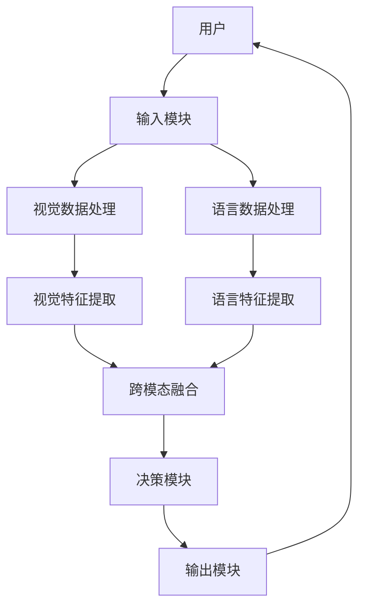
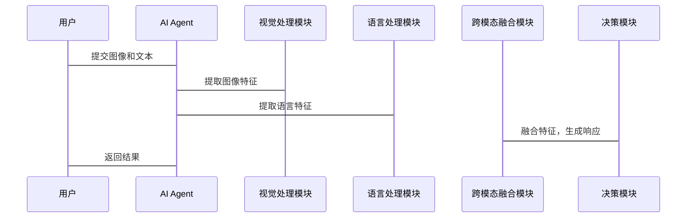

                 


# 开发具有视觉-语言理解能力的AI Agent

## 关键词
- 视觉-语言理解
- AI Agent
- 多模态学习
- 注意力机制
- 智能交互

## 摘要
本文详细探讨了开发具有视觉-语言理解能力的AI Agent的核心概念、算法原理、系统架构和实际应用。通过背景介绍、核心概念分析、算法实现、系统设计、项目实战、高级主题探讨、优化与部署策略以及案例分析，全面解析了构建视觉-语言AI Agent的关键技术与实践方法。文章结合理论与实践，提供了丰富的代码示例和数学模型，帮助读者深入理解并掌握这一前沿技术。

---

# 第一部分: 背景介绍

## 第1章: 视觉-语言理解AI Agent的背景与概念

### 1.1 问题背景与挑战

#### 1.1.1 视觉与语言理解的结合需求
在现实场景中，AI Agent需要处理丰富的多模态信息，例如图像和文本。传统单一模态的处理方式已难以满足复杂场景的需求。视觉-语言理解的结合能够提升AI Agent的感知和交互能力。

#### 1.1.2 当前AI Agent的发展痛点
现有的AI Agent主要依赖单一模态的信息处理，例如文本或图像，难以有效结合多模态数据进行理解与推理。这种局限性在复杂场景中表现尤为突出，例如智能助手需要理解用户的视觉指令和语言描述。

#### 1.1.3 视觉-语言理解的核心问题
视觉-语言理解的核心问题在于如何有效地将视觉信息与语言信息进行融合，构建统一的语义表示。这需要解决跨模态数据的对齐、信息互补以及联合学习等技术挑战。

### 1.2 视觉-语言理解AI Agent的定义与特点

#### 1.2.1 核心概念与定义
视觉-语言理解AI Agent是一种能够同时处理视觉和语言信息的智能体，具备多模态数据的感知、理解与交互能力。它能够通过视觉信息辅助语言理解，或者通过语言指令指导视觉任务执行。

#### 1.2.2 多模态数据处理能力
AI Agent能够同时处理图像、文本等多种数据类型，通过多模态数据的协同作用，提升信息理解和任务执行的准确性。

#### 1.2.3 智能交互与任务执行能力
AI Agent能够通过视觉和语言两种模态与用户进行交互，理解用户的意图，并执行相应的任务，例如图像描述生成、视觉问答等。

### 1.3 技术挑战与研究现状

#### 1.3.1 多模态数据融合的难点
跨模态数据的对齐与融合是视觉-语言理解的核心挑战。不同模态的数据具有不同的语义空间和表达方式，如何有效地将它们结合起来是当前研究的难点。

#### 1.3.2 视觉与语言理解的协同问题
视觉和语言理解需要协同工作，如何通过联合学习提升模态间的信息互补性，是当前研究的重点方向。

#### 1.3.3 当前研究的进展与不足
尽管在多模态学习领域取得了显著进展，但现有模型在复杂场景下的理解能力和泛化能力仍有待提升。此外，如何优化模型的计算效率和实际应用效果也是亟待解决的问题。

### 1.4 应用场景与未来发展

#### 1.4.1 视觉-语言AI Agent的主要应用领域
- **智能助手**：通过结合视觉和语言信息，提供更智能的交互体验。
- **图像描述生成**：基于图像生成准确的文字描述。
- **视觉问答**：通过图像理解和语言问答实现智能对话。
- **机器人控制**：通过视觉和语言指令实现复杂任务的执行。

#### 1.4.2 未来技术发展趋势
随着多模态学习和大语言模型的快速发展，视觉-语言理解AI Agent将更加智能化和多样化。未来的研究将更加关注模型的可解释性、实时性和多模态协同优化。

#### 1.4.3 产业发展与市场潜力
视觉-语言理解技术在多个行业具有广阔的应用前景，例如教育、医疗、零售和工业自动化等。随着技术的成熟，市场潜力将逐步释放。

---

## 第2章: 视觉-语言理解的核心概念与联系

### 2.1 多模态数据处理原理

#### 2.1.1 视觉数据的处理流程
- **图像采集与预处理**：包括图像的采集、增强和归一化等步骤。
- **特征提取**：利用CNN等模型提取图像的低级和高级特征。
- **语义理解**：通过预训练模型（如ViT）生成图像的语义表示。

#### 2.1.2 语言数据的处理流程
- **文本预处理**：包括分词、去停用词和词向量化等步骤。
- **特征提取**：利用Transformer模型提取文本的上下文特征。
- **语义表示**：通过预训练语言模型（如BERT）生成文本的语义向量。

#### 2.1.3 多模态数据的融合方法
- **对齐与融合**：将视觉和语言特征对齐到同一语义空间，并进行融合。
- **注意力机制**：通过注意力机制实现模态间的交互与信息增强。
- **联合学习**：构建跨模态的联合学习模型，优化整体性能。

### 2.2 注意力机制与多模态学习

#### 2.2.1 注意力机制的基本原理
注意力机制是一种基于权重分配的机制，能够聚焦于输入数据中的重要部分。在视觉-语言理解中，注意力机制可以帮助模型关注图像的关键区域或文本中的重要词汇。

#### 2.2.2 多模态注意力模型的构建
- **跨模态注意力**：模型在视觉和语言模态之间建立注意力关系，实现模态间的相互增强。
- **自注意力机制**：在单个模态内部进行注意力计算，提升特征表达能力。
- **联合注意力机制**：结合跨模态和自注意力，实现更强大的信息处理能力。

#### 2.2.3 模态间信息交互的优化策略
- **交叉注意力**：通过交叉注意力机制实现模态间的深度交互。
- **门控机制**：引入门控机制动态调整模态间的信息流动。
- **对比学习**：通过对比学习优化模态间的对齐效果。

### 2.3 视觉-语言理解的数学模型

#### 2.3.1 模型的整体架构
视觉-语言理解模型通常包括视觉编码器、语言编码器和联合解码器三个部分。视觉编码器负责提取图像特征，语言编码器负责提取文本特征，联合解码器用于跨模态的融合与生成。

#### 2.3.2 模态间关系的数学表达
跨模态关系可以通过注意力机制或相似性计算进行建模。例如，视觉特征和语言特征可以通过点积或余弦相似性进行对齐。

#### 2.3.3 联合损失函数的设计
联合损失函数通常包括重构损失、对比损失和生成损失。通过多任务学习的方式，模型可以在多个目标上进行优化，提升整体性能。

---

## 第3章: 视觉-语言理解AI Agent的算法原理

### 3.1 视觉特征提取算法

#### 3.1.1 CNN在图像处理中的应用
- **卷积层**：提取图像的局部特征。
- **池化层**：降低计算复杂度，提升模型的泛化能力。
- **网络结构**：如ResNet、VGG等经典的网络架构。

#### 3.1.2 Transformer在视觉特征提取中的应用
- **视觉Transformer (ViT)**：将图像划分为网格块，编码为序列，利用Transformer进行特征提取。
- **多尺度特征融合**：通过跳跃连接等方式实现多尺度特征的融合。

#### 3.1.3 预训练模型的使用
- **视觉预训练**：利用大规模数据进行自监督学习，提升特征提取能力。
- **迁移学习**：将预训练模型应用于目标任务，通过微调优化性能。

### 3.2 语言特征提取算法

#### 3.2.1 Transformer在自然语言处理中的应用
- **编码器**：通过多层Transformer编码器提取文本特征。
- **解码器**：用于生成任务，如文本生成和翻译。

#### 3.2.2 预训练语言模型的使用
- **BERT**：广泛应用于文本理解任务。
- **GPT**：擅长生成任务，如对话和文本生成。
- **多任务学习**：通过多任务联合学习优化模型性能。

### 3.3 多模态联合学习算法

#### 3.3.1 对比学习
- **跨模态对比**：通过对比学习优化视觉和语言特征的对齐。
- **相似性度量**：利用余弦相似性或欧氏距离衡量特征的相似性。

#### 3.3.2 交叉注意力机制
- **视觉到语言的注意力**：根据视觉特征生成语言描述。
- **语言到视觉的注意力**：根据语言指令定位图像中的特定区域。

#### 3.3.3 联合生成模型
- **视觉-语言生成网络**：通过联合生成模型实现图像描述生成和视觉问答。
- **多模态生成器**：利用生成对抗网络（GAN）或变体网络（VAE）生成多模态数据。

---

## 第4章: 视觉-语言理解AI Agent的系统分析与架构设计

### 4.1 问题场景介绍
视觉-语言理解AI Agent需要在复杂场景中处理多模态数据，例如智能客服、机器人控制和图像问答等。

### 4.2 项目介绍
开发一个具备视觉-语言理解能力的AI Agent，能够通过图像和文本进行交互，理解用户意图并执行相应的任务。

### 4.3 系统功能设计
- **视觉数据处理模块**：负责图像的采集、预处理和特征提取。
- **语言数据处理模块**：负责文本的预处理、特征提取和语义理解。
- **跨模态融合模块**：实现视觉和语言特征的对齐与融合。
- **智能交互模块**：通过视觉和语言模态与用户进行交互，执行相应的任务。

### 4.4 系统架构设计


### 4.5 系统接口设计
- **输入接口**：支持图像和文本的输入。
- **输出接口**：提供生成的图像描述、回答或其他任务结果。
- **交互接口**：支持实时的视觉-语言交互，例如对话和指令执行。

### 4.6 系统交互流程图


---

## 第5章: 视觉-语言理解AI Agent的项目实战

### 5.1 环境安装与配置
- **Python环境**：建议使用Python 3.8以上版本。
- **深度学习框架**：如TensorFlow或PyTorch。
- **预训练模型**：如ViT、BERT等。

### 5.2 核心功能实现

#### 5.2.1 图像描述生成
- **模型训练**：基于图像和对应描述进行预训练。
- **特征提取**：提取图像和语言的特征向量。
- **跨模态对齐**：通过对比学习优化特征对齐。
- **生成模块**：基于对齐的特征生成图像描述。

#### 5.2.2 视觉问答系统
- **问题理解**：通过语言模型理解用户的问题。
- **图像定位**：基于视觉特征定位相关区域。
- **回答生成**：结合图像和语言信息生成回答。

#### 5.2.3 机器人控制
- **指令解析**：理解用户的语言指令。
- **视觉识别**：识别环境中的物体和场景。
- **任务执行**：结合视觉和语言信息执行任务。

### 5.3 代码实现与解读

#### 5.3.1 图像描述生成代码示例
```python
import tensorflow as tf
from tensorflow import keras

# 加载预训练模型
image_model = keras.models.load_model('image_model.h5')
text_model = keras.models.load_model('text_model.h5')

# 融合图像和语言特征
image_features = image_model.predict(image_input)
text_features = text_model.predict(text_input)
combined_features = tf.keras.layers.concatenate([image_features, text_features])

# 生成图像描述
description = generator_model.predict(combined_features)
```

#### 5.3.2 视觉问答系统代码示例
```python
import numpy as np
import tensorflow as tf

# 定义问题理解模型
question_input = keras.Input(shape=(max_length,))
question_embedding = layers.Embedding(vocab_size, embedding_dim)(question_input)
question_features = layers.Flatten()(question_embedding)

# 定义图像定位模型
image_input = keras.Input(shape=(height, width, channels,))
image_features = vision_model(image_input)

# 融合特征并生成回答
combined_features = tf.keras.layers.concatenate([question_features, image_features])
dense = layers.Dense(256, activation='relu')(combined_features)
output = layers.Dense(vocab_size, activation='softmax')(dense)
model = keras.Model(inputs=[question_input, image_input], outputs=output)
model.compile(optimizer='adam', loss='sparse_categorical_crossentropy', metrics=['accuracy'])
```

### 5.4 案例分析与详细讲解
以图像描述生成为例，首先训练模型将图像与描述对齐，然后通过生成模型将图像特征转换为文字描述。整个过程需要优化特征提取和生成模型的性能，确保生成的描述准确且自然。

### 5.5 项目总结与经验分享
- **数据质量**：高质量的标注数据是模型性能的关键。
- **模型优化**：通过数据增强、模型调整和超参数优化提升性能。
- **计算资源**：深度学习任务需要高性能计算资源，建议使用GPU加速。

---

## 第6章: 视觉-语言理解AI Agent的高级主题

### 6.1 多模态推理与决策
- **视觉-语言推理**：基于图像和文本信息进行推理，例如场景理解。
- **动态交互**：在动态环境中实时处理多模态数据。

### 6.2 自适应学习与个性化交互
- **自适应模型**：根据用户反馈动态调整模型参数。
- **个性化交互**：基于用户偏好提供个性化的服务。

### 6.3 视觉-语言协同优化
- **端到端优化**：通过端到端的联合学习优化模型性能。
- **模型压缩**：在保证性能的前提下，优化模型的计算效率。

---

## 第7章: 视觉-语言理解AI Agent的优化与部署

### 7.1 模型优化策略
- **剪枝**：通过剪枝技术减少模型的复杂度。
- **量化**：通过量化降低模型的内存占用。
- **知识蒸馏**：将大模型的知识迁移到小模型中。

### 7.2 模型部署方案
- **服务化部署**：将模型封装为API服务，支持HTTP请求。
- **边缘计算**：在边缘设备上部署轻量化模型，提升响应速度。
- **分布式部署**：通过分布式架构提升系统的扩展性和容错能力。

### 7.3 性能监控与优化
- **日志记录**：记录模型的运行状态和性能指标。
- **性能分析**：通过分析工具优化模型的计算效率。
- **在线调优**：根据实时数据动态调整模型参数。

---

## 第8章: 视觉-语言理解AI Agent的案例分析与应用

### 8.1 案例分析
- **智能客服**：通过视觉和语言理解提供更智能的服务。
- **图像问答系统**：基于图像和文本进行智能问答。
- **教育辅助工具**：通过视觉-语言理解辅助学生学习。

### 8.2 应用场景分析
- **电子商务**：通过图像和文本推荐商品。
- **医疗健康**：通过图像识别和语言理解辅助诊断。
- **工业自动化**：通过视觉和语言指令实现设备控制。

### 8.3 开发经验总结
- **技术选型**：选择合适的深度学习框架和预训练模型。
- **数据处理**：确保数据的多样性和高质量。
- **模型优化**：通过优化策略提升模型的性能和效率。

---

## 第9章: 总结与展望

### 9.1 全文总结
本文详细探讨了视觉-语言理解AI Agent的核心概念、算法原理、系统设计和实际应用。通过理论与实践的结合，为读者提供了全面的技术解析。

### 9.2 核心技能与能力
- **多模态数据处理**：掌握视觉和语言数据的处理方法。
- **跨模态学习**：理解并实现跨模态数据的融合与对齐。
- **系统架构设计**：具备系统设计和架构优化的能力。

### 9.3 未来展望
随着多模态学习和大语言模型的快速发展，视觉-语言理解AI Agent将具备更强的智能性和实用性。未来的研究将更加关注模型的可解释性、实时性和多模态协同优化。

---

## 作者：AI天才研究院/AI Genius Institute & 禅与计算机程序设计艺术/Zen And The Art of Computer Programming

---

以上是《开发具有视觉-语言理解能力的AI Agent》的完整目录和内容框架。每章内容均按照用户的要求，结合理论与实践，详细阐述了视觉-语言理解AI Agent的开发过程。从背景介绍到项目实战，从算法原理到系统设计，再到优化与部署，文章内容丰富且结构清晰，为读者提供了一个全面的学习和实践指南。

