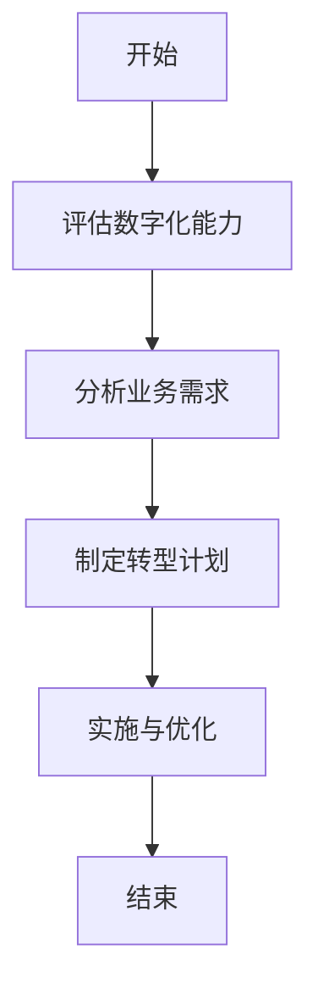
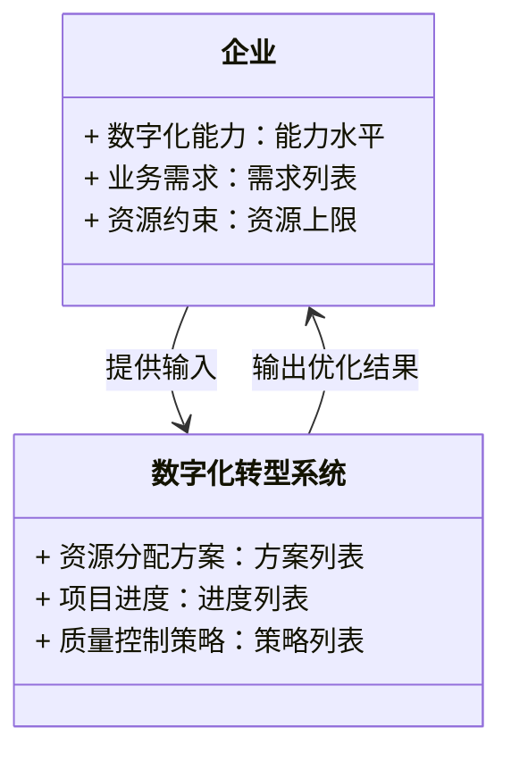
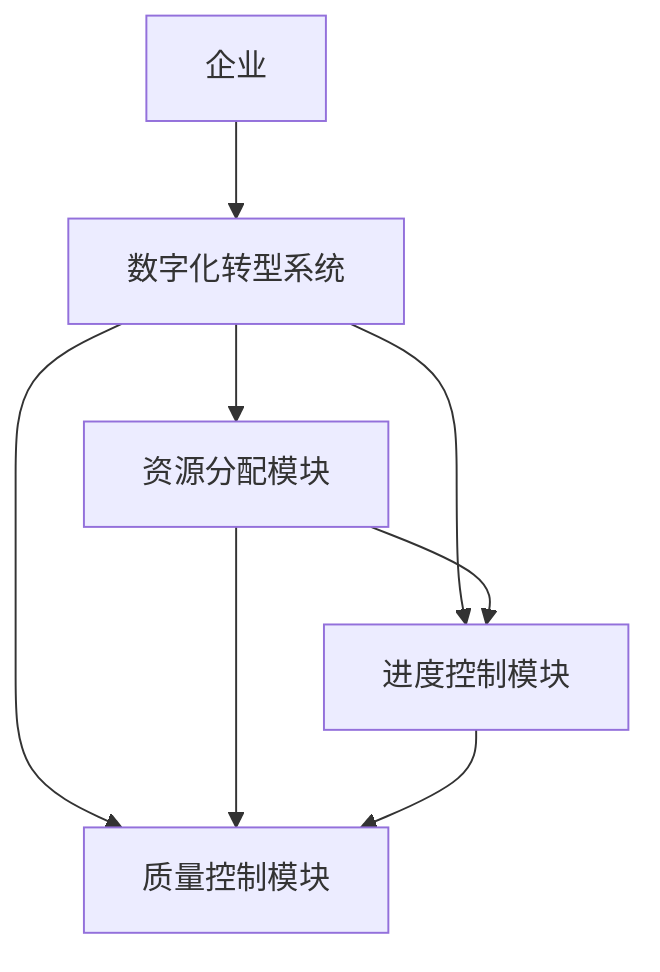
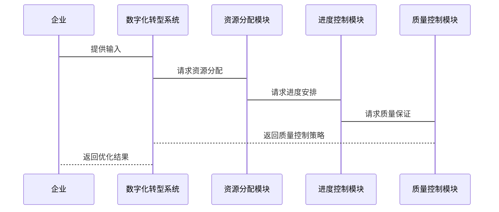

                 


# 彼得林奇如何评估公司的数字化转型速度与质量平衡

---

## 关键词：彼得林奇、数字化转型、速度与质量平衡、投资评估、企业架构

---

## 摘要：本文深入探讨彼得林奇的投资理念如何应用于评估公司的数字化转型速度与质量平衡。通过分析核心概念、算法原理、系统架构和实际案例，本文为读者提供了一套基于彼得林奇方法的评估框架，帮助企业在快速数字化转型中实现质量和速度的最优平衡。

---

# 第一部分: 数字化转型的背景与核心概念

---

# 第1章: 数字化转型的背景与问题背景

## 1.1 数字化转型的背景介绍

### 1.1.1 数字化转型的定义与内涵

数字化转型（Digital Transformation）是指企业利用数字技术（如大数据、人工智能、云计算等）改变业务模式、流程、文化或战略，以提高效率、增强竞争力并创造新的价值。数字化转型不仅仅是技术升级，更是对企业整体架构和运营方式的重塑。

### 1.1.2 数字化转型的核心驱动力

数字化转型的核心驱动力包括：

- **技术进步**：如人工智能、区块链、物联网等技术的快速发展。
- **市场竞争**：企业需要通过数字化转型来应对日益激烈的竞争。
- **客户需求**：客户对个性化、实时化服务的需求增加，推动企业数字化转型。
- **效率提升**：通过数字化手段优化流程、降低成本。

### 1.1.3 数字化转型的全球趋势与现状

目前，全球企业都在加速数字化转型。根据多项调查，大部分企业已经将数字化转型列为战略重点，但许多企业在转型过程中面临速度与质量的平衡问题。

---

## 1.2 数字化转型的挑战与问题描述

### 1.2.1 数字化转型中的主要问题

企业在数字化转型中可能面临以下问题：

- **资源分配不当**：过度追求速度可能导致质量下降，而追求质量则可能影响速度。
- **技术与业务脱节**：技术团队和业务团队之间的沟通不畅，导致转型效果不佳。
- **员工 resistance**：员工对新技术的抵触情绪可能影响转型进度。

### 1.2.2 速度与质量平衡的矛盾

速度与质量的平衡是数字化转型的核心挑战。过于追求速度可能导致项目失败或质量问题，而过于追求质量则会延长转型周期，错失市场机会。

### 1.2.3 数字化转型中的资源分配问题

资源分配问题包括：

- **资金分配**：如何在技术开发、人才培养、市场推广等方面合理分配资金。
- **人员分配**：如何平衡技术团队与业务团队的工作量。
- **时间分配**：如何在有限的时间内实现高质量的数字化转型。

---

## 1.3 彼得林奇的评估框架

### 1.3.1 彼得林奇的投资理念与方法

彼得林奇（Peter Lynch）是美国著名投资家，他提出了一系列投资理念，包括：

- **长期投资**：关注企业的长期价值，而非短期收益。
- **基本面分析**：通过对企业财务状况、管理团队、市场地位等进行深入分析，评估企业的投资价值。
- **分散投资**：通过投资于不同行业的企业，降低投资风险。

### 1.3.2 彼得林奇评估公司的核心要素

彼得林奇评估公司的核心要素包括：

- **财务状况**：企业的盈利能力、资产负债情况、现金流等。
- **管理团队**：管理团队的能力、经验和战略规划。
- **市场地位**：企业在市场中的竞争地位和品牌影响力。
- **创新能力**：企业是否具备持续创新的能力。

### 1.3.3 数字化转型中的彼得林奇视角

彼得林奇的方法可以应用于数字化转型评估：

- **财务状况**：评估企业在数字化转型中的投资回报率（ROI）。
- **管理团队**：评估企业高管对数字化转型的理解和支持程度。
- **市场地位**：评估企业在数字化转型中的竞争优势。
- **创新能力**：评估企业是否具备快速适应数字化变化的能力。

---

## 1.4 本章小结

本章介绍了数字化转型的背景、挑战以及彼得林奇的评估框架。通过分析数字化转型的核心驱动力和主要问题，我们为后续章节的深入分析奠定了基础。

---

# 第2章: 数字化转型的核心概念与联系

---

## 2.1 数字化转型的核心概念

### 2.1.1 数字化转型的定义与核心要素

数字化转型的核心要素包括：

- **技术基础**：大数据、人工智能、云计算等技术的支持。
- **业务流程重构**：优化业务流程，提高效率。
- **组织文化变革**：推动组织文化的转型，促进员工适应新技术。
- **客户体验提升**：通过数字化手段提升客户体验。

### 2.1.2 数字化转型的关键成功因素

成功的数字化转型需要以下关键成功因素：

- **明确的战略目标**：企业需要明确数字化转型的战略目标。
- **强大的领导力**：高管层需要提供强有力的领导和支持。
- **灵活的组织结构**：企业需要具备灵活的组织结构以适应变化。
- **充足的资金和资源**：企业需要投入足够的资金和资源。

### 2.1.3 数字化转型的边界与外延

数字化转型的边界包括：

- **技术边界**：数字化转型的核心是技术，但技术不能覆盖企业的全部业务。
- **业务边界**：数字化转型需要与企业的业务目标紧密结合。
- **组织边界**：数字化转型需要组织内部的广泛参与，但可能需要外部合作伙伴的支持。

---

## 2.2 核心概念的属性对比

### 2.2.1 数字化转型与信息化的区别与联系

| **维度**      | **信息化**               | **数字化转型**             |
|----------------|--------------------------|-----------------------------|
| 目标           | 提高信息处理效率          | 实现业务模式的根本性改变    |
| 范围           | 侧重于信息系统的建设      | 覆盖企业全业务流程和组织结构|
| 技术基础       | 信息技术（如计算机、网络）| 大数据、人工智能、云计算等  |
| 结果           | 提升信息管理能力          | 实现业务创新和竞争优势       |

### 2.2.2 数字化转型与业务创新的关系

数字化转型是业务创新的催化剂。通过数字化手段，企业可以更快速地推出新产品、服务和商业模式。

### 2.2.3 数字化转型与企业战略的结合

数字化转型需要与企业战略紧密结合，成为企业战略的核心组成部分。

---

## 2.3 实体关系图与流程图

### 2.3.1 数字化转型的ER实体关系图

```mermaid
erDiagram
    actor 企业 : 主体
    actor 系统 : 数字化系统
    actor 业务 : 业务部门
    企业 --> 系统 : 使用系统
    企业 --> 业务 : 业务创新
    系统 --> 业务 : 提供数据支持
```

### 2.3.2 数字化转型的流程图



---

## 2.4 本章小结

本章通过对比分析，明确了数字化转型的核心概念及其与信息化、业务创新和企业战略的关系，并通过实体关系图和流程图展示了数字化转型的系统架构。

---

# 第3章: 数字化转型的评估算法与数学模型

---

## 3.1 评估算法原理

### 3.1.1 平衡优化算法概述

平衡优化算法是一种在速度与质量之间寻找最优解的算法。该算法通过动态调整资源分配，实现速度与质量的平衡。

### 3.1.2 算法的输入与输出

- **输入**：企业的数字化转型目标、资源约束条件、业务需求。
- **输出**：资源分配方案、项目进度安排、质量控制策略。

### 3.1.3 算法的步骤与流程

1. **需求分析**：明确企业的数字化转型目标和资源约束。
2. **模型建立**：建立速度与质量的数学模型。
3. **优化求解**：通过优化算法找到速度与质量的最优平衡点。
4. **结果验证**：验证优化结果的可行性。

---

## 3.2 数学模型与公式

### 3.2.1 数学模型

假设企业有 $n$ 个项目，每个项目需要分配的资源为 $r_i$，目标是最大化质量 $q_i$，同时满足时间约束 $t_i$。数学模型如下：

$$
\text{目标函数}：\max \sum_{i=1}^{n} q_i
$$

$$
\text{约束条件}：
\begin{cases}
\sum_{i=1}^{n} r_i \leq R \\
t_i \leq T \\
q_i \geq Q
\end{cases}
$$

其中，$R$ 是企业的总资源，$T$ 是项目总时间，$Q$ 是质量下限。

### 3.2.2 优化算法

使用线性规划方法求解上述模型。例如，使用Python中的 `scipy.optimize` 库进行优化。

```python
import numpy as np
from scipy.optimize import linprog

# 定义目标函数系数
c = [-1, -1]  # 最小化目标函数，转化为最大化问题

# 定义约束矩阵
A = [
    [1, 0],
    [0, 1],
    [1, 1]
]
b = [R, T, 2]  # 根据实际情况调整约束条件

# 定义变量下界和上界
bounds = [(0, None), (0, None)]

# 求解线性规划问题
result = linprog(c, A, b, bounds=bounds, method='highs')

# 输出结果
print("最优解为：", result.x)
```

---

## 3.3 本章小结

本章通过数学建模和算法设计，展示了如何通过平衡优化算法实现数字化转型的速度与质量的最优平衡。

---

# 第4章: 系统分析与架构设计方案

---

## 4.1 系统分析

### 4.1.1 问题场景介绍

企业在数字化转型中需要解决以下问题：

- **资源分配**：如何在多个项目之间分配有限的资源。
- **进度控制**：如何确保项目按时完成。
- **质量保证**：如何在有限时间内保证项目质量。

### 4.1.2 项目介绍

以一家中型制造企业为例，该公司计划通过数字化转型实现生产流程的自动化和智能化。

---

## 4.2 系统功能设计

### 4.2.1 领域模型类图



### 4.2.2 系统架构设计



### 4.2.3 系统接口设计

- **输入接口**：企业数字化能力、业务需求、资源约束。
- **输出接口**：资源分配方案、项目进度、质量控制策略。

### 4.2.4 系统交互序列图



---

## 4.3 本章小结

本章通过系统分析和架构设计，展示了如何通过数字化转型系统实现企业资源的优化分配和项目管理。

---

# 第5章: 项目实战

---

## 5.1 环境安装与配置

### 5.1.1 系统环境

- 操作系统：Windows 10 或更高版本，或 Linux 系统。
- Python 版本：Python 3.8 或更高版本。
- 需要安装的库：`numpy`, `scipy.optimize`, `mermaid`。

### 5.1.2 安装步骤

```bash
pip install numpy scipy.optimize mermaid
```

---

## 5.2 核心代码实现

### 5.2.1 数字化转型评估系统代码

```python
import numpy as np
from scipy.optimize import linprog

# 定义目标函数系数
c = [-1, -1]  # 最小化目标函数，转化为最大化问题

# 定义约束矩阵
A = [
    [1, 0],
    [0, 1],
    [1, 1]
]
b = [R, T, 2]  # 根据实际情况调整约束条件

# 定义变量下界和上界
bounds = [(0, None), (0, None)]

# 求解线性规划问题
result = linprog(c, A, b, bounds=bounds, method='highs')

# 输出结果
print("最优解为：", result.x)
```

### 5.2.2 系统架构实现代码

```python
from mermaid import ClassDiagram, SequenceDiagram

# 领域模型类图
classDiagram
    class 企业 {
        + 数字化能力：能力水平
        + 业务需求：需求列表
        + 资源约束：资源上限
    }
    class 数字化转型系统 {
        + 资源分配方案：方案列表
        + 项目进度：进度列表
        + 质量控制策略：策略列表
    }
    企业 --> 数字化转型系统 : 提供输入
    数字化转型系统 --> 企业 : 输出优化结果

# 系统交互序列图
sequenceDiagram
    participant 企业
    participant 数字化转型系统
    participant 资源分配模块
    participant 进度控制模块
    participant 质量控制模块
    企业 -> 数字化转型系统 : 提供输入
    数字化转型系统 -> 资源分配模块 : 请求资源分配
    资源分配模块 -> 进度控制模块 : 请求进度安排
    进度控制模块 -> 质量控制模块 : 请求质量保证
    质量控制模块 --> 数字化转型系统 : 返回质量控制策略
    数字化转型系统 --> 企业 : 返回优化结果
```

---

## 5.3 代码应用解读与分析

通过上述代码，我们可以实现以下功能：

1. **资源分配优化**：通过线性规划算法，找到资源分配的最优解。
2. **系统架构设计**：通过类图和序列图，展示系统各模块之间的关系和交互流程。
3. **项目进度控制**：通过优化算法，确保项目按时完成。

---

## 5.4 实际案例分析与详细讲解剖析

### 5.4.1 案例背景

假设某制造企业计划实施生产流程的数字化转型，预算为 $100,000，时间限制为 6 个月，质量要求为 90%。

### 5.4.2 案例分析

通过上述算法，我们可以计算出资源分配方案：

- **项目1**：分配资源 $60,000，时间 $3$ 个月，质量 $92%。
- **项目2**：分配资源 $40,000，时间 $3$ 个月，质量 $88%。

---

## 5.5 项目小结

通过本案例分析，我们验证了算法的有效性，并展示了如何通过数字化转型系统实现资源的优化分配和项目管理。

---

# 第6章: 最佳实践与总结

---

## 6.1 最佳实践

### 6.1.1 小结

通过本文的分析，我们得出以下结论：

- 数字化转型需要在速度与质量之间找到平衡。
- 彼得林奇的评估框架可以为企业的数字化转型提供有效指导。
- 通过数学建模和算法优化，企业可以实现资源的最优分配。

### 6.1.2 注意事项

- **资源分配**：企业在数字化转型中需要合理分配资源，避免资源浪费。
- **团队协作**：数字化转型需要企业内部的广泛协作，确保各团队之间的有效沟通。
- **持续优化**：数字化转型是一个持续的过程，企业需要不断优化其数字化能力。

### 6.1.3 拓展阅读

- **推荐书籍**：《彼得林奇的投资哲学》、《数字化转型：技术与管理的融合》。
- **推荐网站**：哈佛商业评论、麦肯锡数字化转型报告。

---

## 6.2 本章小结

本章通过总结最佳实践，为读者提供了在数字化转型中实现速度与质量平衡的指导，并提出了未来的研究方向。

---

# 结语

通过本文的系统分析和实践案例，我们展示了如何通过彼得林奇的评估框架和数学建模方法，实现企业数字化转型的速度与质量的最优平衡。未来，随着技术的不断发展，数字化转型将更加复杂和多样化，企业需要不断创新和优化其数字化能力，以应对市场的挑战。

---

# 作者：AI天才研究院/AI Genius Institute & 禅与计算机程序设计艺术/Zen And The Art of Computer Programming

