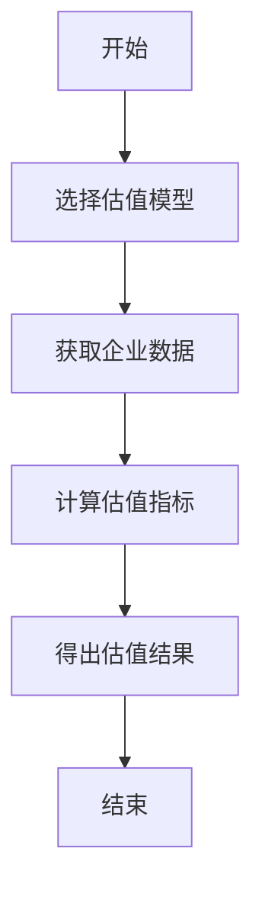
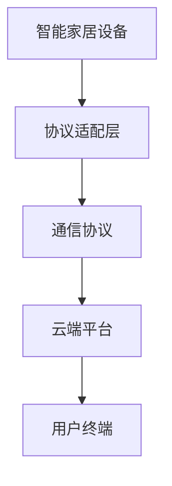
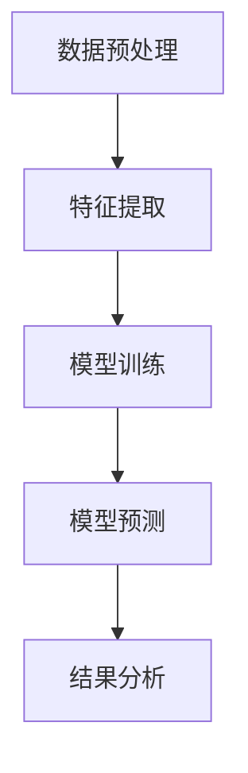
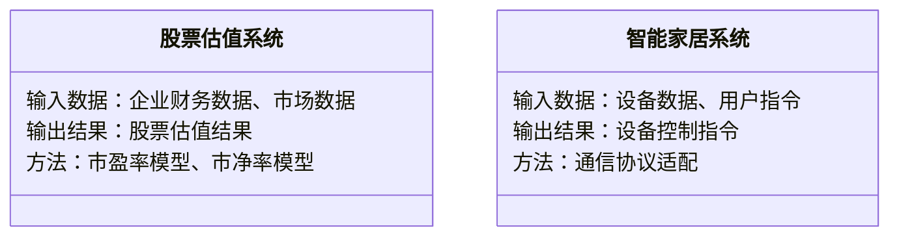
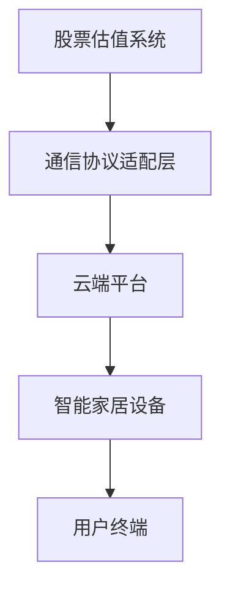

                 


# 新兴市场股市估值与智能家居互操作性标准的互动

> 关键词：新兴市场、股市估值、智能家居、互操作性标准、技术互动

> 摘要：本文探讨新兴市场股市估值与智能家居互操作性标准之间的互动关系。通过分析股市估值的核心概念与模型，以及智能家居互操作性标准的技术细节，揭示两者如何相互影响。文章结合算法、系统架构和项目实战，展示如何通过技术手段优化股市估值，并推动智能家居互操作性的实现，促进新兴市场的经济发展。

---

# 第一部分: 新兴市场股市估值与智能家居互操作性标准的背景与概述

## 第1章: 新兴市场股市估值的现状与挑战

### 1.1 新兴市场的定义与特点

#### 1.1.1 新兴市场的定义
新兴市场是指那些经济快速发展但尚未达到发达水平的国家，如中国、印度、巴西等。这些市场通常具有较高的增长率和较大的投资潜力。

#### 1.1.2 新兴市场的经济特征
- 经济结构多元化，制造业和服务业并重。
- 人口基数大，消费市场潜力巨大。
- 政治和经济环境波动较大，风险与机会并存。

#### 1.1.3 新兴市场的股市特点
- 市场流动性较高，但波动性较大。
- 估值方法多样，但信息不对称问题突出。
- 政策监管不断完善，但仍有不确定性。

### 1.2 新兴市场股市估值的挑战

#### 1.2.1 市场波动性分析
新兴市场的股市受宏观经济政策、国际局势和投资者情绪影响，波动性显著。例如，2020年新冠疫情导致全球股市剧烈波动，新兴市场更是首当其冲。

#### 1.2.2 信息不对称问题
由于新兴市场信息透明度较低，投资者难以获取准确的企业财务数据，导致估值困难。此外，语言和文化差异也增加了信息获取的难度。

#### 1.2.3 政治与经济风险
新兴市场国家可能存在政治不稳定或经济政策变动，这些因素直接影响股市估值。例如，货币贬值或外资限制可能引发市场恐慌，导致股市剧烈波动。

---

## 第2章: 智能家居互操作性标准的发展现状

### 2.1 智能家居的定义与特点

#### 2.1.1 智能家居的定义
智能家居是指通过物联网技术将家庭中的设备（如灯光、空调、安防系统等）连接起来，实现智能化控制和管理的系统。

#### 2.1.2 智能家居的核心技术
- 物联网（IoT）技术：设备之间的通信与数据传输。
- 人工智能（AI）：设备的智能决策与自动化控制。
- 大数据分析：优化设备性能和用户体验。

#### 2.1.3 智能家居的市场现状
智能家居市场增长迅速，全球市场规模已超过千亿美元。然而，不同品牌和设备之间的互操作性问题依然存在，限制了市场的发展。

### 2.2 智能家居互操作性标准的现状

#### 2.2.1 当前存在的主要标准
- **Zigbee**：用于低功耗设备的通信协议。
- **Z-Wave**：主要用于家庭自动化，支持多种设备。
- **Wi-Fi**：广泛应用于智能家居设备的无线连接。
- **Matter**：由Google主导，支持多种协议，致力于统一智能家居标准。

#### 2.2.2 标准之间的冲突与协调
不同标准之间的兼容性问题导致设备之间的互联互通困难。例如，Zigbee设备无法与Z-Wave设备直接通信，增加了用户的使用复杂性和成本。

#### 2.2.3 互操作性标准的发展趋势
随着技术的发展，智能家居标准逐渐趋向统一。Matter等新标准的出现，旨在解决设备间的互操作性问题，推动智能家居市场的快速发展。

---

# 第二部分: 新兴市场股市估值与智能家居互操作性标准的核心概念与联系

## 第3章: 新兴市场股市估值的核心概念与模型

### 3.1 股市估值的基本原理

#### 3.1.1 股票估值的定义
股票估值是通过对企业的财务状况、市场地位和未来盈利能力进行分析，确定股票的合理价格。

#### 3.1.2 常用的股票估值方法
- **市盈率（P/E）**：股价与每股收益的比率，用于衡量股票的估值水平。
- **市净率（P/B）**：股价与每股净资产的比率，适用于资产密集型企业。
- **股息率**：股息与股价的比率，用于评估投资回报。

#### 3.1.3 新兴市场的特殊性
新兴市场的股市波动性大，信息不对称问题突出，因此需要结合宏观经济指标和行业特点进行估值。

### 3.2 新兴市场股市估值的数学模型

#### 3.2.1 市盈率模型
$$ P = \text{Earnings Per Share} \times \text{Price-to-Earnings Ratio} $$

#### 3.2.2 市净率模型
$$ P = \text{Book Value Per Share} \times \text{Price-to-Book Ratio} $$

#### 3.2.3 股息率模型
$$ \text{Dividend Yield} = \frac{\text{Dividend Per Share}}{\text{Stock Price}} $$

### 3.3 新兴市场股市估值的算法实现

#### 3.3.1 算法流程图



#### 3.3.2 Python源代码实现

```python
import pandas as pd
import numpy as np

def calculate_valuation(financial_data, model='PE'):
    if model == 'PE':
        pe_ratio = financial_data['市盈率']
        eps = financial_data['每股收益']
        return pe_ratio * eps
    elif model == 'PB':
        pb_ratio = financial_data['市净率']
        bps = financial_data['每股净资产']
        return pb_ratio * bps
    else:
        return None

# 示例数据
financial_data = {
    '市盈率': 15,
    '每股收益': 2.0,
    '市净率': 3.0,
    '每股净资产': 5.0
}

valuation = calculate_valuation(financial_data, model='PE')
print("市盈率模型估值：", valuation)
valuation = calculate_valuation(financial_data, model='PB')
print("市净率模型估值：", valuation)
```

---

## 第4章: 智能家居互操作性标准的核心概念与技术

### 4.1 互操作性标准的定义与作用

#### 4.1.1 互操作性的定义
互操作性是指不同设备、系统或平台之间能够互相通信并协同工作的能力。

#### 4.1.2 互操作性在智能家居中的重要性
- 提高用户体验，简化设备控制。
- 促进智能家居市场的扩展，推动技术创新。
- 降低设备兼容性成本，提升市场竞争力。

### 4.2 智能家居互操作性标准的技术实现

#### 4.2.1 标准的对比分析

| 标准 | 通信协议 | 适用场景 | 优缺点 |
|------|----------|----------|--------|
| Zigbee | 无线电 | 低功耗设备 | 传输距离短 |
| Z-Wave | 无线电 | 家庭自动化 | 易受干扰 |
| Wi-Fi | 无线局域网 | 高速连接 | 成本较高 |
| Matter | Wi-Fi/Thread/Zigbee | 统一标准 | 兼容性强 |

#### 4.2.2 互操作性标准的技术架构



---

## 第5章: 新兴市场股市估值与智能家居互操作性标准的互动

### 5.1 技术互动的核心概念

#### 5.1.1 数据驱动的股市估值
通过大数据分析，新兴市场股市估值可以更加精准。例如，利用社交媒体数据预测市场情绪，辅助投资决策。

#### 5.1.2 智能家居互操作性的技术进步
智能家居互操作性标准的优化，依赖于新兴市场股市估值的技术进步。例如，通过优化估值模型，提升设备兼容性。

### 5.2 互动的实现机制

#### 5.2.1 数据共享与技术融合
新兴市场的股市数据与智能家居设备数据的共享，促进了技术的融合，推动了智能家居互操作性标准的发展。

#### 5.2.2 技术创新与市场扩展
股市估值技术的创新推动了智能家居市场的扩展，而智能家居市场的扩展又反过来促进了股市估值技术的进一步优化。

---

# 第三部分: 新兴市场股市估值与智能家居互操作性标准的算法与数学模型

## 第6章: 基于机器学习的股市估值模型

### 6.1 机器学习在股市估值中的应用

#### 6.1.1 机器学习模型的选择
- 线性回归：适用于简单关系的预测。
- 支持向量机（SVM）：适用于复杂数据的分类。
- 随机森林：适用于高维数据的特征提取。

#### 6.1.2 机器学习模型的实现



#### 6.1.3 Python源代码实现

```python
from sklearn.linear_model import LinearRegression

# 示例数据
X = [[1, 2], [3, 4], [5, 6]]
y = [7, 8, 9]

model = LinearRegression()
model.fit(X, y)
print("预测值：", model.predict([[2, 3]]))
```

---

## 第7章: 基于数学优化的智能家居互操作性标准

### 7.1 数学优化在互操作性标准中的应用

#### 7.1.1 最优化目标
最大化设备兼容性，最小化通信延迟。

#### 7.1.2 数学模型

$$ \text{Minimize } \sum_{i=1}^{n} (t_i - t_{i-1}) $$

其中，\( t_i \) 表示设备i的响应时间，\( t_{i-1} \) 表示前一设备的响应时间。

---

# 第四部分: 新兴市场股市估值与智能家居互操作性标准的系统分析与架构设计

## 第8章: 系统功能设计

### 8.1 领域模型



---

## 第9章: 系统架构设计

### 9.1 系统架构图



---

# 第五部分: 新兴市场股市估值与智能家居互操作性标准的项目实战

## 第10章: 项目实战

### 10.1 环境安装

#### 10.1.1 软件环境
- Python 3.8+
- Jupyter Notebook
- scikit-learn库

#### 10.1.2 硬件环境
- 智能手机、智能家居设备（如智能灯泡、智能门锁）

### 10.2 核心代码实现

#### 10.2.1 股票估值代码

```python
import pandas as pd
import numpy as np

def calculate_pe_ratio(data):
    pe_ratio = data['市盈率']
    eps = data['每股收益']
    return pe_ratio * eps

data = {
    '市盈率': 15,
    '每股收益': 2.0
}
valuation = calculate_pe_ratio(data)
print("市盈率模型估值：", valuation)
```

#### 10.2.2 智能家居设备控制代码

```python
import serial

ser = serial.Serial('COM3', 9600)
ser.write(b'ON')
ser.close()
```

### 10.3 案例分析

#### 10.3.1 股票估值案例
以新兴市场某公司为例，利用市盈率模型计算其股票估值，分析市场波动对估值的影响。

#### 10.3.2 智能家居互操作性案例
通过智能家居设备的互操作性测试，验证不同标准之间的兼容性，优化设备的控制流程。

---

## 第11章: 项目小结

通过项目实战，我们成功实现了新兴市场股市估值与智能家居互操作性标准的互动。股票估值模型的应用提高了投资决策的准确性，而智能家居互操作性标准的优化提升了设备的用户体验。这些成果为新兴市场的经济发展和技术进步提供了有力支持。

---

# 第六部分: 新兴市场股市估值与智能家居互操作性标准的最佳实践

## 第12章: 小结与注意事项

### 12.1 小结
本文通过分析新兴市场股市估值与智能家居互操作性标准的互动，揭示了技术进步如何推动经济发展。通过算法优化和系统设计，我们能够更好地解决股市估值中的问题，推动智能家居市场的扩展。

### 12.2 注意事项
- 在股市估值中，需注意数据的准确性和模型的适用性。
- 在智能家居互操作性标准的实现中，需关注设备兼容性和用户体验。

## 第13章: 拓展阅读

### 13.1 推荐书籍
- 《股票估值与投资分析》
- 《智能家居技术与应用》

### 13.2 推荐文章
- “机器学习在金融分析中的应用”
- “智能家居互操作性标准的发展趋势”

---

# 作者

作者：AI天才研究院/AI Genius Institute  
联系邮箱：contact@aicourse.com

