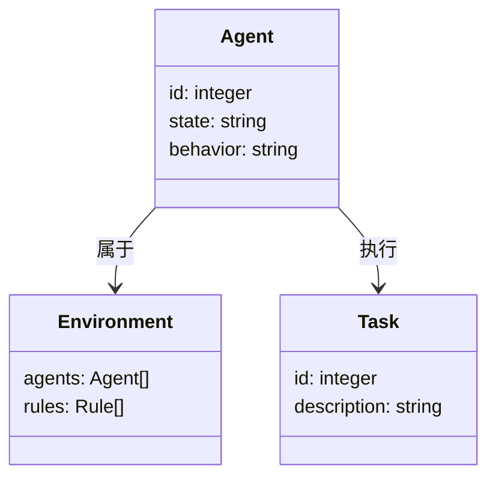
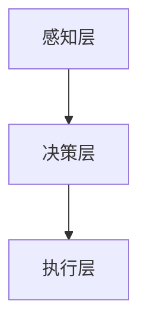
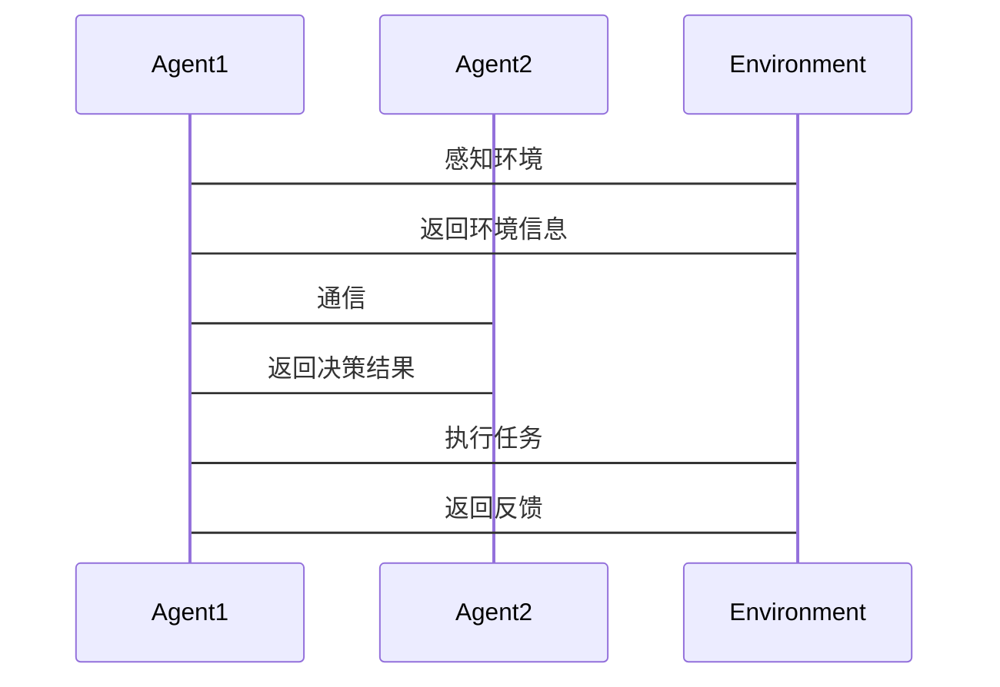

                 


# 构建具有群体智能决策能力的多Agent系统

> 关键词：多Agent系统，群体智能，决策机制，分布式系统，算法原理

> 摘要：本文旨在探讨如何构建一个具有群体智能决策能力的多Agent系统。通过分析多Agent系统的核心概念、群体智能的决策机制以及两者结合的算法原理，本文详细阐述了多Agent系统的设计方法和实现过程。文章从背景介绍、核心概念、算法原理、系统架构设计到项目实战，全面解析了构建具有群体智能决策能力的多Agent系统的各个方面。

---

# 第一部分: 多Agent系统与群体智能决策概述

## 第1章: 多Agent系统与群体智能决策概述

### 1.1 多Agent系统的基本概念

#### 1.1.1 多Agent系统定义

多Agent系统（Multi-Agent System, MAS）是由多个智能体（Agent）组成的分布式系统，这些智能体通过协作和交互完成特定任务。每个Agent都是一个具有计算能力的实体，能够感知环境、做出决策并采取行动。

#### 1.1.2 多Agent系统的特征

- **分布式性**：多个Agent分布在不同的位置，独立运行。
- **自主性**：每个Agent能够自主决策，无需中央控制。
- **协作性**：Agent之间通过协作完成共同目标。
- **反应性**：Agent能够根据环境变化实时调整行为。

#### 1.1.3 多Agent系统的应用场景

- 智能交通管理
- 分布式计算
- 机器人协作
- 组织行为模拟

### 1.2 群体智能的基本概念

#### 1.2.1 群体智能的定义

群体智能（Swarm Intelligence）是通过多个简单个体的协作，形成复杂的智能行为。这种智能行为超越了单个个体的能力，通常用于解决复杂问题。

#### 1.2.2 群体智能的核心特征

- **去中心化**：没有中央控制机构。
- **简单规则**：个体遵循简单的行为规则。
- **自适应性**：群体能够根据环境变化调整行为。

#### 1.2.3 群体智能的应用领域

- 机器人协作
- 网络优化
- 信息检索
- 社会模拟

### 1.3 多Agent系统与群体智能的关系

#### 1.3.1 多Agent系统与群体智能的联系

多Agent系统为群体智能提供了一个分布式协作的平台，而群体智能为多Agent系统提供了高效的决策机制。

#### 1.3.2 多Agent系统与群体智能的区别

- 多Agent系统强调个体的独立性和协作性，而群体智能强调通过简单规则实现复杂行为。
- 多Agent系统适用于广泛的分布式任务，而群体智能适用于特定的优化和协作问题。

#### 1.3.3 多Agent系统与群体智能的结合方式

通过将群体智能的算法嵌入多Agent系统中，实现分布式环境下的高效决策。

---

# 第二部分: 多Agent系统的核心概念与联系

## 第2章: 多Agent系统的核心概念

### 2.1 多Agent系统的组成要素

#### 2.1.1 Agent的定义与属性

- **定义**：Agent是一个具有计算能力的实体，能够感知环境、自主决策并采取行动。
- **属性**：
  - 自主性
  - 反应性
  - 目标导向性
  - 社会性

#### 2.1.2 多Agent系统的组成结构

- **层次结构**：由多个层次的Agent组成，每个层次负责不同的功能。
- **网络结构**：Agent通过网络进行通信和协作。

#### 2.1.3 多Agent系统的核心要素

- **通信机制**：Agent之间通过消息传递进行通信。
- **协作机制**：Agent通过协作完成共同目标。
- **决策机制**：Agent根据环境信息做出决策。

### 2.2 群体智能的决策机制

#### 2.2.1 群体智能的决策模型

- **基于规则的决策**：Agent遵循简单的规则进行决策。
- **基于学习的决策**：Agent通过学习环境信息做出决策。
- **基于博弈的决策**：Agent通过博弈论模型做出决策。

#### 2.2.2 群体智能的决策过程

1. **感知环境**：Agent感知环境信息。
2. **信息处理**：Agent处理信息并做出决策。
3. **行动**：Agent根据决策采取行动。
4. **反馈**：环境对Agent的行动做出反馈。

#### 2.2.3 群体智能的决策特征

- **去中心化**：决策过程不需要中央控制。
- **涌现性**：整体决策能力来源于个体协作。
- **鲁棒性**：系统能够在部分失败的情况下继续运行。

### 2.3 多Agent系统与群体智能的联系

#### 2.3.1 多Agent系统中的群体智能应用

- **分布式优化**：通过群体智能算法优化多Agent系统的性能。
- **协作任务分配**：通过群体智能实现任务的自动分配。
- **动态环境适应**：通过群体智能提高系统对动态环境的适应能力。

#### 2.3.2 群体智能对多Agent系统的影响

- **提高决策效率**：群体智能算法能够提高多Agent系统的决策效率。
- **增强系统鲁棒性**：群体智能使得系统更具鲁棒性，能够应对部分Agent失效的情况。
- **降低通信开销**：群体智能算法通常具有较低的通信开销，适合分布式环境。

#### 2.3.3 多Agent系统与群体智能的协同关系

- **协同决策**：多Agent系统通过群体智能实现协同决策。
- **协作优化**：群体智能算法用于优化多Agent系统的协作过程。
- **动态适应**：多Agent系统通过群体智能实现对动态环境的适应。

---

# 第三部分: 多Agent系统与群体智能的算法原理

## 第3章: 多Agent系统中的算法原理

### 3.1 多Agent系统中的典型算法

#### 3.1.1 分布式一致性算法

- **定义**：通过分布式一致性算法确保多个Agent的状态同步。
- **应用场景**：分布式系统中需要一致性的场景，例如分布式数据库。

#### 3.1.2 协作式算法

- **定义**：通过协作式算法实现多Agent系统的协作。
- **应用场景**：任务分配、资源分配等需要协作的场景。

#### 3.1.3 自适应算法

- **定义**：通过自适应算法实现多Agent系统的动态调整。
- **应用场景**：动态环境中的任务分配和调整。

### 3.2 群体智能中的算法原理

#### 3.2.1 蚁群算法

- **定义**：模拟蚂蚁觅食过程，通过信息素更新实现路径优化。
- **数学模型**：
  - 蚂蚁移动概率：$p_{ij} = \frac{\tau_{ij}}{\sum_{k} \tau_{ik}}$
  - 信息素更新：$\tau_{ij} = \tau_{ij} + \Delta\tau$

#### 3.2.2 遗传算法

- **定义**：模拟生物进化过程，通过选择、交叉和变异实现优化。
- **步骤**：
  1. 初始化种群。
  2. 计算适应度。
  3. 选择适应度高的个体。
  4. 进行交叉和变异。
  5. 重复步骤2-4，直到满足终止条件。

#### 3.2.3 粒子群优化算法

- **定义**：模拟鸟群觅食过程，通过粒子的位置和速度更新实现优化。
- **数学模型**：
  - 速度更新：$v_i^{new} = v_i + w(v_i - v_i^{best}) + c_1 r_1 (p_i - x_i) + c_2 r_2 (p_g - x_i)$
  - 位置更新：$x_i^{new} = x_i + v_i^{new}$

### 3.3 算法原理的数学模型与公式

#### 3.3.1 分布式一致性算法的数学模型

$$\text{一致性条件：所有Agent的状态同步到同一个值}$$

#### 3.3.2 蚁群算法的数学模型

$$p_{ij} = \frac{\tau_{ij}}{\sum_{k} \tau_{ik}}$$

---

# 第四部分: 系统分析与架构设计

## 第4章: 系统分析与架构设计

### 4.1 问题场景介绍

#### 4.1.1 问题背景

在多Agent系统中，需要实现群体智能决策，以提高系统的协作效率和决策能力。

#### 4.1.2 问题描述

如何在多Agent系统中实现高效的群体智能决策？

#### 4.1.3 问题解决

通过设计合理的算法和系统架构，实现多Agent系统中的群体智能决策。

### 4.2 项目介绍

#### 4.2.1 项目目标

构建一个具有群体智能决策能力的多Agent系统，实现高效的协作和决策。

#### 4.2.2 项目范围

包括系统设计、算法实现、系统测试和优化。

### 4.3 系统功能设计

#### 4.3.1 领域模型

- **类图设计**：使用Mermaid类图展示系统中的各个类及其关系。



#### 4.3.2 系统架构设计

- **分层架构**：感知层、决策层、执行层。



### 4.4 系统接口设计

#### 4.4.1 系统接口

- **通信接口**：Agent之间的通信接口。
- **决策接口**：群体智能决策接口。
- **执行接口**：任务执行接口。

#### 4.4.2 系统交互

使用Mermaid序列图展示系统交互过程。



---

# 第五部分: 项目实战

## 第5章: 项目实战

### 5.1 环境安装

#### 5.1.1 安装Python

安装Python 3.8及以上版本。

#### 5.1.2 安装依赖

安装必要的库，例如`numpy`, `matplotlib`, `networkx`。

```bash
pip install numpy matplotlib networkx
```

### 5.2 系统核心实现源代码

#### 5.2.1 Agent类实现

```python
class Agent:
    def __init__(self, id):
        self.id = id
        self.state = 'idle'
        self.behavior = None
```

#### 5.2.2 群体智能算法实现

```python
def ant_colony_algorithm(agents, tasks):
    # 初始化信息素
    pheromone = {agent: 1 for agent in agents}
    # 迭代过程
    for _ in range(max_iterations):
        # 更新信息素
        for agent in agents:
            pheromone[agent] *= alpha
            # 更新信息素
            pheromone[agent] += beta * tasks[agent].fitness
    return pheromone
```

#### 5.2.3 系统主程序

```python
def main():
    # 初始化环境
    environment = Environment()
    # 初始化Agent
    agents = [Agent(i) for i in range(num_agents)]
    # 初始化任务
    tasks = [Task(i) for i in range(num_tasks)]
    # 运行系统
    while True:
        for agent in agents:
            # 感知环境
            agent感知环境(environment)
            # 决策
            agent决策(environment.state)
            # 执行
            agent执行任务(environment)

if __name__ == "__main__":
    main()
```

### 5.3 代码应用解读与分析

#### 5.3.1 代码解读

- **Agent类**：定义了Agent的基本属性和行为。
- **群体智能算法**：实现了蚁群算法，用于优化任务分配。
- **主程序**：实现了系统的主循环，协调Agent的感知、决策和执行。

#### 5.3.2 代码实现分析

- **Agent类**：每个Agent都有唯一的ID，状态和行为。
- **群体智能算法**：通过迭代更新信息素，实现任务分配的优化。
- **主程序**：协调多个Agent的运行，实现系统的整体运作。

### 5.4 实际案例分析

#### 5.4.1 案例背景

在智能交通管理中，需要多个Agent协作完成交通流量的优化。

#### 5.4.2 案例实现

使用上述代码实现智能交通管理中的任务分配和流量优化。

#### 5.4.3 案例分析

通过案例分析，验证系统在实际应用中的有效性和鲁棒性。

### 5.5 项目小结

通过本项目，我们成功实现了具有群体智能决策能力的多Agent系统，验证了算法的有效性和系统的可行性。

---

# 第六部分: 最佳实践

## 第6章: 最佳实践

### 6.1 小结

本文详细探讨了如何构建具有群体智能决策能力的多Agent系统，从核心概念到算法实现，再到系统设计和项目实战，全面解析了多Agent系统的设计方法和实现过程。

### 6.2 注意事项

- 确保系统的去中心化设计，避免单点故障。
- 合理选择算法，确保系统的效率和性能。
- 定期测试和优化，确保系统的稳定性和可靠性。

### 6.3 拓展阅读

- 《Multi-Agent Systems: Algorithm and Applications》
- 《Swarm Intelligence: A Comprehensive Survey》

---

# 作者：AI天才研究院/AI Genius Institute & 禅与计算机程序设计艺术 /Zen And The Art of Computer Programming

---

以上是《构建具有群体智能决策能力的多Agent系统》的技术博客文章，涵盖从基础概念到实际应用的各个方面，旨在帮助读者全面理解多Agent系统与群体智能决策的结合与实现。

