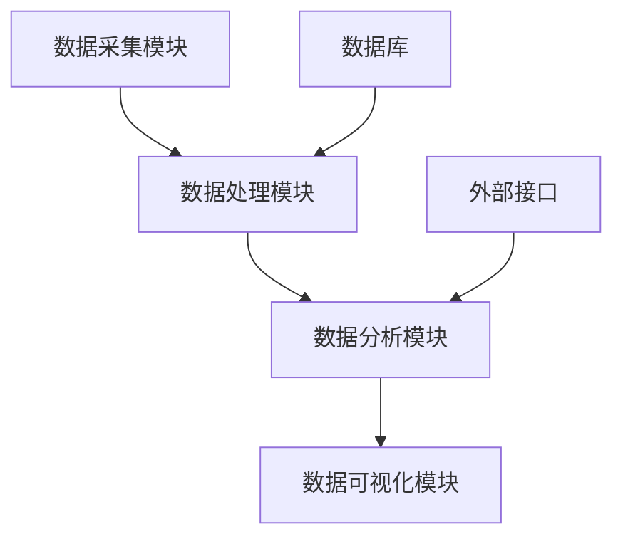

                 


# 量化投资模型：大数据时代的投资决策工具

## 关键词：量化投资、大数据分析、机器学习、时间序列分析、风险管理、投资决策

## 摘要：  
在金融市场的日益复杂化和数据化的背景下，量化投资模型作为大数据时代的重要投资决策工具，正在改变传统的投资方式。通过大数据分析和机器学习算法，量化投资模型能够快速处理海量数据，识别市场趋势，并制定最优的投资策略。本文将深入探讨量化投资模型的核心概念、算法原理、系统架构以及实际应用，为读者提供全面的视角和深入的分析。

---

## 第1章: 量化投资模型的背景与概念

### 1.1 量化投资的定义与特点  
量化投资是一种基于数学模型和算法的投资策略，通过分析大量数据来寻找投资机会。其核心在于利用计算机技术进行数据处理、模型构建和交易执行。  

#### 1.1.1 量化投资的定义  
量化投资是通过数学模型和算法，基于大量历史数据，寻找价格波动规律并进行投资决策的过程。  

#### 1.1.2 量化投资的核心特点  
- **数据驱动**：依赖大量数据进行分析和预测。  
- **自动化**：从数据处理到交易执行，部分或全部由计算机完成。  
- **高频交易**：利用算法在短时间内完成大量交易。  
- **风险可控**：通过模型优化和风险指标控制投资风险。  

#### 1.1.3 量化投资与传统投资的区别  
| **维度**       | **量化投资**                 | **传统投资**                 |  
|----------------|------------------------------|------------------------------|  
| 投资决策方式   | 数据驱动，算法辅助             | 人为判断，经验主导             |  
| 交易频率       | 高频交易                     | 低频交易                     |  
| 风险管理方式   | 数学模型优化                 | 依赖人工判断和经验             |  

### 1.2 大数据在投资决策中的作用  
大数据为量化投资提供了丰富的数据来源，包括市场数据、新闻数据、社交媒体数据等。通过大数据分析，投资者能够发现传统方法难以察觉的市场规律。  

#### 1.2.1 大数据时代的投资决策工具  
- **数据清洗**：去除噪声数据，提取有用信息。  
- **特征工程**：构建有意义的特征，用于模型训练。  
- **数据可视化**：通过图表展示数据规律，辅助决策。  

#### 1.2.2 数据量与数据质量对投资的影响  
- **数据量**：数据量越大，模型的预测能力越强。  
- **数据质量**：高质量数据能够提高模型的准确性。  
- **数据多样性**：多源数据能够帮助发现更多市场规律。  

### 1.3 量化投资模型的分类与应用  
量化投资模型可以根据不同的分类标准进行划分，例如基于时间维度、数据类型或算法类型。  

#### 1.3.1 常见的量化投资模型分类  
- **时间序列模型**：用于预测价格走势。  
- **因子模型**：基于多个因子（如市值、价值）进行投资决策。  
- **机器学习模型**：利用机器学习算法进行预测和分类。  

#### 1.3.2 不同模型的应用场景  
- **时间序列模型**：适用于短期价格预测。  
- **因子模型**：适用于长期资产配置。  
- **机器学习模型**：适用于复杂市场环境下的非线性关系分析。  

#### 1.3.3 模型选择的策略与方法  
- **模型性能**：选择能够准确预测的模型。  
- **数据特性**：根据数据类型选择合适的模型。  
- **计算能力**：考虑模型的计算复杂度和资源需求。  

### 1.4 量化投资模型的核心要素  
- **数据来源与处理**：数据是模型的基础，需要进行清洗和特征提取。  
- **模型构建与优化**：通过算法选择和参数调优提高模型性能。  
- **风险管理与投资策略**：制定合理的风险管理策略，确保投资安全。  

---

## 第2章: 大数据时代量化投资的挑战与机遇  

### 2.1 大数据对量化投资的影响  
大数据技术为量化投资提供了新的工具和方法，但也带来了新的挑战。  

#### 2.1.1 数据量的爆炸式增长  
随着金融市场的数据量指数级增长，如何高效处理数据成为关键问题。  

#### 2.1.2 数据类型的多样化  
除了传统的市场数据，社交媒体、新闻等非结构化数据也为量化投资提供了新的信息来源。  

#### 2.1.3 数据处理的技术挑战  
- **数据清洗**：如何去除噪声数据并提取有用信息。  
- **特征工程**：如何构建有效的特征以提高模型性能。  
- **数据可视化**：如何通过可视化工具帮助投资者理解数据规律。  

### 2.2 量化投资中的大数据分析方法  
大数据分析方法为量化投资提供了更强大的工具和更精确的预测能力。  

#### 2.2.1 数据清洗与特征提取  
- **数据清洗**：去除无效数据，填充缺失值。  
- **特征提取**：通过主成分分析等方法提取关键特征。  

#### 2.2.2 数据建模与预测  
- **回归分析**：用于预测资产价格。  
- **聚类分析**：用于发现市场中的相似模式。  
- **分类算法**：用于判断市场趋势。  

#### 2.2.3 数据可视化与结果解读  
- **图表展示**：通过折线图、柱状图等展示数据规律。  
- **可视化工具**：使用Matplotlib、Plotly等工具进行数据可视化。  

### 2.3 量化投资中的算法优化  
算法优化是提高量化投资模型性能的关键。  

#### 2.3.1 算法复杂度的优化  
- **时间复杂度**：选择计算效率高的算法。  
- **空间复杂度**：减少内存占用，提高处理速度。  

#### 2.3.2 并行计算与分布式处理  
- **并行计算**：利用多核处理器加速计算。  
- **分布式计算**：利用集群资源处理海量数据。  

#### 2.3.3 高性能计算技术的应用  
- **GPU加速**：利用GPU进行并行计算，提高处理速度。  
- **分布式架构**：利用Hadoop、Spark等框架处理大数据。  

### 2.4 量化投资中的风险管理  
风险管理是量化投资中不可忽视的重要环节。  

#### 2.4.1 风险评估与量化  
- **VaR模型**：计算投资组合的风险价值。  
- **CVaR模型**：计算在险价值。  

#### 2.4.2 风险对冲策略  
- **对冲基金**：通过做空相关资产对冲风险。  
- **套利策略**：利用市场价差进行无风险套利。  

#### 2.4.3 风险模型的动态调整  
- **动态再平衡**：根据市场变化调整投资组合。  
- **模型更新**：定期更新模型，适应市场变化。  

---

## 第3章: 量化投资模型的核心算法  

### 3.1 常用的回归分析算法  
回归分析是量化投资中常用的预测方法。  

#### 3.1.1 线性回归模型  
线性回归模型是最简单的回归模型，适用于线性关系的预测。  

$$ y = \beta_0 + \beta_1x + \epsilon $$  

其中，$\beta_0$是截距，$\beta_1$是回归系数，$\epsilon$是误差项。  

#### 3.1.2 逻辑回归模型  
逻辑回归模型适用于二分类问题，如判断股票价格是上涨还是下跌。  

$$ P(y=1|x) = \frac{1}{1 + e^{-(\beta_0 + \beta_1x)}} $$  

#### 3.1.3 回归算法的优缺点对比  
| **算法**       | **优点**                   | **缺点**                   |  
|----------------|----------------------------|----------------------------|  
| 线性回归       | 简单，计算速度快             | 仅适用于线性关系             |  
| 逻辑回归       | 适用于分类问题               | 仅适用于二分类问题           |  

### 3.2 时间序列分析算法  
时间序列分析是量化投资中常用的预测方法。  

#### 3.2.1 ARIMA模型  
ARIMA模型是一种常用的时间序列预测模型，适用于具有趋势和季节性的数据。  

$$ ARIMA(p, d, q) $$  

其中，$p$是自回归阶数，$d$是差分阶数，$q$是移动平均阶数。  

#### 3.2.2 GARCH模型  
GARCH模型用于估计金融资产的 volatility（波动率）。  

$$ GARCH(p, q) $$  

其中，$p$是自回归阶数，$q$是移动平均阶数。  

#### 3.2.3 时间序列分析的注意事项  
- **平稳性**：数据应满足平稳性假设。  
- **模型选择**：根据AIC或BIC准则选择最优模型。  

### 3.3 机器学习算法在量化投资中的应用  
机器学习算法在量化投资中被广泛应用，用于处理复杂非线性关系。  

#### 3.3.1 支持向量机（SVM）  
SVM适用于分类和回归问题，能够处理高维数据。  

#### 3.3.2 随机森林（Random Forest）  
随机森林是一种基于树的集成算法，适用于分类和回归问题。  

#### 3.3.3 机器学习算法的优缺点对比  
| **算法**       | **优点**                   | **缺点**                   |  
|----------------|----------------------------|----------------------------|  
| SVM           | 高精度，适合小数据集       | 参数敏感性高               |  
| 随机森林       | 抗过拟合能力强，计算速度快   | 适合高维数据               |  

---

## 第4章: 量化投资模型的数学模型与公式  

### 4.1 时间序列模型的数学表达  
时间序列模型的数学表达是量化投资的核心内容。  

#### 4.1.1 ARIMA模型的公式  
$$ ARIMA(p, d, q) $$  

其中，$p$是自回归阶数，$d$是差分阶数，$q$是移动平均阶数。  

#### 4.1.2 GARCH模型的公式  
$$ GARCH(p, q) $$  

其中，$p$是自回归阶数，$q$是移动平均阶数。  

### 4.2 因子模型的数学表达  
因子模型是基于多个因子进行资产定价的模型。  

#### 4.2.1 Fama-French三因子模型  
Fama-French三因子模型包括市值、价值和动量三个因子。  

$$ R_i = \alpha + \beta_1R_m + \beta_2SMB + \beta_3HML + \epsilon $$  

其中，$R_i$是资产的超额收益，$R_m$是市场收益，$SMB$是小市值溢价，$HML$是高书动溢价。  

### 4.3 机器学习模型的数学表达  
机器学习模型的数学表达是模型优化和预测的基础。  

#### 4.3.1 线性回归的公式  
$$ y = \beta_0 + \beta_1x + \epsilon $$  

其中，$\beta_0$是截距，$\beta_1$是回归系数，$\epsilon$是误差项。  

#### 4.3.2 支持向量机的公式  
SVM的目标是最小化 hinge loss 函数，同时最大化分类间隔。  

$$ \text{min} \frac{1}{2}||\beta||^2 + C \sum_{i=1}^n \xi_i $$  

其中，$C$是惩罚系数，$\xi_i$是松弛变量。  

---

## 第5章: 量化投资模型的系统架构设计  

### 5.1 系统功能设计  
量化投资系统的功能设计包括数据采集、处理、分析和可视化。  

#### 5.1.1 数据采集模块  
数据采集模块负责从多种数据源获取数据，包括市场数据、新闻数据和社交媒体数据。  

#### 5.1.2 数据处理模块  
数据处理模块负责数据清洗、特征提取和数据转换。  

#### 5.1.3 数据分析模块  
数据分析模块负责模型训练、预测和回测。  

#### 5.1.4 数据可视化模块  
数据可视化模块负责将分析结果以图表形式展示。  

### 5.2 系统架构图  
系统架构图展示了量化投资系统的整体架构。  



---

## 第6章: 量化投资模型的项目实战  

### 6.1 环境配置  
量化投资项目的环境配置包括安装Python、Jupyter Notebook和相关库。  

#### 6.1.1 安装Python  
使用Anaconda安装Python环境。  

#### 6.1.2 安装Jupyter Notebook  
通过Anaconda安装Jupyter Notebook。  

#### 6.1.3 安装相关库  
安装Pandas、NumPy、Matplotlib、Scikit-learn等库。  

### 6.2 核心实现  
量化投资模型的核心实现包括数据处理、模型训练和结果分析。  

#### 6.2.1 数据处理  
使用Pandas进行数据清洗和特征提取。  

```python
import pandas as pd
data = pd.read_csv('data.csv')
data = data.dropna()
```

#### 6.2.2 模型训练  
使用Scikit-learn进行模型训练。  

```python
from sklearn.linear_model import LinearRegression
model = LinearRegression()
model.fit(X_train, y_train)
```

#### 6.2.3 结果分析  
通过混淆矩阵和回归系数分析模型性能。  

```python
from sklearn.metrics import mean_squared_error
print(mean_squared_error(y_test, model.predict(X_test)))
```

### 6.3 项目小结  
通过项目实战，读者可以掌握量化投资模型的核心实现方法，包括数据处理、模型训练和结果分析。

---

## 第7章: 总结与展望  

### 7.1 总结  
量化投资模型是大数据时代的重要投资工具，通过数学模型和算法，帮助投资者做出更科学的投资决策。  

### 7.2 未来展望  
随着人工智能和大数据技术的不断发展，量化投资模型将更加智能化和自动化，为投资者提供更精准的投资策略。  

---

## 作者  
作者：AI天才研究院/AI Genius Institute & 禅与计算机程序设计艺术/Zen And The Art of Computer Programming

