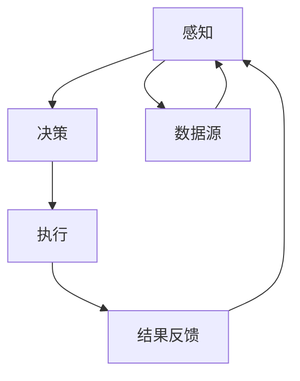
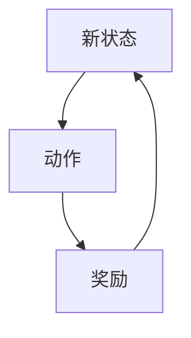
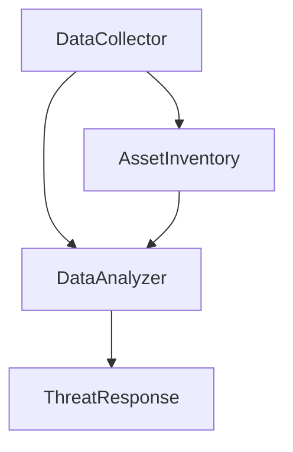
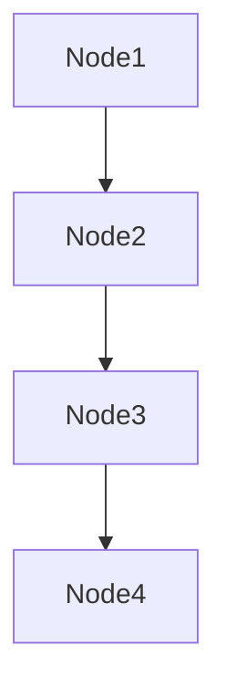

                 


# AI Agent在企业信息安全态势感知与威胁响应中的应用

> 关键词：AI Agent, 企业信息安全, 态势感知, �威肋响应, 强化学习, 图神经网络

> 摘要：本文深入探讨了AI Agent在企业信息安全态势感知与威胁响应中的应用。文章从AI Agent的基本概念、核心原理、系统架构到实际应用案例，全面分析了其在提升企业信息安全能力中的作用。通过具体的技术实现、算法原理和系统设计，展示了AI Agent如何助力企业构建智能化的安全防护体系。

---

# 第一部分: AI Agent与企业信息安全态势感知概述

## 第1章: AI Agent与企业信息安全态势感知概述

### 1.1 AI Agent的基本概念与特点

#### 1.1.1 AI Agent的定义
AI Agent（人工智能代理）是一种能够感知环境、自主决策并执行任务的智能体。它通过感知数据、分析信息和执行动作，帮助企业在复杂的安全环境中实现自动化和智能化的防护。

#### 1.1.2 AI Agent的核心特点
- **自主性**：AI Agent能够自主完成任务，无需人工干预。
- **反应性**：能够实时感知环境变化并做出响应。
- **学习能力**：通过机器学习技术不断优化自身的决策能力。
- **协作性**：能够与其他系统、AI Agent或人类协同工作。

#### 1.1.3 AI Agent与传统安全工具的区别
| 特性             | AI Agent                          | 传统安全工具                   |
|------------------|-----------------------------------|-------------------------------|
| 智能性           | 高                                | 低                             |
| 自主性           | 高                                | 低                             |
| 学习能力         | 强                                | 弱                             |
| 响应速度         | 快                                | 较慢                           |

### 1.2 企业信息安全态势感知的定义与目标

#### 1.2.1 信息安全态势感知的定义
信息安全态势感知是指通过收集、分析和综合各种安全数据，理解当前安全环境的状态，并预测未来可能的安全威胁。它是企业安全管理的核心能力之一。

#### 1.2.2 企业信息安全态势感知的目标
- **实时监控**：持续监测企业网络中的安全事件和威胁。
- **威胁分析**：识别潜在的威胁并评估其严重性。
- **风险预警**：提前预警可能对企业造成重大损失的安全威胁。
- **决策支持**：为安全策略的制定和执行提供数据支持。

#### 1.2.3 信息安全态势感知的挑战与难点
- **数据多样性**：需要整合来自不同设备、日志和网络流量的数据。
- **威胁复杂性**：现代威胁往往具有隐蔽性和复杂性，难以通过传统方法检测。
- **系统集成性**：需要与现有的安全系统（如防火墙、入侵检测系统）无缝集成。

### 1.3 AI Agent在信息安全态势感知中的作用

#### 1.3.1 AI Agent在态势感知中的优势
- **智能分析**：AI Agent能够通过机器学习算法自动分析海量数据，发现潜在威胁。
- **快速响应**：在检测到威胁后，AI Agent可以迅速启动响应机制，减少损失。
- **自我优化**：通过不断学习新的威胁特征，优化自身的检测和响应能力。

#### 1.3.2 AI Agent如何提升威胁响应效率
- **自动化响应**：AI Agent可以在检测到威胁后立即执行预定义的响应策略，如隔离受感染的设备。
- **智能决策**：基于当前的安全态势，AI Agent可以提供最优的应对策略，减少人为错误。
- **持续改进**：通过反馈机制，AI Agent能够不断优化自身的算法和策略。

#### 1.3.3 AI Agent在企业安全中的应用现状
当前，AI Agent已经在企业安全领域得到广泛应用，尤其是在以下几个方面：
- **异常行为检测**：通过分析用户行为日志，识别潜在的内部威胁。
- **网络流量分析**：实时监控网络流量，识别可疑的攻击行为。
- **漏洞管理**：自动识别系统中的安全漏洞并提供修复建议。

### 1.4 本章小结
本章介绍了AI Agent的基本概念、特点以及其在企业信息安全态势感知中的作用。通过对比传统安全工具，突出了AI Agent在智能化和自动化方面的优势，为后续章节的深入分析奠定了基础。

---

# 第二部分: AI Agent的核心原理与技术

## 第2章: AI Agent的核心原理

### 2.1 AI Agent的基本原理

#### 2.1.1 AI Agent的感知机制
AI Agent通过多种传感器或数据源（如日志文件、网络流量、系统状态）收集环境信息。这些信息经过预处理后，输入到分析模块中。

#### 2.1.2 AI Agent的决策机制
基于感知到的信息，AI Agent利用机器学习算法（如强化学习、深度学习）进行分析和推理，生成决策策略。

#### 2.1.3 AI Agent的执行机制
根据决策结果，AI Agent执行相应的操作，如发出警报、隔离设备或调整安全策略。

#### AI Agent的感知-决策-执行流程图（Mermaid）



### 2.2 AI Agent的关键技术

#### 2.2.1 自然语言处理技术
自然语言处理（NLP）技术用于分析文本数据，如安全报告和日志信息，提取有用的信息。

#### 2.2.2 强化学习算法
强化学习（Reinforcement Learning）通过试错机制优化AI Agent的决策策略，使其在复杂环境中做出最优选择。

#### 2.2.3 图神经网络
图神经网络（Graph Neural Network）能够处理复杂的网络结构，适用于分析设备之间的关联关系。

### 2.3 AI Agent的核心算法原理

#### 2.3.1 强化学习算法原理



数学公式：
- 状态转移概率：$P(s', r | s, a)$
- 奖励函数：$R(s, a, s') = r$

#### 2.3.2 图神经网络原理

图神经网络通过节点和边的特征表示，学习网络中的结构信息。其核心思想是通过聚合相邻节点的信息，更新当前节点的表示。

数学公式：
- 节点表示：$h_i = \sigma(A h_i^{(t-1)})$
- 聚合操作：$A = \sum_{j \in N(i)} w_{ij}$

### 2.4 本章小结
本章详细介绍了AI Agent的核心原理和技术，包括感知、决策和执行机制，以及强化学习和图神经网络等关键技术。这些技术为AI Agent在信息安全态势感知中的应用提供了理论基础。

---

# 第三部分: 企业信息安全态势感知的系统架构

## 第3章: 企业信息安全态势感知系统架构

### 3.1 系统总体架构设计

#### 3.1.1 系统模块划分
- 数据采集模块
- 数据分析模块
- 威胁响应模块

#### 3.1.2 系统功能设计
- 数据采集：收集网络流量、日志、资产信息等数据。
- 数据分析：利用AI Agent进行威胁检测和风险评估。
- 威胁响应：根据分析结果启动相应的响应策略。

#### 3.1.3 系统架构图（Mermaid）



### 3.2 系统功能模块实现

#### 3.2.1 数据采集模块
数据采集模块负责从各种数据源（如防火墙、服务器日志）获取数据，并进行预处理。

#### 3.2.2 数据分析模块
数据分析模块利用强化学习和图神经网络等算法，对数据进行分析和建模，识别潜在威胁。

#### 3.2.3 威胁响应模块
威胁响应模块根据分析结果，启动相应的响应策略，如隔离设备、切断网络连接等。

### 3.3 系统接口设计

#### 3.3.1 数据接口
- 数据输入接口：接收各种数据源的数据。
- 数据输出接口：将分析结果输出到其他系统。

#### 3.3.2 用户接口
- 用户界面：供管理员查看安全态势和操作记录。
- API接口：供其他系统调用分析结果。

#### 3.3.3 第三方服务接口
- 第三方威胁情报接口：获取外部威胁情报。
- 第三方安全工具接口：与防火墙、入侵检测系统等集成。

### 3.4 本章小结
本章详细描述了企业信息安全态势感知系统的架构设计，包括模块划分、功能设计和接口设计。通过Mermaid图展示了系统的整体架构，为后续的系统实现提供了指导。

---

# 第四部分: AI Agent在威胁响应中的应用

## 第4章: 威胁响应的AI Agent实现

### 4.1 威胁检测与响应的基本流程

#### 4.1.1 威胁检测
AI Agent通过分析网络流量和日志数据，检测潜在的威胁。

#### 4.1.2 威胁分析
根据检测到的威胁特征，分析其严重性和影响范围。

#### 4.1.3 威胁响应
根据分析结果，启动相应的响应策略，如隔离设备、发出警报等。

### 4.2 AI Agent在威胁检测中的应用

#### 4.2.1 基于强化学习的威胁检测


#### 4.2.2 基于图神经网络的威胁检测



### 4.3 AI Agent在威胁响应中的实现

#### 4.3.1 响应策略的设计
- 预定义策略：根据威胁类型定义响应动作。
- 动态调整策略：根据当前安全态势动态调整响应策略。

#### 4.3.2 响应执行机制
- 自动化执行：AI Agent直接触发响应动作。
- 人工审核：在高风险情况下，需要人工审核后执行。

### 4.4 本章小结
本章详细探讨了AI Agent在威胁响应中的应用，包括威胁检测、分析和响应的实现。通过具体的算法和流程图，展示了AI Agent如何提升威胁响应的效率和准确性。

---

# 第五部分: 项目实战与总结

## 第5章: 项目实战：基于AI Agent的日志分析系统

### 5.1 环境安装与配置

#### 5.1.1 安装依赖
- Python 3.8+
- TensorFlow
- Keras
- Scikit-learn

#### 5.1.2 系统部署
- 数据采集模块部署在服务器端。
- 数据分析模块部署在云端。
- 威胁响应模块部署在本地。

### 5.2 系统核心实现

#### 5.2.1 数据采集模块代码

```python
def collect_data():
    # 从日志文件读取数据
    data = []
    with open('log.txt', 'r') as f:
        for line in f:
            data.append(line.strip())
    return data
```

#### 5.2.2 数据分析模块代码

```python
def analyze_data(data):
    # 使用强化学习模型进行分析
    model.predict(data)
    return model.predict_classes(data)
```

#### 5.2.3 威胁响应模块代码

```python
def respond_to_threat(threat_level):
    if threat_level >= 0.9:
        # 高风险威胁，执行隔离操作
        isolate_device()
    else:
        # 低风险威胁，发出警报
        send_alarm()
```

### 5.3 实际案例分析与结果解读

#### 5.3.1 案例背景
某企业服务器的日志中发现可疑的访问行为，可能遭受了DDoS攻击。

#### 5.3.2 数据分析
AI Agent通过强化学习模型分析日志数据，发现异常流量的模式与已知的DDoS攻击模式匹配。

#### 5.3.3 威胁响应
AI Agent触发了隔离受攻击服务器的响应策略，同时向管理员发出警报。

### 5.4 项目小结
本章通过一个实际的项目案例，展示了AI Agent在日志分析系统中的应用。从环境配置到代码实现，详细讲解了系统的实现过程，并通过具体案例分析了系统的实际效果。

---

## 第6章: 总结与展望

### 6.1 总结
本文详细探讨了AI Agent在企业信息安全态势感知与威胁响应中的应用。通过分析AI Agent的核心原理、系统架构和实际应用案例，展示了其在提升企业安全能力中的重要作用。

### 6.2 最佳实践与注意事项
- **数据质量**：确保数据的完整性和准确性。
- **模型更新**：定期更新AI Agent的模型，以应对新的威胁。
- **人机协同**：在关键决策中，结合人类专家的判断。

### 6.3 未来展望
随着AI技术的不断发展，AI Agent在企业信息安全中的应用将更加广泛。未来的研究方向包括：
- 更高效的威胁检测算法。
- 更智能的威胁响应策略。
- 更强大的数据隐私保护技术。

---

# 作者：AI天才研究院/AI Genius Institute & 禅与计算机程序设计艺术 /Zen And The Art of Computer Programming

---

通过本文的详细分析和技术实现，读者可以全面了解AI Agent在企业信息安全态势感知与威胁响应中的应用。无论是理论知识还是实际案例，都为读者提供了丰富的学习和实践资源。

