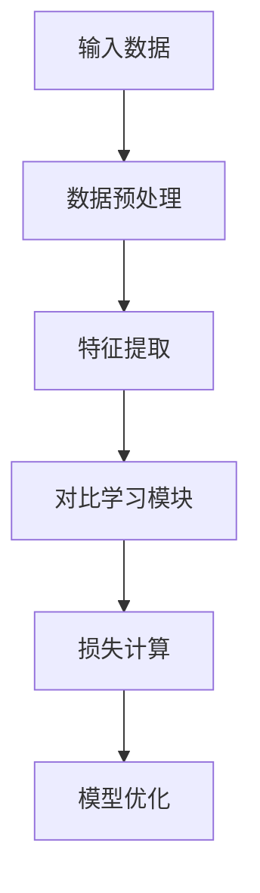
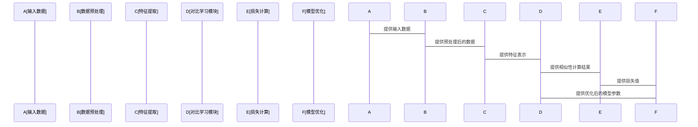

                 


# AI Agent的自监督学习实现方法

> 关键词：AI Agent，自监督学习，深度学习，对比学习，生成式模型

> 摘要：自监督学习作为一种新兴的无监督学习范式，在AI Agent领域展现了巨大的潜力。本文从AI Agent与自监督学习的基本概念出发，详细探讨了自监督学习的核心原理、算法实现、系统架构设计以及实际项目案例。通过对比分析和数学模型推导，深入剖析了自监督学习在AI Agent中的实现方法，结合具体的代码实现和系统设计，为读者提供了一个全面而深入的理解框架。

---

## 第1章: AI Agent与自监督学习概述

### 1.1 AI Agent的基本概念

#### 1.1.1 AI Agent的定义与特点
AI Agent（人工智能代理）是指在计算机系统中，能够感知环境、自主决策并执行任务的智能实体。AI Agent的核心特点包括：

- **自主性**：能够在没有外部干预的情况下独立运行。
- **反应性**：能够感知环境并实时调整行为。
- **目标导向**：具备明确的目标，所有行为均围绕目标展开。
- **学习能力**：能够通过经验改进自身的决策和执行能力。

#### 1.1.2 AI Agent的核心功能与应用场景
AI Agent的主要功能包括：
- **感知环境**：通过传感器或接口获取环境信息。
- **决策制定**：基于感知信息和目标，制定最优行动方案。
- **执行操作**：根据决策结果执行具体操作。

应用场景包括：
- 智能助手（如Siri、Alexa）。
- 自动驾驶系统。
- 智能推荐系统。
- 智能监控系统。

#### 1.1.3 自监督学习在AI Agent中的重要性
自监督学习是一种无监督学习方法，通过利用数据本身的结构信息进行学习。在AI Agent中，自监督学习可以实现以下目标：
- **数据预处理**：无需人工标注，利用数据本身进行特征提取。
- **目标驱动**：通过目标函数引导AI Agent学习有用的特征表示。
- **自主决策**：通过自监督学习，AI Agent能够更好地理解环境并做出决策。

---

### 1.2 自监督学习的基本原理

#### 1.2.1 自监督学习的定义与特点
自监督学习（Self-Supervised Learning）是一种无监督学习方法，通过构建一个任务（通常称为“伪任务”），利用数据本身的信息进行特征学习。其特点包括：
- **无需人工标注**：自监督学习的核心思想是利用数据本身的信息，而非依赖人工标注。
- **目标驱动**：通过设计目标函数，引导模型学习有用的特征表示。
- **灵活性高**：适用于各种类型的数据，包括图像、文本、音频等。

#### 1.2.2 自监督学习与监督学习的区别
以下是自监督学习与监督学习的主要区别：

| 对比维度 | 监督学习 | 自监督学习 |
|----------|----------|------------|
| 数据需求 | 需要人工标注 | 利用数据本身结构 |
| 学习目标 | 确定的标签 | 生成伪标签 |
| 适用场景 | 数据充足且标注容易 | 数据充足但标注困难 |

#### 1.2.3 自监督学习的优势与挑战
**优势：**
- **数据效率高**：自监督学习能够充分利用数据本身的信息，减少对标注数据的依赖。
- **适用性强**：适用于各种类型的数据，尤其适用于标注数据不足的场景。
- **灵活性高**：可以通过设计不同的伪任务，适应不同的应用场景。

**挑战：**
- **伪任务设计**：自监督学习的效果高度依赖于伪任务的设计，设计不当可能导致模型性能下降。
- **计算成本高**：自监督学习通常需要进行多次迭代，计算成本较高。
- **模型过拟合**：在某些情况下，自监督学习可能导致模型过拟合，降低泛化能力。

---

### 1.3 AI Agent的自监督学习发展现状

#### 1.3.1 自监督学习在AI Agent中的研究现状
近年来，自监督学习在AI Agent领域得到了广泛研究，主要集中在以下几个方面：
- **图像领域**：利用自监督学习进行图像特征提取，提升AI Agent的视觉感知能力。
- **文本领域**：通过自监督学习进行文本表示学习，增强AI Agent的语言理解能力。
- **多模态领域**：结合图像、文本等多种数据源，设计多模态的自监督学习方法。

#### 1.3.2 当前技术的主要瓶颈与未来方向
当前自监督学习在AI Agent中的主要瓶颈包括：
- **伪任务设计**：如何设计有效的伪任务，提升模型的泛化能力。
- **计算效率**：自监督学习通常需要多次迭代，计算成本较高。
- **模型解释性**：自监督学习的黑箱特性使得模型的解释性较差。

未来的研究方向可能包括：
- **更高效的伪任务设计**：探索新的伪任务设计方法，提升模型性能。
- **轻量化模型**：设计轻量化的自监督学习模型，降低计算成本。
- **多模态融合**：探索多模态数据的自监督学习方法，提升AI Agent的综合感知能力。

#### 1.3.3 自监督学习在AI Agent中的潜在应用场景
自监督学习在AI Agent中的潜在应用场景包括：
- **智能助手**：通过自监督学习，提升智能助手的语言理解和交互能力。
- **自动驾驶**：利用自监督学习进行多模态数据的特征提取，提升自动驾驶系统的感知能力。
- **智能监控**：通过自监督学习进行视频数据的特征提取，提升智能监控系统的异常检测能力。

---

## 第2章: 自监督学习的核心概念与联系

### 2.1 自监督学习的核心原理

#### 2.1.1 自监督学习的数学模型
自监督学习的核心思想是通过构建一个伪任务，利用数据本身的信息进行特征学习。数学上，可以表示为：

$$ L = \mathbb{E}_{(x,y)}[f(x,y)] $$

其中，$x$ 是输入数据，$y$ 是目标标签，$f(x,y)$ 是损失函数。

#### 2.1.2 自监督学习的优化目标
自监督学习的目标是通过优化以下目标函数，学习到有用的特征表示：

$$ \arg\min_{\theta} \mathbb{E}_{(x,y)}[L(x,y;\theta)] $$

其中，$\theta$ 是模型参数。

#### 2.1.3 自监督学习的主要算法框架
自监督学习的主要算法框架包括：
- **对比学习**：通过最大化正样本的相似性，最小化负样本的相似性。
- **生成式自监督学习**：通过生成模型生成数据，进行特征提取。
- **正则化自监督学习**：通过正则化项约束模型的特征表示。

---

### 2.2 自监督学习的类型与对比

#### 2.2.1 正则化自监督学习
正则化自监督学习通过引入正则化项，约束模型的特征表示。例如，可以通过以下方式实现：

$$ L_{reg} = \lambda \cdot ||f(x)||^2 $$

其中，$\lambda$ 是正则化系数，$f(x)$ 是特征表示。

#### 2.2.2 对比学习
对比学习通过最大化正样本的相似性，最小化负样本的相似性。例如，可以通过以下方式实现：

$$ L_{contrast} = -\frac{1}{N} \sum_{i=1}^{N} \log \frac{\exp(s_i)}{\exp(s_i) + \sum_{j \neq i} \exp(s_j)}} $$

其中，$s_i$ 是正样本的相似性，$s_j$ 是负样本的相似性。

#### 2.2.3 生成式自监督学习
生成式自监督学习通过生成模型生成数据，进行特征提取。例如，可以通过以下方式实现：

$$ L_{gen} = \mathbb{E}_{x}[D(x)] + \mathbb{E}_{x}[D(G(z))] $$

其中，$D(x)$ 是判别模型，$G(z)$ 是生成模型。

---

### 2.3 自监督学习的核心概念对比表格
以下是自监督学习的不同方法的对比表格：

| 方法类型 | 对比学习 | 生成式自监督学习 | 正则化自监督学习 |
|----------|----------|------------------|------------------|
| 核心思想 | 最大化正样本相似性，最小化负样本相似性 | 通过生成模型生成数据，进行特征提取 | 通过正则化项约束特征表示 |
| 优点 | 能够充分利用数据的对比信息 | 能够生成多样化的数据 | 计算简单，易于实现 |
| 缺点 | 对比信息可能存在偏差 | 生成数据的质量可能不稳定 | 正则化项设计复杂 |

---

## 第3章: 自监督学习的算法原理与数学模型

### 3.1 对比学习算法

#### 3.1.1 Contrastive Learning的原理
对比学习的核心思想是通过最大化正样本的相似性，最小化负样本的相似性。例如，可以通过以下方式实现：

$$ L_{contrast} = -\frac{1}{N} \sum_{i=1}^{N} \log \frac{\exp(s_i)}{\exp(s_i) + \sum_{j \neq i} \exp(s_j)}} $$

其中，$s_i$ 是正样本的相似性，$s_j$ 是负样本的相似性。

#### 3.1.2 SimCLR算法的实现细节
SimCLR算法是一种基于对比学习的自监督学习方法，其主要步骤包括：
1. 数据增强：对输入数据进行数据增强。
2. 特征提取：通过模型提取特征表示。
3. 对比损失计算：计算正样本和负样本的相似性，计算对比损失。

#### 3.1.3 其他对比学习算法的对比分析
其他对比学习算法包括：
- **InfoNCE**：通过信息论的角度设计损失函数。
- **SupCon**：通过引入标签信息，改进对比学习的效果。

---

### 3.2 生成式自监督学习算法

#### 3.2.1 InfoMax原理
InfoMax是一种生成式自监督学习方法，其核心思想是通过最大化信息量，提取数据的特征表示。例如，可以通过以下方式实现：

$$ L_{info} = -\mathbb{E}_{x}[ \log p(x) ] $$

其中，$p(x)$ 是数据的分布。

#### 3.2.2 Deep InfoMax算法
Deep InfoMax算法通过构建生成模型和判别模型，进行特征提取。其主要步骤包括：
1. 数据增强：对输入数据进行数据增强。
2. 特征提取：通过生成模型生成数据，通过判别模型进行特征提取。
3. 信息量计算：计算生成数据和真实数据的信息量，计算损失函数。

---

### 3.3 自监督学习的数学模型
自监督学习的数学模型可以表示为：

$$ L = \mathbb{E}_{(x,y)}[f(x,y)] $$

其中，$x$ 是输入数据，$y$ 是目标标签，$f(x,y)$ 是损失函数。

---

## 第4章: 自监督学习的系统架构设计

### 4.1 问题场景介绍
AI Agent的自监督学习系统需要解决以下问题：
- 如何通过自监督学习，提取数据的特征表示。
- 如何通过特征表示，进行目标决策。

### 4.2 项目介绍
本项目旨在设计一个基于自监督学习的AI Agent系统，能够通过自监督学习进行特征提取，提升系统的感知和决策能力。

### 4.3 系统功能设计
系统功能设计包括：
- 数据预处理模块：对输入数据进行数据增强和预处理。
- 特征提取模块：通过自监督学习模型提取特征表示。
- 对比学习模块：计算正样本和负样本的相似性，计算对比损失。

### 4.4 系统架构设计
以下是系统的架构图：



### 4.5 系统接口设计
系统接口设计包括：
- 数据输入接口：接收输入数据。
- 模型训练接口：训练自监督学习模型。
- 特征提取接口：提取数据的特征表示。

### 4.6 系统交互设计
以下是系统的交互流程图：



---

## 第5章: 自监督学习的项目实战

### 5.1 环境配置
项目实战的环境配置包括：
- 操作系统：Linux
- 编程语言：Python 3.8+
- 深度学习框架：TensorFlow 2.0+
- 其他依赖：numpy, matplotlib, scikit-learn

### 5.2 系统核心实现源代码
以下是自监督学习模型的核心实现代码：

```python
import tensorflow as tf
from tensorflow.keras import layers

def contrastive_loss(x, y, temperature=0.5):
    # 计算正样本的相似性
    positive = tf.exp(tf.dot(x, y, transpose_b=True) / temperature)
    # 计算负样本的相似性
    negative = tf.exp(tf.matmul(x, tf.transpose(y)) / temperature)
    # 计算损失函数
    loss = -tf.mean(tf.log(positive / (positive + tf.reduce_sum(negative, axis=1))))
    return loss

def simclr_model(input_shape):
    inputs = layers.Input(shape=input_shape)
    features = layers.Dense(128, activation='relu')(inputs)
    model = tf.keras.Model(inputs=inputs, outputs=features)
    return model

# 初始化模型
model = simclr_model((32, 32, 3))
optimizer = tf.keras.optimizers.Adam(learning_rate=1e-4)

# 训练模型
def train_model(data_loader, epochs=100):
    for epoch in range(epochs):
        for x, y in data_loader:
            with tf.GradientTape() as tape:
                features = model(x)
                loss = contrastive_loss(features, features, temperature=0.5)
            gradients = tape.gradient(loss, model.trainable_weights)
            optimizer.apply_gradients(model.trainable_weights, gradients)
```

### 5.3 代码应用解读与分析
代码实现包括以下几个部分：
1. **对比损失函数**：定义对比损失函数，计算正样本和负样本的相似性。
2. **特征提取模型**：定义特征提取模型，提取数据的特征表示。
3. **模型训练**：通过训练数据，优化模型参数，降低对比损失。

### 5.4 实际案例分析
以下是自监督学习在图像分类中的应用案例：

```python
import tensorflow as tf
from tensorflow.keras import layers

# 定义对比损失函数
def contrastive_loss(x, y, temperature=0.5):
    positive = tf.exp(tf.dot(x, y, transpose_b=True) / temperature)
    negative = tf.exp(tf.matmul(x, tf.transpose(y)) / temperature)
    loss = -tf.mean(tf.log(positive / (positive + tf.reduce_sum(negative, axis=1))))
    return loss

# 定义特征提取模型
def simclr_model(input_shape):
    inputs = layers.Input(shape=input_shape)
    features = layers.Dense(128, activation='relu')(inputs)
    model = tf.keras.Model(inputs=inputs, outputs=features)
    return model

# 初始化模型和优化器
model = simclr_model((32, 32, 3))
optimizer = tf.keras.optimizers.Adam(learning_rate=1e-4)

# 训练模型
def train_model(data_loader, epochs=100):
    for epoch in range(epochs):
        for x, y in data_loader:
            with tf.GradientTape() as tape:
                features = model(x)
                loss = contrastive_loss(features, features, temperature=0.5)
            gradients = tape.gradient(loss, model.trainable_weights)
            optimizer.apply_gradients(model.trainable_weights, gradients)

# 加载数据集
data_loader = ...  # 自定义数据加载器

# 开始训练
train_model(data_loader, epochs=100)
```

### 5.5 项目小结
通过上述代码实现，我们可以看到自监督学习在AI Agent中的应用潜力。通过对比学习，我们可以有效地提取数据的特征表示，提升模型的感知和决策能力。

---

## 第6章: 自监督学习的最佳实践

### 6.1 小结
自监督学习是一种强大的无监督学习方法，能够通过数据本身的信息进行特征学习。在AI Agent中，自监督学习可以提升系统的感知和决策能力。

### 6.2 注意事项
- **伪任务设计**：伪任务的设计对模型性能有重要影响，需要谨慎设计。
- **计算效率**：自监督学习通常需要多次迭代，计算成本较高，需要注意优化。
- **模型解释性**：自监督学习的黑箱特性可能导致模型解释性较差，需要结合其他方法提升解释性。

### 6.3 拓展阅读
- **对比学习**：InfoNCE、SupCon等。
- **生成式自监督学习**：Deep InfoMax、CycleGAN等。
- **多模态自监督学习**：对比学习在多模态数据中的应用。

---

## 作者：AI天才研究院/AI Genius Institute & 禅与计算机程序设计艺术 /Zen And The Art of Computer Programming

---

通过以上思考过程，我们可以看到，自监督学习在AI Agent中的实现方法是一个复杂但有趣的领域，需要从理论到实践的全面探索。

