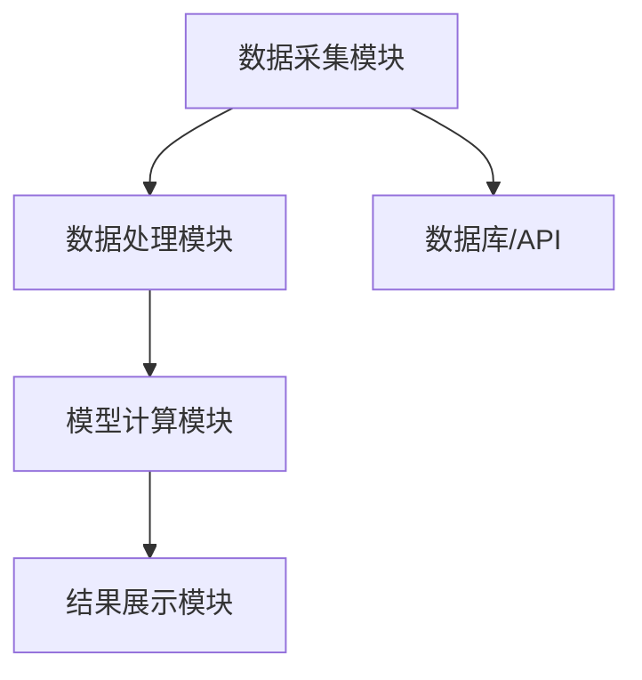

                 


# 价值投资中的成长型企业估值

## 关键词：价值投资，成长型企业，企业估值，DCF模型，PEG指标，ROE，ROA

## 摘要：  
本文深入探讨了价值投资中的成长型企业估值方法，从核心概念、算法原理、数学模型到系统分析和项目实战，全面解析了成长型企业估值的关键要素和实现步骤。通过详细分析ROE、ROA等财务指标，结合DCF模型和PEG指标，帮助投资者准确评估成长型企业的内在价值，并结合实际案例提供代码实现和系统架构设计，为价值投资中的成长型企业估值提供了系统的解决方案。

---

## 第一部分: 价值投资与成长型企业估值的背景介绍

### 第1章: 价值投资的核心概念与成长型企业定义

#### 1.1 价值投资的基本原理
价值投资是一种基于对企业内在价值评估的投资策略，强调以低于内在价值的价格买入优质资产。其核心理念包括：
- **安全边际**：买入价格低于内在价值，以降低风险。
- **长期视角**：关注企业的长期盈利能力，而非短期价格波动。
- **基本面分析**：通过财务报表和行业分析，评估企业的内在价值。

#### 1.2 成长型企业的定义与特征
成长型企业是指在较长时期内能够持续实现收入和利润增长的企业，其核心特征包括：
- **高增长率**：收入和净利润的年增长率显著高于行业平均水平。
- **高ROE**：净资产收益率（ROE）较高，表明企业利用股东资金的效率较高。
- **竞争优势**：具备强大的竞争优势，如专利、品牌、技术壁垒等。
- **市场扩张能力**：能够通过市场扩展或产品创新持续增长。

#### 1.3 价值投资中的企业估值意义
企业估值是价值投资的核心步骤，其意义在于：
- **确定投资价值**：通过估值判断企业的内在价值，决定是否买入。
- **评估安全边际**：确保买入价格低于内在价值，降低投资风险。
- **动态调整投资组合**：通过定期估值，优化投资组合，捕捉低估机会。

---

## 第二部分: 成长型企业估值的核心概念与联系

### 第2章: 成长型企业估值的核心概念原理

#### 2.1 成长型企业估值的核心要素分析
成长型企业估值需要关注以下几个核心要素：
- **收益能力**：ROE、ROA、ROCE等指标反映了企业的盈利能力。
- **增长能力**：收入增长率、净利润增长率体现了企业的扩张潜力。
- **财务健康性**：资产负债率、流动比率等指标评估企业的财务稳定性。
- **竞争优势**：企业的护城河（如品牌、技术）决定了其长期增长能力。

#### 2.2 成长型企业估值的关键指标对比
以下表格对比了常见的成长型企业估值指标：

| 指标名称   | 定义与作用                          | 适用场景               |
|------------|-----------------------------------|------------------------|
| P/E（市盈率） | 股价/每股净利润，衡量股价是否被高估或低估 | 适用于盈利稳定的成长型企业 |
| PEG（市盈率相对盈利增长比率） | P/E / 净利润增长率，衡量成长性与估值的匹配度 | 适用于高增长的成长型企业 |
| DCF（现金流折现模型） | 通过未来现金流的现值计算企业价值 | 适用于现金流稳定的成长型企业 |
| ROE（净资产收益率） | 净利润 / 净资产，衡量股东资金的利用效率 | 适用于评估企业的盈利能力 |

#### 2.3 成长型企业估值的基本框架
成长型企业估值的基本框架包括以下几个步骤：
1. **确定企业的成长阶段**：判断企业处于高增长期还是稳定期。
2. **选择合适的估值方法**：根据企业特点选择DCF模型、PEG指标等。
3. **预测未来现金流或盈利**：基于企业历史数据和行业趋势，预测未来5-10年的现金流或净利润。
4. **计算内在价值**：通过折现率计算企业未来现金流的现值，得出内在价值。
5. **比较市场价与内在价值**：判断企业是否被低估或高估。

---

## 第三部分: 成长型企业估值的算法原理与数学模型

### 第3章: 成长型企业估值的算法原理

#### 3.1 现金流折现模型（DCF模型）的算法原理
现金流折现模型（DCF模型）是成长型企业估值的核心方法之一。其基本步骤如下：

1. **预测自由现金流（FCFF）**：
   - 收入预测：基于历史收入增长率和行业趋势，预测未来5-10年的收入。
   - 成本与费用预测：预测未来5-10年的营业成本、管理费用、销售费用等。
   - 税后现金流计算：净利润 + 折旧与摊销 - 资本支出。

2. **确定折现率**：
   - 使用加权平均资本成本（WACC）作为折现率，公式如下：
     \[
     WACC = w_d \times k_d + w_l \times k_l \times (1 - t)
     \]
     其中，\( w_d \) 和 \( w_l \) 分别是债务和股权的权重，\( k_d \) 和 \( k_l \) 分别是债务和股权的资本成本，\( t \) 是税率。

3. **计算终值（TV）**：
   - 假设企业在永续期以稳定增长率 \( g \) 增长，则终值公式为：
     \[
     TV = \frac{FCFF_{n+1}}{g - WACC}
     \]

4. **计算企业总价值**：
   - 将未来5-10年的FCFF和终值按WACC折现，求和后得到企业总价值。

#### 3.2 算法实现
以下是DCF模型的Python代码实现：

```python
def calculate_wacc(company_data, tax_rate):
    # 假设company_data包含债务、股权、债务成本、股权成本等信息
    w_d = company_data['debt'] / (company_data['debt'] + company_data['equity'])
    k_d = company_data['debt_cost']
    w_l = company_data['equity'] / (company_data['debt'] + company_data['equity'])
    k_l = company_data['equity_cost']
    wacc = w_d * k_d + w_l * k_l * (1 - tax_rate)
    return wacc

def calculate_fcf(company_data):
    # 假设company_data包含收入、成本、费用、折旧、摊销等信息
    ebit = company_data['revenue'] - company_data['cost'] - company_data['expenses']
    tax = ebit * company_data['tax_rate']
    fcf = (ebit - tax) + company_data['depreciation'] + company_data['amortization'] - company_data['capital_expenditure']
    return fcf

def calculate_tv(fcff, wacc, perpetuity_growth):
    if wacc <= 0:
        return 0
    tv = fcf_next_year / (wacc - perpetuity_growth)
    return tv

def calculate_enterprise_value(company_data, years, tax_rate, perpetuity_growth):
    wacc = calculate_wacc(company_data, tax_rate)
    fcf_values = [calculate_fcf(company_data) * (1 + growth_rate) for growth_rate in company_data['growth_rates']]
    terminal_value = calculate_tv(fcf_values[-1], wacc, perpetuity_growth)
    enterprise_value = 0
    for i in range(years):
        enterprise_value += fcf_values[i] / (1 + wacc)**i
    enterprise_value += terminal_value / (1 + wacc)**years
    return enterprise_value
```

#### 3.3 数学模型与公式
DCF模型的核心公式为：
\[
\text{企业总价值} = \sum_{t=1}^{n} \frac{\text{FCFF}_t}{(1 + WACC)^t} + \frac{\text{TV}}{(1 + WACC)^n}
\]
其中：
- \( FCFF_t \) 是第 \( t \) 年的自由现金流。
- \( WACC \) 是加权平均资本成本。
- \( TV \) 是终值。
- \( n \) 是预测年数。

---

## 第四部分: 成长型企业估值的系统分析与架构设计

### 第4章: 成长型企业估值的系统分析与架构设计

#### 4.1 问题场景介绍
在实际投资中，投资者需要对大量成长型企业进行估值，这需要一个高效的系统来支持：
- **数据采集**：获取企业的财务数据、行业信息等。
- **数据处理**：清洗、整理和计算关键财务指标。
- **模型构建**：选择合适的估值模型（如DCF模型、PEG指标）。
- **结果分析**：生成估值报告，比较市场价与内在价值。

#### 4.2 系统功能设计
系统功能设计包括以下模块：
- **数据采集模块**：从数据库或API获取企业数据。
- **数据处理模块**：计算ROE、ROA等指标。
- **模型计算模块**：实现DCF模型、PEG指标等估值方法。
- **结果展示模块**：生成可视化报告，对比市场价与内在价值。

#### 4.3 系统架构设计
以下是系统的架构图：



---

## 第五部分: 成长型企业估值的项目实战

### 第5章: 成长型企业估值的项目实战

#### 5.1 环境安装与配置
需要安装以下Python库：
- pandas
- numpy
- matplotlib
- scipy

#### 5.2 核心代码实现
以下是DCF模型的Python代码实现：

```python
import pandas as pd
import numpy as np
import matplotlib.pyplot as plt
from scipy import optimize

def calculate_wacc(firm_data, tax_rate):
    w_d = firm_data['debt'] / (firm_data['debt'] + firm_data['equity'])
    k_d = firm_data['debt_cost']
    w_l = firm_data['equity'] / (firm_data['debt'] + firm_data['equity'])
    k_l = firm_data['equity_cost']
    wacc = w_d * k_d + w_l * k_l * (1 - tax_rate)
    return wacc

def calculate_fcf(firm_data):
    ebit = firm_data['revenue'] - firm_data['cost'] - firm_data['expenses']
    tax = ebit * firm_data['tax_rate']
    fcf = (ebit - tax) + firm_data['depreciation'] + firm_data['amortization'] - firm_data['capital_expenditure']
    return fcf

def calculate_tv(fcff, wacc, growth_rate):
    if wacc <= 0:
        return 0
    tv = fcf_next_year / (wacc - growth_rate)
    return tv

def calculate_enterprise_value(firm_data, years, tax_rate, growth_rate):
    wacc = calculate_wacc(firm_data, tax_rate)
    fcf_values = [calculate_fcf(firm_data) * (1 + growth_rate)**i for i in range(years)]
    terminal_value = calculate_tv(fcf_values[-1], wacc, growth_rate)
    enterprise_value = 0
    for i in range(years):
        enterprise_value += fcf_values[i] / (1 + wacc)**i
    enterprise_value += terminal_value / (1 + wacc)**years
    return enterprise_value
```

#### 5.3 案例分析与代码解读
以微软公司为例，假设我们已经获取了其财务数据，并计算了其DCF模型的内在价值。代码实现步骤如下：
1. 数据采集：从数据库或API获取微软的财务数据。
2. 数据处理：计算ROE、ROA等指标。
3. 模型计算：使用DCF模型计算微软的内在价值。
4. 结果展示：生成可视化报告，对比市场价与内在价值。

---

## 第六部分: 成长型企业估值的最佳实践与总结

### 第6章: 成长型企业估值的最佳实践与总结

#### 6.1 最佳实践
- **数据质量**：确保财务数据的准确性和完整性。
- **模型假设**：合理假设增长率和折现率，避免过于乐观或悲观。
- **动态调整**：定期更新模型，反映企业的最新情况。

#### 6.2 小结
成长型企业估值是价值投资中的核心步骤，需要综合运用财务分析、模型计算和行业分析等方法。通过DCF模型、PEG指标等方法，投资者可以准确评估企业的内在价值，做出明智的投资决策。

#### 6.3 注意事项
- **数据误差**：财务数据可能存在误差，需谨慎处理。
- **模型局限性**：DCF模型假设未来现金流可预测，实际情况可能复杂多变。
- **市场波动**：短期市场波动可能影响股价，需长期持有优质资产。

#### 6.4 拓展阅读
- 《The Intelligent Investor》——本杰明·格雷厄姆
- 《价值投资实战策略》——彼得·林奇
- 《投资的艺术》——菲利普·费雪

---

## 作者：AI天才研究院/AI Genius Institute & 禅与计算机程序设计艺术/Zen And The Art of Computer Programming

